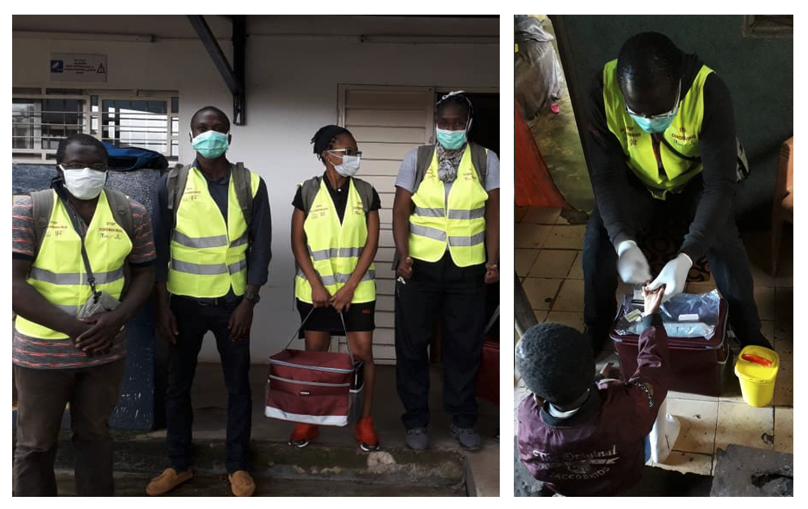

```{r, echo = F, message = F, warning = F}
if(!require("pacman")) install.packages("pacman")
pacman::p_load("here",
                "readr",
                "skimr",
               update=F)

# functions
source(here::here("global/functions/misc_functions.R"))

# default render
registerS3method("reactable_5_rows", "data.frame", reactable_5_rows)
knitr::opts_chunk$set(class.source = "tgc-code-block")

## autograders
suppressMessages(source(here::here("ch02_data_cleaning_pipeline/lessons/ch02_ls01_introduction_autograder.R")))
```

------------------------------------------------------------------------

# Data cleaning: Introduction

## Introduction to the lesson

**Data cleaning** is one of the important steps in data analysis. Data cleaning is the process of transforming dirty data into reliable data that can be analyzed.

::: key-point
It involves identifying **inaccurate**, **incomplete**, or **improbable** data and resolving potential data inconsistencies or errors to improve your data quality and subsequently, and overall productivity.
:::

{width="200"}

## How do you clean data

::: pro-tip
While **every dataset requires different techniques** to clean dirty data, there is a need to address these issues in **a systematic way**.

It's important to conserve as much of the original data as possible while also ensuring that you end up with a clean dataset.
:::

In practice, the cleaning process may focus on finding and resolving data points that don't agree or fit with the rest of the dataset in more obvious ways. In particular, the data cleaning process may include(but is not necessarily limited to):

-   Formatting data frame column names
-   Deleting all blank rows/columns
-   Removing duplicate rows
-   Checking for irrelevant Observations
-   Converting data types into their appropriate types for analysis
-   String normalization

In this chapter, we will go through the process of converting messy data, into clean or reliable data that can be analyzed in R. Multiple packages are available in R to clean the data sets. For this course, we will predominantly make use of functions from the `tidyverse` family of R packages, as well as the `janitor` and `linelist` packages.

::: side-note
This is the flow we will follow for this chapter:

1.  We will familiarize ourselves with the data set here in this introduction lesson

2.  We will check for structural errors in lesson 1 (cleaning column/variable names) and lesson 2 (removing empty rows/columns)

3.  We will check for data irregularities in lesson 3 (deduplicating data entries), in lesson 4 (monitoring types and encodings), and in lesson 5 (managing missing values)
:::

::: pro-tip
For the **BEST** data cleaning, you need to know what mess / what errors you are **hunting** for by **EXPLORING** the dataset, then you **CLEAN**.
:::

## The Real Messy Data

In terms of the data, we will use a familiar dataset, the Yaounde dataset, which gives the results from a COVID-19 serological survey conducted in Yaounde, Cameroon in late 2020.

::: recap
It should be noted, however, that the version of the Yaounde dataset we have encountered thus far in previous lessons had already gone through the process of data cleaning.
:::

**Now, we will look at the raw data** (the original data collected) to learn how to clean a messy data set. In addition, some parts of the Yaounde data set have been altered to further illustrate the data cleaning process.

The full dataset can be obtained from [Zenodo](https://zenodo.org/record/5218965), and the paper can be viewed [here](https://www.nature.com/articles/s41467-021-25946-0).

{width="504"}

While this is not the type of data we will work with for the rest of this course, the cleaning steps we will perform here are good practice for working with real-world linelists.

::: side-note
For practice, we will also make use of data from a case control study investigating the temporal, spatial and household dynamics of typhoid fever in Kasese district, Uganda.
:::

## Importing and reviewing the data

```{r, message = F, include=T}
yaounde <- read_csv(here::here('ch02_data_cleaning_pipeline/data/yaounde_data.csv'))
```

::: key-point
To get a detailed overview of each of the variables in your dataset, there are a number of functions you could use. We recommend the use of the `skim()` function from the `{skimr}` package. This function provides an overview of the data frame and a summary of every column (by class/type).
:::

Specifically, it provides:

-   An overview of the rows and columns of the dataframe
-   The data type for each variable: `skim_type`
-   The number of missing entries (entries per variable that are `NA`): `n_missing`
-   The completeness rate for each variable (a number from 0 to 1 corresponding to the ratio: *missing observations / number of observations*): `complete_rate`
-   A set of summary statistic; the mean, standard deviation and the five number summary for numerical variables and the frequency and proportions for categorical variables
-   Spark histograms and line graphs for the numerical variables

::: watch-out
If your "missing" variable is a "0" or a blank space, the `n_missing` and `complete_rate` outputs of `skim()` will not pick up on these missing forms.
:::

```{r, eval = F, message = F, render = knitr::knit_print}
skimr::skim(yaounde)
```

{width="681"} 

{width="681"} 

{width="681"}

You can also specify the specific variables to be included, similar to `dplyr::select()`

```{r,include=T, message = F, render = knitr::knit_print}
skimr::skim(yaounde,SEX,AGE)
```

The format of the results are a single wide data frame combining the summary results, with some additional attributes and two metadata columns:

-   `skim_variable`: name of the original variable
-   `skim_type`: class of the variable

::: key-point
We can also use some `dplyr` verbs like `select` on skim output. We only need to specify the additional attributes mentioned above.
:::

::: practice
1.  Use `skim()` to obtain a detailed overview of the Ugandan `typhoid` dataset.

```{r,eval = FALSE,echo=FALSE}
q1 <- "YOUR ANSWER HERE"
.check_q1()
.hint_q1()
```

2.  Use `skim()` to obtain a detailed overview of the Ugandan `typhoid` dataset. However, this time, include only the variables `Age` and `Levelofeducation`.

```{r,eval = FALSE,echo=FALSE}
q2 <- "YOUR ANSWER HERE"
.check_q2()
.hint_q2()
```
:::

To just get information on a variable without displaying the type of variable

```{r,include=T, message = F}
skim(yaounde) %>%
  select(skim_type) %>%
  count(skim_type)
```

Overall, the output displayed above highlights a few key features about our data frame

-   There are 981 rows and 36 columns.
-   There are 20 character variables, 15 numeric variables and 1 logical variable.

In addition, looking at the output from the `skim()` function immediately brings to light some potential issues in the data that may need to be addressed before the data are used in an analysis.

::: watch-out
We can identify the following issues with our data :

-   there is an empty column in the data (the logical column, `NA` has a `complete_rate` of 0)

-   names of variables are unclear/unclean (`is drug_parac` has a whitespace in its name, `treatment..combinations` has a special character, `..`, etc.)

-   several variables are heavily incomplete (such as `sequelae`, `consultation`)

-   distributions are skewed for certain variables (such as `AGE`, `height cm`)

-   etc...
:::

::: practice
-   What other potential issues from the `skim()` output may need to be addressed before the data are used in an analysis?
:::

## Contributors {.unlisted .unnumbered}

The following team members contributed to this lesson:

`r tgc_contributors_list(ids = c("eem", "lolovanco"))`

## References {.unlisted .unnumbered}

Some material in this lesson was adapted from the following sources:

-   Batra, Neale, et al. The Epidemiologist R Handbook. 2021.*Cleaning data and core functions*. <https://epirhandbook.com/en/cleaning-data-and-core-functions.html#cleaning-data-and-core-functions>

-   Waring E, Quinn M, McNamara A, Arino de la Rubia E, Zhu H, Ellis S (2022). skimr: Compact and Flexible Summaries of Data. <https://docs.ropensci.org/skimr/> (website), <https://github.com/ropensci/skimr/.>
