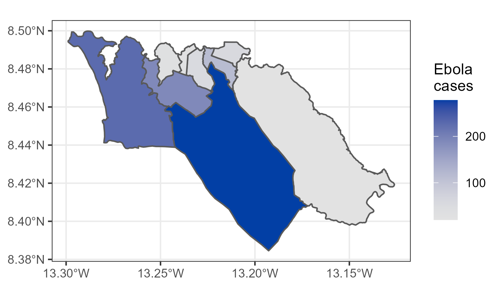
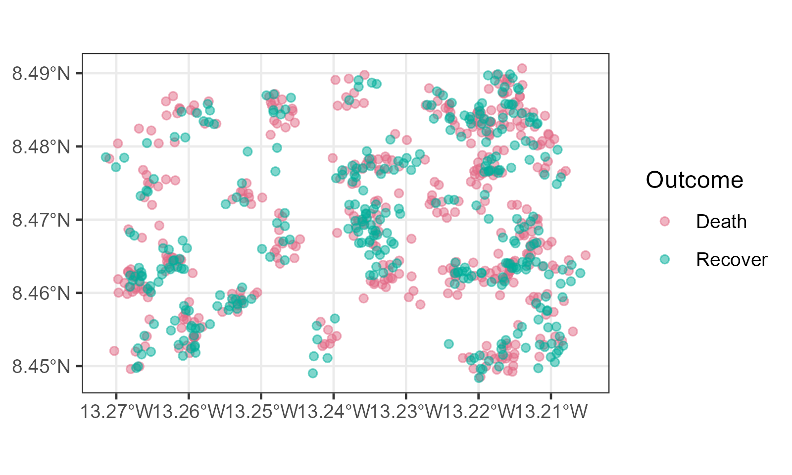
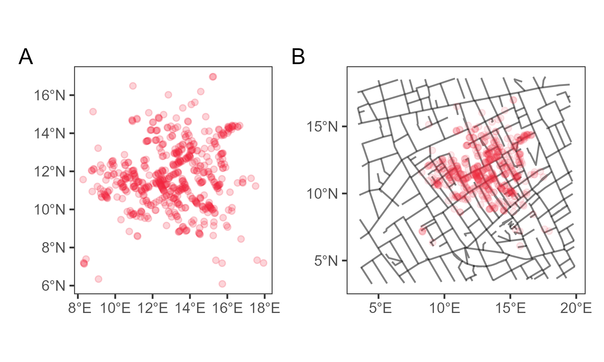
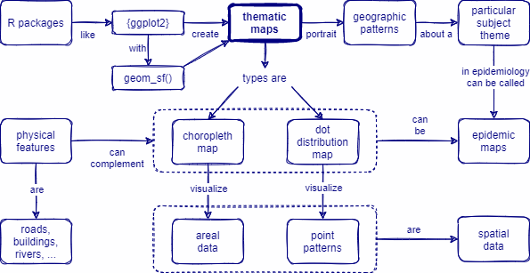

```{r, include = FALSE, warning = FALSE, message = FALSE}
# Load packages 
if(!require(pacman)) install.packages("pacman")
pacman::p_load(tidyverse, knitr, here)

# Source functions 
source(here("global/functions/misc_functions.R"))

# knitr settings
knitr::opts_chunk$set(warning = F, message = F, class.source = "tgc-code-block", error = T)

# Source autograder script quietly 
suppressMessages(source(here::here("ch06_basic_geospatial_viz/lessons/ch06_ls01_thematic_maps_autograder.R")))
```

```{r,echo=FALSE}
ggplot2::theme_set(new = theme_bw())
options(scipen=10000)
```

------------------------------------------------------------------------

# Geospatial analysis: thematic maps

## Learning objectives

1.  Identify two types of **Thematic maps** (choropleth and dot maps) used by epidemiologist to visualize Geospatial data.

2.  Create Thematic maps using `{ggplot2}` and the **`geom_sf()`** function.

3.  Relate each Thematic map with a **Spatial data** type.

## Prerequisites

This lesson requires the following packages:

```{r,eval=TRUE,echo=TRUE,message=FALSE}
if(!require('pacman')) install.packages('pacman')
pacman::p_load_gh("afrimapr/afrilearndata")
pacman::p_load(ggspatial,
               ggplot2,
               mdsr,
               terra,
               spData)

```

This lesson requires familiarity with `{ggplot2}`: if you need to brush up, have a look at our introductory course on data visualization.

## Introduction

Spatial aspects of your data can provide a lot of insights into the situation of a certain disease or an outbreak, and to answer questions such as:

-   **Where** are the current disease hotspots?
-   How have the hotspots **changed over time**?
-   How is the **access** to health facilities? Are any improvements needed?

A Geographic Information System (GIS) is a framework or environment for gathering, managing, analyzing, and visualizing spatial data.

Here we are using the R as a GIS environment to address all these tasks, in order to address the needs of applied epidemiologists in outbreak response.

### Thematic maps {.unnumbered}

*Thematic maps* portrait geographic patterns about a particular subject theme in a geographic area. In the context of epidemiological outbreaks, these maps can be called *Epidemic maps*.


The most iconic types of thematic maps to visualize your spatial data are *Choropleth maps* and *Dot maps*.

## Choropleth map

### What is it? {.unnumbered}

A *Choropleth map* is a type of thematic map where *colors, shading, or patterns* are used to represent **geographic regions** in relation to the value of an attribute.

For instance a *larger value* could be indicated by a darker color, while a *smaller value* could be indicated by a lighter color.

### How to plot it? {.unnumbered}

Geospatial data can be plotted with the `{ggplot2}` package, using the **`geom_sf()`** function. Information such as *colors* and *shapes* can be depicted using the `aes()` function with the `fill`, `color` and `shape` arguments.

::: side-note
`sf` stands for **"simple features"**, an [open standard](http://portal.opengeospatial.org/files/?artifact_id=25355) used to represent a wide range of *geometric shapes*.
:::

A *Choropleth map* will usually require using the `fill` argument. Let's create a Choropleth map!

1.  Install the `{afrilearndata}` package
2.  Use the `africountries` dataset. It contains the administrative boundaries of all the countries in the African continent.
3.  Then, use `{ggplot2}` and the `geom_sf()` function to plot African countries,
4.  and `fill` each of them in relation to the estimated population (`pop_est`) of each country:

```{r,eval=TRUE,echo=TRUE}
pacman::p_load_gh("afrimapr/afrilearndata")
pacman::p_load(ggplot2)

ggplot(data = africountries) +
  geom_sf(mapping = aes(fill = pop_est))
```

::: practice
Create a Choropleth map with the `world` data from the `{spData}` package to portrait its countries and `fill` them in relation to its population with the `pop` variable.

```{r,eval = FALSE,echo=FALSE,warning=FALSE,message=FALSE}
# Write and visualize your answer:
q1 <- 
  ggplot(data = ________) +
  geom_sf(mapping = aes(________ = ________))
q1
```

```{r,eval = FALSE,echo=FALSE,warning=FALSE,message=FALSE}
# Check your answer:
.check_q1()
.hint_q1()
```
:::

### How to use it? {.unnumbered}

This type of map is particularly useful when visualizing a variable and how it changes across defined regions or geopolitical areas.



In Figure 1, the region of interest (Sierra Leona) has been partitioned into a finite number of subregions (districts) at which the number of cases have been aggregated.

The type of data that *Choropleth maps* visualize is called **Areal data**. This is data that pertains to an enclosed region partitioned into a finite number of areal units with well-defined boundaries. For example, attributes collected by ZIP code, census tract, or the administrative boundary levels of a country (Figure 1).

## Dot map

### What is it? {.unnumbered}

A *Dot map* is a thematic map type that uses **dots** to represent attribute values in your data.

### How to plot it? {.unnumbered}

The *Dot map* could use the `size` or `color` argument. Let's create a Dot map!

1.  Use the `africapitals` dataset, also from the `{afrilearndata}` package, which contains the location of capital cities in the African continent.
2.  Then, use again `{ggplot2}` and `geom_sf()` to plot these locations,
3.  and `size` each of them in relation to their number of inhabitants:

```{r,eval=TRUE,echo=TRUE}
ggplot(data = africapitals) +
  geom_sf(mapping = aes(size = pop))
```

::: practice
Create a Thematic map with the `afriairports` object to portrait all its airport locations and `color` them in relation to the `type` variable.

```{r,eval = FALSE,echo=FALSE,warning=FALSE,message=FALSE}
# Write and visualize your answer:
q2 <- 
  ggplot(data = ________) +
  geom_sf(mapping = aes(________ = ________))
q2
```

```{r,eval = FALSE,echo=FALSE,warning=FALSE,message=FALSE}
# Check your answer:
.check_q2()
.hint_q2()
```
:::

::: watch-out
Before using `geom_sf()` to create *Thematic maps*, you must verify that your *Spatial data* is an `"sf"` R object using the **`class()`** function:

```{r}
class(africountries)
```

In the following lessons, we will learn how to get more of them and even convert foreign objects to `sf`!
:::

### How to use it? {.unnumbered}

This type of map is best used to visualize the *scatter of your data* and visually *scan for clusters*.



The type of data that *Dot maps* visualize is called **Point patterns**. This is data that register the locations of random events. For example, collecting geographical coordinates of individuals with a given diagnosis (Figure 2): the Ebola cases in Sierra Leone.

::: side-note
Are you bothered by the fact of having just dots and no country lines? That's good ! We will see how to add those using the **spatial data** of **Physical features** very soon.
:::

::: recap
Thematic maps visualize specific *Spatial data* types:

-   Choropleth maps visualize *Areal data*.
-   Dot maps visualize *Point patterns*.

These types refer to the *data generating process* of their spatial information.
:::

::: practice
Which of the following options of *Thematic map* types:

a.  `"choropleth_map"`
b.  `"dot_distribution_map"`

...corresponds to each of these *Epidemic map* figures?

Your answer should be either "choropleth_map" or "dot_distribution_map".

[Malaria cases in Africa](https://data.unicef.org/topic/child-health/malaria/):

{width="304"}

```{r,eval = FALSE,echo=FALSE}
# unlock your unswer:
# q3 <- "choropleth_map"
# q3 <- "dot_distribution_map"

.check_q3()
.hint_q3()
```

[COVID-19 cases in the world](https://coronavirus.jhu.edu/map.html):

{width="436"}

```{r,eval = FALSE,echo=FALSE}
# unlock your unswer:
# q4 <- "choropleth_map"
# q4 <- "dot_distribution_map"

.check_q4()
.hint_q4()
```
:::

<!-- # @LV-edits: Cut HERE into another Lesson -->

## Physical features

### What are they? {.unnumbered}

We can complement Thematic maps with spatial *Physical features* like roads, buildings and rivers.

### How to plot them? {.unnumbered}

As an example, we will complement a Choropleth map with the population of African countries, from the `africountries`, with:

-   the African trans-continental highway network lines, available in the `afrihighway` dataset from the same package.

```{r,eval=FALSE,echo=TRUE}
ggplot() +
  geom_sf(data = africountries, mapping = aes(fill = pop_est)) +
  geom_sf(data = afrihighway)
```

Here, the physical feature `afrihighway` is **above** all the other layers.

But it can also be **below**. For example, we can complement a Dot map with the population in the capital cities of Africa, from the `africapitals` dataset, with the same layer:

```{r,eval=FALSE,echo=TRUE}
ggplot() +
  geom_sf(data = afrihighway) +
  geom_sf(data = africapitals, mapping = aes(size = pop, color = pop))
```

This is how you plot another map layer on top of another map.

::: recap
`{ggplot2}` allows to **overlap multiple layers (of maps)** from different data sources to complement Thematic maps.

For this, instead of a *global* specification of data, you need to use a **local** one:

``` r
# instead of:
ggplot(data = data_global) +
  geom_sf()

# we use:
ggplot() +
  geom_sf(data = data_local_layer_1) +
  geom_sf(data = data_local_layer_2)
```
:::

The *order* of the layers (below or above) will depend on the aim of the plot.

::: practice
Create a map with the `world` dataset. Then, overlap it with the African trans-continental highway network lines from the `afrihighway` dataset.

```{r,eval = FALSE,echo=FALSE}
q5 <- "YOUR ANSWER HERE"
.check_q5()
.hint_q5()
```
:::

### How to use it? {.unnumbered}

We can also add *trajectory data* like records of the location of moving objects at various times. Both of them are depicted in a map using **Lines**.



In this example, we replicate John Snow's *Dot map* with the locations of deaths of the 1854 London cholera outbreak. We complemented this map with a *physical feature* like the *street roads* of the city: subfigure B is much more readable than subfigure A right?!

In Figure 3B, the *physical feature* is used as background, below the Dot map. This is why it looks much more readable.

### Basemaps {.unnumbered}

For all our previous maps, we only have partial context for what we are seeing. For a more integrative view, we may want to overlay our map over *Google Maps-like* physical features.

For example, for our London cholera outbreak Dot map, we want overlay it on the London street map---and this is exactly what `{ggspatial}` lets us do.

The `annotation_map_tile()` function adds a layer of **map tiles** pulled from [Open Street Map](https://www.openstreetmap.org/). We can control the `zoom` level, as well as the `type`. Here, we map the number of deaths at each location to the size of the dot.

```{r, results = "hide", warning = FALSE, message = FALSE}
p <- 
  ggplot(mdsr::CholeraDeaths) + 
  annotation_map_tile(type = "osm", zoomin = 0) + 
  geom_sf(mapping = aes(size = Count), alpha = 0.7)
```

```{r}
print(p)
```

::: rstudio-cloud
Add a Basemap to a Dot map using the `africapitals` object and the `annotation_map_tile()` function.

```{r,eval=FALSE,echo=FALSE}
ggplot(data = africapitals) +
  annotation_map_tile(type = "osm", zoomin = 0) + 
  geom_sf(mapping = aes(size = pop))
```
:::

::: watch-out
If you are publishing a map using these tiles, make sure to use the proper attribution (e.g., "Copyright OpenStreetMap contributors" when using an OpenStreetMap-based tile set)
:::

```{r include = F}
.score_print()
```

```{r include = F}
pacman::p_unload(raster) # avoid masking select(). Temporary investigation
```

## Wrap up

In this lesson, we learned about *Thematic maps*, how to create them using *{ggplot2}* and the *`geom_sf()`* function, and which type of *Spatial data* they visualize.



But, How can we create more *Thematic maps* from **external** Spatial data? In the next lesson, we are going to learn how to **read external Spatial data** from *online* repositories and *local* files!

## Contributors {.unlisted .unnumbered}

The following team members contributed to this lesson:

`r tgc_contributors_list(ids = c("avallecam", "lolovanco"))`

## References {.unlisted .unnumbered}

Some material in this lesson was adapted from the following sources:

-   *Batra, Neale, et al. (2021). The Epidemiologist R Handbook. Chapter 28: GIS Basics*. (2021). Retrieved 01 April 2022, from <https://epirhandbook.com/en/gis-basics.html>

-   *Lovelace, R., Nowosad, J., & Muenchow, J. Geocomputation with R. Chapter 2: Geographic data in R*. (2019). Retrieved 01 April 2022, from <https://geocompr.robinlovelace.net/spatial-class.html>

-   *Moraga, Paula. Geospatial Health Data: Modeling and Visualization with R-INLA and Shiny. Chapter 2: Spatial data and R packages for mapping*. (2019). Retrieved 01 April 2022, from <https://www.paulamoraga.com/book-geospatial/sec-spatialdataandCRS.html>

-   *Baumer, Benjamin S., Kaplan, Daniel T., and Horton, Nicholas J. Modern Data Science with R. Chapter 17: Working with geospatial data*. (2021). Retrieved 05 June 2022, from <https://mdsr-book.github.io/mdsr2e/ch-spatial.html>

`r tgc_license()`
