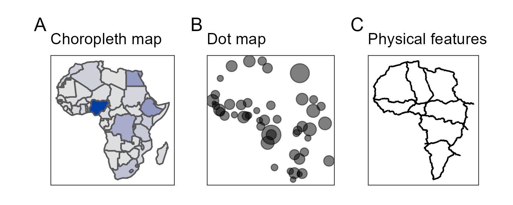
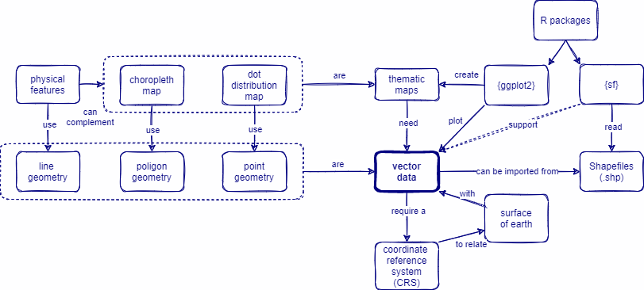

```{r, include = FALSE, warning = FALSE, message = FALSE}
# Load packages 
if(!require(pacman)) install.packages("pacman")
pacman::p_load(tidyverse, knitr, here)

# Source functions 
source(here("global/functions/misc_functions.R"))

# knitr settings
knitr::opts_chunk$set(warning = F, message = F, class.source = "tgc-code-block", error = T)

## autograders
suppressMessages(source(here::here("ch06_basic_geospatial_viz/lessons/ch06_ls02_external_data_autograder.R")))
```

```{r,echo=FALSE}
ggplot2::theme_set(new = theme_bw())
```

------------------------------------------------------------------------

# Geospatial analysis: Read external data

## Learning objectives

1.  Read Spatial data from **online databases** using `{rgeoboundaries}` and `{malariaAtlas}`.

2.  Convert foreign objects to **`sf` class** using the `st_as_sf()` function from the `{sf}` package.

3.  Relate each Thematic map with a **Vector data** type.

## Prerequisites

This lesson requires the following packages:

```{r,eval=TRUE,echo=TRUE,message=FALSE}
if(!require('pacman')) install.packages('pacman')

pacman::p_load(malariaAtlas,
               ggplot2,
               cholera,
               here,
               sf)

pacman::p_load_gh("afrimapr/afrilearndata",
                  "wmgeolab/rgeoboundaries")
```

## Introduction

In the previous lesson we learned how to create *Thematic maps* using `{ggplot2}` and the `geom_sf()` function.



For all of our previous examples we used *Spatial data* recorded inside the `{afrilearndata}` package, like `africapitals`, `africountries`, and `afrihighway`. But, How can we create more *Thematic maps* from **external** Spatial data?

In this lesson we are going to learn how to **read external Spatial data** from *online* repositories.

## From Online databases

Here we are going to explore two `{packages}` that **connect** our environment to web repositories and facilitate the downloading of external data. This procedure *do not need* URL paths, only specific *arguments* inside a function.

### Boundaries of countries with `rgeoboundaries`

The [`rgeoboundaries`](https://github.com/wmgeolab/rgeoboundaries) package is a client for the [geoBoundaries API](https://www.geoboundaries.org/), providing country political administrative boundaries.

#### A single country {.unnumbered}

To download boundaries of countries we use the `geoboundaries()` function of `{rgeoboundaries}`. For example, we can download the administrative boundary of Zimbabwe and assign it to a variable called `zimbabwe_boundary` as follows.

```{r,eval=FALSE,echo=TRUE}
zimbabwe_boundary <- geoboundaries(country = "Zimbabwe")
```

::: key-point
-   The `zimbabwe_boundary` is a `"sf"` class object.

```{r,eval=FALSE,echo=FALSE,message=FALSE}
class(zimbabwe_boundary)
```

-   `{ggplot2}` allows us to easily visualise **simple feature** objects using the `geom_sf()` function.

-   It can be used to plot the administrative boundary of Zimbabwe as follows:

```{r, eval=FALSE}
ggplot(data = zimbabwe_boundary) +
  geom_sf()
```
:::

::: practice
Download the boundaries of `Sierra Leone`.

```{r,eval = FALSE,echo=FALSE}
q1 <- geoboundaries(country = ________)
.check_q1()
.hint_q1()
```
:::

#### Different levels of administrative boundaries {.unnumbered}

If available, lower levels of administrative boundaries in countries can be downloaded too. We just have to pass the administrative level as an argument in the `geoboundaries()` function.

Administrative **level 1** (`"adm1"`) is the highest level, while administrative **level 5** (`"adm5"`) is the lowest. This means the country will be further sub-divided into administrative divisions as the Administrative level progresses from 1 to 5.

See how the first and second administrative level boundaries of Zimbabwe are downloaded below.

```{r,fig.height=3}
# downloading administrative level 1 boundaries
zimbabwe_boundaries_adm1 <- geoboundaries(country = "Zimbabwe",
                                         adm_lvl = "adm1")

ggplot(data = zimbabwe_boundaries_adm1) +
  geom_sf()
```

```{r,fig.height=3}
# downloading administrative level 2 boundaries
zimbabwe_boundaries_adm2 <- geoboundaries(country = "Zimbabwe",
                                         adm_lvl = "adm2")

ggplot(data = zimbabwe_boundaries_adm2) +
  geom_sf()
```

::: practice
Download the `third` administrative level boundaries of `Sierra Leone`.

```{r,eval = FALSE,echo=FALSE}
q2 <- geoboundaries(country = ________, adm_lvl = ________)
.check_q2()
.hint_q2()
```
:::

::: pro-tip
We can also download the boundaries of **multiple countries** together by including the names of countries as a `vector` class object like: `c("country_01","country_02")`.

See how the `second` administrative level boundaries of adjacent countries like `Zimbabwe` and `Mozambique` are downloaded and plotted below.

```{r, eval=FALSE}
zimbabwe_mozambique_adm2 <- 
  geoboundaries(country = c("Zimbabwe", "Mozambique"),
                                   adm_lvl = "adm2")
```

```{r,eval=FALSE}
ggplot(data = zimbabwe_mozambique_adm2) +
  geom_sf()
```
:::

### Disease information with `malariaAtlas`

The `malariaAtlas` package download, visualize and manipulate global malaria data hosted by the [Malaria Atlas Project](https://malariaatlas.org/).

The `malariaAtlas` package enables users to download data like:

-   parasite rate (PR) survey data (*Plasmodium falciparum* and *Plasmodium vivax*)
-   mosquito occurrence data

#### Parasite Rate surveys {.unnumbered}

The `getPR()` function downloads all the publicly available PR points for a country (or countries) and returns it as a dataframe. The `species` argument is a string specifying the Plasmodium species and can be `Pf` (*Plasmodium falciparum*), `Pv` (*Plasmodium vivax*) or `BOTH`.

```{r get-pr,message = FALSE,warning=FALSE}
zimbabwe_malaria_pr <- getPR(country = "Zimbabwe", species = "BOTH")
```

The output is a `data.frame` object that contains `longitude` and `latitude` as variables:

```{r}
class(zimbabwe_malaria_pr)
```

```{r}
zimbabwe_malaria_pr %>% 
  as_tibble()
```

::: practice
Download the publicly available Parasite Ratio (PR) points for *Plasmodium falciparum* in Sierra Leone.

```{r,eval = FALSE,echo=FALSE}
q3 <- "YOUR ANSWER HERE"
.check_q3()
.hint_q3()
```
:::

`autoplot()` can be used to quickly and easily visualise the downloaded PR survey points.

```{r viz-PR, eval=FALSE, message=FALSE,warning=FALSE}
autoplot(zimbabwe_malaria_pr)
```

However, if you would like to make a **custom plot** for your particular research needs, with complete control of the *output aesthetics*, you would probably prefer `{ggplot2}` for the work!

#### Convert a foreign object to `sf` {.unnumbered}

To convert a `data.frame` to an `sf` object, we can use the `st_as_sf()` from the `{sf}` package.

In case of **Point** patterns data (like for a **Dot map**):

-   the `coords` argument need to specify the names of the variables holding the **Coordinates**, and
-   the `crs` argument specify the **Coordinate Reference System (CRS)** to be assigned (here WGS84, which is the CRS code \#`4326`).

```{r,eval=TRUE,echo=TRUE}
zimbabwe_malaria_pr_sf <- 
  # data frame
  zimbabwe_malaria_pr %>% 
  # convert to sf
  sf::st_as_sf(coords = c("longitude","latitude"),
               crs = 4326)
```

Inside the **`coords` argument**,you need to pay attention to two things:

-   You need to use `"quotation_marks"` for each column name,
-   First write the `longitude`, and then the `latitude`.

::: side-note
Does this CRS business sound like gibberish to you? DON'T PANIC ! We are going to cover this SOON in the coming lessons. We will see what "WGS84" stands for and how to choose the right CRS for our plots. For now, trust me on this.
:::

**Mission accomplished!** This is the output of the convertion:

```{r}
zimbabwe_malaria_pr_sf
```

Now we have converted our data into an `sf` object and can directly plot this object with `{ggplot2}` code:

```{r,fig.height=3}
ggplot(data = zimbabwe_malaria_pr_sf) +
  geom_sf(aes(size = pr))
```

Or add one previous layer with the administrative boundaries of Zimbabwe:

```{r,fig.height=3}
ggplot() +
  # boundaries data
  geom_sf(data = zimbabwe_boundaries_adm1,
          fill = "white") +
  # disease data
  geom_sf(data = zimbabwe_malaria_pr_sf,
          aes(size = pr),
          color = "red",
          alpha=0.5)
```

::: watch-out
`sf::st_as_sf()` does not allow missing values in coordinates!

So you can use `{dplyr}` verbs like `filter()` to drop problematic rows from variable `x` using this notation:`filter(!is.na(x))`.
:::

::: practice
With the publicly available Parasite Ratio (PR) points of *Plasmodium falciparum* in Sierra Leone stored in `q3`:

Convert its `data.frame` output to a `sf` object using the code `4326` to set a WGS84 CRS. (More on all these codes coming soon, don't be intimidated !)

```{r,eval = FALSE,echo=FALSE}
q4 <- 
  q3 %>% 
  sf::st_as_sf(coords = c(________,________),
               crs = ________)
.check_q4()
.hint_q4()
```
:::

#### Vector data {.unnumbered}

**Vector Data** is the most common format of *Spatial data* used in GIS. *Vector data* provides sufficient information about where different features should be, in relation to one another.

::: vocab
-   When we collect *Point* pattern data, used to create *Dot maps*, we need to use a **Vector data** type called **Point** geometry.

-   When we collect *Areal* data, used to create *Choropleth maps*, we need to use a **Vector data** type called **Polygon** geometry.
:::

Above is an example of converting foreign **Point** data to `sf` class. Now let's see briefly see how to convert foreign **Areal** data.

Here is an example, using an alternative way to download administrative boundaries using \`raster::getData()\`\`:

1.  We get *level 2* administrative boundaries data from the [GADM](https://gadm.org/) online repository.

2.  Countries are specified by their [3 letter ISO codes](https://en.wikipedia.org/wiki/List_of_ISO_3166_country_codes#Current_ISO_3166_country_codes).

```{r,message=FALSE,warning=FALSE}
pacman::p_load(raster)
sle_polygon <- getData(name = 'GADM', country = 'SLE', level = 2)
sle_polygon
```

3.  Countries are *areas* (i.e. Spatial **Polygons**) hence we need to convert these area coordinates to an `sf` object.

```{r,message=FALSE,warning=FALSE}
sle_polygon %>% class()
```

4.  Let's see how this translated into code (reminder: you do not need to use any argument inside `st_as_sf()`):

```{r,message=FALSE,warning=FALSE}
sle_polygon %>% sf::st_as_sf() %>% class()
```

5.  With this `sf` object we can easily make plots with {ggplot2}

```{r,message=FALSE,warning=FALSE}
sle_polygon %>% 
  sf::st_as_sf() %>% 
  ggplot() +
  geom_sf()
```

::: watch-out
Do not get confused by the `vector` class object, which is an R class just like `data.frame` and `matrix`.
:::

::: vocab
*Vector data* require a **Coordinate Reference System (CRS)** to relate the spatial elements of the data with the *surface of Earth*.

Degrees of **longitude/latitude** are the most common.

 <!-- Original source: dreamstime --> <!-- https://es.dreamstime.com/stock-de-ilustraci%C3%B3n-latitud-longitud-image60598958#_ -->

For now, it is sufficient to know that coordinate systems are a *key component* of geographic objects. We will cover them in detail later !
:::

```{r include = F}
.score_print()
```

```{r include = F}
pacman::p_unload(raster) # avoid masking select(). Temporary investigation
```

## Wrap up

In this lesson, we have learned how to **read** Vector data like *Polygon geometries* from *Online databases* from the `{rgeoboundaries}` package and `GADM` repository, how to **convert** foreign *Point geometries* to `sf` from the `{malariaAtlas}` package, and why they need a *Coordinate Reference Systems (CRS)*.



In the next lesson we are going dive into **Vector data** components and how to read it from **local files**!

## Contributors {.unlisted .unnumbered}

The following team members contributed to this lesson:

`r tgc_contributors_list(ids = c("avallecam", "lolovanco"))`

## References {.unlisted .unnumbered}

Some material in this lesson was adapted from the following sources:

-   *Seimon, Dilinie. Administrative Boundaries.* (2021). Retrieved 15 April 2022, from <https://rspatialdata.github.io/admin_boundaries.html>

-   *Varsha Ujjinni Vijay Kumar. Malaria.* (2021). Retrieved 15 April 2022, from <https://rspatialdata.github.io/malaria.html>

-   *Batra, Neale, et al. The Epidemiologist R Handbook. Chapter 28: GIS Basics*. (2021). Retrieved 01 April 2022, from <https://epirhandbook.com/en/gis-basics.html>

-   *Lovelace, R., Nowosad, J., & Muenchow, J. Geocomputation with R. Chapter 2: Geographic data in R*. (2019). Retrieved 01 April 2022, from <https://geocompr.robinlovelace.net/spatial-class.html>

-   *Moraga, Paula. Geospatial Health Data: Modeling and Visualization with R-INLA and Shiny. Chapter 2: Spatial data and R packages for mapping*. (2019). Retrieved 01 April 2022, from <https://www.paulamoraga.com/book-geospatial/sec-spatialdataandCRS.html>

`r tgc_license()`
