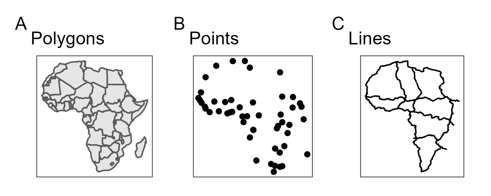

```{r, include = FALSE, warning = FALSE, message = FALSE}
# Load packages 
if(!require(pacman)) install.packages("pacman")
pacman::p_load(tidyverse, knitr, here)

# Source functions 
source(here("global/functions/misc_functions.R"))

# knitr settings
knitr::opts_chunk$set(warning = F, message = F, class.source = "tgc-code-block", error = T)

## autograders
suppressMessages(source(here::here("ch06_basic_geospatial_viz/lessons/ch06_ls03_local_data_autograder.R")))
```

```{r,echo=FALSE}
ggplot2::theme_set(new = theme_bw())
```

------------------------------------------------------------------------
# Geospatial analysis: Read local data

## Learning objectives

1.  Identify the components of **Vector data** objects.

2.  Read Spatial data from **local Shapefiles** using the `read_sf()` function from the `{sf}` package.

## Prerequisites

This lesson requires the following packages:

```{r,eval=TRUE,echo=TRUE,message=FALSE}
if(!require('pacman')) install.packages('pacman')

pacman::p_load(malariaAtlas,
               ggplot2,
               cholera,
               here,
               sf)

pacman::p_load_gh("afrimapr/afrilearndata",
                  "wmgeolab/rgeoboundaries")
```

## Introduction

In the previous lesson we learned how to get **Vector Data**, which is the most common format of Spatial data used in GIS, from **external** repositories. We also learned and how to relate **Vector data** types that are needed by GIS software to create *Thematic maps*.

But, How can we create more *Thematic maps* from *external* Spatial data that is only available in our **local files**? Or how to *distribute* it to colleagues through e-mail or GitHub?

In this lesson we are going dive into **Vector data** components and how to read it from **local files**!

## Delving into vector data {.unnumbered}

::: reminder
All these *simple feature* (`sf`) objects are also of class **data.frame**.

```{r}
class(africapitals)
```
:::

All the *Spatial data* that we used until now used to make *Thematic maps* have two main components: A **header** and a **data frame**.

For example, for a *Dot map* we used a the `africapitals` object:

```{r}
africapitals
```

The first line of the **header** details the dimensions of the *Simple feature* (`sf`) object.

    Simple feature collection with 51 features and 4 fields

-   The number of *features* are the number of rows in the **data frame**.
-   The number of *fields* are the number of columns in the **data frame**, except the *last one*.

### Geometries {.unnumbered}

If we explore the **data frame** associated with the Spatial data objects, we identify that all of them have a **geometry** column at the end:

                geometry
       POINT (7.17 9.18)
       POINT (-0.2 5.56)
      POINT (38.74 9.03)
      POINT (3.04 36.77)
    POINT (47.51 -18.89)
     POINT (38.94 15.33)
     POINT (-7.99 12.65)
      POINT (18.56 4.36)
     POINT (-16.6 13.46)
     POINT (-15.6 11.87)

The text that appears below the **geometry** column its also detailed in the second line of the **header** of the output:

    Geometry type: POINT

Try to identify which *Geometry* is detailed in the other Spatial data objects used until now for a *Choropleth map* and *Physical features*:

```{r,eval=FALSE}
africountries
afrihighway
```

These **Geometries** are types of **Vector data**:

::: practice
Which of the following options of *vector data* types:

a.  `"polygon_geometry"`
b.  `"point_geometry"`
c.  `"line_geometry"`

...corresponds to each of these *thematic map* scenarios? 

Please enter the name of the geometry and not the letter associated to it.

Number of positive SARS-CoV-2 PCR tests by province in Angola during the year 2021.

```{r,eval = FALSE,echo=FALSE}
q1 <- "YOUR ANSWER HERE"

.check_q1()
.hint_q1()
```

Geographical coordinates for the location of hospital and clinic health facilities in Senegal.

```{r,eval = FALSE,echo=FALSE}
q2 <- "YOUR ANSWER HERE"

.check_q2()
.hint_q2()
```

Visualization of the urban water supply networks in the city of Cape Town, South Africa.

```{r,eval = FALSE,echo=FALSE}
q3 <- "YOUR ANSWER HERE"

.check_q3()
.hint_q3()
```
:::

## Recap : Thematic maps and Vector data

::: recap
All *Thematic maps* need **Vector data** in a GIS software to be plotted:

-   Choropleth maps use *Polygon* geometry.
-   Dot maps use *Point* geometry.
-   Physical features in a map use *Line* geometry.
:::



## From Local files

We can **read** *Vector data* from **local files** with a `.shp` extension like `sle_adm3.shp`, available inside the `ch06_basic_geospatial_viz/data/gis/shp/` folder, in two steps:

1.  Specify the file path up to the `.shp` filename:

```{r}
pacman::p_load(here)

shape_path <- 
  here::here("ch06_basic_geospatial_viz",
             "data","gis","shp",
             "sle_adm3.shp")
```

2.  Then, use the `read_sf()` function from the `{sf}` package as follows:

```{r,eval=TRUE,echo=FALSE}
pacman::p_load(sf)
shape_file <- read_sf(dsn = shape_path,quiet = TRUE)
```

```{r,eval=FALSE,echo=TRUE}
pacman::p_load(sf)
shape_file <- read_sf(dsn = shape_path)

shape_file
```

::: practice
Read the shapefile called `sle_hf.shp` inside the `ch06_basic_geospatial_viz/data/gis/shp/` folder:

```{r,eval = FALSE,echo=FALSE}
q4 <- "YOUR ANSWER HERE"

.check_q4()
.hint_q4()
```
:::

::: key-point
The [`{sf}` package]((https://r-spatial.github.io/sf/)) provides a set of tools for working with geospatial **vectors**, i.e., all the **geometry types** used in the vast majority of geographic research, like polygons, points, and lines.
:::

### Shapefiles

Files with a `.shp` extension are called **Shapefiles**.

### What are they? {.unnumbered}

A **Shapefiles** is the most common data format for storing *Vector data*. 

A **single shapefile** is actually a *collection* of at least three files - `.shp`, `.shx`, and `.dbf`.


<!-- [source](https://transportgeography.org/contents/methods/network-data-models/esri-shapefile-model/) -->

::: side-note
Each **individual shapefile** can only contain *one vector type* (all points, all lines or all polygons). You will not find a mixture of point, line and polygon objects in a single shapefile.
:::

::: watch-out
All of these *sub-component files* must be present in a given directory (folder) for the shapefile to be readable.
::: 

As an example, this is a list with the sub-component files of a *Shapefile* called `sle_adm3.shp`. All of them are located in the same `ch06_basic_geospatial_viz/data/gis/shp/` folder:

```{r,eval=TRUE,echo=FALSE}
shape_folder <- 
  here::here("ch06_basic_geospatial_viz",
             "data","gis","shp")

list.files(path = shape_folder,
           pattern = "*adm3*",
           full.names = FALSE) %>% 
  tibble::enframe(name = NULL)
```

What is the content inside each file associated with one shapefile?

-   **`.shp`**: contains the *geometry* data,
-   `.shx`: is a *positional index* of the geometry data that allows to seek forwards and backwards the .shp file,
-   `.dbf`: stores the *attributes* for each shape.
-   `.prj`: plain text file describing the *projection*,
-   `.sbn` and `.sbx`: *spatial index* of the geometry data,
-   `.shp.xml`: geospatial *metadata* in XML format.

These *associated files* can be compressed into a ZIP folder to be sent via email or download from a website.

::: practice
Which of the following options of *component files of Shapefiles*:

a.  `"shp"`
b.  `"shx"`
c.  `"dbf"`

contains the *geometry* data?

```{r,eval = FALSE,echo=FALSE}
q5 <- "YOUR ANSWER HERE"
.check_q5()
.hint_q5()
```

stores the *attributes* for each shape?

```{r,eval = FALSE,echo=FALSE}
q6 <- "YOUR ANSWER HERE"
.check_q6()
.hint_q6()
```
:::

```{r include = F}
.score_print()
```

## Wrap up

In this lesson, we have learned to identify the **components** of *Vector data* and how to **read** it from *local Shapefiles* using the *`{sf}`* package.


In the next lesson we are going dive into **CRS**'s. We are going to learn how to manage the CRS of maps by **zooming in** to an area of interest, **set them up** to external data with coordinates different to longitude and latitude, and **transform** between different coordinate systems!

## Contributors {.unlisted .unnumbered}

The following team members contributed to this lesson:

`r tgc_contributors_list(ids = c("avallecam", "lolovanco"))`

## References {.unlisted .unnumbered}

Some material in this lesson was adapted from the following sources:

-   *Seimon, Dilinie. Administrative Boundaries.* (2021). Retrieved 15 April 2022, from <https://rspatialdata.github.io/admin_boundaries.html>

-   *Varsha Ujjinni Vijay Kumar. Malaria.* (2021). Retrieved 15 April 2022, from <https://rspatialdata.github.io/malaria.html>

-   *Batra, Neale, et al. The Epidemiologist R Handbook. Chapter 28: GIS Basics*. (2021). Retrieved 01 April 2022, from <https://epirhandbook.com/en/gis-basics.html>

-   *Lovelace, R., Nowosad, J., & Muenchow, J. Geocomputation with R. Chapter 2: Geographic data in R*. (2019). Retrieved 01 April 2022, from <https://geocompr.robinlovelace.net/spatial-class.html>

-   *Moraga, Paula. Geospatial Health Data: Modeling and Visualization with R-INLA and Shiny. Chapter 2: Spatial data and R packages for mapping*. (2019). Retrieved 01 April 2022, from <https://www.paulamoraga.com/book-geospatial/sec-spatialdataandCRS.html>

`r tgc_license()`

