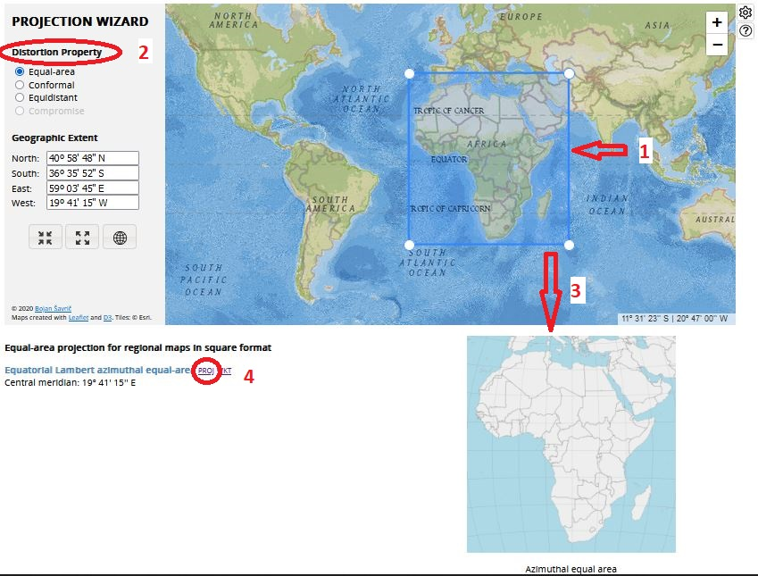

```{r, include = FALSE, warning = FALSE, message = FALSE}
# Load packages 
if(!require(pacman)) install.packages("pacman")
pacman::p_load(tidyverse, knitr, here)

# Source functions 
source(here("global/functions/misc_functions.R"))

# knitr settings
knitr::opts_chunk$set(warning = F, message = F, class.source = "tgc-code-block", error = T)

# Source autograder script quietly 
suppressMessages(source(here::here("ch06_basic_geospatial_viz/lessons/ch06_ls04_crs_autograder.R")))
```

```{r,echo=FALSE}
ggplot2::theme_set(new = theme_bw())
```

# Geospatial analysis: coordinate reference systems

## Learning objectives

1.  Zoom in `ggplot` maps with Coordinate Reference Systems (**CRS**) using the `coord_sf()` function.

2.  Change the **CRS projection** of a `ggplot` map using the `crs` argument of `coord_sf()`.

3.  Configure data with **UTM coordinate system** using the `st_as_sf()` function.

4.  Change the **CRS projection** of a `sf` object using the `st_transform()` function.

## Prerequisites

This lesson requires the following packages:

```{r,eval=TRUE,echo=TRUE,message=FALSE}
if(!require('pacman')) install.packages('pacman')

pacman::p_load(malariaAtlas,
               colorspace,
               ggplot2,
               cholera,
               spData,
               here,
               rio,
               sf)

pacman::p_load_gh("afrimapr/afrilearndata",
                  "wmgeolab/rgeoboundaries")
```

## Introduction

From the second lesson, we learned that **Vector data** require a **Coordinate Reference System (CRS)** to relate the spatial elements of the data with the *surface of Earth*. For that reason, Coordinate systems are a *key component* of geographic objects.


<!-- Original source: [dreamstime](https://es.dreamstime.com/stock-de-ilustraci%C3%B3n-latitud-longitud-image60598958#_) -->

In this lesson we are going to learn how to manage the CRS of maps by **zooming in** to an area of interest, **set them up** to external data with coordinates different to longitude and latitude (called UTM), and **transform** between different coordinate systems of CRS's.

## Data and basic plot

First, let us start with creating a base map of the `world` from the `spData` package using `ggplot2`:

```{r world-plot, fig.width = 10, fig.height = 5, out.width = "90%"}
ggplot(data = world) +
    geom_sf()
```

## Manage Coordinate systems with `coord_sf()`

The function `coord_sf()` from the `{ggplot2}` package allows to deal with the **coordinate system**, which includes both the *extent* and *projection* of a map.

### "Zoom in" on maps

The **extent** of the map can also be set in `coord_sf()`, in practice allowing to "zoom" in the area of interest, provided by limits on the x-axis (`xlim`), and on the y-axis (`ylim`).

Here, we zoom in the `world` map to the African continent, which is in an area delimited in **longitude** between 20°W and 55°E, and in **latitude** between 35°S and 40°N. To exactly match the limits provided, use `expand = FALSE`.

```{r world-zoom,warning=FALSE,message=FALSE}
ggplot(data = world) +
    geom_sf() +
    coord_sf(xlim = c(-20, 55), ylim = c(-35, 40), expand = FALSE)
```

::: watch-out
Check which `+` and `-` **signs** are related with the **cardinal direction**:

-   In longitude: West is `-`, East is `+`,
-   In latitude: South is `-`, North is `+`.
:::

::: practice
Zoom in the `africountries` map to Sierra Leona, which is in an area delimited in longitude between 14°W and 10°W, and in latitude between 6°N and 10°N.

```{r,eval = FALSE,echo=FALSE}
q1 <- "YOUR ANSWER HERE"
.check_q1()
.hint_q1()
```
:::

### Change the Projection of a map

The `world` object have a **CRS projection** called *WGS84* (detailed in the **fifth line** of the **header**)

```{r,eval=FALSE,echo=TRUE}
world
```

    ## Geometry set for 177 features 
    ## Geometry type: MULTIPOLYGON
    ## Dimension:     XY
    ## Bounding box:  xmin: -180 ymin: -89.9 xmax: 180 ymax: 83.64513
    ## Geodetic CRS:  WGS 84
    ## First 5 geometries:

Which corresponds to the **EPSG code 4326**:

```{r}
st_crs(world)$input
```

::: key-point
**Projection** refers to the mathematical equation that was used to *project* the truly *round* earth onto a *flat* surface.


:::

::: vocab
-   **EPSG** refers to the *European Petroleum Survey Group (EPSG)*.

-   *EPSG* is a Spatial Reference System Identifier (SRID) with arbitrary **codes** available for concrete **CRS projections**.

-   One of these projections is **WGS84**, which refers to *World Geodetic System 1984*.
:::

Using the `crs` argument of the `coord_sf()` function, it is possible to **override** this setting, and project on the fly to **any projection**.

For example, we can change the current *WGS84* projection to the *ETRS89 Lambert Azimuthal Equal-Area projection* (alias LAEA), which is **EPSG code 3035**:

```{r}
ggplot(data = world) +
    geom_sf() +
    coord_sf(crs = 3035)
```

However, this CRS projection is useful for [European countries](https://epsg.io/3035).

::: practice
Get into the linked webpage to find the *EPSG code* that its required:

Change the CRS projection of the `ggplot` map with the `world` object to the [Pseudo-Mercator](https://epsg.io/3857) coordinate system.

```{r,eval = FALSE,echo=FALSE}
q2 <- "YOUR ANSWER HERE"
.check_q2()
.hint_q2()
```
:::

#### Choosing a Projection / CRS {.unnumbered}

::: reminder
**Which projection should I use?**

To decide if a projection is right for your data, answer these questions:

-   What is the area of minimal distortion?\
-   What aspect of the data does it preserve?\
:::

::: pro-tip
Take the time to identify a **projection** that is suited for your project. You don't have to stick to the ones that are popular.
:::

Online tools like [Projection Wizard](http://projectionwizard.org/) can also help you **discover** projections that might be a **better fit for your data**.



For instance, to **find** an appropriate projection for the African continent, you can:

1.  Define your *area* of interest,
2.  Select a *distortion* property,
3.  Confirm the map outcome that *fits* your needs,
4.  Copy the text inside the **PROJ** option.

Then, paste that valid **PROJ string** to the `crs` argument:

```{r world-coord}
ggplot(data = world) +
    geom_sf() +
    coord_sf(crs = "+proj=laea +lon_0=19.6875 +lat_0=0 +datum=WGS84 +units=m +no_defs")
```

::: vocab
[PROJ](http://proj4.org/) is an open-source library for storing, representing and transforming CRS information.
:::

::: practice
Get into the linked webpage to find the *PROJ string* that its required:

Change the CRS projection of the `ggplot` map with the `world` object to the [Aitoff](https://proj.org/operations/projections/aitoff.html) coordinate system.

```{r,eval = FALSE,echo=FALSE}
q3 <- "YOUR ANSWER HERE"
.check_q3()
.hint_q3()
```
:::

#### CRS components {.unnumbered}

A **CRS** has a few key components:

-   *Coordinate System* - There are many many different coordinate systems, so make sure you know which system your coordinates are from. (e.g. longitude/latitude, which is the most common);

-   *Units* - Know what the units are for your coordinate system (e.g. decimal degrees, meters);

-   *Datum* - A particular modeled version of the Earth. These have been revised over the years, so ensure that your map layers are using the same datum. (e.g. WGS84);

-   *Projections* - As defined above, it refers to the mathematical equation that was used to project the truly round earth onto a flat surface.

#### CRS projections {.unnumbered}

The *"orange peel" analogy* is useful to understand **projections**. If you imagine that the earth is an *orange*, how you *peel it* and then *flatten the peel* is similar to how projections get made.

-   A **datum** is the choice of fruit to use. Is the earth an orange, a lemon, a lime, a grapefruit?


<!-- [Image source](https://github.com/MicheleTobias/R-Projections-Workshop) -->

-   A **projection** is how you peel your orange and then flatten the peel.


<!-- [Image source](http://blogs.lincoln.ac.nz/gis/2017/03/29/where-on-earth-are-we/) -->


The above image shows maps of the United States in **different projections**. Notice the differences in *shape* associated with each projection. These differences are a direct result of the calculations used to *flatten* the data onto a 2-dimensional map.

::: watch-out
-   Data from the **same location** but saved in **different projections** will not line up in any GIS software.

-   Thus, it's important when working with spatial data to **identify the coordinate reference system** applied to the data **and retain it** throughout data processing and analysis.
:::

## Set up a CRS Projection to UTM coordinates

Let's say that you receive a data frame with coordinates, but *without* a CRS projection. If you want to make a `ggplot` map with it, you know that you can use `st_as_sf()` from the `{sf}` package.

::: recap
As we learned in a previous lesson, for **point** data we need to specify the coordinates and the CRS:

```{r,eval=FALSE}
fatalities %>% 
  st_as_sf(coords = c("x","y"),
           crs = 4326) %>% 
  ggplot() +
  geom_sf(alpha = 0.3)
```
:::

However, what if you receive coordinates **different to** *longitude* and *latitude*?

To exemplify this scenario, we are going to use **malaria prevalence in The Gambia**. We use data of malaria prevalence in children obtained at **65 villages** in The Gambia. 

### Malaria prevalence

First, we download the `gambia.rda` file from internet using its **URL path** with the [`{rio}` package](https://github.com/leeper/rio).

```{r,message=FALSE,warning=FALSE}
gambia <- rio::import("https://github.com/cran/geoR/raw/master/data/gambia.rda")

as_tibble(gambia)
```

It is a data frame with 2035 observations and 8 variables, among them:

-   `x`: x coordinate of the village (**UTM**),
-   `y`: y coordinate of the village (**UTM**),
-   `pos`: presence (1) or absence (0) of malaria in a blood sample taken from the child,

::: vocab
**UTM** stants for Universal Transverse Mercator, another coordinate system.
:::

#### Aggregate data {.unnumbered}

Data in `gambia` are given at an **individual level**. To get an estimate of the prevalence per village, we need to **aggregate** the malaria tests *by village*.

##### Unique coordinates {.unnumbered}

Using the `dplyr::distinct()` function, we can see that `gambia` has 2035 rows and 65 **unique pair** of coordinates. This indicates that 2035 malaria tests were conducted at 65 locations.

```{r}
gambia %>% 
  distinct(x,y) %>% 
  nrow()
```

##### Use `group_by()` and `summarise()` {.unnumbered}

Here we use `dplyr` to create a data frame called `gambia_point_summary` containing, **for each village** the:

-   *coordinates* (x, y),
-   *total* number of tests performed (total),
-   number of *positive* tests (positive), and
-   malaria *prevalence* (prev).

```{r,message=FALSE,warning=FALSE}
gambia_point_summary <- 
  gambia %>% 
  group_by(x, y) %>%
  summarize(
    total = n(),
    positive = sum(pos),
    prev = positive / total
  ) %>% 
  ungroup()
```

```{r}
gambia_point_summary
```

#### Set up the CRS projection {.unnumbered}

Now we can plot the malaria prevalence. However, in order to use `ggplot2` and `geom_sf()`, we need to transform the `data.frame` to an `sf` object.

To use the `st_as_sf()` function from the `{sf}` package, we need to specify a CRS projection. But in this case, the **units** of the `x` and `y` variables are **not** in *Geographic* coordinates (longitude/latitude). Instead, these data coordinates are in **UTM format (Easting/Northing)**, also called **Projected** coordinates.

::: vocab
**CRS coordinate systems:**

-   **Geographic** (or unprojected) reference systems use *longitude and latitude* for referencing a location on the Earth's *three-dimensional* ellipsoid surface.

-   **Projected** coordinate reference systems use *easting and northing* Cartesian coordinates for referencing a location on a *two-dimensional* representation of the Earth.


:::

::: key-point
All **Projected CRSs** are *based on* a **Geographic CRS** and rely on *map projections* to convert the three-dimensional surface of the Earth into Easting and Northing (x and y) values in a projected CRS.


:::

::: practice
Which of the following options of Coordinate Reference System (CRS) types:

a.  `"geographic_crs"`
b.  `"projected_crs"`

...corresponds to each of these datasets, given the magnitude of the values in their `x` and `y` columns:

the `parana` dataset? 

```{r,eval=FALSE,echo=TRUE,message=FALSE,warning=FALSE}
parana <- import("https://github.com/cran/geoR/raw/master/data/parana.rda")
as_tibble(parana$coords)
```

```{r,eval = FALSE,echo=FALSE}
q4 <- "YOUR ANSWER HERE"

.check_q4()
.hint_q4()
```

the `fatalities` dataset?

```{r,eval=FALSE,echo=TRUE}
pacman::p_load(cholera)
as_tibble(fatalities)
```

```{r,eval = FALSE,echo=FALSE}
q5 <- "YOUR ANSWER HERE"

.check_q5()
.hint_q5()
```
:::

##### Set UTM Projected coordinates with `st_as_sf()` {.unnumbered}

First, we need to set **UTM coordinates**. For this, we specify the projection of The Gambia, that is, **UTM zone 28** (`"+proj=utm +zone=28"`) in the `st_as_sf()` function of the `{sf}` package.

```{r}
gambia_projected <- gambia_point_summary %>% 
  # first, specify the projection of gambia
  # UTM zone 28
  st_as_sf(coords = c("x", "y"),
           crs = "+proj=utm +zone=28")

gambia_projected
```

Confirm the presence of the:

-   CRS text (`CRS: +proj=utm +zone=28`) inside the **header** of the new `sf` object, and
-   the **unit** the `geometry` column in **meters** (`<POINT [m]>`).

::: vocab
-   The **UTM** system divides the Earth into **60 zones** of *6 degrees of longitude in width*. Each of the zones uses a transverse Mercator projection that maps a region of large north-south extent.

-   To **get** the *UTM zones* of various parts of the world, you could use [online interactive maps](https://mangomap.com/robertyoung/maps/69585/what-utm-zone-am-i-in-#), or gridded images available in [wikipedia](https://en.wikipedia.org/wiki/Universal_Transverse_Mercator_coordinate_system#Exceptions).
:::

::: key-point
In the **UTM** system, a **position** on the Earth is given by the:

-   UTM *zone* number,
-   *Hemisphere* (north or south), and
-   Easting and northing *coordinates* in the zone which are measured in **meters**.
    -   *Eastings* are referenced from the central meridian of each zone, and
    -   *northings* are referenced from the equator.
:::

::: practice
`parana_data` contains the average rainfall over different years for the period May-June (dry-season). It was collected at 143 recording stations throughout *Parana State, Brasil*.

Set UTM coordinate system to the `parana_data`.

```{r}
parana_data <- as_tibble(parana$coords) %>% 
  mutate(Rainfall = parana$data)
```

```{r,eval = FALSE,echo=FALSE}
q6 <- "YOUR ANSWER HERE"
.check_q6()
.hint_q6()
```
:::

##### Transform to Geographic coordinates with `st_transform()` {.unnumbered}

We can transform the UTM *projected* coordinates to *geographic* coordinates (**longitude/latitude** with datum **WGS84**) using `st_transform()` where we set CRS to `"+proj=longlat +datum=WGS84"`.

```{r}
gambia_geographic <- gambia_projected %>% 
  # second, transform 
  # projected coordinates to
  # geographic coordinates
  st_transform(crs = "+proj=longlat +datum=WGS84")

gambia_geographic
```

Confirm the **update** of the:

-   CRS text to `CRS: +proj=longlat +datum=WGS84` inside the **header**, and
-   the **units** of the `geometry` column to **degrees** (`<POINT [°]>`).

::: vocab
A **PROJ string** includes the following information:

-   `+proj=`: the projection of the data (e.g. `utm`, `longlat`, or `laea`)
-   `+zone=`: the zone of the data, specific to the UTM projection (e.g. `28`)
-   `+datum=`: the datum use (e.g. `WGS84`)
-   `+units=`: the units for the coordinates of the data (e.g. `m`)
:::


::: practice
With the UTM coordinate system data stored in `q6`:

Transform its Projected CRS to a Geographic CRS using the `longitude/latitude` projection with datum `WGS84`.

```{r,eval = FALSE,echo=FALSE}
q7 <- "YOUR ANSWER HERE"
.check_q7()
.hint_q7()
```
:::

#### Map prevalences {.unnumbered}

Now that you have set up the right CRS projection to your data, you can **overlap** these points with other Vector data objects:

```{r}
gambia_adm_2 <- geoboundaries(country = "Gambia", adm_lvl = 2)
```

```{r,fig.height=2,fig.width=8}
ggplot() +
  geom_sf(data = gambia_adm_2) +
  geom_sf(data = gambia_geographic, mapping = aes(color = prev)) +
  colorspace::scale_color_continuous_sequential(palette="Reds 3")
```

::: pro-tip
**Which CRS to use?**

"There exist no all-purpose projections, all involve distortion when far from the center of the specified frame" (Bivand, Pebesma, and Gómez-Rubio 2013).

-   When **Geographic CRS**, the answer is often **WGS84**.
    -   It is used by default for web mapping, in *GPS* datasets, and vector datasets.
    -   WGS84 is the most common CRS in the world, so it is worth knowing its *EPSG code: 4326*.
    -   This 'magic number' can be used to convert objects with unusual projected CRSs into something that is widely understood.
-   About **Projected CRS**,
    -   It is often a choice made by a *public mapping agency*.
    -   With local data sources, work with the CRS in which the data was provided, to ensure *compatibility*, even if the official CRS is not the most accurate.
:::

```{r include = F}
.score_print()
```

```{r include = F}
pacman::p_unload(raster) # avoid masking select(). Temporary investigation
```

## Wrap up

In this lesson, we have learned how to **manage** a CRS *projection* in `ggplot` maps and `sf` objects, how projections are **codified** with *EPSG* codes and *PROJ* strings, and how to **transform** the CRS between different *coordinate systems* (projected and geographic).

In the next lesson, we are going to use all our previous learning to built one single thematic map by **layers**, and enrich them with **text** and **labels** referring to specific places or regions, and important map elements like **scale bars** and a **north arrow**!

## Contributors {.unlisted .unnumbered}

The following team members contributed to this lesson: `r tgc_contributors_list(ids = c("avallecam", "lolovanco"))`

## References {.unlisted .unnumbered}

Some material in this lesson was adapted from the following sources:

-   *Moreno, M., Basille, M. Drawing beautiful maps programmatically with R, sf and ggplot2 --- Part 1: Basics*. (2018). Retrieved 10 May 2022, from <https://r-spatial.org/r/2018/10/25/ggplot2-sf.html>

-   *Data carpentry. Introduction to Geospatial Concepts: Coordinate Reference Systems*. (2021). Retrieved 15 May 2022, from <https://datacarpentry.org/organization-geospatial/03-crs/index.html>

-   *Moraga, Paula. Geospatial Health Data: Modeling and Visualization with R-INLA and Shiny. Chapter 9: Spatial modeling of geostatistical data. Malaria in The Gambia*. (2019). Retrieved 10 May 2022, from <https://www.paulamoraga.com/book-geospatial/sec-geostatisticaldataexamplespatial.html>

-   *Carrasco-Escobar, G., Barja, A., Quispe, J. [Visualization and Analysis of Spatial Data in Public Health]*. (2021). Retrieved 15 May 2022, from <https://www.reconlearn.org/post/spatial-analysis-1-spanish.html>

`r tgc_license()`
