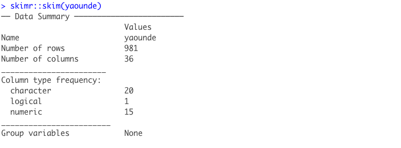
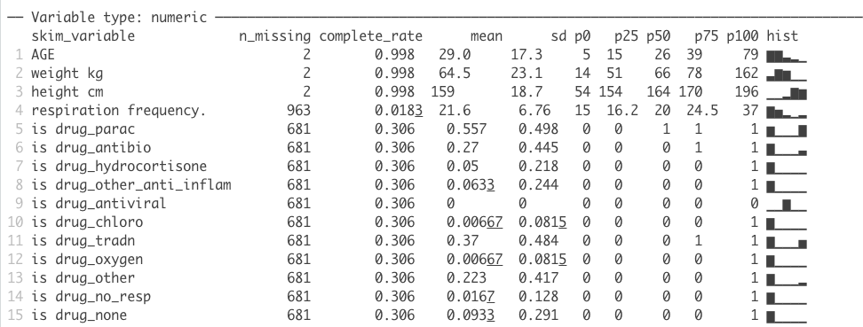
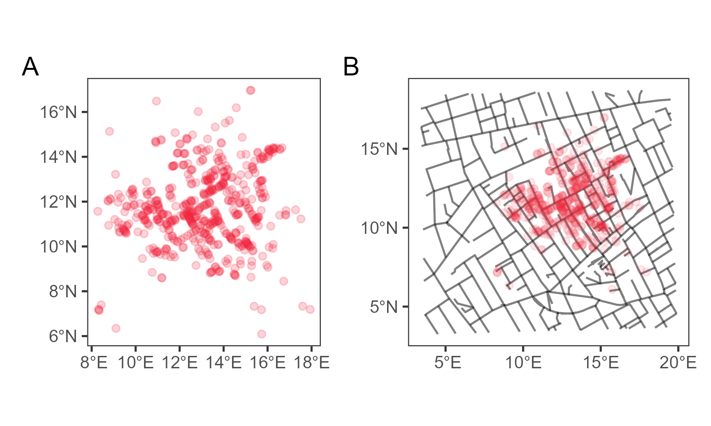
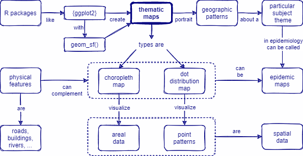

```{r echo = F, include = F, warning = F, message = F}
# Load packages ----
if(!require(pacman)) install.packages("pacman")
pacman::p_load(clock,
               knitr,
               tidyverse, 
               here)

# Source functions 
source(here("global/functions/misc_functions.R"))

# knitr settings
knitr::opts_chunk$set(warning = F, message = F, class.source = "tgc-code-block", error = T, render = knitr::knit_print)

```


<!--chapter:end:index.Rmd-->

---
title: '\ '
output:
  html_document:
    number_sections: true
    toc: true
    css: !expr here::here("global/style/style.css")
    highlight: kate
    pandoc_args: --shift-heading-level-by=-1
  word_document:
    toc: true
editor_options:
  markdown:
    wrap: 100
  canonical: true
  chunk_output_type: inline
---

```{r, echo = F, message = F, warning = F}
# Load packages ----
if(!require(pacman)) install.packages("pacman")
pacman::p_load(clock,
               knitr,
               tidyverse, 
               here)

# Source functions 
source(here("global/functions/misc_functions.R"))

# knitr settings
knitr::opts_chunk$set(warning = F, message = F, class.source = "tgc-code-block", error = T)

## autograders
suppressMessages(source(here::here("ch01_dates_times/lessons/ch01_ls01_dates_times_intro_autograder.R")))
```

------------------------------------------------------------------------

# Date/time data: introduction

## Learning Objectives

1.  Learn about Build a date object by providing individual components (year, month, day) using `{clock}` and the `date_build()` function.
2.  Create a date-time object by providing individual components (year, month, day, hour, minute, second) using `{clock}` and the `date_time_build()` function.

## Overview

As a data analyst, being able to work with temporal data (that is data associated with dates and times) is a key skill to have.

Temporal data can be inputted in several ways.
For example, when recording the date a patient visited the clinic, one nurse could input the date this way - Monday, 3rd January, 2022 while another nurse could record the same date as 03/01/2022.
Thus, if our aim is to find out how many patients visited the hospital on a particular day, the data must be cleaned and the columns containing the date and/or time information must be reformatted.

### Date and time classes in R

Here are some fundamental things to know about working dates and times in R.

R has special classes to deal with date and/or time data.
We are going to discuss three of them.

-   The `date` class for dates (which can be formatted into different configurations of year-month-day.

-   The `time` class for times (hours, minutes and seconds)

-   The `date-time` class also called POSIXct used to represent date plus time that is to pin point a distinct moment in time on a particular day in specified time zone.

For example, to get the current date and time in your local time zone, R has two in-built functions.

`Sys.Date()` for the current date and `Sys.time()` for the current date-time in the time zone on your computer.

```{r now}
Sys.time()

Sys.Date()

```

## Creating date and times

Clock, is an R package that has many functions that make working with dates and times easier.

To install `{clock}`, run the following code in your R session.
`install.packages("clock")`.

Proceed to load the packages if you have already installed them.

### The `date_build()` function

We are going to use the function `date_build()` in the `{clock}` package to date objects with the birthdays given in the report above.

`clock::date_build()` is a function used to create a date by providing the following arguments.

-   The first argument provided is the year.
    If only one argument is given, the date output is the first day of the first month of that year.

    For example, run the code below, to quickly get the date- the first of January, 2022.

```{r year_date_build}
clock::date_build(2022)
```

You can specify the year, month and day by providing three integer values separated by commas.
For example, the output of the following code is 15th March, 2022.

```{r ides_of_March}
clock::date_build(2022,3,15)
```

::: watch-out
-   The second argument of the `clock::date_build()` function has a range of 1 to 12 to represent the 12 months (January to December).

-   The third argument of this function has a range of 1 to 31 to represent the number of possible days in a month.
:::

Thus, providing values outside these ranges would be invalid.
For example, the code below gives an error because there is no 14th month or 40th day of the year 2007.

```{r month_error}
try(clock::date_build(2007,14))
try(clock::date_build(2007,12,40))
```

You can create a range of dates using the colon `:` operator between the range you want either in the year, month or day arguments.

For example, to represent the first week of February 2002, in place of the third argument (day) in `clock::date_build(year, month, day)`,type `1:7` as shown below.

```{r day_error}
date_build(2002, 2, 1:7)
```

Also, to get the last day of each month the year 2015, you can type the following code in place of `clock::date_build(year,month, day)` .

-   The month argument is replaced by the range `1:12`

-   Then, the day argument is replaced by the string `"last"`

```{r last_day }
clock::date_build(2015,1:12,"last")
```

Supposing you are analyzing birth records from a hospital in Nairobi, Kenya in the report below.

> A healthy infant male was born on 27th December 2021 at 6 am.
> The next day, 3 baby girls were delivered.
> They were born in 1 hour intervals from 3pm.

::: practice
1.  Create date objects from this information and write code to output the baby boy's correct birthday.

    ```{r q-1, include = F}
    q1 <- "YOUR ANSWER HERE"
    .check_q1()
    .hint_q1a()
    .hint_q1b()
    ```
:::

### The `date_time_build()` function

To create a date-time object, a R object that contains both dates and times, we use the function `date_time_build()` with seven arguments `(year, month, day, hour, minute, second, zone)`.

A key thing, to note is how to input the arguments of date_time_build().
As discussed previously, month and day have specified ranges, so do hour, minute, second and zone.

-   The hour argument ranges from 0-23

-   The minute argument ranges from 0-59

-   The second argument ranges from 0-59

-   The zone is the local timezone written in the form "continent/city" eg.
    "America/New York" or "Africa/Lagos".
    You can check out the list of all time zones with associated cities by viewing this inbuilt R data set `OlsonNames()`

```{r list_timezones}
head(OlsonNames()) #Get first 6 rows of the timezones data set
```

For example, to create a date-time object of the boy born on 27th December, 2021 at 6 am in Nairobi, Kenya we should run the following code.

```{r date_time_build}
clock::date_time_build(2021,12,27,06,00,00, zone="Africa/Nairobi")
```

::: practice
2.  Create a data object for the birthdays of the three baby girls born the following day after 27th December, 2021 at 3pm with one hour interval between them.

    ```{r q-2,include = F}
    q2 <- "YOUR ANSWER HERE"
    .check_q2()
    .hint_q2a()

    .hint_q2b()
    .hint_q2c()

    .hint_q2d()
    .hint_q2e()

    .hint_q2f()

    ```
:::

```{r echo = F}
.score_print()
```

## Contributors {.unlisted .unnumbered}

The following team members contributed to this lesson:

`r tgc_contributors_list(ids = c("aowusuda"))`

## References {.unlisted .unnumbered}

Some material in this lesson was adapted from the following sources:

-   Wickham, Hadley, and Garrett Grolemund.
    "R For Data Science." 16 Dates and times \| R for Data Science, 2017.
    <https://r4ds.had.co.nz/dates-and-times.html#time-zones>.

-   Vaughan, Davis.
    "Building: Date-Time - date_time_build." - date_time_build • clock, February 12, 2021.
    <https://clock.r-lib.org/reference/date_time_build.html>.

`r tgc_license()`

<!--chapter:end:ch01_ls01_dates_times_intro.Rmd-->

---
title: '\ '
output:
  html_document:
    number_sections: true
    toc: true
    css: !expr here::here("global/style/style.css")
    highlight: kate
    pandoc_args: --shift-heading-level-by=-1
  word_document:
    toc: true
editor_options:
  markdown:
    wrap: 100
  canonical: true
  chunk_output_type: inline
---

```{r, echo = F, message = F, warning = F}
# Load packages ----
if(!require(pacman)) install.packages("pacman")
pacman::p_load(lubridate,
               knitr,
               tidyverse, 
               here)

# Source functions 
source(here("global/functions/misc_functions.R"))

# knitr settings
knitr::opts_chunk$set(warning = F, message = F, class.source = "tgc-code-block", error = T)

## autograders
suppressMessages(source(here::here("ch01_dates_times/lessons/ch01_ls02_grouping_dates_autograder.R")))
```

------------------------------------------------------------------------

# Date/time data: disaggregating dates

## Learning Objectives

1\.
Group temporal data into different categories (days, weeks, months and years)

When working with data is important for data analysts to understand that data aggregation can hide a lot of things.

For example, when you rely on monthly case counts to tell you the entire story about the development of new disease cases, there is a lot granular data you are not taking advantage of.

Disaggregating (separating) monthly data into weekly case counts and even daily counts might reveal more information about the progression of diseases, or trend of sales of a product.

We are going to use the ebola_sierraleone_2014 data set from the `{outbreaks}` package to explore historical Ebola outbreak data and demonstrate this concept.

Run the code chunk below to create an R object called ebola_data.
With `head(ebola_data)` function, you can explore the initial rows of the data set.

```{r ebola_data}
#Create an R object named ebola_data 
ebola_data <- outbreaks::ebola_sierraleone_2014
head(ebola_data) #show the first 6 rows of the ebola_data
```

The `names(ebola_data)` function would show the names of the different columns.

```{r columns}
names(ebola_data)
```

It seems intuitive that `ebola_data$date_of_onset` and `ebola_data$date_of_sample` are columns containing date information.
Let us confirm that by checking the class of the columns.

```{r date columns}
class(ebola_data$date_of_onset)
class(ebola_data$date_of_sample)
```

Here is a monthly breakdown of a past epidemic of Ebola.
We see that there is a peak in October-December.

```{r month_image, out.width=c('100%', '100%'), echo=F}
knitr::include_graphics(here::here("ch01_dates_times","images", "Ebola_monthly_case_totals.png"))
```

To create the bar chart of monthly totals of new Ebola cases above, we would use the `floor_date()` from the `{lubridate}` package.

`lubridate::(floor_date)` takes a date-time object and rounds it down to the nearest boundary of the specified unit.

::: key-point
The `unit` argument of `lubridate::(floor_date)` can specify either one of the following as character strings.
(Second, minute, hour, day, week, month, bimonth, quarter, season, halfyear and year.)
:::

For example, let's apply `floor_date()` to today's date.
`floor_date()` takes the current date provided by the function `lubridate::today()` and rounds it down to the first day of the particular month as shown below.

```{r today}
lubridate::today() #gives the current date in yyyy-mm-dd format

lubridate::floor_date(lubridate::today(), unit = "months")

```

::: practice
What would be the result if the function `lubridate::floor_date(x, unit= "months")` is applied to Valentine's day 2022?
In other words, round 2022-02-14 down to the first day of the particular month in the year 2022.

```{r q1}
q1 <- "YOUR ANSWER HERE"
.check_q1()
.hint_q1()
```

A.  

```{r q1_option1, echo=FALSE, message=FALSE, warning=FALSE}
lubridate::floor_date(ymd("2021-02-14"), unit= "months")
```

B.  

```{r q1_option2, echo=FALSE, message=FALSE, warning=FALSE}
lubridate::floor_date(ymd("2022-02-14"), unit= "months")
```

C.  

```{r q1_option3, echo=FALSE, message=FALSE, warning=FALSE}
lubridate::floor_date(ymd("2022-03-14"), unit= "months")
```
:::

### Monthly cases

Let us get the number of total Ebola cases per month.

**Assumptions**

To answer this question, we assume that each individual `date_of_onset` entry represents a unique case of Ebola.

Thus, to get the total unique cases per month, we would use the `{dplyr}` function `mutate()` and the `lubridate::floor_date()` to modify the `date of onset` column and separate the data by months.

That is what this section of code does.

``` r
dplyr::mutate(date_of_onset = lubridate::floor_date(date_of_onset, unit = "months")) 
```

Then, the following section of code `count(date_of_onset)` counts the number of unique instances of `date_of_onset` grouped by months.

To ensure that, all possible dates are included in the new column month_onset, use the `complete()` function from the `{tidyr}` package to create a sequence of dates and the argument `fill=list(n=0)`sets to zero (0) any dates that did not have corresponding inputs (cases).
Run `?complete` for more details.

Without this step, any graph or table you create may not display time units (that is months) with zero reported cases.

The code below follows the sequence described to get the total monthly cases

```{r total_monthly_cases}
total_monthly_cases <- ebola_data%>%
  mutate(month_onset = lubridate::floor_date(date_of_onset, unit = "months"))%>% 
  # new column, 1st of month of onset
  count(month_onset) %>% # count cases by month
  tidyr::complete(
    month_onset = seq.Date(
      min(month_onset, na.rm=T),# include all months with no cases reported
      max(month_onset, na.rm=T),
      by="month"),
    fill = list(n = 0))
```

::: reminder
We are using mutate, group_by, count and filter functions from the `{dpylr}` package (part of the tidyverse packages) for data wrangling and the `{ggplot2}` package for plotting graphs.
:::

#### Plotting Monthly case totals

Run the following code to plot the monthly Ebola case totals

```{r monthly_plot}
total_monthly_cases%>%
  ggplot(aes(x=month_onset,y=n,fill= month_onset))+geom_col()+
  scale_x_date(date_breaks= "2 month",date_labels = "%B %Y")+
  guides(x = guide_axis(angle = 45))+ 
  labs(title= "A Bar chart showing the counts of Ebola cases per month")+
  ylab("Monthly Case count")+xlab("Month in which cases occurred")+
  geom_text(aes(label=n),angle=30,check_overlap= T)# to display case counts as labels
```

::: pro-tip
`guides( x = guide_axis(angle = 45)` is a `{ggplot2}` function that can be used to change the direction of the axis labels on a graph.
In the code above we use it to create diagonal axis labels by indicating `angle= 45`.
:::

::: practice
Refer to the graph above and find the average number of Ebola cases (mean) for the 3 month period from May 2014 to July 2014.
Select the correct answer from the options below.

```{r eval = F}
q1 <- "YOUR ANSWER HERE"
.check_q2()
.hint_q2()
```

A.  

```{r q2_option1, echo=FALSE, message=FALSE, warning=FALSE}
mean(total_monthly_cases$n[1:3])
```

B.  

```{r q2_option2, echo=FALSE, message=FALSE, warning=FALSE}
mean(total_monthly_cases$n[2:4])
```

C.  

```{r q2_option3, echo=FALSE, message=FALSE, warning=FALSE}
mean(total_monthly_cases$n[3:5])
```
:::

### Daily Cases

Now imagine we were monitoring the cases real-time in 2014 at the very beginning of the epidemic, a case of Ebola has been declared and we need to start looking day by day if we have a growing epidemic on our hands.

Let's follow the code below to plot the daily case rate over May 2014 to see the progression of the spread of Ebola.

```{r daily_cases}
daily_cases <- ebola_data %>% 
  
  count(date_of_onset) %>%      # count number of rows per unique date
  complete(                      # ensure all days appear even if no cases
    date_of_onset = seq.Date(    # re-define date column as daily sequence of dates
      from = min(date_of_onset, na.rm=T), 
      to = max(date_of_onset, na.rm=T),
      by = "day"),
    fill = list(n = 0)) 

daily_cases
```

The table above shows a sequence of dates from May 2014 to September 2015 and their associated record of new cases of Ebola.
To plot the trend of cases in the first month of the epidemic, we would have to isolate the cases that occurred in May 2014.

Thus, we would use the `lubridate::month()` function to create a new column containing only the month component of the date_of_onset.
Also, the `lubridate::year()` will be used to extract the year column.

#### Plotting daily case totals

```{r plot_daily}
daily_cases%>%
  mutate(month_onset=lubridate::month(date_of_onset, label = TRUE, abbr = FALSE),
         year_onset= lubridate::year(date_of_onset))%>%
  filter(month_onset=="May" & year_onset== 2014)%>%
  ggplot(aes(x=date_of_onset,y=n,fill= date_of_onset))+geom_col()+
  scale_x_date(date_breaks= "1 day",date_labels = "%d %b %Y")+
  guides(x = guide_axis(angle = 45))+ 
  labs(title= "A Bar chart showing the daily counts of Ebola cases in May 2014")+
  ylab("Daily Case count")+
  geom_text(aes(label=n),check_overlap= T, vjust= -0.2)
```

### Weekly Case counts

The plot above shows the trend of the first days of the Ebola outbreak in May 2014.

If we wanted to get weekly totals of cases in May and June 2014, we would use the code below.

```{r weekly}
weekly_counts <- 
  ebola_data%>%# remove cases missing date_onset
  mutate(week_onset = lubridate::floor_date(date_of_onset, unit = "week")) %>%  # new column of week of onset
  count(week_onset) %>%  # group data by week and count rows per group
  tidyr::complete(    # ensure all days appear even if no cases
    week_onset = seq.Date(# re-define date column as daily sequence of dates
      from = min(week_onset, na.rm=T), 
      to = max(week_onset, na.rm=T),
      by = "week"),
    fill = list(n = 0))   

weekly_counts%>%
           mutate(year_onset=lubridate::year(week_onset),
                 month_onset=lubridate::month(week_onset, label= TRUE,
                                              abbr= FALSE))%>%
    filter(month_onset %in% c("May","June","July")&
             year_onset==2014)%>%
    ggplot(aes(x=week_onset, y= n, fill= month_onset)) +geom_col()+
  scale_x_date(date_breaks = "1 week", date_labels = "%d %b %Y")+
  labs(title="Ebola cases counts over time (May, June , July 2014)")+
  ylab("Weekly Case_count")+
  geom_text(aes(label=n),check_overlap= T, vjust= -0.2)
```

We can see that generally there is an increase in case counts with a sharp increase in cases in the week of 9th June, 2014.

```{r eval = F, echo = F}
.score_print()
```

## Contributors {.unlisted .unnumbered}

The following team members contributed to this lesson:

`r tgc_contributors_list(ids = c("aowusuda"))`

## References {.unlisted .unnumbered}

Some material in this lesson was adapted from the following sources:

-   *Batra, Neale, et al. (2021). The Epidemiologist R Handbook. Chapter 28: GIS Basics*.
    (2021).
    Retrieved 01 April 2022, from <https://epirhandbook.com/en/gis-basics.html>

-   *Wickham, Hadley, and Garrett Grolemund."R For Data Science."* 16 Dates and times \| R for Data Science, 2017.
    Accessed May 10, 2022 <https://r4ds.had.co.nz/dates-and-times.html#time-zones>.

`r tgc_license()`

<!--chapter:end:ch01_ls02_grouping_dates.Rmd-->

---
title: '\ '
output:
  html_document:
    number_sections: yes
    toc: yes
    css: !expr here::here("global/style/style.css")
    highlight: kate
    pandoc_args: --shift-heading-level-by=-1
  word_document:
    toc: yes
editor_options: 
  chunk_output_type: console
---

```{r, echo = F, message = F, warning = F}
if(!require("pacman")) install.packages("pacman")
pacman::p_load("here",
                "readr",
                "skimr",
               update=F)

# functions
source(here::here("global/functions/misc_functions.R"))

# default render
registerS3method("reactable_5_rows", "data.frame", reactable_5_rows)
knitr::opts_chunk$set(class.source = "tgc-code-block")

## autograders
suppressMessages(source(here::here("ch02_data_cleaning_pipeline/lessons/ch02_ls01_introduction_autograder.R")))
```

------------------------------------------------------------------------

# Data cleaning: Introduction

## Introduction to the lesson

**Data cleaning** is one of the important steps in data analysis. Data cleaning is the process of transforming dirty data into reliable data that can be analyzed.

::: key-point
It involves identifying **inaccurate**, **incomplete**, or **improbable** data and resolving potential data inconsistencies or errors to improve your data quality and subsequently, and overall productivity.
:::

{width="200"}

## How do you clean data

::: pro-tip
While **every dataset requires different techniques** to clean dirty data, there is a need to address these issues in **a systematic way**.

It's important to conserve as much of the original data as possible while also ensuring that you end up with a clean dataset.
:::

In practice, the cleaning process may focus on finding and resolving data points that don't agree or fit with the rest of the dataset in more obvious ways. In particular, the data cleaning process may include(but is not necessarily limited to):

-   Formatting data frame column names
-   Deleting all blank rows/columns
-   Removing duplicate rows
-   Checking for irrelevant Observations
-   Converting data types into their appropriate types for analysis
-   String normalization

In this chapter, we will go through the process of converting messy data, into clean or reliable data that can be analyzed in R. Multiple packages are available in R to clean the data sets. For this course, we will predominantly make use of functions from the `tidyverse` family of R packages, as well as the `janitor` and `linelist` packages.

::: side-note
This is the flow we will follow for this chapter:

1.  We will familiarize ourselves with the data set here in this introduction lesson

2.  We will check for structural errors in lesson 1 (cleaning column/variable names) and lesson 2 (removing empty rows/columns)

3.  We will check for data irregularities in lesson 3 (deduplicating data entries), in lesson 4 (monitoring types and encodings), and in lesson 5 (managing missing values)
:::

::: pro-tip
For the **BEST** data cleaning, you need to know what mess / what errors you are **hunting** for by **EXPLORING** the dataset, then you **CLEAN**.
:::

## The Real Messy Data

In terms of the data, we will use a familiar dataset, the Yaounde dataset, which gives the results from a COVID-19 serological survey conducted in Yaounde, Cameroon in late 2020.

::: recap
It should be noted, however, that the version of the Yaounde dataset we have encountered thus far in previous lessons had already gone through the process of data cleaning.
:::

**Now, we will look at the raw data** (the original data collected) to learn how to clean a messy data set. In addition, some parts of the Yaounde data set have been altered to further illustrate the data cleaning process.

The full dataset can be obtained from [Zenodo](https://zenodo.org/record/5218965), and the paper can be viewed [here](https://www.nature.com/articles/s41467-021-25946-0).

{width="504"}

While this is not the type of data we will work with for the rest of this course, the cleaning steps we will perform here are good practice for working with real-world linelists.

::: side-note
For practice, we will also make use of data from a case control study investigating the temporal, spatial and household dynamics of typhoid fever in Kasese district, Uganda.
:::

## Importing and reviewing the data

```{r, message = F, include=T}
yaounde <- read_csv(here::here('ch02_data_cleaning_pipeline/data/yaounde_data.csv'))
```

::: key-point
To get a detailed overview of each of the variables in your dataset, there are a number of functions you could use. We recommend the use of the `skim()` function from the `{skimr}` package. This function provides an overview of the data frame and a summary of every column (by class/type).
:::

Specifically, it provides:

-   An overview of the rows and columns of the dataframe
-   The data type for each variable: `skim_type`
-   The number of missing entries (entries per variable that are `NA`): `n_missing`
-   The completeness rate for each variable (a number from 0 to 1 corresponding to the ratio: *missing observations / number of observations*): `complete_rate`
-   A set of summary statistic; the mean, standard deviation and the five number summary for numerical variables and the frequency and proportions for categorical variables
-   Spark histograms and line graphs for the numerical variables

::: watch-out
If your "missing" variable is a "0" or a blank space, the `n_missing` and `complete_rate` outputs of `skim()` will not pick up on these missing forms.
:::

```{r, eval = F, message = F, render = knitr::knit_print}
skimr::skim(yaounde)
```

{width="681"} 

{width="681"} 

{width="681"}

You can also specify the specific variables to be included, similar to `dplyr::select()`

```{r,include=T, message = F, render = knitr::knit_print}
skimr::skim(yaounde,SEX,AGE)
```

The format of the results are a single wide data frame combining the summary results, with some additional attributes and two metadata columns:

-   `skim_variable`: name of the original variable
-   `skim_type`: class of the variable

::: key-point
We can also use some `dplyr` verbs like `select` on skim output. We only need to specify the additional attributes mentioned above.
:::

::: practice
1.  Use `skim()` to obtain a detailed overview of the Ugandan `typhoid` dataset.

```{r,eval = FALSE,echo=FALSE}
q1 <- "YOUR ANSWER HERE"
.check_q1()
.hint_q1()
```

2.  Use `skim()` to obtain a detailed overview of the Ugandan `typhoid` dataset. However, this time, include only the variables `Age` and `Levelofeducation`.

```{r,eval = FALSE,echo=FALSE}
q2 <- "YOUR ANSWER HERE"
.check_q2()
.hint_q2()
```
:::

To just get information on a variable without displaying the type of variable

```{r,include=T, message = F}
skim(yaounde) %>%
  select(skim_type) %>%
  count(skim_type)
```

Overall, the output displayed above highlights a few key features about our data frame

-   There are 981 rows and 36 columns.
-   There are 20 character variables, 15 numeric variables and 1 logical variable.

In addition, looking at the output from the `skim()` function immediately brings to light some potential issues in the data that may need to be addressed before the data are used in an analysis.

::: watch-out
We can identify the following issues with our data :

-   there is an empty column in the data (the logical column, `NA` has a `complete_rate` of 0)

-   names of variables are unclear/unclean (`is drug_parac` has a whitespace in its name, `treatment..combinations` has a special character, `..`, etc.)

-   several variables are heavily incomplete (such as `sequelae`, `consultation`)

-   distributions are skewed for certain variables (such as `AGE`, `height cm`)

-   etc...
:::

::: practice
-   What other potential issues from the `skim()` output may need to be addressed before the data are used in an analysis?
:::

## Contributors {.unlisted .unnumbered}

The following team members contributed to this lesson:

`r tgc_contributors_list(ids = c("eem", "lolovanco"))`

## References {.unlisted .unnumbered}

Some material in this lesson was adapted from the following sources:

-   Batra, Neale, et al. The Epidemiologist R Handbook. 2021.*Cleaning data and core functions*. <https://epirhandbook.com/en/cleaning-data-and-core-functions.html#cleaning-data-and-core-functions>

-   Waring E, Quinn M, McNamara A, Arino de la Rubia E, Zhu H, Ellis S (2022). skimr: Compact and Flexible Summaries of Data. <https://docs.ropensci.org/skimr/> (website), <https://github.com/ropensci/skimr/.>

<!--chapter:end:ch02_ls01_introduction.Rmd-->

---
title: '\ '
output:
  html_document:
    number_sections: yes
    toc: yes
    css: !expr here::here("global/style/style.css")
    highlight: kate
    pandoc_args: --shift-heading-level-by=-1
  word_document:
    toc: yes
editor_options: 
  markdown: 
    wrap: 72
---

```{r, echo = F, message = F, warning = F}
if(!require("pacman")) install.packages("pacman")
pacman::p_load("tidyverse",
               "knitr",
               "janitor",
               "here",
               "skimr",
                "inspectdf",
               update=F)


# Source functions 
source(here::here("global/functions/misc_functions.R"))

# default render
registerS3method("reactable_5_rows", "data.frame", reactable_5_rows)
knitr::opts_chunk$set(class.source = "tgc-code-block")

## autograders
suppressMessages(source(here::here(("ch02_data_cleaning_pipeline/lessons/ch02_ls02_column_names_autograder.R"))))
```

------------------------------------------------------------------------

# Data cleaning: tidying column names

## Learning objectives

1.  You can use `janitor::clean_names()` to column names automatically.
2.  You can use `rename()` and `rename_with()` to clean column names manually.

## Intro to the lesson

In R, column names are the "header" or "top" value of a column. They are used to refer to columns in the code, and serve as a default label in figures. They should have "clean", standardized syntax so that we can work with them, and so that our code can be readable to other coders.

::: pro-tip
Ideally, column names:

-   should be short
-   should have no spaces or periods(space and periods should be replaced by underscore "\_")
-   should have no unusual characters(&, #, \<, >)
-   should have a similar style
:::

In this lesson, we will explore how to clean column names manually and automatically in R.

::: side-note
As a reminder, the data we are cleaning is the data from the COVID-19 serological survey conducted in Yaounde, Cameroon.
:::

```{r, message = F, include=T}
yaounde <- read_csv(here::here('ch02_data_cleaning_pipeline/data/yaounde_data.csv'))
```

## Columns of our Data

We can use the `names()` function from base R. Or return to this chapter's intro to have a look at the output of `skim()`

```{r, message = F, include=T, render = knitr::knit_print}
names(yaounde)
```

We can see that:

-   some names contain spaces
-   some names contain special characters such as `..`
-   some names are in upper case while some are not

::: practice
1.  Display the names of the `typhoid` dataset.

```{r,eval = FALSE,echo=FALSE}
q1 <- "YOUR ANSWER HERE"
.check_q1()
.hint_q1()
```
:::

## Automatically clean column names

### `janitor::clean_names()`

A handy function for standardizing column names is the `clean_names()` from the {janitor} package.

{width="400"}

::: key-point
The function `clean_names()`: -

-   Converts all names to consist of only underscores, numbers, and letters.

-   Parses letter cases and separators to a consistent format. (default is snake_case)

-   Handles special characters(&, #, \<, >) or accented characters.
:::

```{r, message = F,warning=FALSE, render = knitr::knit_print}
yaounde %>%
  clean_names() %>%
  names()
```

::: recap
From this output, we can see that:

-   upper case variable names were converted to lower case (e.g., `EDUCATION` is now `education`)

-   spaces inside the variable names have been converted to underscores (e.g., `id ind` is now `id_ind`)

-   periods(`.`) have all been replaced by underscores (e.g., `is.smoker` is now `is_smoker`)
:::


::: practice
2.  Use the `clean_names()` function from {janitor} to clean the variables names `typhoid` dataset. **Do not display the column names** 

```{r,eval = FALSE,echo=FALSE}
q2 <- "YOUR ANSWER HERE"
.check_q2()
.hint_q2()
```


:::
## Manually cleaning column names

We can also rename columns manually, either as an alternative to the automatic procedure described above or **in addition to the automatic step above**.

We will first illustrate how to manually clean column names as an alternative to the automatic procedure using the functions `rename()` and `rename_with()`.

### `rename()` and `rename_with()`

::: recap
The `rename()` function is simply a way to change variable names. It was covered in our data wrangling chapter.

As a reminder, its syntax is so: `rename(new_name = old_name)`
:::

Here, manually, we could rename `weight kg` to `weight`, `height cm` to `height`, `is.smoker` to `smoker`, `is.pregnant` to `pregnant` and `is.medicated` to `medicated`.

```{r, eval=FALSE, echo=TRUE, render = knitr::knit_print}
yaounde %>% rename(weight = `weight kg`,
                   height = `height cm`,
                   smoker = is.smoker,
                   pregnant = is.pregnant,
                   medicated = is.medicated) %>%
            names()
```

::: watch-out
But this would make a long list if we have a dataset with 300 columns. Let's see how to do so with `rename_with()`.
:::

Instead of changing each column individually, `rename_with` is a handy shortcut to do the same modification to all (or a collection of) column names.

::: vocab
The arguments of `rename_with` are: a data frame

-   a function to apply to each column name

-   a selection of column to rename (by default all columns)
:::

Say, for example, we want all the column names to be in lower case, we can either change all the columns in upper case to lower case, 1 at a time (which would be a time consuming exercise), or we can use the rename_with function;

```{r, render = knitr::knit_print}
yaounde %>% 
  rename_with(tolower) %>%
  names()
```

Here we see that all columns such as `AGE` and `SEX` etc. have been transformed to lower case.

::: practice
3.  Manually rename the following column names in the `typhoid` dataset; `CaseorControl`and `Levelofeducation` to `case_control`, `education_level`, respectively. 

```{r,eval = FALSE,echo=FALSE}
q3 <- "YOUR ANSWER HERE"
.check_q3()
.hint_q3()
```

4.  Convert all the column names in the `typhoid` dataset to lower case

```{r,eval = FALSE,echo=FALSE}
q4 <- "YOUR ANSWER HERE"
.check_q4()
.hint_q4()
```

:::

## `str_replace` {.unnumbered}

::: key-point
The `rename_with` function can also be used for more complex operations, such as, modifying column names with unwanted characters (whitespaces, special characters).
:::

We use a new function called `str_replace` to replace the whitespaces from our column names with an underscore.

::: vocab
The function allows us to replace matched patterns in a string. The arguments are:

-   a pattern such as `"is."` or `"-"`

-   a replacement pattern
:::

Let's build on what we did before. We corrected for upper cases, now let's correct whitespaces. 

```{r, render = knitr::knit_print}
yaounde %>% 
  rename_with(tolower) %>%
  rename_with(str_replace, pattern = " ",replacement = "_") %>%
  names()
```

::: watch-out
To replace special characters like the period (`.`), we adjust the syntax slightly by adding `\\` before the special character.
:::

```{r, render = knitr::knit_print}
yaounde %>% 
  #correcting for upper cases
  rename_with(tolower) %>%
  #correcting for white spaces
  rename_with(str_replace, pattern = " ",replacement = "_") %>%
  #correcting for periods
  rename_with(str_replace, pattern = "\\.",replacement = "_") %>%
  names()
```

::: watch-out
Note, however, how only the first occurrence of `.` was replaced. If we want to replace all occurrences of `.` we can use the function `str_replace_all`.

Here we see that `treatment..combinations` has become `treatment._combinations`: still not ideal as a column name.
:::

```{r, render = knitr::knit_print}
yaounde %>% 
  #correcting for upper cases
  rename_with(tolower) %>%
  #correcting for ALL white spaces
  rename_with(str_replace_all, pattern = " ",replacement = "_") %>%
  #correcting for ALL periods
  rename_with(str_replace_all, pattern = "\\.",replacement = "_") %>%
  names()
```

But even with this, we still have weird column names such as `symptoms__` or `treatment__combinations`. These names are cleaned automatically by {janitor}'s `clean_names()` to `symptoms` and `treatment_combinations`: remember to use this function first! **It will save you a lot of trouble/manipulations.** 


# Automatic then manual cleaning of column names

Evidently, manually cleaning column names can be a cumbersome task, particularly when cleaning a large dataset with many variables. A combination of the automatic and manual procedure is more desirable as it not only saves on time, but can help make our column names more readable. We can start with the automatic clean-up, then check there are no weird column names remaining (which would need manual cleanup).

Here is an example of combining automatic and manual cleaning: a more appropriate cleanup would be to standardise the column names, first, and then remove the prefix `is_` from all columns.

```{r render = reactable_5_rows}
yaounde %>% 
  # standardize column name syntax
  clean_names() %>%
  # manually re-name columns
  rename_with(str_replace_all, pattern = "is_",replacement = "")
```

Now let's save this first step of cleaning as a dataset. 

::: pro-tip
It is good practice to save your dataset regularly in different steps of cleaning. In case you should find later on that your cleaning generated a data manipulation error and need to go back through your cleaning steps !
:::

```{r, render = knitr::knit_print}
yaounde_cleaned_column_names <- 
  yaounde %>% 
  # standardize column name syntax
  clean_names() %>%
  # manually re-name columns
  rename_with(str_replace_all, pattern = "is_",replacement = "")

write_csv(yaounde_cleaned_column_names,
          here::here('ch02_data_cleaning_pipeline/data/yaounde_data_clean_names.csv'))
```

::: practice

5.  Standardize the column names in the `typhoid` dataset then; 

-  replace `or_` with `_`

-  replace `of` with `_`

- rename variables `below10years` `n1119years` `n2035years` `n3644years`, `n4565years` `above65years` to
 `num_below_10_yrs` `num_11_19_yrs` `num_20_35_yrs` `num_36_44_yrs`, `num_45_65_yrs` `num_above_65_yrs`

```{r,eval = FALSE,echo=FALSE}
q5 <- "YOUR ANSWER HERE"
.check_q5()
.hint_q5()
```

:::

## Wrapping up
In this lesson, we have been able to automatically and manually clean column names. This is only the first step to fixing the structural errors in our data. The next step would be removing any empty rows or columns from the data. We will be tackling this in the next lesson.


## Contributors {.unlisted .unnumbered}

The following team members contributed to this lesson: `r tgc_contributors_list(ids = c("eem", "lolovanco"))`

## References {.unlisted .unnumbered}

Some material in this lesson was adapted from the following sources:

-   Horst, A. (2021). *Dplyr-learnr*. <https://github.com/allisonhorst/dplyr-learnr> (Original work published 2020)

-   Batra, Neale, et al. The Epidemiologist R Handbook. 2021.*Cleaning data and core functions*. <https://epirhandbook.com/en/cleaning-data-and-core-functions.html#cleaning-data-and-core-functions>

Artwork was adapted from:

-   Horst, A. (2021). *R & stats illustrations by Allison Horst*. <https://github.com/allisonhorst/stats-illustrations> (Original work published 2018)

```{r, include = F}
 # knitr::purl(input = here::here("chapter_04_data_wrangling/lessons/01_select_rename.Rmd"),
 #             output = here::here("chapter_04_data_wrangling/lessons/01_select_rename.R"),
 #             documentation = 2)
```

<!--chapter:end:ch02_ls02_column_names.Rmd-->

---
title: '\ '
output:
  html_document:
    number_sections: yes
    toc: yes
    css: !expr here::here("global/style/style.css")
    highlight: kate
    pandoc_args: --shift-heading-level-by=-1
  word_document:
    toc: yes
editor_options: 
  markdown: 
    wrap: 72
---

```{r, echo = F, message = F, warning = F}
if(!require("pacman")) install.packages("pacman")
pacman::p_load("tidyverse",
               "knitr",
               "janitor",
               "here",
               "skimr",
               "inspectdf",
               update=F)


# Source functions 
source(here::here("global/functions/misc_functions.R"))

# default render
registerS3method("reactable_5_rows", "data.frame", reactable_5_rows)
knitr::opts_chunk$set(class.source = "tgc-code-block")

## autograders
suppressMessages(source(here::here(("ch02_data_cleaning_pipeline/lessons/ch02_ls03_remove_empty_autograder.R"))))

```

------------------------------------------------------------------------

# Data cleaning: removing empty rows and columns

## Learning objectives

1.  You will use `janitor::remove_empty()`, to remove empty rows and columns.

2.  You will learn when to remove empty rows and columns and why it is meaningful

## Intro to the lesson

::: vocab
An **EMPTY** row/column is one where all values are `NA` values.
:::

::: key-point
There are two clear moments where you will want to check for empty rows or columns:

1.  When you load a dataset, you always want to check if it has any empty rows or columns and remove them. The goal is that **every row is a meaningful data point** and that **every column is a meaningful variable**.

2.  Another moment where you will want to check for empty rows or empty columns will be after wrangling the data.
:::

::: side-note
A quick example: if you filter to keep only the children of the dataset, then maybe some of these children will have missing records. With their `age` information they are not empty rows INITALLY but if AFTER FILTERING for the `age` variable, then they are empty records and should not be considered for the subsequent analysis.
:::

In this lesson, we will explore how to remove empty rows and columns in R.

## Our Data

::: recap
We are cleaning the data from the COVID-19 serological survey conducted in Yaounde, Cameroon.

We will use the version of the dataset with standardized column names.
:::

```{r, message = F, include=T, warning=FALSE}

yaounde <- read.csv(here::here('ch02_data_cleaning_pipeline/data/yaounde_data_clean_names.csv'))

```

The first step to removing the empty rows and columns is to identify these empty columns and rows.

## Exploring emptiness

We will again use the `inspect_na()` function from the package {inspectdf} to identify empty columns.

```{r, message = F, include=T, warning=FALSE, render=knitr::knit_print}

inspectdf::inspect_na(yaounde) 

```

From the output we see that the `pcnt` indicates 100% emptiness (i.e. `NA` values) for this `na` column: there is a `NA` values in every row.

::: watch-out
We also see that `sequelae`, `respiration_frequency`, `consultation` are respectively 98.8%, 98.2%, 92.4% incomplete (filled with `NA`). **These variables are unusable for further analysis.**

There was an issue during data collection, and it cannot be undone at the programming level.

The less data you have, the more you have to leave aside variables which are not documented correctly.
:::

::: practice
1.  Identify the empty columns in the `typhoid` dataset.

```{r,eval = FALSE,echo=FALSE}
q1 <- "YOUR ANSWER HERE"
.check_q1()
.hint_q1()
```
:::

## Remove empty columns

In order to remove empty columns from the data frame, we will use the `remove_empty()` function from the {`janitor`} package. This function removes all columns from a data frame that are composed entirely of `NA` values.

::: vocab
The syntax is `remove_empty(data,"cols")`, where data is a data frame and `"cols"` specifies that we are removing empty columns.
:::

We will apply the function on the `yaounde` dataset and remove the empty column identified earlier.

```{r,message = T,warning=FALSE, render=knitr::knit_print}
ncol(yaounde)

yaounde <- yaounde %>% 
  remove_empty("cols")

ncol(yaounde)

```

We can see that the column named `na` has been removed from the data.

2.  Remove the empty columns from the `typhoid` dataset.

```{r,eval = FALSE,echo=FALSE}
q2 <- "YOUR ANSWER HERE"
.check_q2()
.hint_q2()
```
:::

## Remove empty rows

While it is relatively easy to identify empty columns from the `skim()` output, its not as easy to do so for empty rows. Fortunately, the `remove_empty()` also works if there are empty rows in the data. The only change in the syntax is specifying `"rows"`instead of `"cols"`.

```{r,message = T,warning=FALSE, render=knitr::knit_print}
nrow(yaounde)

yaounde <- yaounde %>% 
  remove_empty("rows")

nrow(yaounde)
```

The number of rows has gone from 981 to 979 suggesting there were empty rows in the data that have been removed.

::: pro-tip
The `remove_empty()` function can be used to remove empty rows and columns simultaneously. This can be done by adding the arguments `which = c("rows", "cols")`. Also, not specifying this argument will lead to R removing both.
:::

::: practice
3.  Remove both the empty rows and columns from the `typhoid` dataset.

```{r,eval = FALSE,echo=FALSE}
q3 <- "YOUR ANSWER HERE"
.check_q3()
.hint_q3()
```
:::

::: watch-out
Data is **collected by HUMANS** which means that, in order to indicate an uncollected data, a human might input all `0` (zeros) or `"NA"` (`NA` but as a string)

CAREFUL: `remove_empty()` will not be able to identify these rows/columns as "empty" !

A good practice to identify these could be to look at each column with `unique(column_name)` from base R to see of which unique values it is composed. 
:::

Let's save our even cleaner dataset !

```{r, message = F,warning=FALSE}
yaounde_no_empty <- yaounde %>% 
  remove_empty(which = c("rows","cols"))

write_csv(yaounde_no_empty,
          here::here('ch02_data_cleaning_pipeline/data/yaounde_data_clean_structure.csv'))

```

## Wrapping up
In this lesson, we have been able to remove the empty rows and columns from our data. The next step in the data cleaning pipeline would be to check for irregularities in the data. In the next lesson, we will start with deduplicating data entries. 

## Contributors {.unlisted .unnumbered}

The following team members contributed to this lesson: `r tgc_contributors_list(ids = c("eem", "lolovanco"))`

## References {.unlisted .unnumbered}

Some material in this lesson was adapted from the following sources:

-   Batra, Neale, et al. The Epidemiologist R Handbook. 2021.*Cleaning data and core functions*. <https://epirhandbook.com/en/cleaning-data-and-core-functions.html#cleaning-data-and-core-functions>

-   Sam Firke, Bill Denney , Chris Haid , Ryan Knight, Malte Grosser , Jonathan Zadra  (2021). janitor: Simple Tools for Examining and Cleaning Dirty Data. R package version  2.1.0. <https://cran.r-project.org/web/packages/janitor/vignettes/janitor.html>


<!--chapter:end:ch02_ls03_remove_empty.Rmd-->

---
title: '\ '
output:
  html_document:
    number_sections: yes
    toc: yes
    css: !expr here::here("global/style/style.css")
    highlight: kate
    pandoc_args: --shift-heading-level-by=-1
  word_document:
    toc: yes
editor_options: 
  markdown: 
    wrap: 72
---

```{r, echo = F, message = F, warning = F}
if(!require("pacman")) install.packages("pacman")
pacman::p_load("tidyverse",
               "knitr",
               "janitor",
               "here",
               "skimr",
               "inspectdf",
               update=F)


# Source functions 
source(here::here("global/functions/misc_functions.R"))

# default render
registerS3method("reactable_5_rows", c("data.frame","matrix"), reactable_5_rows)
knitr::opts_chunk$set(class.source = "tgc-code-block")

## autograders
suppressMessages(source(here::here(("ch02_data_cleaning_pipeline/lessons/ch02_ls04_deduplication_autograder.R"))))

# #Limit the number of lines to display
# hook_output <- knit_hooks$get("output")
# knit_hooks$set(output = function(x, options) {
#   lines <- options$output.lines
#   if (is.null(lines)) {
#     return(hook_output(x, options))  # pass to default hook
#   }
#   x <- unlist(strsplit(x, "\n"))
#   more <- "..."
#   if (length(lines)==1) {        # first n lines
#     if (length(x) > lines) {
#       # truncate the output, but add ....
#       x <- c(head(x, lines), more)
#     }
#   } else {
#     x <- c(more, x[lines], more)
#   }
#   # paste these lines together
#   x <- paste(c(x, ""), collapse = "\n")
#   hook_output(x, options)
# })
```

------------------------------------------------------------------------

# Data cleaning: deduplication

## Learning objectives

1.  *Exploring duplicates* with `duplicated()` and `get_dupes()` from the {`janitor`} package, to identify rows which values appear more than once.
2.  *Removing duplicates* using `unique()` and `distinct()` from the {`dplyr`} package, to remove duplicate rows from a dataset.

## Intro to the lesson

Very often in your datasets there are situations where you have duplicated values of data, when one row has the same values as some other row. This often occurs when you combine data from multiple sources, or have received multiple survey responses.

::: watch-out
Duplicated values can lead you to make incorrect conclusions by leading you to believe that some observations are more common than they really are.
:::

As such, it is therefore necessary to identify and remove any duplicate values from your data in order to have well-balanced results. In this lesson, we will explore how to identify and remove duplicated values in R.

## Our data

::: recap
The data we are cleaning is the data from the COVID-19 serological survey conducted in Yaounde, Cameroon.

We will use the version of the dataset with:

-   standardized column names

-   with no empty columns and rows.
:::

For this lesson, we will also make use of some vectors to illustrate the concepts.

```{r, message = F, include=T, warning=FALSE}

#Data frame
yaounde <- read.csv(here::here('ch02_data_cleaning_pipeline/data/yaounde_data_clean_structure.csv'))

# Vectors
ages <- c(11, 21, 46, 21, 19, 18, 19)

```

## Exploring duplicates

### `duplicated()`

The `duplicated()` function from base R defines which items of a vector or data frame are duplicates.

::: vocab
The output specifies the position of duplicate elements (rows) in the vector(data frame). If the element(row) is duplicated, the function returns `TRUE`. The first time a value appears, it will return `FALSE` (not a duplicate), and subsequent times that value appears it will return `TRUE`.

The syntax is `duplicated(x)`, where x can be a vector or a data frame.
:::

We will apply the function on the `ages` vector

```{r,output.lines=8, message = F,warning=FALSE, render=knitr::knit_print}
duplicated(ages)
```

We can see that the fourth and seventh elements of the `ages` vector are both duplicates.

::: watch-out
The output above only returns the positions of the duplicates and does not specify which elements are being duplicated.
:::

We will now apply the same function on the `yaounde` dataset.

```{r ,output.lines=8, message = F,warning=FALSE, render=knitr::knit_print}
#Let's look at the first 100 rows
duplicated(yaounde) %>% head(100)
```

From the output, we can tell that the 13th and the 28th row are both duplicates: an identical row has been found beforehand in the dataset.

::: practice
1.  Identify the elements that are duplicates from the `typhoid` dataset. Display only the first 50 entries.

```{r,eval = FALSE,echo=FALSE}
q1 <- "YOUR ANSWER HERE"
.check_q1()
.hint_q1()
```
:::

It is, however, quite clear that applying the `duplicated()` function on larger vectors or data frames does not provide easily discernible output. A more useful way of using the `duplicated()` function is **extracting the duplicated elements**.

```{r,output.lines=8, message = F,warning=FALSE, render=knitr::knit_print}
ages[duplicated(ages)]
```

The output shows that the ages 19 and 21 are duplicates.

Using the same syntax, we can also extract the duplicate rows from the yaounde dataset.

```{r,output.lines=10, message = F,warning=FALSE}
yaounde[duplicated(yaounde),]
```

The output shows that there are 8 rows that are duplicates.

::: key-point
Note the slight difference in syntax for the data frame (there is an additional comma in the square brackets). This is necessary because the dimensions of the dataset are `rows x columns` and the `duplicate()` function is intended for the rows. In this manner we select duplicate rows and all columns.
:::

### `get_dupes()`

An alternative to the `duplicated()` function from base R to quickly review rows that have duplicates is the `get_dupes()` function from the {janitor} package.

::: vocab
The syntax is `get_dupes(x)`, where x is **a dataframe**.
:::

```{r,output.lines=8, message = T,warning=FALSE}
yaounde %>%
  get_dupes()
```

The output is made up of 16 rows: there are 2 rows for each pair of duplicates. You can easily see they are duplicates based on this `id_in`. 

::: pro-tip
There is also an additional variable, `dupe_count`, showing the number of rows sharing that combination of duplicated values. 

So if there were 5 copies of the same row (i.e. datapoint) then `dupe_count` would be equal to 5. 

Careful that if there are many duplicates in a dataset, you should question the rigor of the data collection.
:::

::: practice
2.  Extract the duplicate rows from the `typhoid` dataset.

```{r,eval = FALSE,echo=FALSE}
q2 <- "YOUR ANSWER HERE"
.check_q2()
.hint_q2()
```
:::

## Extracting unique elements (Removing duplicates)

### `unique()`

The `unique()` base function in R is used to eliminate the duplicate values or the rows present in the vector or data frame.

::: key-point
The `unique()` function works in opposite way of `duplicated()` function in that it returns a vector or data frame with duplicate elements and rows deleted.
:::

::: vocab
The syntax is `unique(x)`, where x can be a vector or a data frame.
:::

Applying the `unique()` function to the ages vector removes the duplicate elements from the vector and returns a vector of unique elements.

```{r,output.lines=8, message = F,warning=FALSE, render=knitr::knit_print}
unique(ages)
```

It's also possible to apply `unique()` on a data frame, for removing duplicated rows as follows,

```{r,output.lines=8, message = F,warning=FALSE, render=knitr::knit_print}

dim(yaounde) # to get the dimensions of the dataframe
yaounde_unique <- unique(yaounde)

dim(yaounde_unique) # to get the dimensions of the dataframe without duplicates

```

Initially, this dataset had 979 rows and 35 columns. Applying the `unique()` function reduces the dimensions of the dataset to 971 rows and 35 columns.

### `distinct()`

The `distinct()` is a function of the {`dplyr`} package that can keep unique/distinct rows from **a data frame**. If there are duplicate rows, only the first row is preserved.

To get the unique rows from the data frame, use the following code.

```{r,output.lines=8, message = F,warning=FALSE, render=knitr::knit_print}
yaounde_distinct <- yaounde %>% distinct()

dim(yaounde_distinct)
```

The output is exactly the same as would be obtained after applying the `unique()` function.

::: practice
3.  Remove the duplicate rows from the `typhoid` dataset. Ensure only unique rows remain in the dataset

```{r,eval = FALSE,echo=FALSE}
q3 <- "YOUR ANSWER HERE"
.check_q3()
.hint_q3()
```
:::

So far we have only looked at cases where rows are exactly the same. There are, however, instances when there is a need to remove duplicate rows based on specific columns of a data frame. The `distinct()` function allows for the removal of rows in a data frame based on unique column values or unique combination of columns values. For this reason, `distinct()` is **better for dataframes**.

::: key-point
When finding distinct column values or combination of values, the `.keep_all = TRUE` attribute is used to retain all other variables in the output data frame.
:::

For study designs, it might be useful to keep only unique combinations within a dataset. As an illustration, if we want to get the unique rows for the `sex` and `age` combination

```{r,output.lines=10, message = F,warning=FALSE, render=knitr::knit_print}
yaounde %>% 
  distinct(age,sex,.keep_all = TRUE) %>% 
  nrow()
```

We now have 134 unique rows based on age and sex.

::: watch-out
Only the first row of each combination of age and sex is shown in the output
:::

::: practice
4.  Based on `age` and `county`, find the number unique rows in the `typhoid` dataset.

```{r,eval = FALSE,echo=FALSE}
q4 <- "YOUR ANSWER HERE"
.check_q4()
.hint_q4()
```
:::

Let's now save our deduplicated dataset using `distinct()` to keep unique patient IDs (this is good practice because all patients should have different patient IDs). 

```{r,output.lines=10, message = T,warning=FALSE}
yaounde_no_duplicates <- yaounde %>% distinct(id_ind,.keep_all = TRUE)

write_csv(yaounde_no_duplicates,
          here::here('ch02_data_cleaning_pipeline/data/yaounde_data_deduped.csv'))

```

## Wrapping up
In this lesson, we learnt how to identify and remove duplicated values from datasets. The next step in the data cleaning pipeline would be fixing inconsistencies and structural errors in the variables.

## Contributors {.unlisted .unnumbered}

The following team members contributed to this lesson: `r tgc_contributors_list(ids = c("eem", "lolovanco"))`

## References {.unlisted .unnumbered}

Some material in this lesson was adapted from the following sources:

-   Batra, Neale, et al. The Epidemiologist R Handbook. 2021.*Cleaning data and core functions*. <https://epirhandbook.com/en/cleaning-data-and-core-functions.html#cleaning-data-and-core-functions>

-   Sam Firke, Bill Denney , Chris Haid , Ryan Knight, Malte Grosser , Jonathan Zadra  (2021). janitor: Simple Tools for Examining and Cleaning Dirty Data. R package version  2.1.0. <https://cran.r-project.org/web/packages/janitor/vignettes/janitor.html>
  
  
Artwork was adapted from:

-   Horst, A. (2021). *R & stats illustrations by Allison Horst*. <https://github.com/allisonhorst/stats-illustrations> (Original work published 2018)

```{r, include = F}
 # knitr::purl(input = here::here("chapter_04_data_wrangling/lessons/01_select_rename.Rmd"),
 #             output = here::here("chapter_04_data_wrangling/lessons/01_select_rename.R"),
 #             documentation = 2)
```

<!--chapter:end:ch02_ls04_deduplication.Rmd-->

---
title: '\ '
output:
  html_document:
    number_sections: yes
    toc: yes
    css: !expr here::here("global/style/style.css")
    highlight: kate
    pandoc_args: --shift-heading-level-by=-1
  word_document:
    toc: yes
editor_options: 
  markdown: 
    wrap: 72
---

```{r, echo = F, message = F, warning = F}
if(!require("pacman")) install.packages("pacman")
pacman::p_load("tidyverse",
               "knitr",
               "janitor",
               "stringr",
               "here",
               "skimr",
               "inspectdf",
               update=F)

skim_format(.levels = list(max_char = 4))
# Source functions 
source(here::here("global/functions/misc_functions.R"))

# default render
registerS3method("reactable_5_rows", c("data.frame","matrix"), reactable_5_rows)
knitr::opts_chunk$set(class.source = "tgc-code-block")

## autograders
suppressMessages(source(here::here(("ch02_data_cleaning_pipeline/lessons/ch02_ls05_transformation_autograder.R"))))

```

------------------------------------------------------------------------

# Data cleaning: data transformation

## Learning objectives

1.  You will learn how to fix inconsistencies and structural errors in the variables using `recode`, `replace`, and `gsub`
2.  You will verify datatypes
3.  You will correct datatypes using `across()` to transform multiple columns.

## Intro to the lesson

::: key-point
Data format determines the kind of manipulations and plotting possible with such data.

An important step in data cleaning is **checking the datatypes** of your variables and **fixing any inconsistencies** that would cost time and accuracy of results later on.
:::

::: pro-tip
A few elements you want to keep in mind as targets:

-   you want strings without typos or multiple versions of the same information

-   you want numeric variables to "make sense" (no infinity numbers, weird negative numbers etc.)

-   you want numbers as numeric variables

-   you want variables made of categories as factors
:::

In this lesson, we will explore how to modify existing columns and create new columns. The order of our column cleanings is as follows: 

1.   Cleaning character type variables and their strings for inconsistencies

2.   Cleaning data types to transform all categorical variables into factors

3.   With clean data types, we evaluate if our numerical variables are consistent

::: pro-tip
In this case it is important to have this order because we want to correct some of the character variables, and it is easier to do so while they are still characters. However, many of our numerical variable are factors so applying consistency checks of numerical variables to them would not make sense. So we convert categorical variables to factors before handling our numerical variables. 
:::

::: side-note
Much of the content covered in this lesson builds on what has already been covered in Chapter 4, Lesson 3 of the Introduction to Data analysis course. Have a look before starting !
:::

## Our data

::: recap
The data we are cleaning is the data from the COVID-19 serological survey conducted in Yaounde, Cameroon.

We will use the version of the dataset with:

-   standardized column names

-   no empty columns or rows

-   no duplicates.
:::

```{r, message = F, include=T, warning=FALSE}

#data frame
yaounde <- read.csv(here::here('ch02_data_cleaning_pipeline/data/yaounde_data_deduped.csv'))

```

## Dealing with inconsistencies

### Recode values {.unnumbered}

::: key-point
There are often times when you need to correct some inconsistencies in strings that might interfere with data analysis. This includes;

-   typos

-   capitalization errors.

-   misplaced punctuation

These issues can be fixed manually in the raw data source or we can make the change in the cleaning pipeline. The latter is more transparent and reproducible to anyone else seeking to understand or repeat your analysis.
:::

#### `recode()` {.unnumbered}

We can use the `recode()` function within the `mutate()` function to change specific values and to reconcile values not spelt the same.

:::vocab
The syntax is `recode(column_name, old_column_value = new_column_value)`
:::

We will have a look at the `age_category` column

```{r, message = F,warning=FALSE}
yaounde %>% count(age_category, name = "Count")
```

We see that there are 5 age groups with one of the groups being `May-14`. We will recode this category to `5-14`.

```{r, message = F,warning=FALSE}
yaounde %>%
  mutate(age_category = recode(age_category,`May-14` = "5-14")) %>%
  count(age_category, name = "Count")

```


We can also recode more than 1 value in a column. To do this, we will look at the variable `sex`

```{r, message = F,warning=FALSE}
yaounde %>% count(sex, name = "Count")
```

In this variable, there are capitalization errors and typos. We will recode values in the `sex` column so that `F = Female, female = Female,  M = Male and Mal = Male`

```{r, message = F,warning=FALSE}
yaounde %>%
  mutate(sex = recode(sex, `F` = "Female",
                         `female` = "Female",
                         `M` = "Male",
                         `Mal` = "Male")) %>%
  count(sex, name = "Count")
 
```

::: practice
1.   The variable `householdmembers` from the `typhoid` dataset should represent the number of individuals in a household. Display the different values in the variable. 

```{r,eval = FALSE,echo=FALSE}
q1 <- "YOUR ANSWER HERE"
.check_q1()
.hint_q1()
```

2. There is a value `01-May` in the `householdmembers` variable. Recode this value to `1-5`.
```{r,eval = FALSE,echo=FALSE}
q1 <- "YOUR ANSWER HERE"
.check_q1()
.hint_q1()
```

:::

#### `replace` {.unnumbered}

The `replace` function can be used to recode values with simple logical criteria . You can also use a logic condition to specify the rows to change. Within the replace function, we have to specify the name of our data object, the value you want to change and the replacement value.

::: vocab
The general syntax is:

`mutate(col_to_change = replace(col_to_change, criteria_for_rows, new value)`

OR 

`mutate(new_name = replace(col_to_change, criteria for rows, new value)`.

if you wan to create a new column
:::

One common situation to use `replace()` is changing just one value in one row, using an unique row identifier. This can be useful if you have external information indicating anomalies specific to a patient or to an observation and need to do a very specific edit. 

More generally, in cleaning, you will use `replace()` to change multiple rows based on some logic criteria. 

Conforming to human rights, we will indicate all patients under 18 years of age as having the `occupation` of `Child`. This is how we would do that: 


```{r, message = F,warning=FALSE}
yaounde %>% 
    mutate(occupation = replace(occupation, age < 18 , "Child"))
```

::: pro-tip
Use {dplyr's} `case_when()` if you are re-coding into many new groups, or if you need to use complex logic statements to re-code values.

This function evaluates every row in the data frame, assess whether the rows meets specified criteria, and assigns the correct new value.
:::

::: practice

3. The individual with `unique_key = 75` is described as "Housewhold head" in the variable `positioninthehousehold`. Replace this with "Household head"
```{r,eval = FALSE,echo=FALSE}
q3 <- "YOUR ANSWER HERE"
.check_q3()
.hint_q3()
```

:::

### String inconsistencies {.unnumbered}

#### `gsub` {.unnumbered} 

When fixing inconsistencies and structural issues in variables, it is often necessary to selectively replace multiple occurrences of a text within an R string.

The function `gsub()` is ideal for this as it searches for a regular expression in a string and replaces it.

The general syntax of the function is:

`gsub(search_term, replacement_term, string_searched)`

When combined with {dplyr's} `mutate()` function, a column of a data frame can be cleaned to enable analysis.

We will illustrate the use of this function using the `education` variable.

```{r, message = F,warning=FALSE}
yaounde %>% count(education, name = "Count")
```

There is an unwanted element in each of the categories ("1"). We will remove this element using `gsub` and replace it with an empty string "".

```{r, message = F,warning=FALSE}
yaounde %>%
    select(education)%>%
    mutate(education_new = gsub("1","",education))
```

Let us also change the encoding of `treatment_combinations` and `occupation` and replace all `--` with `/`

```{r, message = F,warning=FALSE}
yaounde %>%
    select(treatment_combinations,occupation)%>%
    mutate(across(c(treatment_combinations,occupation),
           ~ gsub("--","/",.x)))
```

::: pro-tip
Other useful checks in your column strings are:
-   finding whitespaces (`" "`) and replace them with (`"_"`) because whitespaces are never desirable in programming. You can reinsert them once you want to plot.
:::

::: practice
4.   Remove the value "1" from the variable `county`.

```{r,eval = FALSE,echo=FALSE}
q4 <- "YOUR ANSWER HERE"
.check_q4()
.hint_q4()
```

::: 

#### `str_replace_all` {.unnumbered} 

It is good practice to check for special characters (vector, known in R as `[[:punct:]]`) in your strings. This rigor is especially useful if you are working in another language than English (such as French), which uses accents, because accents are often transformed into special characters by computers. 

:::vocab
We will use `str_replace_all` from the {`stringr`} package, which allows you to input a vector of characters that you want to replace by another (commonly to remove them we use the `""` character).

The syntax is as follows:
`str_replace_all(column, vector_of_characters_to_replace, replacement_character)`
:::

```{r, message = F,warning=FALSE}
yaounde %>%
    mutate(across(where(is.character),
           ~ str_replace_all(.x, "[[:punct:]]","")))
```

#### Homogenize all strings throughout the dataset {.unnumbered}

Here, to easily manipulate all our data in the future, we transform all our strings to lowercase using the `tolower()` function. We select all character type columns with `where(is.character)`

```{r, message = F,warning=FALSE}
yaounde %>%
  mutate(across(where(is.character),
                ~ tolower(.x)))
```


::: practice
5.  Transform all the strings in the `typhoid` dataset to lowercase.

```{r,eval = FALSE,echo=FALSE}
q5 <- "YOUR ANSWER HERE"
.check_q5()
.hint_q5()
```

::: 

Now let's address data types. 

## Cleaning data types

Columns containing values that are numbers, factors or logical values (TRUE/FALSE) will only behave as expected if they are correctly classified. As such, you may need to redefine the type or class of your variable.

::: key-point
R has 6 basic data types/classes.

-   `character`: strings or individual characters, quoted
-   `numeric` : any real numbers (includes decimals)
-   `integer`: any integer(s)/whole numbers
-   `logical`: variables composed of `TRUE` or `FALSE`
-   `factor`: categorical/qualitative variables
-   `Date/POSIXct`: represents calendar dates and times

In addition to the ones listed above, there is also `raw` which will not be discussed in this lesson.
:::

::: recap 
In the introduction to this chapter we saw that our data has:
-   1 logical variable (`na` column which we removed because all values were `NA`)
-   20 character type variables 
-   15 numeric type variables 

Reminder, this is how we observed this:
```{r, eval=F, echo=T}
skim(yaounde) %>%
  select(skim_type) %>%
  count(skim_type)
```
:::

::: watch-out
There are no factor variables when you know the data contains variables such as age, sex: this means we will have quite some work in converting character or numeric variables to factors !
:::

::: key-point
**Why is converting categories to factors so important?** 

Factor variables are a way for representing categorical variables that can be either numeric or string variables. Factors are stored as integers, and often have labels associated with these unique integers. There are a number of advantages to converting categorical variables to factor variables;

-   Factor variables are also essential in rendering plots easily

-   Storing string variables as factor variables is a more efficient use of memory

-   Factor variables are essential when you want to apply a statistical model to your variable: the model will handle them correctly, assigning the correct number of degrees of freedom 

(if this does not ring any bells for you, no worries, we will delve into statistics into later courses: you will be happy to have your variables as factors then!)

Reminder: the functions to convert a variable to a factor are `as.factor()` from {dplyr} or `factor()` from base R 
:::

Now, let's move to cleaning our data types ! 

### Converting categories to factor type {.unnumbered}

Looking at our data, all our variables are categories, omit `age`, `height_cm`, `weight_kg`, and `respiratory_frequency`. 

::: side-note
Here, we already have `age_category` as a variable, else it would be important to create an age category variable: it is often useful to have age aggregates to look at data in plots or statistical analysis.
:::

```{r, message = F,warning=FALSE}
yaounde_factors <- 
  yaounde %>%
  mutate(across(!c(age, height_cm, weight_kg, respiration_frequency), 
                ~ as.factor(.x)))

skim(yaounde_factors) %>%
  select(skim_type) %>%
  count(skim_type)
```

::: side-note
As a reminder from your data wrangling lesson: we use `~` to indicate that we're supplying an anonymous function and use `.x` to indicate where the variables supplied in `across()` are used.
:::

::: practice

6. Convert the variables in position 13 to 29 to factor. 
```{r,eval = FALSE,echo=FALSE}
q6 <- "YOUR ANSWER HERE"
.check_q6()
.hint_q6()
```
:::

#### Using factors to recode values {.unnumbered}

All drug related variables are encoded as numeric variables. However, they are categories! They represent if a patient took (encoded by 1) or if they did not take (encoded by 0) that drug. 

::: pro-tip
If you want finer control while creating factors, use the `factor()` function. `as.factor()` should suffice in most cases but use `factor()` when you want to:

-   specify levels
-   modify labels
-   include NA as a level/category
-   create ordered factors
-   specify order of levels

The syntax is `factor(x,levels, labels = levels )`, where x is the variable in question.
:::

0 and 1 may not be very clear annotations of if a patient took a drug or not: let's transform all the drug variables into factors, while naming their levels with representative "No" (did not take the drug) instead of 0 and "Yes" (took the drug) instead of 1. 

```{r, message = F,warning=FALSE}
yaounde %>%
mutate(across(contains("drug"), # selects all variables reflecting a drug intake
              ~ factor(.x, # handles the variables one by one
                       levels = c(0:1), # selects the current binary varialbes
                       labels = c("No","Yes")))) %>% # and renames then with clearer annotations
  select(contains("drug")) 
```

::: pro-tip
For some manipulations, it could be better to have the encoding be binary (0 or 1), so this is an example data transformation, it's not imperative to do so.
:::

::: practice

7. Recode the variable `sex` to factor such that: `0 = female` and `1 = male`.

```{r,eval = FALSE,echo=FALSE}
q7 <- "YOUR ANSWER HERE"
.check_q7()
.hint_q7()
```
:::

## Back to inconsistencies

### Numeric inconsistencies {.unnumbered}

For numerical values, it is important to think about our variables and anticipate what errors would cause errors later on. 

A few examples: 
-   an abornmal occurence would be having negative values for variables that can only be positive (age, height, weight)
-   a problematic data recording includes have `Inf` values for numbers

Let's see how to address both of these issues. 

::: side-note
We will keep `NA` values and see how to address these more specifically in the next lesson 
:::

#### Ensuring non-negative variables {.unnumbered}

Here we will check that all our numeric variables are either `NA` (have not been entered), with the `is.na(.x)` condition, or are coherent i.e. are all positive values, with the `.x >= 0` condition. 

```{r, message = F,warning=FALSE, render=knit_print}
nrow(yaounde)
yaounde_positive_numeric <- 
  yaounde_factors %>%
  filter(across(where(is.numeric),
                ~ (.x >=0 | is.na(.x)) )) 

nrow(yaounde_positive_numeric)
```

From this filter, we see that none of our numeric variables had erroneous negative values: yay! It is always important to check this because you do not know until you check. 


### Ensuring finite variables {.unnumbered}

Here we will check that all our numeric variables are either `NA` (have not been entered), with the `is.na(.x)` condition, or are a finite number, with the `is.finite(.x)` condition. 

```{r, message = F,warning=FALSE, render=knit_print}
nrow(yaounde)
yaounde_finite_numeric <- 
  yaounde_factors %>%
  filter(across(where(is.numeric),
                ~ (is.finite(.x) | is.na(.x)) ))

nrow(yaounde_finite_numeric)
```

Once again, there are no strange values, such as `Inf`, in our dataset. Good that we checked. 

::: practice

8. Find the number of rows that are either `NA` or negative in the `typhoid` dataset.

```{r,eval = FALSE,echo=FALSE}
q8 <- "YOUR ANSWER HERE"
.check_q8()
.hint_q8()
```
:::

## Putting it all together 

Time to bring it all together, as you would to do a subsequent analysis. 

```{r, message = F,warning=FALSE, render=knit_print}
# Let's look with how many rows we started
nrow(yaounde)

yaounde_content_cleaned <- 
  yaounde %>%
  
  # STRING INCONSISTENCIES CORRECTIONS
  # Recode the age categories' strings
  mutate(age_category = recode(age_category,`May-14` = "5-14")) %>%
  # Recode the sex categories' strings
  mutate(sex = recode(sex, `F` = "Female",
                         `female` = "Female",
                         `M` = "Male",
                         `Mal` = "Male")) %>%
  # Change variable annotation for the occupation column
  mutate(occupation = replace(occupation, age < 18 , "Child")) %>%
  # Ensure in all columns that no strings are polluted by special characters
  mutate(across(where(is.character),
                ~ str_replace_all(.x, "[[:punct:]]",""))) %>%
  # Correct the education column's strings
  mutate(education = gsub("1","",education)) %>%
  # Homogenize all strings within all columns are similar: lowercase
  mutate(across(where(is.character),
                ~ tolower(.x))) %>%
  
  # CHANGE TYPE
  # Transform all categorical variables into factors
  mutate(across(!c(age, height_cm, weight_kg, respiration_frequency), 
              ~ as.factor(.x))) %>%
  # Make the drug treatment columns more readable to an external user
  mutate(across(contains("drug"), 
              ~ factor(.x, 
                       levels = c(0:1), 
                       labels = c("No","Yes")))) %>% 
    
  # NUMERIC INCONSISTENCIES CORRECTIONS
  # Check all numerical variables are positive (because in our case they should not be negative)
  filter(across(where(is.numeric), 
                         ~ (.x >=0 | is.na(.x)) )) %>%
  # Check all numerical variables are finite 
  filter(across(where(is.numeric),
                  ~ (is.finite(.x) | is.na(.x)) ))

# Let's see check we didn't loose any rows from cleaning !
# We are cleaning inside the rows so we expect to have THE SAME NUMBER of rows before and after
nrow(yaounde_content_cleaned)
```

Let's now save our cleaned dataset ! 

```{r, message = T,warning=FALSE}
write_csv(yaounde_content_cleaned,
          here::here('ch02_data_cleaning_pipeline/data/yaounde_content_cleaned.csv'))
```

## Wrapping up
In this chapter, we learnt how to fix inconsistencies and structural errors in the variables. However, there is still one more step in the data cleaning pipeline and that is; **dealing with missingness in the data.**
## Contributors {.unlisted .unnumbered}

The following team members contributed to this lesson: `r tgc_contributors_list(ids = c("eem", "lolovanco"))`

## References {.unlisted .unnumbered}

Some material in this lesson was adapted from the following sources:

-   Horst, A. (2021). *Dplyr-learnr*. <https://github.com/allisonhorst/dplyr-learnr> (Original work published 2020)

Artwork was adapted from:

-   Horst, A. (2021). *R & stats illustrations by Allison Horst*. <https://github.com/allisonhorst/stats-illustrations> (Original work published 2018)


<!--chapter:end:ch02_ls05_transformation.Rmd-->

---
title: '\ '
output:
  html_document:
    number_sections: yes
    toc: yes
    css: !expr here::here("global/style/style.css")
    highlight: kate
    pandoc_args: --shift-heading-level-by=-1
  word_document:
    toc: yes
---
```{r, echo = F, message = F, warning = F}
if(!require("pacman")) install.packages("pacman")
pacman::p_load("tidyverse",
               "knitr",
               "janitor",
               "here",
               "skimr",
               "inspectdf",
               update=F)


# Source functions 
source(here::here("global/functions/misc_functions.R"))

# default render
registerS3method("reactable_5_rows", "data.frame", reactable_5_rows)
knitr::opts_chunk$set(class.source = "tgc-code-block")

## autograders
suppressMessages(source(here::here(("ch02_data_cleaning_pipeline/lessons/ch02_ls06_missing_values_autograder.R"))))

# #Limit the number of lines to display
# hook_output <- knit_hooks$get("output")
# knit_hooks$set(output = function(x, options) {
#   lines <- options$output.lines
#   if (is.null(lines)) {
#     return(hook_output(x, options))  # pass to default hook
#   }
#   x <- unlist(strsplit(x, "\n"))
#   more <- "..."
#   if (length(lines)==1) {        # first n lines
#     if (length(x) > lines) {
#       # truncate the output, but add ....
#       x <- c(head(x, lines), more)
#     }
#   } else {
#     x <- c(more, x[lines], more)
#   }
#   # paste these lines together
#   x <- paste(c(x, ""), collapse = "\n")
#   hook_output(x, options)
# })
``` 

------------------------------------------------------------------------

# Data cleaning: missing values

## Learning objectives

1.  You explore `NA` values using `is.na()` to test for missing values.
2.  You will learn that some `NA` values are normal with the example of gender-specific variables
2.  You will replace missing values encoded differently with `NA`s using `na_if()` 
3.  You will use `replace_na()` to replace `NA` with another value. 
  

## Intro to the lesson

The most common problem related to data cleaning is handling missing values. It can be difficult to perform statistical analysis on data where one or more values in the data are missing.
In this lesson, we will explore how to handle missing values.

::: pro-tip
Too many missing variables: small sample size of complete and hence **a bias** in analysis ! 

**The smaller the dataset, the bigger the bias problem !** 
:::


## Our data

::: recap 
The data we are cleaning is the data from the COVID-19 serological survey conducted in Yaounde, Cameroon. 

We will use the version of the dataset with:
-   standardised column names
-   no empty columns and rows
-   no duplicates
-   cleaned column content and types
:::

```{r, message = F, include=T, warning=FALSE}

#data frame
yaounde <- read.csv(here::here('ch02_data_cleaning_pipeline/data/yaounde_cleaned.csv'))

```

## Identifying missing values

We can identify the number of missing values for each variable from the `n_missing` attribute of the skim output.


```{r, message = F,warning=FALSE, render = reactable_5_rows}
yaounde %>%
  skim() %>%
  select(skim_variable,n_missing, complete_rate) %>%
  arrange(desc(n_missing))
```

::: practice

1. Identify the number of missing values for each variable in the `typhoid` dataset.

```{r,eval = FALSE,echo=FALSE}
q1 <- "YOUR ANSWER HERE"
.check_q1()
.hint_q1()
```
:::

## What to do with variables with missing data ?

### Drop the variables {.unnumbered}

Here we define a vector of columns that are less than 10% complete which we will simply drop altogether from further analysis: they cannot supply unbiased information. 

Looking above, we see that these columns are `drugsource`, `consultation`,`sequelae`, and `respiration_frequency`. So we expect to remove 4 columns.

We check that we have correctly dropped these 4 columns by printing `ncol()` before and after our manipulation. 

```{r, message = F,warning=FALSE, render = knit_print}
columns_with_too_many_missing <- 
  yaounde %>%
  skim() %>%
  select(skim_variable,n_missing, complete_rate) %>%
  filter(complete_rate < 0.1) %>%
  select(skim_variable) %>%
  pull()

ncol(yaounde)

yaounde_dropped_incomplete <- 
  yaounde %>%
  select(-columns_with_too_many_missing)

ncol(yaounde_dropped_incomplete)

```

```{r, message = F,warning=FALSE, render = reactable_5_rows}
yaounde_dropped_incomplete %>%
  skim() %>%
  select(skim_variable,n_missing, complete_rate) %>%
  arrange(desc(n_missing))
```

### Make subsets where the variable has complete information {.unnumbered}

::: recap 
Your go-to for checking if a column or a row is `NA` in a dataframe is the `is.na()` function.
:::

You may want to keep only patients that have complete drug treatment information.

```{r, message = F,warning=FALSE, render = knit_print}
nrow(yaounde)

yaounde_subset_complete_drugs <- 
  # We must use the version of the dataset without overly incomplete variables, else the variable drugsource will bias our subsetting
  yaounde_dropped_incomplete %>%
  filter(across(contains("drug"),
                ~!is.na(.x)))

nrow(yaounde_subset_complete_drugs)
```

::: watch-out
The number of patients we can consider for further analysis drops from 971 to 295. Our sample size is reduced but we can still perform further statistical analysis as long as we are careful of checking for biases in this population. We should, for example, plot key variables such as age, BMI, etc. to check that their histograms are not biased. 
:::

### Some missing data makes sense! The example of gender specific data {.unnumbered}

As we know, men cannot be pregnant. So having a 56% incompleteness for the variable indicating pregnancy could just reflect the proportion of men in the study, not the percentage of missing data! 

Let's look further and contextualize this variable! 

```{r, message = F,warning=FALSE, render = reactable_5_rows}
yaounde %>%
  filter(sex=="female") %>%
  count(pregnant)
```
We see that we have 549 out of 971 patients that are women. 

How complete are our records of pregnancy, for women? We see that we only have 4 female patients missing information `NA` on their pregnancy BUT 57 women are also categorized as having given `no response`. In our analysis, this comes down to the same value as `NA` ("we do not know").

We should:
-   Ask the data collectors if this "no reponse" can mean something more than missing information
-   Convert the `no response` to `NA`

:::vocab
We can convert a value to `NA` using the `na_if()` function within `mutate()` 

The syntax is: `mutate(column = na_if(column, value_to_convert_to_NA))`
:::

```{r, message = F,warning=FALSE, render = reactable_5_rows}
yaounde %>%
  filter(sex=="female") %>%
  mutate(pregnant = na_if(pregnant, "no response")) %>%
  count(pregnant)
```

Then we can do two things : 
-   Save this subset dataset for women and work with it when we want to investigate female related inquiries
-   Change the global dataset to differenciate these two types of `NA`: for men it means "Non applicable" and for a women it is a true `NA` (i.e. missing data)

Let's edit the entire dataset, to keep all our data together.

```{r, message = F,warning=FALSE, render = reactable_5_rows}
yaounde %>%
  mutate(pregnant = na_if(pregnant, "no response")) %>%
  # by default, all other variables are set to NA
  mutate(pregnant= case_when(sex=="female" & !is.na(pregnant) ~ pregnant,
                             sex=="male" ~ "non applicable")) %>%
  count(pregnant)
```
It's always good to check what we did so let's verify that the number of men is the same as the number of `non applicable`: 422.

```{r, message = F,warning=FALSE, render=knit_print}
nrow(yaounde %>% filter(sex=="male"))
```

All good !

::: side-note
This way, we are also ensuring data correctness: if the sex of the patient is male, we declare it is impossible for there to be pregnancy information.
:::

### Be wary of hidden `NA` values ! {.unnumbered}

We saw for the `pregnant` variable that we had "hidden" `NA` values entered as `no response`. There is the same occurence in the `medicated` variable. 

```{r, message = F,warning=FALSE, render = reactable_5_rows}
yaounde %>% 
  count(medicated)
```

Now let's correct it !

```{r, message = F,warning=FALSE, render = reactable_5_rows}
yaounde %>%
  mutate(medicated = na_if(medicated, "no response")) %>%
  count(medicated)
```

::: pro-tip
When we put it all together, we can use `across` to handle both columns (`pregnant` and `medicated`) at the same time. 
:::

## Replace with values / Impute missing data {.unnumbered}

We will have a complex analysis on this later using MICE. Stay tuned! 

In this dataset, `smoker` has 2 missing values! let's look into it. 

```{r, message = F,warning=FALSE, render = reactable_5_rows}
yaounde %>%
  skim() %>%
  select(skim_variable,n_missing, complete_rate) %>%
  filter(skim_variable=="smoker")
```

Let's have a look:

```{r, message = F,warning=FALSE, render = reactable_5_rows}
yaounde %>%
  count(smoker)
```
Imagine you wanted to make a graph and wanted to recode those 2 `NA` to a category name that makes more sense to the general public.

:::side-note
`NA` are of common use for programmers but for a non-coder, general public, they may not even know what an "NA" is. Make sure to always rename them with "missing value" or "unknown" when presenting your data. 
:::

:::vocab
The function `replace_na()` allows to substitute all `NA` values with another value (string or numeric). It is combined to `mutate()`

The syntax is as follows: 

`mutate(column = replace_na(column, replacement_value_string_or_numeric))`
:::

```{r, message = F,warning=FALSE, render = reactable_5_rows}
yaounde %>%
  mutate(smoker = replace_na(smoker, "missing information")) %>%
  count(smoker)
```
::: recap
`na_if` converts: 

a value (numeric/character) -> `NA`. 

`replace_na` converts: 

`NA` -> a value (numeric/character)
:::

## Global overview

As a last step, let's look how many of the variables (`ncol(yaounde)`) collected have a complete information (`complete_rate==1`). 

```{r, message = F,warning=FALSE, render = knit_print}
ncol(yaounde)

ncol(yaounde %>%
       skim() %>%
       filter(complete_rate==1))
```

A bit more than half our variables have complete information. Seeing that these include essential demographic information such as `age`, `sex` etc, this is pretty satisfying. We can perform an analysis using this dataset. 

## Putting it all together

```{r, message = F,warning=FALSE, render = reactable_5_rows}
yaounde_missing_handled <- 
  yaounde %>%
  # remove unusable data columns defined above
  select(-columns_with_too_many_missing) %>%
  # handle hidden NA 
  mutate(across(c(pregnant,medicated),
                ~ na_if(.x, "no response"))) %>%
  # handle normal missing values by redefining them
  mutate(pregnant= case_when(sex=="female" & !is.na(pregnant) ~ pregnant,
                             sex=="male" ~ "non applicable"))
```

**Missing values were the LAST step !!** 

Let's now save our totally cleaned dataset, ready for plotting or statistical analysis: we made it, **BRAVO** ! 

```{r, message = T,warning=FALSE}
write_csv(yaounde_missing_handled,
          here::here('ch02_data_cleaning_pipeline/data/yaounde_clean.csv'))
```


## Contributors {.unlisted .unnumbered}

The following team members contributed to this lesson:
`r tgc_contributors_list(ids = c("eem", "lolovanco"))`

## References {.unlisted .unnumbered}

Some material in this lesson was adapted from the following sources:

-   Horst, A. (2021). *Dplyr-learnr*.
    <https://github.com/allisonhorst/dplyr-learnr> (Original work
    published 2020)

-   *Subset columns using their names and types---Select*. (n.d.).
    Retrieved 31 December 2021, from
    <https://dplyr.tidyverse.org/reference/select.html>

Artwork was adapted from:

-   Horst, A. (2021). *R & stats illustrations by Allison Horst*.
    <https://github.com/allisonhorst/stats-illustrations> (Original work
    published 2018)

<!--chapter:end:ch02_ls06_missing_values.Rmd-->

---
title: '\ '
output:
  html_document:
    number_sections: true
    toc: true
    css: !expr here::here("global/style/style.css")
    highlight: kate
    pandoc_args: --shift-heading-level-by=-1
  word_document:
    toc: true
editor_options:
  markdown:
    wrap: 100
  canonical: true
  chunk_output_type: console
---

```{r, include = FALSE, warning = FALSE, message = FALSE}
# Load packages 
if(!require(pacman)) install.packages("pacman")
pacman::p_load(tidyverse, knitr, here)

# Source functions 
source(here("global/functions/misc_functions.R"))

# knitr settings
knitr::opts_chunk$set(warning = F, message = F, class.source = "tgc-code-block", error = T)

# Source autograder script quietly 
mute(here("ch04_functions/lessons/ch04_ls01_functions_autograder.R"))
```

# Functions: introduction

## Learning objectives

1.  You will learn how to create your own functions.

2.  You will learn the importance of creating your own functions as you improve your career as a developing data scientist.

3.  You will learn how to write the body of a function.

4.  You will learn how to design and handle the arguments (parameters) of a function.

## Introduction to the dataset

In this lesson, we will continue to to use the COVID-19 dataset containing the results from a serological survey conducted in Yaounde, Cameroon in late 2020.

```{r render = reactable_10_rows, message = FALSE}
yaounde <- read_csv(here("ch04_functions/data/yaounde_data.csv"))
yaounde

```

## Introducing functions

R language is based mainly on using objects and functions. Quoting [John Chambers](https://statweb.stanford.edu/~jmc4/vitae.html), everything that "exists" in a R environment is an object, and everything that "happens" is a function.

So far, we have already encountered and used a large number of functions. Functions can be quite simple (such as `sum()`, `max()`, `mean()`), or really complex (such as what we are seeing in the `tidyverse` package like `mutate()`, and even more so functions related to statistical analysis which you will discover in further courses).

@ILLUSTRATE:

The basic principle behind a function is that it needs to receive as input one or more arguments (or parameters), to perform a certain number of actions so as to return a result. Functions are programmed in a way that the user does not see its code running; all calculations and actions are usually done in the background. Finally, the function will return the desired result, which can - but not always - be accompanied by a message or even an error. More on these later.

## Why should I bother writing functions?

Writing functions is a very important task to any data scientist, from beginners to seasoned coders. Functions not only make you more experienced with the R language, but it allows you to speed up your work and even reduce the chance of making errors while coding. You will be able to automate common and repetitive tasks in your data analysis flow (such as calculating epidemiological indicators, for example). This is very important because it will allow you to drop the dreaded copy-and-paste routine that plagues many good scripts (which can easily turn into hundreds or thousands of copied redundant lines). 

@ILLUSTRATE

The main advantages of writing functions over copy-and-pasting are:

- You can give a function an evocative name that makes your code easier to understand.

- As requirements change, you only need to update code in one place, instead of many.

- You eliminate the chance of making incidental mistakes when you copy and paste (i.e. updating a variable name in one place, but not in another).

## You convinced me, when do we start to writing our own functions?

In a few moments. But, before starting with our coding, you should know that writing your own functions is a lifetime journey. Even experienced programmers learn new techniques and better ways of approaching old problems. This happens because as we grow more experienced in our path as data scientists, we are exposed to new problems and solving them gives us new insights in turn. So, don't worry about mastering every little detail, because it is just not possible to list them all. This lesson will provide you with some advice that you can learn and start applying immediately.

Also, don't worry if things seem complicated. As said above, time and experience (and a lot of testing!) will make you write good and useful functions in no time!

::: practice
-   So far, what have you understood about writing your own functions in R?

    A. To be able to automate tasks that are needed in the script and minimize the chance of erring when we need to copy-and-paste chunks of code multiple times.

    B. Functions are a less effective way of repeating chunks of code that we can easily copy-and-paste in our script.

    C. It is easier to spot mistakes and typos when we are copying-and-pasting repeated chunks of code, since we are familiar with it.

```{r include = F}

q1 <- "A"

.check_q1()

```
:::

------------------------------------------------------------------------

## Basics of a function

Here is an example of a very simple function that only adds 2 to a number:

```{r}

sum_2 <- function(x) {
  result <- x + 2
  return(result)
}

```

If you execute this code, you will create a function named `sum_2`, which can be used directly in a script or in the console:

```{r}

sum_2(12)

```

Before going further, let's break down the structure of this first function step by step. First, a function is created using the statement `function`. This is followed by a pair of parentheses and a pair of braces.

```{r eval=FALSE}

function() {
  
  }

```

Inside the parentheses, we indicate the arguments of the function, those that must be passed to it when we call it. Our function only takes one argument, which we have arbitrarily decided to name `x`.

```{r eval=FALSE}

function(x) {
  
  }

```

The braces include a series of R statements that make up the **body** of the function. This is the code that will be executed when our function is called. The arguments passed to it must be used here inside the body of the function. In our function `sum_2`, the first line takes the value of the argument x, adds 2 to it, and stores the result in a new object `result`.

```{r eval=FALSE}

function(x) {
  result <- x + 2
}

```

Now we want that our function return what is calculated inside its body. This is achieved via the instruction `return` to which we pass the value to return (in our case, the object `result`).

```{r eval=FALSE}

function(x) {
  result <- x + 2
  return(result)
}

```

Finally, in order for our function to be called and used, we need to give it a name. This is the same as storing a value in an object. Here we store it in an object named `sum_2`.

```{r eval=FALSE}

sum_2 <- function(x) {
  result <- x + 2
  return(result)
}

```

With our function, we have therefore created a new object in our environment called `sum_2`, of type `function`. This new function takes a single argument `x`, calculates the value `x + 2` and returns that result. It is used by typing its name followed by the value of its argument in parentheses, in the same manner that we have done so far in our course. For example:

```{r}

sum_2(12)

```

Or:

```{r}

sum_2(x = 12)

```

You can also assign the value to an object and pass it to the function. This is what the pros do in their scripts, since it avoids what is called "hardcoding":

```{r}

value <- 12

sum_2(value)

```

::: pro-tip
**Why is hardcoding bad?**

Hardcoding is a common bad practice of inputing data directly into the code, as opposed to obtaining the data from an external source. Whenever possible, we should avoid hardcoding our scripts in order to prevent errors. In very long scripts, the act of hardcoding might cause unnexpected errors (especially if the user is a copy-and-paste addict). This is analogous to our initial examples of why you should write your own functions: if copying-and-pasting chunks of repeated code is by itself prone to errors, imagine copying-and-pasting chunks of code while manually changing some values (hardcoding). This is a review nightmare. In our example above, we avoided hardcoding by assigning the value to an object, which was then passed to the `sum_2` function.
:::

Note that if `x` is a vector, we can also call our function by passing `x` as a vector into the argument. Our vector will be a sequence of 10 up to 50, with jumps of 10 between (10, 20, 30, 40 and 50). This is achieved by the `seq` function in R base.

```{r}

vector <- seq(from = 10, to = 50, by = 10)

sum_2(vector)

```

This is specially important when working with datasets, since we can pull a variable out of the dataset to apply a function. Coming back to our dataset! Let's apply the function we have just created to the `age` variable of the Yaounde dataset (i.e. adding +2 to the age collected for each participant). We will do this only for the first 10 observations (notice the [1:10], used to select observations 1 through 10).

```{r}

age <- yaounde$age[1:10]

sum_2(age)

```

::: practice
1. Create a simple function called `age_months` that transforms age in years to age in months. (With the hint being: there are 12 months per year, think multiplication.)

```{r include = F}

age_months <- function(x) { 
                  months <- x * 12 
                  return(months) }

q2 <- age_months

.check_q2()

.hint_q2()

```
:::

::: practice
2. Now, apply your function to the yaounde dataset's age variable (i.e. convert the age in years of all participants to an age in months). You should submit a vector. 

```{r include = F}

years <- yaounde$age

q3 <-  q2(years)

.check_q3()

.hint_q3()

```
:::

```{r include = F}
.score_print()
```

## Contributors {.unlisted .unnumbered}

The following team members contributed to this lesson:

`r tgc_contributors_list(ids = c("dcpcamara", "eduardo", "lolovanco", "kendavidn"))`

## References {.unlisted .unnumbered}

Some material in this lesson was adapted from the following sources:

-   Barnier, Julien. "Introduction à R et au tidyverse." Accessed May 23, 2022. <https://juba.github.io/tidyverse>

-   Wickham, Hadley; Grolemund, Garrett. "R for Data Science." Accessed May 25, 2022. <https://r4ds.had.co.nz/>

<!-- (Chicago format. You can use https://www.citationmachine.net) -->

`r tgc_license()`

<!--chapter:end:ch04_ls01_functions.Rmd-->

---
title: '\ '
output:
  html_document:
    number_sections: true
    toc: true
    css: !expr here::here("global/style/style.css")
    highlight: kate
    pandoc_args: --shift-heading-level-by=-1
  word_document:
    toc: true
editor_options:
  markdown:
    wrap: 100
  canonical: true
  chunk_output_type: console
---

```{r, include = FALSE, warning = FALSE, message = FALSE}
# Load packages 
if(!require(pacman)) install.packages("pacman")
pacman::p_load(tidyverse, knitr, here)

# Source functions 
source(here("global/functions/misc_functions.R"))

# knitr settings
knitr::opts_chunk$set(warning = F, message = F, class.source = "tgc-code-block", error = T)

# Source autograder script quietly 
mute(here("ch04_functions/lessons/ch04_ls02_functions_autograder.R"))
```

# Functions: multiple arguments

## Learning objectives

1.  You will learn how to create more complex functions, with two or more arguments.

2.  You will learn how arguments are called in a R function.

## Introduction to the dataset

In this lesson, we will continue to to use the COVID-19 dataset containing the results from a serological survey conducted in Yaounde, Cameroon in late 2020.

```{r render = reactable_10_rows, message = FALSE}

yaounde <- read_csv(here("ch04_functions/data/yaounde_data.csv"))

yaounde

```

## Functions with more than one argument and definition of arguments

It is definitely possible to write more complex functions with multiple arguments. For instance:

```{r}

sum_y <- function(x, y) {
  result <- x + y
  return(result)
}

sum_y(1, 12)

```

In this example, we defined that our function should have an `x` and a `y` arguments. If you try to use the function without passing one of the arguments, it will result in an error. This happens because whenever we create a function in which we do not define default values for the arguments, they are mandatory. For example:

```{r}

sum_y(1)

```

This generates an error, since both `x` and `y` arguments do not have any default values attributed to them.

### Default values for the arguments of a function {.unnumbered}

::: key-point
You can define **default values** for the arguments of your function. In this manner, if a function is **called** without **attributing a value to an argument**, then this argument takes its default value. 
:::

See the example below, where `y` is given the default value of `0`.

```{r}

sum_y <- function(x, y = 0) {
  result <- x + y
  return(result)
}

sum_y(1)

```

You will notice that we defined the default value for `y` as `0`. So, using `sum_y(1)` will not return any error message. Thus, `x` is a mandatory argument and `y` is an optional argument in our last example.

::: watch-out
If we would like an argument to be optional, but we don't want it to necessarily have a default value, we can assign the default value to `NULL`. Just pay attention that `NULL` values are of the class `NULL` (just type in the console `class(NULL)`). Remember that you can't mix different types of data! For instance, in our function `sum_y`, you can't make the operation `sum_y(1, NULL)`. Try it for yourself.
:::

### The order of the arguments {.unnumbered}

If you paid attention so far, you might have noticed that one way of passing arguments to a function is simply by inputing them by position. For instance:

```{r}

simple_function <- function(arg1, arg2, arg3) {
  cat(arg1, arg2, arg3)
}

x <- "Hello!"

simple_function(x, 12, TRUE)

```

In this case, `arg1` will be `x` (which, in turn, received the word "Hello!"), `arg2` will be `12`, and `arg3` will be `TRUE`.

When you pass the arguments by name, you can specify them in any order you want:

```{r}

simple_function(arg1 = x, arg3 = TRUE, arg2 = 12)

```

And we can obviously mix pass by position and pass by name, and even change their order:

```{r}

simple_function(12, arg1 = x, arg3 = TRUE)

```

:::recap
You can give several arguments to a function **by position** `function(value1,value2,value3)` or **by name** `function(arg1=value1, arg2=value2, arg3=value3)`. 

If you give them via **name** then **the order does not matter**: `function(arg3=value3, arg1=value1, arg2=value2)`

BUT

If you give them via **position** only, then **order DOES matter**: `function(value2, value3, value1)` will be intaken by your function as `function(arg1=value2, arg2=value3, arg3=value1)`. It's a mess and can lead to errors !
:::

:::pro-tip
Often, the first argument in a R function is the data on which it will work, while the following arguments are parameters that will modify its behavior. For example, the function `median` accepts as its first argument `x`, which is a vector of numerical values, and then an argument `na.rm` that will change the way it calculates the median of the values of `x`. Remember that `na.rm` is a logical argument of some functions that strip the NA values before doing the calculations!
:::

::: practice
1. Create a function called `BMI` that calculates the Body Mass Index (BMI) of one or more persons. Remember that BMI is calculated as weight in kg divided by the squared height (in meters). This is obviously a function that needs two mandatory arguments: weight and height. 

Tip: check the dataset before writing your function. (OR look back at what you learnt with `mutate` in *Introductory Data Analysis with R* - Data wrangling with dplyr chapter)

```{r include = F}

BMI <- function(weight, height) { 
                        x <- weight / (height ^ 2) 
                       return(x) }  

q1 <- BMI

.check_q1()

.hint_q1()

```

2. Use the `yaounde` dataset to compute the BMI of the patients in the study. 

```{r include = F}

q2 <- BMI(weight = yaounde$weight_kg, height = yaounde$height_cm/100)

.check_q2()

.hint_q2()

```
:::

## More complex functions

Functions can become as complex as you want. Just make sure to not hardcode and to test everything. 

::: challenge
The following is a much more complex version of the BMI function, which allows to compute a table with the counts of subjects in each category (BMI allows you to determine if the person is obese or not).

If the example is scary to you now, **don't worry** ! by the end of this chapter you will feel at ease with functions like these.
:::

You will notice the use of a function from R base called `cut`. We have seen it in the **conditional statements** lessons. Remember that you can always learn more about a function by using the help function. Type `?cut` or `help(cut)` in the console to learn more about it.

Also, you will notice that we introduced a conditional statement in our function. We used the `if` function to make an internal test of the argument `return_table`. According to the `if` chain, if `return_table = TRUE`, the function must return the internal object `BMI_table`. Otherwise (as specified by the `else` statement) it will return the vector of BMI values `x`.

```{r }

BMI <- function(weight, height, return_table = FALSE) { 
  
  x <- weight / (height ^ 2) 
  
  BMI_classes <- cut(x, 
                     breaks = c(-Inf, 18.5, 24.9, 29.9, 34.9, 39.9, Inf), 
                     labels = c("Underweight", "Normal weight", "Overweight", "Obesity class I", "Obesity class II", "Obesity class III"))
  
  BMI_table <- table(BMI_classes)
  
  if (return_table == TRUE) { 
    return(BMI_table)
  } else {
      return(x)
  }
}

```

Let's check our new BMI functions when defining `return_table = FALSE`. We will use data from the `yaounde` dataset. Notice that we are converting the height from centimeters to meters by dividing the vector by 100. Also, since the final result will be a vector of 971 numbers, we will limit the output to just the first 10 observations.

```{r }

ya_w <- yaounde$weight_kg

ya_h <- yaounde$height_cm / 100

bmi_result1 <- BMI(weight = ya_w, height = ya_h, return_table = FALSE)

bmi_result1[1:10]

```

Now, let's try the BMI functions defining `return_table = TRUE`. Now, we have a beautiful table with the counts for each BMI category, just like we programmed in our function.

```{r }

bmi_result2 <- BMI(weight = ya_w, height = ya_h, return_table = TRUE)

bmi_result2

```

```{r include = F}
.score_print()
```

::: practice
Note this data set has de column `age_category`. This column is really useful to have known about the behavior of the other columns of the data set in different age groups. But, sometimes, a data set provides a column with age but not a column as `age_category`, or, the range provided in the age category can not be useful for you. For this reason, it’s interesting to know how to create this column given a data set with an age column. So, let’s create a function to do this! To create this function, follow the instructions below:

The function must have four parameters:

* `data`: That receives a data frame that should have a column with age.

* `age_column`: Name of the age column in the data parameter.

* `age_range`: vector with the range of values will be used in the breaks of the `cut` function

* `age_name`: vector with the name of the age groups that will be used in the  labels of the `cut` function

The function must return an updated version of the data frame with a new column called `age_group`.

Tip: If you fill the parameters `age_range` and `age_name` as:

* `age_range = c(5,15,30,45,65, Inf)`
* `age_name = c('5 - 14', '15 - 29', '30 - 44', '45 - 64', '65 +')`.

the `age_group` column returned should be equal to the `age_category` column.


:::

```{r include = F}

age_range = c(5,15,30,45,65, Inf)
age_name = c('5 - 14', '15 - 29', '30 - 44', '45 - 64', '65 +')

agg_age <- function(data, age_column, age_range, age_name){
  
  age_groups <- cut(data %>% pull(age_column), 
                    breaks = age_range, 
                    labels = age_name, include.lowest = T, right = F)
  
  data['age_group'] = age_groups
  
  return (data)
}

q3 <- agg_age

.check_q3()

.hint_q3()


```

```{r include = F}
.score_print()
```

## Contributors {.unlisted .unnumbered}

The following team members contributed to this lesson:

`r tgc_contributors_list(ids = c("dcpcamara", "eduardo", "lolovanco", "kendavidn"))`

## References {.unlisted .unnumbered}

Some material in this lesson was adapted from the following sources:

-   Barnier, Julien. "Introduction à R et au tidyverse." Accessed May 23, 2022. <https://juba.github.io/tidyverse>

-   Wickham, Hadley; Grolemund, Garrett. "R for Data Science." Accessed May 25, 2022. <https://r4ds.had.co.nz/>

<!-- (Chicago format. You can use https://www.citationmachine.net) -->

`r tgc_license()`

<!--chapter:end:ch04_ls02_functions.Rmd-->

---
title: '\ '
output:
  html_document:
    number_sections: true
    toc: true
    css: !expr here::here("global/style/style.css")
    highlight: kate
    pandoc_args: --shift-heading-level-by=-1
  word_document:
    toc: true
editor_options:
  markdown:
    wrap: 100
  canonical: true
  chunk_output_type: console
---

```{r, include = FALSE, warning = FALSE, message = FALSE}
# Load packages 
if(!require(pacman)) install.packages("pacman")
pacman::p_load(tidyverse, knitr, here)

# Source functions 
source(here("global/functions/misc_functions.R"))

# knitr settings
knitr::opts_chunk$set(warning = F, message = F, class.source = "tgc-code-block", error = T)

# Source autograder script quietly 
mute(here("ch04_functions/lessons/ch04_ls03_functions_autograder.R"))
```

# Functions: naming and commenting

## Learning objectives

1.  You will learn the conventions for naming functions.

2.  You will learn the importance of commenting your functions  (towards reproducible and easily understandable code!).

## General IMPORTANT advice when writing functions (part 1)

Before delving deeper into writing functions using conditional execution, there are a few points that should be said regarding functions.

### Naming {.unnumbered}

Always remember that functions communicate with the computer, but they also need to be comprehensible for humans to read (in the name of reproducible and collaborative programming). The name of a function should clearly state what it does while being short. Ideally, you want the name of your function to be short and informative, but this is not always possible, since it is a hard exercise. 

::: pro-tip
Remember always: **it’s better to be clear than short**. Remember that RStudio’s autocomplete functionality makes it easy to type long names quickly.
:::

As said by [Hadley Wickham](https://hadley.nz), **function names should be verbs, and arguments should be nouns**. 

::: side-note
Some exceptions to this are that nouns are ok if the function computes a very well known noun (i.e. `std_error()` is better than `compute_std_error()`). Also, it is ok if you are trying to access properties of an object (i.e. `coef()` is better than `get_coefficients()`). Use your best judgement and don’t be afraid to rename a function if you figure out a better name later.
:::

```{r eval=FALSE}

# Too short
f()

# Not a verb, or descriptive
a_great_function()

# Long, but clear
convert_utm()
age_months()

```

::: watch-out
Maintain consistency when naming your functions. This will be extremely useful if you manage to right your own R package in the future, and also if you share your functions with other colleagues. There aren't any rules written in stone for this. In the R universe, it is common to use **"snake_case" naming** (where each word is lower case and separated by an underscore), or **camelCase**.
:::

```{r eval=FALSE}

# Don't do mix naming styles: choose EITHER camelCase or snake_case
convert_utm()
ageMonths()

```

Also, try to have consistent names and arguments if you write functions that do similar things. A good practice is to use a common suffix in these cases, since RStudio`s autocomplete will show you other functions of the family

```{r eval=FALSE}

# Do this
convert_utm()
convert_wgs84()

# Don't do this
utm_convert()
wgs84_convert()

```

::: watch-out 
Avoid at all costs overriding existing functions and variables, especially from base R.

```{r eval=FALSE}

# Never ever do this
mean <- function(x) sum(x)
c <- function(x) print(x)

```
:::

::: practice

So far, what have you understood about naming your own functions in R? Type T (True) or F (False) to the sentences below: 

1. It's better for the function's name to be shorter than clear. 

2. It's recommended that function names should be verbs and arguments should be nouns. 

3. Try to adopt an standard when naming your functions, separating the words by `_` or using uppercase. For example, use `compute_utm()` or `computeUtm()`.

4. It's recommended to override existing functions in the base R as `mean()`.

:::

```{r include = F}

q1 <- "F"

.check_q1()

q2 <- "T"

.check_q2()

q3 <-"T"

.check_q3()

q4 <- "F"

.check_q4()

```

### Commenting {.unnumbered}

Finally, another good practice is to always comment your code. If you are not doing this already, make this a priority. One of the major advantages of commenting code is that you assure reproducibility not only for your future you but also other colleagues. Use and abuse of the `#` in your code to explain what you are doing and trying to achieve.

First, let's recap the expanded BMI function that we wrote in last lesson


```{r }

BMI <- function(weight, height, return_table = FALSE) { 
  
  x <- weight / (height ^ 2) 
  
  BMI_classes <- cut(x, 
                     breaks = c(-Inf, 18.5, 24.9, 29.9, 34.9, 39.9, Inf), 
                     labels = c("Underweight", "Normal weight", "Overweight", "Obesity class I", "Obesity class II", "Obesity class III"))
  
  BMI_table <- table(BMI_classes)
  
  if (return_table == TRUE) { 
    return(BMI_table)
  } else {
      return(x)
  }
}

```

Now, let's see an example of useful comments that will surely improve its documentation and help other users (and even your future you):

```{r eval=FALSE}

BMI <- function(weight, height, return_table = FALSE) { 
  # Calculating the BMI for each individual
  # weight should be in kilograms
  # height should be in meters
  x <- weight / (height ^ 2) 
  # creating categories from the BMI values
  BMI_classes <- cut(x, 
                     # creating breaks based on the accepted BMI thresholds
                     breaks = c(-Inf, 18.5, 24.9, 29.9, 34.9, 39.9, Inf), 
                     # using official classification to create categories
                     labels = c("Underweight", "Normal weight", "Overweight", "Obesity class I", "Obesity class II", "Obesity class III"))
  # creating a table that counts the observations in each BMI category
  BMI_table <- table(BMI_classes)
  # conditional statement; should the function return the BMI_table or the vector of numerical BMI values?
  if (return_table == TRUE) { 
    return(BMI_table)
  } else {
      return(x)
  }
}

```

This makes the function much more understandable, don't you agree? It is an exercise that you should be doing whenever writing functions and scripts in your career. 

```{r include = F}
.score_print()
```

## Contributors {.unlisted .unnumbered}

The following team members contributed to this lesson:

`r tgc_contributors_list(ids = c("dcpcamara", "eduardo", "lolovanco", "kendavidn"))`

## References {.unlisted .unnumbered}

Some material in this lesson was adapted from the following sources:

-   Barnier, Julien. "Introduction à R et au tidyverse." Accessed May 23, 2022. <https://juba.github.io/tidyverse>

-   Wickham, Hadley; Grolemund, Garrett. "R for Data Science." Accessed May 25, 2022. <https://r4ds.had.co.nz/>

<!-- (Chicago format. You can use https://www.citationmachine.net) -->

`r tgc_license()`

<!--chapter:end:ch04_ls03_functions.Rmd-->

---
title: '\ '
output:
  html_document:
    number_sections: true
    toc: true
    css: !expr here::here("global/style/style.css")
    highlight: kate
    pandoc_args: --shift-heading-level-by=-1
  word_document:
    toc: true
editor_options:
  markdown:
    wrap: 100
  canonical: true
  chunk_output_type: console
---

```{r, include = FALSE, warning = FALSE, message = FALSE}
# Load packages 
if(!require(pacman)) install.packages("pacman")
pacman::p_load(tidyverse, knitr, here)

# Source functions 
source(here("global/functions/misc_functions.R"))

# knitr settings
knitr::opts_chunk$set(warning = F, message = F, class.source = "tgc-code-block", error = T)

# Source autograder script quietly 
mute(here("ch04_functions/lessons/ch04_ls05_functions_autograder.R"))
```

# Functions: testing and checking values

## Learning objectives

1.  You will learn about using conditional checks to make your functions robust and more reliable.

## Introduction to the dataset

In this lesson, we will continue to to use the COVID-19 dataset containing the results from a serological survey conducted in Yaounde, Cameroon in late 2020.

```{r render = reactable_10_rows, message = FALSE}

yaounde <- read_csv(here("ch04_functions/data/yaounde_data.csv"))
yaounde

```

## Testing and checking values

As you start to become more confident and write more complex functions, you’ll eventually get to the point where you don’t remember exactly every detail of how your function works. When this happens, it’s easy to call your function with invalid inputs and provide wrong arguments. To avoid this problem, it’s often useful to make constraints explicit. 

For example, let's recap a shorter version of our`BMI` function.

```{r eval=FALSE}

BMI <- function(weight, height) {
  x <- weight / (height ^ 2)
  return(x)
}

```

What happens if the arguments `weight` and `height` are not the same length?

```{r}

u <- yaounde$weight_kg[1:6]

v <- yaounde$height_cm[1:3] / 100

BMI(u, v)

```

In this case, because of R’s vector recycling rules, we don’t get an error. This is specially problematic, since we can get undesired results that will mess all our work.

::: recap
- Remember that in R, vector recycling rules state that if two vectors are of unequal length, the shorter one will be recycled in order to match the longer vector. In our example, the `u` and the `v` vectors have different lengths, and their sum is computed by recycling values of the shorter vector `v`.
- What this means? It means that the BMI of subjects 4, 5 and 6 were calculated using the repeated heights of subjects 1, 2 and 3!
:::

At a first glance, this could be dismissed as a very obvious error. But, sometimes when dealing with multiple data sets and objects, we can commit errors. In very complex functions (specially if we don't comment them enough), we could be inserting errors during the coding.

Because of this, it’s considered good practice to always check important preconditions. If some of these conditions don't apply, we should throw an error (with the function `stop()`,type `?stop` or `help(stop)` in the console to learn more about it).

```{r}

BMI <- function(weight, height) {
    if (length(weight) != length(height)) {
    stop("`weight` and `height` must be the same length", call. = FALSE)
  }
x <- weight / (height ^ 2)
  return(x)
}

```

Notice that checks are done via conditional statement using the `if` function. In our example, our function will return an error if the length of `x` and `y` differ.

```{r}

u <- yaounde$weight_kg[1:6]

v <- yaounde$height_cm[1:3] / 100

BMI(u, v)

```

You should consider carefully what are the important steps in your function and add some conditional checks of your arguments. However, keep in mind that there’s a tradeoff between how much time you spend making your function robust, versus how long you spend writing it. Again, there aren't rules written in stone and you will have to use your judgement on this. For example, take another look at our `BMI` function. Imagine if we also added a `na.rm` argument to is.

```{r}

BMI <- function(weight, height, na.rm = FALSE) {
    if (length(weight) != length(height)) {
    stop("`weight` and `height` must be the same length", call. = FALSE)
  }
  if (!is.numeric(height)) {
    stop("`weight` must be numerical", call. = FALSE)
  }
  if (!is.numeric(height)) {
    stop("`weight` must be numerical", call. = FALSE)
  }
  if (!is.logical(na.rm)) {
    stop("`na.rm` must be logical")
  }
  if (length(na.rm) != 1) {
    stop("`na.rm` must be length 1")
  }

  if (na.rm) {
    miss <- is.na(weight) | is.na(height)
    weight <- weight[!miss]
    height <- height[!miss]
  }
  
  x <- weight / (height ^ 2)
  
  return(x)
}

```

Although this is very comprehensive, it is just too much: **it is a lot of extra work for little additional gain**. A useful compromise is the built-in function `stopifnot()`. It checks that each argument is `TRUE`, and produces a generic error message if not.

```{r}

BMI <- function(weight, height, na.rm = FALSE) {
  stopifnot(length(weight) == length(height))
  stopifnot(is.numeric(weight), is.numeric(height))
  stopifnot(is.logical(na.rm), length(na.rm) == 1)
  
  if (na.rm) {
    miss <- is.na(weight) | is.na(height)
    weight <- weight[!miss]
    height <- height[!miss]
  }
  
  x <- weight / (height ^ 2)
  
  return(x)
}

```

::: watch-out 
Note that when using `stopifnot()` you must assert what is supposed be `TRUE` rather than checking for what might be wrong. 
::: 

::: practice
In the lesson 2, we create an function to categorize the value of an age column. One possible solution is: 

```{r}

cat_age <- function(data, age_column, age_range, age_name){
  
  age_groups <- cut(data %>% pull(age_column), 
                    breaks = age_range, 
                    labels = age_name, include.lowest = T, right = F)
  
  data['age_group'] = age_groups
  
  return (data)
}


```

To ensure that the parameters are filled correctly before applying the `cut` function we can add in the function some verification `if` statements as shown above. Look at the four chunks of code below and select the letter referring to the right chunk that you think that should be used in the `cat_age` function to verify if the parameters passed in the function have the exact type and length. 

* A
```{r eval = F, include = T}
stopifnot(is.data.frame(data))
stopifnot(is.numeric(age_column))
stopifnot(is.vector(age_range) && is.vector(age_name))
  
if (!age_column %in% colnames(data)) {
  stop(sprintf("The ‘data’ data frame does not have a column called %s.", age_column), call. = FALSE) 
  }
  
if (!length(age_name) == length(age_name)) {
  stop("The length of age_name should be equals to the length of age_range.", call. = FALSE) 
  }

```

* B
```{r eval = F, include = T}
stopifnot(is.vector(data))
stopifnot(is.character(age_column))
stopifnot(is.vector(age_range) && is.vector(age_name))
  
if (!age_column %in% colnames(data)) {
  stop(sprintf("The ‘data’ data frame does not have a column called %s.", age_column), call. = FALSE) 
  }
  
if (!length(age_name) == length(age_name) + 1 ) {
  stop("The length of age_name should be equals to the length of age_range more 1.", call. = FALSE) 
  }

```

* C
```{r eval = F, include = T}
stopifnot(is.data.frame(data))
stopifnot(is.numeric(age_column))
stopifnot(is.vector(age_range) && is.vector(age_name))
  
if (age_column %in% colnames(data)) {
  stop(sprintf("The ‘data’ data frame does not have a column called %s.", age_column), call. = FALSE) 
  }
  
if (!length(age_name) == length(age_name) - 1 ) {
  stop("The length of age_name should be equals to the length of age_range minus 1.", call. = FALSE) 
  }

```

* D
```{r eval = F, include = T}
stopifnot(is.data.frame(data))
stopifnot(is.character(age_column))
stopifnot(is.vector(age_range) && is.vector(age_name))
  
if (!age_column %in% colnames(data)) {
  stop(sprintf("The ‘data’ data frame does not have a column called %s.", age_column), call. = FALSE) 
  }
  
if (!length(age_name) == length(age_name) - 1 ) {
  stop("The length of age_name should be equals to the length of age_range minus 1.", call. = FALSE) 
  }

```


```{r include = F}
q1 <- "D"

.check_q1()

.hint_q1()
```

```{r include = F}
.score_print()
```

:::

## Contributors {.unlisted .unnumbered}

The following team members contributed to this lesson:

`r tgc_contributors_list(ids = c("dcpcamara", "eduardo", "lolovanco", "kendavidn"))`

## References {.unlisted .unnumbered}

Some material in this lesson was adapted from the following sources:

-   Barnier, Julien. "Introduction à R et au tidyverse." Accessed May 23, 2022. <https://juba.github.io/tidyverse>

-   Wickham, Hadley; Grolemund, Garrett. "R for Data Science." Accessed May 25, 2022. <https://r4ds.had.co.nz/>

-   Wickham, Hadley; Grolemund, Garrett. "The tidyverse style guide." Accessed May 30, 2022. <https://style.tidyverse.org/>

<!-- (Chicago format. You can use https://www.citationmachine.net) -->

`r tgc_license()`

<!--chapter:end:ch04_ls05_functions.Rmd-->

---
title: '\ '
output:
  html_document:
    number_sections: true
    toc: true
    css: !expr here::here("global/style/style.css")
    highlight: kate
    pandoc_args: --shift-heading-level-by=-1
  word_document:
    toc: true
editor_options:
  markdown:
    wrap: 100
  canonical: true
  chunk_output_type: console
---

```{r, include = FALSE, warning = FALSE, message = FALSE}
# Load packages 
if(!require(pacman)) install.packages("pacman")
pacman::p_load(tidyverse, knitr, here)

# Source functions 
source(here("global/functions/misc_functions.R"))

# knitr settings
knitr::opts_chunk$set(warning = F, message = F, class.source = "tgc-code-block", error = T)

# Source autograder script quietly 
mute(here("ch05_loop_conditionals/lessons/ch05_ls01_conditional_autograder.R"))
```

# Conditionals: introduction

## Learning objectives

1.  You will learn about conditional execution of code using the `if` statement.

2.  You will learn more complex conditional execution of code using the `if/else` statement.

## Conditional statement `if`

An `if` statement allows you to conditionally execute code. To define an `if` statement, we need to define a condition, that's simple a comparison of values. When comparing values in R, the output is a **BOOLEAN** value. There are two types of boolean values in R, `TRUE`( or `T`), and `FALSE` (or `F`).  

::: reminder 

We have the following operators to compare values in R, they are known as **relational operators**:

* `==` : Equal to. 

* `!=` : Not equal to.

* `<` : Less than. This operator only can be applied with numeric values or dates.

* `>` : Greater than. This operator only can be applied with numeric values or dates.

* `<=` : Less than or equal to. This operator only can be applied with numeric values or dates.

* `>=` : Greater than or equal to. This operator only can be applied with numeric values or dates. 

:::

Look at some examples of conditions and your returned values: 

* `'example' == 'example'` returns `TRUE`;
* `5 > 6` returns `FALSE`;
* `1 != 1` returns `FALSE`.

The basic structure of an `if` statement looks like:

```{r eval=FALSE}

if (condition) {
  # code executed when condition is TRUE
} 

```

If your `if` statement is short and simple, you can structure it like this:

```{r eval=FALSE}

if (condition) # code executed when condition is TRUE 

```

::: key-point 
Note that the code after the **`if`** statement is executed **only** when the condition is **`TRUE`**. 
::: 

If you need to get help on the `if` you need to surround it in backticks: `` ?`if` ``. 

Here’s a simple example using the `if` statement. It will only display a message if your first name is `"Laure"`.

```{r}

first_name <- "Laure"

if (first_name == "Laure") {
    message("Hello!")
}

```

or

```{r}

first_name <- "Laure"

if (first_name == "Laure") message("Hello!")

```

Surely, we could use the `if` to create useful tests or functions for our analyzes.

::: reminder
Sometimes we may want to combine different conditions, in this case, we use the following **logical operators**: 

* `!`: This operator return the oposite boolean value of a condition. For example, `5>3` returns `TRUE`, while `!5>3` returns `FALSE`.  

* `&&`: This operator can be used to combine two expressions. In this case, the returned value is only `TRUE` when the two conditions are `TRUE`. For example, `(5>3) && (7>3)` return `TRUE`, since the two conditions return `TRUE`, while `(5>3)&&(1>3)` returns `FALSE`, since `1>3` is `FALSE`. 

* `&`: The `&&` return just one boolean vale. So, if in the condition we have vectors, the boolean value will be decide according to the first values in each vector. But, if we use the `&` operator, it will compare the values element by element. For example, `c(TRUE, FALSE, FALSE) & c(TRUE, TRUE, FALSE)` returns `TRUE FALSE FALSE`, while `c(TRUE, FALSE, FALSE) && c(TRUE, TRUE, FALSE)` returns `TRUE`. 

* `||`: This operator can be used to combine two expressions. In this case, the returned value is `TRUE` when one of the conditions are `TRUE`. For example, `(5>3) || (7>3)` return `TRUE`, since the two conditions return `TRUE`, while `(5>3) || (1>3)` returns `TRUE`, since, at least, `5>3` is `TRUE`.

* `|`: The `||` return just one boolean vale. So, if in the condition we have vectors, the boolean value will be decide according to the first values in each vector. But, if we use the `|` operator, it will be compare the values element by element. For example, `c(TRUE, FALSE, FALSE) | c(TRUE, TRUE, FALSE)` returns `TRUE TRUE FALSE`, while `c(TRUE, FALSE, FALSE) || c(TRUE, TRUE, FALSE)` returns `TRUE`. 

::: 

::: practice
-   Let `x = runif(n = 1, min = 36.5, max = 42)` be the measure of the body temperature of a patient that arrived at the emergency of your hospital. Look at the four chunks of code below and select the letter referring to the chunk with an `if` statement that returns the message: "The patient has fever", if the temperature is equal or above 38 degrees Celsius.

* A
```{r eval = F, include = T}

x = runif(n = 1, min = 36.5, max = 42)

if (x > 38) {
    message("The patient has fever.")
  }
  

```

* B
```{r eval = F, include = T}

x = runif(n = 1, min = 36.5, max = 42)

if (x = 38) {
    message("The patient has fever.")
  }
  

```

* C
```{r eval = F, include = T}

x = runif(n = 1, min = 36.5, max = 42)

if (x >= 38) {
    message("The patient has fever.")
  }
  

```

* D
```{r eval = F, include = T}

x = runif(n = 1, min = 36.5, max = 42)

if (x <= 38) {
    message("The patient has fever.")
  }
  

```


```{r, echo = FALSE}

q1 <- "C"

.check_q1()

.hint_q1()

```
:::

--------------------------------------------------------------------------------

## Conditional statement `if/else`

In this special case of the `if` statement, there will be a statement `else` that is only executes if the given condition `if` is `FALSE`. It's basic structure looks like this:

```{r eval=FALSE}

if (condition) {
  # code executed when condition is TRUE
} else {
  # code executed when condition is FALSE
}

```

::: key-point 
Note that the code after the **`else`** statement is executed **only** when the condition is **`FALSE`**. 
::: 

::: pro-tip
At this point, it will be difficult to understand your code if you structure your `if/else` in a single line, so avoid doing it.
:::

Let's go back to our previous example and make sure to greet anyone that comes by:

```{r}

first_name = 'Claire' # Type the first name here

if (first_name == "Laure") {
    message("Hello!")
  } else { 
    message("Oh, hi there you too!")
  }


```

You will find that the `if/else` will be very useful to perform two different actions depending on the value of an argument. For instance, the following code will generate two different graphs depending on the type of vector `x`.

When `x` is a vector of strings is returned a bar plot. 

```{r}

x = c("Movie", "Theater", "Movie", "Movie", "Museum")

if (is.character(x)) {
      barplot(table(x))
    } else {
        hist(x)
    }

```

When `x` is a numeric vector, a histogram is returned.  
```{r}
x = c(2, 4, 4, 3, 1)

if (is.character(x)) {
      barplot(table(x))
    } else {
        hist(x)
    }

```


::: practice
-   Let `x = runif(n = 1, min = 18, max = 32)` be the BMI of a patient. Look at the four chunks of code below and select the letter referring to the chunk with an `if/else` statement that returns the message: "Your BMI indicates overweight.", if the BMI is above 25, and, otherwise, the message: "Your BMI indicates that you are not overweight".

* A
```{r eval = F, include = T}

x = runif(n = 1, min = 18, max = 32)

if (x >= 25){
    message("Your BMI indicates overweight.")
  } else {
    message("Your BMI indicates that you are not overweight")
  }
  

```

* B
```{r eval = F, include = T}

x = runif(n = 1, min = 18, max = 32)

if (x < 25){
    message("Your BMI indicates overweight.")
  } else {
    message("Your BMI indicates that you are not overweight")
  }
  

```

* C
```{r eval = F, include = T}

x = runif(n = 1, min = 18, max = 32)

if (x <= 25){
    message("Your BMI indicates overweight.")
  } else {
    message("Your BMI indicates that you are not overweight")
  }
  

```

* D
```{r eval = F, include = T}

x = runif(n = 1, min = 18, max = 32)

if (x > 25){
    message("Your BMI indicates overweight.")
  } else {
    message("Your BMI indicates that you are not overweight")
  }
  

```

```{r, echo = FALSE}

q2 <- "D"

.check_q2()

.hint_q2()

```

:::
--------------------------------------------------------------------------------

## Conditional statement `if/else if/else`

There is the possibility to use `else if` to add additional conditions. As soon as a condition is `TRUE`, the corresponding block of code is executed. The last block `else` is only executed if none of the conditions are `TRUE`. It's basic structure looks like this:

```{r eval = F}

if (this) {
  # do that
  } else if (that) {
    # do that
    } else {
      # 
    }

```

This way, you can chain multiple `if` statements together:

```{r}

x = c(TRUE, TRUE, FALSE, TRUE)

if (is.character(x)) {
  barplot(table(x))
} else if (is.numeric(x)) {
    hist(x)
} else {
   message("The type of `x` does not allow a graph!")
}

```

With this, your imagination is your only limit to what you can do with a function. However, avoid having a very long series of chained `if` statements. If this is the case, you should consider rewriting your chain/function.

::: watch-out
One thing to pay attention it that only the block of the first true condition is executed. Therefore, **the order of the conditions is extremely important.** In the following example, the second block is never executed and therefore the second message will never be displayed.

```{r}

x = 50 

if (x > 30) {
    message("It is hot outside.")
} else if (x > 40) {
    message("Time to go to the beach!")
} else {
  message("Weather is just fine")
}

```

:::

::: practice
-   Let `x = runif(n = 1, min = 36.5, max = 42)` be the measure of the body temperature of a patient that arrived at the emergency of your hospital. Continuing with our last practice, select the chunk of code with an `if/else if/else` statement that returns a message saying that the patient does not have fever, that the patient has fever if the temperature is equal or above 38 degrees Celsius, and that the patient needs urgent attention if the temperature is equal or above 40 degrees Celsius. 

* A
```{r eval = F, include = T}

x = runif(n = 1, min = 36.5, max = 42)

if (x >= 38) {
  message('The patient needs urgent attention.')
} else if (x >= 40) {
  message('The patient has fever.')
} else {
    message('The patient does not have fever.')
}

```

* B
```{r eval = F, include = T}

x = runif(n = 1, min = 36.5, max = 42)

if (x >= 40) {
  message('The patient needs urgent attention.')
} else if (x >= 38) {
  message('The patient has fever.')
} else {
    message('The patient does not have fever.')
}

```

* C
```{r eval = F, include = T}

x = runif(n = 1, min = 36.5, max = 42)

if (x > 40) {
  message('The patient needs urgent attention.')
} else if (x >= 38) {
  message('The patient has fever.')
} else {
    message('The patient does not have fever.')
}

```

* D
```{r eval = F, include = T}

x = runif(n = 1, min = 36.5, max = 42)

if (x >= 38) {
  message('The patient needs urgent attention.')
} else if (x > 40) {
  message('The patient has fever.')
} else {
    message('The patient does not have fever.')
}

```

```{r, echo = FALSE}

q3 <- "B"

.check_q3()

.hint_q3()

```

:::

--------------------------------------------------------------------------------

## Contributors {.unlisted .unnumbered}

The following team members contributed to this lesson:

`r tgc_contributors_list(ids = c("dcpcamara", "eduardo", "lolovanco", "kendavidn"))`

## References {.unlisted .unnumbered}

Some material in this lesson was adapted from the following sources:

-   Barnier, Julien. "Introduction à R et au tidyverse." Accessed May 23, 2022. <https://juba.github.io/tidyverse>

-   Wickham, Hadley; Grolemund, Garrett. "R for Data Science." Accessed May 25, 2022. <https://r4ds.had.co.nz/>

<!-- (Chicago format. You can use https://www.citationmachine.net) -->

`r tgc_license()`

<!--chapter:end:ch05_ls01_conditional_statement.Rmd-->

---
title: '\ '
output:
  html_document:
    number_sections: true
    toc: true
    css: !expr here::here("global/style/style.css")
    highlight: kate
    pandoc_args: --shift-heading-level-by=-1
  word_document:
    toc: true
editor_options:
  markdown:
    wrap: 100
  canonical: true
  chunk_output_type: console
---

```{r, include = FALSE, warning = FALSE, message = FALSE}
# Load packages 
if(!require(pacman)) install.packages("pacman")
pacman::p_load(tidyverse, knitr, here)

# Source functions 
source(here("global/functions/misc_functions.R"))

# knitr settings
knitr::opts_chunk$set(warning = F, message = F, class.source = "tgc-code-block", error = T)

# Source autograder script quietly 
mute(here("ch05_loop_conditionals/lessons/ch05_ls02_conditional_autograder.R"))
```

# Conditionals: advanced

## Learning objectives

1.  You will learn more how to code complex chains of code using the `if/else if/ else` statement.

2.  You will learn the difference between `if/else`, `ifelse()` and `dplyr::if_else()`.

--------------------------------------------------------------------------------

## Conditional statement `if/else`, and the functions `ifelse` and `if_else`

In R, it is possible to use `if/else` or the base function `ifelse` (the `dplyr` package has the equivalent `if_else` function). Although both are very similar, the two are very different though.

- The `if/else` statements are used when you test a single condition and you want to execute different blocks of code depending on its result.

Suppose we have an object `x` that contains a **single** value, and we want to display a different message depending on whether it is less or greater than 30. In this case, we use `if/else`

```{r}

temperature <- 32

if (temperature >= 30) {
    message("Temperature is above 30 degrees Celsius")
} else {
    message("Temperature is below 30 degrees Celsius")
}

```

- The function `ifelse` applies a test to **all** elements of a **vector**. It returns a vector whose elements depend on the result of each test.

```{r}

temperatures <- runif(n = 10, min = 20, max = 42)

temperature_test <- ifelse(test = temperatures >= 30, 
                           yes = "Temperature is above 30 degrees Celsius", 
                           no = "Temperature is below 30 degrees Celsius")

temperature_test

```

The `if_else` function from the `dplyr` package is faster than the base `ifelse`. It is stricter also, because it checks if the `TRUE` and `FALSE` conditions are of the same type. It works nicely inside a `mutate` function (also, from the `dplyr` package). It also allows you to control missing values.

```{r render = reactable_10_rows}

library(dplyr)

temperatures <- runif(n = 10, min = 20, max = 42)

temperatures[4] <- NA

df_temperature <- as.data.frame(temperatures)

df_temperature %>% 
  mutate(temperature_test = if_else(condition = temperatures >= 30, 
                                    true = "Temperature is above 30 degrees Celsius", 
                                    false = "Temperature is below 30 degrees Celsius",
                                    missing = "Missing value!"))

```

You might be wondering what does "checking if the `TRUE` and `FALSE` conditions are of the same type" means. Check out this example. It returns an error since the `false` argument is not a character vector, but a numeric vector.

```{r}
df_temperature %>% 
  mutate(temperature_test = if_else(condition = temperatures >= 30, 
                                    true = "Temperature is above 30 degrees Celsius", 
                                    false = 999,
                                    missing = "Missing value!"))

```

::: pro-tip
If you need to categorize a number into a large number of factors, you might want to use the function `cut()` instead of a chain of `if/else if/else`. Read the help of `?cut` to understand it better. `cut` is a very useful function to categorize a numeric vector, such as a vector of BMI values into the categories established in the literature. 

- We passed the `x` vector as an argument of numeric vectors to the function.
- We passed a vector of cut points for the intervals as the argument called `breaks`.
- Finally, the argument `labels` received the names of the categories which will be created by the argument `breaks`.


```{r}

patient_temperatures <- runif(n = 10, min = 36.5, max = 43)

cut(x = patient_temperatures, 
    breaks = c(-Inf, 37.5, 38, 40, 42, Inf), 
    labels = c("No fever", "Fever", "High fever", "Immediate attention", "Allert"))

```

:::

::: practice
-   Let `x = runif(n = 10, min = 36.5, max = 42)` be a vector with body temperature measures of ten different patients that arrived at the emergency of your hospital. Use the `ifelse` or the `if_else` functions to write a test that identifies if a patient has fever when their temperature is equal or above 38 degrees Celsius. If the temperature is below 38, the patient does not have fever. The output messages should be: 'The patient has fever.', or 'The patient does not have fever.'.

::: watch-out
This time, since you are creating a vector of strings, *do not* use the function `message`.
:::

```{r, eval = F, echo = FALSE}
set.seed(1)
x = runif(n = 10, min = 36.5, max = 42)


q1 <- if_else(condition = x >= 38, 
              true = 'The patient has fever.', 
              false = 'The patient does not have fever.')

.check_q1()

.hint_q1()

```
:::

--------------------------------------------------------------------------------

## Advanced stuff regarding `if` conditions

This session draws heavily from the excellent advice from Hadley Wickham and Garrett Grolemund's "R for Data Science"<https://r4ds.had.co.nz/> book.

The `condition` in your chain must evaluate to either `TRUE` or `FALSE.` If it’s a vector or if it’s an `NA`, you’ll get an error.

```{r}

x <- c(1, 2, 1)

if (x) {}

if (NA) {}

```

Be very careful when using logical operators to test conditions. 

You should **never** use `|` (or) or `&` (and) in an if statement. These are vectorised operations that apply to multiple values, and that's why we use them inside the `filter()` function of the `dplyr` package. This means that they can be applied to vectors and will return a vector of `TRUE` and `FALSE`. Remember that `if`, `if/else` and `if/else if/else` are not applied over vectors!

::: reminder 
Inside `if`, `if/else` and `if/else if/else` statements, we should use `||` (or) and `&&` (and) as operators to combine multiple logical expressions. As soon as `||` sees the first `TRUE` it returns `TRUE` without computing anything else. As soon as `&&` sees the first `FALSE` it returns `FALSE`. This means that the double operators `||` and `&&` can only return a single value, and if given vectors they will only use the first value of each.

::: watch-out
Applying the & operator over a vector will return a vector of TRUE and FALSE values

```{r}

x <- 1:5

x > 0 & x <= 2

```
:::

::: watch-out
Applying the && operator over a vector will return just the first logical value (in this case, TRUE) and a warning message

```{r}

x <- 1:5

x > 0 && x <= 2
#> Warning messages:
#> 1: In x > 0 && x <= 2 : 'length(x) = 5 > 1' in coercion to 'logical(1)'

```
:::
::: 

When we pass a test to an `if` statement, it is supposed to return a single value `TRUE` or `FALSE`. A common mistake, especially when you are in a function (more on functions in a later lesson), is to apply an `if` statement to a vector. When this happens, R displays an error.

```{r}

x <- 1:5


if (x >= 5) {
    message("x is >= 5")
}

```

If you do have a logical vector, you can use `any()` or `all()` to collapse it to a single value.

```{r}

x <- c(TRUE, TRUE, FALSE, TRUE, FALSE)

```

::: watch-out
Wrong
```{r}

# wrong
if (x == TRUE) message("x is true")

```
:::

::: watch-out
Correct
```{r}

# correct
if (any(x) == TRUE) message("x is true") else message("x is false")
if (all(x) == TRUE) message("x is true") else message("x is false")

```
:::

Also, be careful when checking conditions for equality. The `==` operator is vectorised, which means that you can get a vector of outputs. You might have noticed that we used the `==` operator in almost all examples, but now you will understand better when to use it in a conditional statement:

To use the `==` operator, make sure to:

- Either check the `length` of the object is already 1.
- Collapse the object with `all` or `any`.
- Or use the non-vectorised `identical`. 

The function `identical` is very strict: it always returns either a single `TRUE` or a single `FALSE`. It also doesn’t coerce types. This means that you need to be careful when comparing integers and doubles:

```{r}

x <- c("Sarah", "Sahra", "Sara")

y <- "Sara"

any(x == y)

all(x == y)

identical(x, y)

```

Finally, make sure that when checking conditions involving numbers, you should be wary of floating point numbers. In these cases, you might want to use `dplyr::near` for comparisons.

```{r}

x <- sqrt(2) ^ 2

x

x == 2

```

Actually, `x` is not 2, as you just saw. It is a very, very small number:

```{r}

x - 2

```

In such cases, make sure to remember to use `dplyr::near` (if this is what you really want your condition to be):

```{r}

dplyr::near(x, 2)

```

```{r include = F}
.score_print()
```

--------------------------------------------------------------------------------

## Contributors {.unlisted .unnumbered}

The following team members contributed to this lesson:

`r tgc_contributors_list(ids = c("dcpcamara", "eduardo", "lolovanco", "kendavidn"))`

## References {.unlisted .unnumbered}

Some material in this lesson was adapted from the following sources:

-   Barnier, Julien. "Introduction à R et au tidyverse." Accessed May 23, 2022. <https://juba.github.io/tidyverse>

-   Wickham, Hadley; Grolemund, Garrett. "R for Data Science." Accessed May 25, 2022. <https://r4ds.had.co.nz/>

<!-- (Chicago format. You can use https://www.citationmachine.net) -->

`r tgc_license()`

<!--chapter:end:ch05_ls02_conditional_statement.Rmd-->

---
title: '\ '
output:
  html_document:
    number_sections: true
    toc: true
    css: !expr here::here("global/style/style.css")
    highlight: kate
    pandoc_args: --shift-heading-level-by=-1
  word_document:
    toc: true
editor_options:
  markdown:
    wrap: 100
  canonical: true
  chunk_output_type: console
---

```{r, include = FALSE, warning = FALSE, message = FALSE}
# Load packages 
if(!require(pacman)) install.packages("pacman")
pacman::p_load(tidyverse, knitr, here)
library(dplyr)
# Source functions 
source(here("global/functions/misc_functions.R"))

# knitr settings
knitr::opts_chunk$set(warning = F, message = F, class.source = "tgc-code-block", error = T)

# Source autograder script quietly 
mute(here("ch05_loop_conditionals/lessons/ch05_ls03_loops_autograder.R"))
```

# Loops: introduction

## Learning objectives

1.  You will learn how to create an iteration to repeat your code over multiple objects.

## Introduction to the dataset

In this lesson, we will use the data comprise of 136 cases of influenza A H7N9 in China.

```{r render = reactable_10_rows, message = FALSE}

flu <- read_csv(here("ch05_loop_conditionals/data/fluH7N9_china_2013.csv"))
flu

```

## Repeating instructions in a loop

Loops make it possible to repeat code several times, either according to a condition or according to the elements of a vector.

You will learn in the **functions** lesson that one of the most important tools to improve reproducibility and reduce code duplication is creating your own functions. Another important tool that will enable you to reduce code duplication is iteration over a loop. This means that the days of copy-and-paste the same code to repeat the same operation on different columns, or even in different data sets, are over!

## `for` loop

The `for` loop is defined by the statement `for`. The principle behind it is that it will iterate a code over all the items in a vector. 

For example, given a vector defined as `c(1,2,3,4,5)`, you can iterate over each value of this vector and print each value using a `for` statement:

```{r}

v = c(1, 2, 3, 4,5)
for (i in v) {            # 1. sequence
  
  print(i)                # 2. body
  
}

```

The simplest `for` loop will have at least two elements. Here we will refer to these elements as `sequence`, and `body`. In the `sequence`, we will define a vector/sequence in which the values will be iterated, and in the `body` we will define operations that it will be done with each of the iterated values. 

The `for` statement can iterate over any value in a vector, numeric or not. For example, instead of use `c(1,2,3,4,5)`, we could use: `c('Ana', 'Benedict', 'Carlos', 'Daniel', 'Eduardo')` and iterate over a list of names:

```{r}

v = c('Ana', 'Benedict', 'Carlos', 'Daniel', 'Eduardo')
for (i in v) {            # 1. sequence
  
  print(i)                # 2. body
  
}

```

You also can iterate over a sequence of numbers as `1:5`: 

```{r}

for (i in 1:5) {            # 1. sequence
  
  print(i)                  # 2. body
  
}

```

In the examples above, we just iterated over the vector and printed each value. Still, usually, we want to save this result to use in other operations, such as creating a plot or a data frame. In this case, we need to define a vector where we will save the result after each operation.   

```{r}
x = c()                   # create an empty vector 

for (i in 1:5){           # sequence
  
  x_i = i^3               # body
  
  x = append(x, x_i)      # save the result in a vector
  
}

x
``` 

::: watch-out

You must create your empty element to save the results **outside** the loop. Otherwise, you will save the result of the last iteration.  

:::


::: key-point 
That's the usual way that we build and use a `for` loop. We can summarize it in four steps: 

* Create an empty element to save the values obtained in the loop;
* Define a sequence that will be iterated; 
* Define the operations that will be done inside the loop (the `body`); 
* Save the result in the element **created outside** the loop. 
:::

Observe that we have a lot of possibilities when using the `for` statements. Let's now see a practice example that can be useful when analysing data. 

Imagine we have the following data set to analyse:

```{r render = reactable_10_rows} 

set.seed(1)
df <- tibble(
  height = runif(n = 20, min = 1.50, max = 2.10),
  weight = runif(n = 20, min = 50, max = 150),
  age = runif(n = 20, min = 18, max = 80),
  heart_rate = runif(n = 20, min = 40, max = 120),
  bmi = weight / (height ^2)
)

df
```

Now, imagine that you need to compute the median of each variable. Normally, we would copy and paste:

```{r}

median(df$height)

median(df$weight)

median(df$age)

median(df$heart_rate)

median(df$bmi)

```

This is a lot of copy-and-paste for just one descriptive statistic. Imagine doing this for the mean, standard deviation, minimum and maximum values?

**The `for` loop can easily iterate for all columns!** 


To do this, we can simply define an output vector for each desired metric, where the result will be saved after each iteration. 

```{r}

out_median = c()                                  # create an empty vector

for (column in colnames(df)){                     # sequence 
    
  col_median = median(df[[column]])               # body
  
  out_median = append(out_median, col_median)     # save the result 
}

out_median
```

Note that you can use any name for the iterator value. In the example above, we use the name `column`. 

::: practice
-   Using the `df2` data set below, create a loop that calculates the mean of each variable and stores it in a vector called `df2_means`.Your answer must be the vector `df_means`. 

```{r render = reactable_10_rows} 

set.seed(1) 
df2 <- tibble(
  a = rnorm(10),
  b = rnorm(10),
  c = rpois(10, 10),
  d = rnorm(10),
  e = rpois(10, 3),
  f = rnorm(10),
)

df2
```

```{r include = F}

df2_means = c()

for (i in 1:ncol(df2)){
  
  df2_means = append(df2_means, mean(df2[[i]]))
}

q1 <- df2_means

.check_q1()

.hint_q1()

```

:::


```{r include = F}
.score_print()
```

--------------------------------------------------------------------------------

## Contributors {.unlisted .unnumbered}

The following team members contributed to this lesson:

`r tgc_contributors_list(ids = c("dcpcamara", "eduardo", "lolovanco", "kendavidn"))`

## References {.unlisted .unnumbered}

Some material in this lesson was adapted from the following sources:

-   Barnier, Julien. "Introduction à R et au tidyverse." Accessed May 23, 2022. <https://juba.github.io/tidyverse>

-   Wickham, Hadley; Grolemund, Garrett. "R for Data Science." Accessed May 25, 2022. <https://r4ds.had.co.nz/>

<!-- (Chicago format. You can use https://www.citationmachine.net) -->

`r tgc_license()`


<!--chapter:end:ch05_ls03_loops.Rmd-->

---
title: '\ '
output:
  html_document:
    number_sections: true
    toc: true
    css: !expr here::here("global/style/style.css")
    highlight: kate
    pandoc_args: --shift-heading-level-by=-1
  word_document:
    toc: true
editor_options:
  markdown:
    wrap: 100
  canonical: true
  chunk_output_type: console
---

```{r, include = FALSE, warning = FALSE, message = FALSE}
# Load packages 
if(!require(pacman)) install.packages("pacman")
pacman::p_load(tidyverse, knitr, here)
library(dplyr)
# Source functions 
source(here("global/functions/misc_functions.R"))

# knitr settings
knitr::opts_chunk$set(warning = F, message = F, class.source = "tgc-code-block", error = T)

# Source autograder script quietly 
mute(here("ch05_loop_conditionals/lessons/ch05_ls04_loops_autograder.R"))
```

# Loops: automating tasks

## Learning objectives

1.  You will learn how to use `for` loops to automate tasks in R.

## Introduction to the dataset

In this lesson, we will use some data from the [Gapminder project](https://www.gapminder.org/). 
```{r render = reactable_10_rows, message = FALSE}

gapminder = read_csv('https://raw.githubusercontent.com/OHI-Science/data-science-training/master/data/gapminder.csv')
gapminder

```

## Automation with `for` loops

For loops can be really useful to automate tasks in R. 

Suppose we want to plot the variation in time of the life expectancy in Switzerland. We can do that using the code below. In the plot, we use as title: `Switzerland - lifeExp` and save the plot in the `images` folder.  

```{r} 
## filter the country to plot
gap_to_plot <- gapminder %>%
  filter(country == "Switzerland")

## plot
my_plot <- ggplot(data = gap_to_plot, aes(x = year, y = lifeExp)) + 
  geom_point() +
  ## add title and save
  labs(title = "Switzerland - lifeExp")

ggsave(filename = 'Switzerland_lifeExp.png', path = here("ch05_loop_conditionals/images"), plot = my_plot)
my_plot
```

To be able to create this plot with another country, let's replace the 'Switzerland' string by a variable called `ctry`. 

```{r} 

ctry = 'Switzerland'

gap_to_plot <- gapminder %>%
  filter(country == ctry)

## plot
my_plot <- ggplot(data = gap_to_plot, aes(x = year, y = lifeExp)) + 
  geom_point() +
  ## add title and save
  labs(title = paste(ctry, " - ", "lifeExp", sep = ""))

ggsave(filename = paste(ctry, '_lifeExp.png', sep = ""), path = here("ch05_loop_conditionals/images"), plot = my_plot)
my_plot
```

Suppose now, that we want to create this plot also for 'Brazil', 'Colombia' and 'Angola'. Instead of running the code above three times, we can create a loop that given a vector, change the value of `ctry` after each iteration. Let's do this in the code below: 

```{r} 

countries = c("Brazil", "Colombia", "Angola")

for (ctry in countries){
  gap_to_plot <- gapminder %>%
    filter(country == ctry)
  
  ## plot
  my_plot <- ggplot(data = gap_to_plot, aes(x = year, y = lifeExp)) + 
    geom_point() +
    ## add title and save
    labs(title = paste(ctry, " - ", "lifeExp", sep = ""))
  
  ggsave(filename = paste(ctry, '_lifeExp.png', sep = ""), path = here("ch05_loop_conditionals/images"), plot = my_plot)
  }

```

::: practice

 Based on the code above, select between the chunks of code below, which allows you to generate the plot for a list of countries and columns. The code must allow you to plot any column of the gapminder data set. 

* A
```{r eval = F, include = T}


countries = c("Brazil", "Colombia", "Angola")
cols_plot = c("pop", "lifeExp","gdpPercap")

for (col in countries){
  for (ctry in cols_plot) {
    
    gap_to_plot <- gapminder %>%
    filter(country == ctry)
  
  ## plot
  my_plot <- ggplot(data = gap_to_plot, aes_string(x ="year", y = col)) + 
    geom_point() +
    ## add title and save
    labs(title = paste(ctry, " - ", col, sep = ""))
  
  ggsave(filename = paste(ctry, '_' , col, '.png', sep = ""), path = here("ch05_loop_conditionals/images"), plot = my_plot)
  }
}

```

* B
```{r eval = F, include = T}


countries = c("Brazil", "Colombia", "Angola")
cols_plot = c("pop", "lifeExp","gdpPercap")

for (ctry in countries){
  for (col in cols_plot) {
    
    gap_to_plot <- gapminder %>%
    filter(country == ctry)
  
  ## plot
  my_plot <- ggplot(data = gap_to_plot, aes_string(x ="year", y = lifeExp)) + 
    geom_point() +
    ## add title and save
    labs(title = paste(ctry, " - ", col, sep = ""))
  
  ggsave(filename = paste(ctry, '_' , 'lifeExp', '.png', sep = ""), path = here("ch05_loop_conditionals/images"), plot = my_plot)
  }
}

```

* C
```{r eval = F, include = T}


countries = c("Brazil", "Colombia", "Angola")
cols_plot = c("pop", "lifeExp","gdpPercap")

for (ctry in countries){
  for (col in cols_plot) {
    
    gap_to_plot <- gapminder %>%
    filter(country == ctry)
  
  ## plot
  my_plot <- ggplot(data = gap_to_plot, aes_string(x ="year", y = col)) + 
    geom_point() +
    ## add title and save
    labs(title = paste(ctry, " - ", "lifeExp", sep = ""))
  
  ggsave(filename = paste(ctry, '_' , col, '.png', sep = ""), path = here("ch05_loop_conditionals/images"), plot = my_plot)
  }
}

```


* D
```{r eval = F, include = T}


countries = c("Brazil", "Colombia", "Angola")
cols_plot = c("pop", "lifeExp","gdpPercap")

for (ctry in countries){
  for (col in cols_plot) {
    
    gap_to_plot <- gapminder %>%
    filter(country == ctry)
  
  ## plot
  my_plot <- ggplot(data = gap_to_plot, aes_string(x ="year", y = col)) + 
    geom_point() +
    ## add title and save
    labs(title = paste(ctry, " - ", col, sep = ""))
  
  ggsave(filename = paste(ctry, '_' , col, '.png', sep = ""), path = here("ch05_loop_conditionals/images"), plot = my_plot)
  }
}

```
::: 

```{r, echo = FALSE}

q1 <- "D"

.check_q1()


```

We can also save the data filtered by country in a `.csv` file by adding the function `write.csv` in the loop.

```{r} 
countries = c("Brazil", "Colombia", "Angola")

for (ctry in countries){
  gap_to_plot <- gapminder %>%
    filter(country == ctry)
  
  ## plot
  my_plot <- ggplot(data = gap_to_plot, aes(x = year, y = lifeExp)) + 
    geom_point() +
    ## add title and save
    labs(title = paste(ctry, " - ", "lifeExp", sep = ""))
  
  setwd(here("ch05_loop_conditionals/data"))
  
  write.csv(gap_to_plot, paste("gapminder_",ctry, ".csv", sep = ""), row.names = FALSE)
  
  ggsave(filename = paste(ctry, '_lifeExp.png', sep = ""), path = here("ch05_loop_conditionals/images"), plot = my_plot)
}

 
```


```{r include = F}
.score_print()
```


--------------------------------------------------------------------------------

## Contributors {.unlisted .unnumbered}

The following team members contributed to this lesson:

`r tgc_contributors_list(ids = c("dcpcamara", "eduardo", "lolovanco", "kendavidn"))`

## References {.unlisted .unnumbered}

Some material in this lesson was adapted from the following sources:

-   The Ocean Health Index Team. "Introduction to Open Data Science." Accessed Jun 10, 2022. <http://ohi-science.org/data-science-training/programming.html#automation-with-for-loops>


<!-- (Chicago format. You can use https://www.citationmachine.net) -->

`r tgc_license()`


<!--chapter:end:ch05_ls04_loops.Rmd-->

---
title: '\ '
output:
  html_document:
    number_sections: true
    toc: true
    css: !expr here::here("global/style/style.css")
    highlight: kate
    pandoc_args: --shift-heading-level-by=-1
  word_document:
    toc: true
editor_options:
  markdown:
    wrap: 100
  canonical: true
  chunk_output_type: console
---

```{r, include = FALSE, warning = FALSE, message = FALSE}
# Load packages 
if(!require(pacman)) install.packages("pacman")
pacman::p_load(tidyverse, knitr, here)
library(dplyr)
# Source functions 
source(here("global/functions/misc_functions.R"))

# knitr settings
knitr::opts_chunk$set(warning = F, message = F, class.source = "tgc-code-block", error = T)

# Source autograder script quietly 
mute(here("ch05_loop_conditionals/lessons/ch05_ls05_loops_autograder.R"))
```

# Loops: best practices

## Learning objectives

1.  You will learn good practices to building a loop.
2.  You will learn how to use multiple `for` loops.

## Introduction to the dataset

In this lesson, we will use the data comprise of 136 cases of influenza A H7N9 in China.

```{r render = reactable_10_rows, message = FALSE}

flu <- read_csv(here("ch05_loop_conditionals/data/fluH7N9_china_2013.csv"))
flu

```

## Good practices building a loop

Let's remember the example of the last lesson: 

Imagine we have the following data set to analyse and you need to compute the median of each variable.

```{r render = reactable_10_rows} 

set.seed(1)
df <- tibble(
  height = runif(n = 20, min = 1.50, max = 2.10),
  weight = runif(n = 20, min = 50, max = 150),
  age = runif(n = 20, min = 18, max = 80),
  heart_rate = runif(n = 20, min = 40, max = 120),
  bmi = weight / (height ^2)
)

df
```

To do this, we can simply define an output vector for each desired metric, where the result will be saved after each iteration. 

```{r}

out_median = c()                                  # create an empty vector

for (column in colnames(df)){                     # sequence 
    
  col_median = median(df[[column]])               # body
  
  out_median = append(out_median, col_median)     # save the result 
}

out_median
```


::: watch-out

In the last example, we defined our output vector as an empty vector using `c()`. However, this is not the optimal way to do that. The optimal way is to define a vector of the exact amount of space necessary and the right type of values that will be stored in the vector. 

We can do that using the `vector()` function. This function has two arguments: 

* `mode` that must be filled with the type of the vector ("“logical”, “integer”, “double”, “character”, etc); 
* `length`: that must be filled with the length of the vector that we want to create. 

To use `c()` or `vector()` results in minimal difference for small loops (as the example above). **But it can save a valuable amount of time when using a bigger loop.** 
:::

In the example above, we could define our output using the `vector()` function as:
```{r}
out_median = vector("double", ncol(df))
out_median
```

When we define a vector using the `vector()`, we will not use the `append()` method over the loop. You can see above that the vector already has the exact length to be used in the loop. So, if you use the `append()` method, you will change the length of the vector. 

```{r}
append(out_median, 1)
```

Therefore, when using the `vector()` we need to change the value of the vector by your index. For example, to change the first value of the vector `out_median` we use: 
```{r}
out_median = vector("double", ncol(df))

out_median[[1]] = 4

out_median 
```

::: pro-tip
You might have noticed that we used `[[]]` instead of `[]`. We follow [Hadley Wickham's](https://hadley.nz) advice that it’s better to use `[[]]` even for atomic vectors because it makes it clear that we want to work with a single element.
:::

Now, let's change the definition of the vector in our last example. In the example, we were iterating over the columns names and appending the values in an empty vector. But, now, how we need to change the elements of our vector by index, we will need to iterate over the values of the index. To do this, we will need to change the definition of our sequence. Now we will use `for (i in 1:ncol(df))`.

So, rewriting, we have: 

```{r} 
out_median = vector("double", ncol(df))                                # create an empty vector

for (i in 1:ncol(df)){                     # sequence 
    
  col_median = median(df[[i]])               # body
  
  out_median[[i]] = col_median     # save the result 
}

out_median

```

Note that we have the same output obtained using the `c()`. 

::: watch-out

In the loop code above, we define the sequence using `1:ncol(df)`, where `ncol(df)`represents the number of columns in `df`. There is an optimal way to do it in R. We can use the `seq_along(x)` function, which create a sequence based on the length of the `x` element in the function. 

The `seq_along(x)` is a safe version of the familiar `1:length(x)`. The crucial thing that `seq_along()` does is that if you have a zero-length vector, it will do the right thing:

```{r}

x <- vector("double", 0)

# right
seq_along(x)

# wrong
1:length(x)

```

Since we warned that it is important to **not** iterate over a zero-length vector deliberately, it’s easy to create them accidentally. If you use `1:length(x)` instead of `seq_along(x)`, you’re likely to get a confusing error message. The `seq_along(x)` function will prevent this.

::: 

So, in our last example, we will change `1:ncol(df)` to `seq_along(df)`.  
```{r}

seq_along(df)

```

So, in each loop iteration, `i` will assume one of the values in `seq_along(df)` (e.g., 1 in the first iteration, 2 in the second iteration, and so on up to i = 5 in the fifth iteration).

Thus, more optimally, our last example can be rewritten as: 

```{r} 

out_median = vector("double", ncol(df))                                # create an empty vector

for (i in seq_along(df)) {                     # sequence 
    
  col_median = median(df[[i]])               # body
  
  out_median[[i]] = col_median     # save the result 
}

out_median


```

and, as expected the result is the same. 

::: recap 

To build a `for` loop, follow the steps below: 

* Create an empty element to save the values obtained in the loop. Remember to define it **outside** the loop, and that's recommended to use `vector()` instead of `c()`;
* Define a sequence that will be iterated. Remember that's recommended to use `seq_along(x)` instead of `1:length(x)`; 
* Define the operations that will be done inside the loop (the `body`); 
* Save your result in the element created outside the loop. Remember that's recommended to use `[[]]` instead of `[]` when accessing values by index.
:::

::: practice
-   Using the `flu` data set determine the type of the column `case_id`. 

```{r include = F}

q1 <- class(flu[["case_id"]])

.check_q1()

.hint_q1()
```

- Using a `for` loop, compute the type of each column in the `flu` data set and store it in a vector. Your answer must be this vector. 

```{r include = F}

flu_var_types <- vector("character", ncol(flu))

for (i in seq_along(flu)) {
  flu_var_types[[i]]    <-    class(  flu[[i]]  )
}

q2 <- flu_var_types

.check_q2()

.hint_q2()

```


:::

We also can concatenate multiple `for` loops. Let's see an example with the `flu` data set.

The `flu` data set represents the cases of Influenza in 2013, in some provinces in China. Using that data set we can create a new data frame with three columns:

* `province`: Representing the province of China where the cases were notified;
* `cases_m`: Representing the cumulative number of cases between the men in this period; 
* `cases_f`: Representing the cumulative number of cases between the women in this period.  

Let's create this data frame for the provinces 'Anhui', 'Beijing', and 'Shangai'. In order to do this, we need, for each province, filter the data by the province, count the number of `m` and `f` values in the `gender` variable and save it in our data frame. 

First, let's use the `group_by` function to aggregate our data set by the values in `province` and `gender` to get the number of cases between men and women in each province. 


```{r render = reactable_10_rows}
flu_group = filter(flu %>% group_by(province, gender) %>%
                   summarise(obs = n(),
                             .groups = 'drop'))  
flu_group
```

Now, let's create a new data frame where we will save the results of our loop. Let's define two vectors, one with the province values (called `prov` in the code) and another with the gender values (called `sex` in the code). 

```{r render = reactable_10_rows}

# vector with the provinces 
prov = c("Anhui", "Beijing", "Shanghai")

# vector with the gender values 
sex = c("m", "f")

df_group <- tibble(
  province = prov,
  cases_m = vector("integer", length(prov)),
  cases_f = vector("integer", length(prov)))

df_group
```

::: reminder
We can access the values of a data frame, and replace them, by the number of the row and column that we want to access. For example, we can get the value in the first row (province = 'Anhui') and second column (column `cases_m`), and change it to `10`, using the notation: 

```{r render = reactable_10_rows}
df_group[[1,2]] = 10 

df_group
```

:::

We will use the information in the box above to finish our `for` loop. 

```{r render = reactable_10_rows}
for (i in seq_along(prov)){
  
  for (j in seq_along(sex)){
    df_group[[i, j+1]] = filter(flu_group, (province == prov[[i]] & gender == sex[[j]])) $ obs
    }
  }

df_group
```
Notice that we used `j + 1` to access the column of the data frame, because, when `j = 1`, then `sex[[1]] = 'm'`, and the column `cases_m` is the second (2) column of the data frame. In the same way, when `j = 2`, then `sex[[2]] = 'f'`, and the column `cases_f` is the third (3) column of the data frame.

::: key-point 
When we have two for `for` loops, first, we will have the first iteration of the first loop and so, we will iterate over all the values in the second loop before iterate the second value of the first for loop. 
:::

```{r include = F}
.score_print()
```

--------------------------------------------------------------------------------

## Contributors {.unlisted .unnumbered}

The following team members contributed to this lesson:

`r tgc_contributors_list(ids = c("dcpcamara", "eduardo", "lolovanco", "kendavidn"))`

## References {.unlisted .unnumbered}

Some material in this lesson was adapted from the following sources:

-   Barnier, Julien. "Introduction à R et au tidyverse." Accessed May 23, 2022. <https://juba.github.io/tidyverse>

-   Wickham, Hadley; Grolemund, Garrett. "R for Data Science." Accessed May 25, 2022. <https://r4ds.had.co.nz/>

<!-- (Chicago format. You can use https://www.citationmachine.net) -->

`r tgc_license()`


<!--chapter:end:ch05_ls05_loops.Rmd-->

---
title: '\ '
output:
  # word_document:
  #   toc: true
  html_document:
    number_sections: true
    toc: true
    css: !expr here::here("global/style/style.css")
    highlight: kate
    pandoc_args: --shift-heading-level-by=-1
editor_options:
  markdown:
    wrap: 100
  canonical: true
  chunk_output_type: inline
---

```{r, include = FALSE, warning = FALSE, message = FALSE}
# Load packages 
if(!require(pacman)) install.packages("pacman")
pacman::p_load(tidyverse, knitr, here)

# Source functions 
source(here("global/functions/misc_functions.R"))

# knitr settings
knitr::opts_chunk$set(warning = F, message = F, class.source = "tgc-code-block", error = T)

# Source autograder script quietly 
suppressMessages(source(here::here("ch06_basic_geospatial_viz/lessons/ch06_ls01_thematic_maps_autograder.R")))
```

```{r,echo=FALSE}
ggplot2::theme_set(new = theme_bw())
options(scipen=10000)
```

------------------------------------------------------------------------

# Geospatial analysis: thematic maps

## Learning objectives

1.  Identify two types of **Thematic maps** (choropleth and dot maps) used by epidemiologist to visualize Geospatial data.

2.  Create Thematic maps using `{ggplot2}` and the **`geom_sf()`** function.

3.  Relate each Thematic map with a **Spatial data** type.

## Prerequisites

This lesson requires the following packages:

```{r,eval=TRUE,echo=TRUE,message=FALSE}
if(!require('pacman')) install.packages('pacman')
pacman::p_load_gh("afrimapr/afrilearndata")
pacman::p_load(ggspatial,
               ggplot2,
               mdsr,
               terra,
               spData)

```

This lesson requires familiarity with `{ggplot2}`: if you need to brush up, have a look at our introductory course on data visualization.

## Introduction

Spatial aspects of your data can provide a lot of insights into the situation of a certain disease or an outbreak, and to answer questions such as:

-   **Where** are the current disease hotspots?
-   How have the hotspots **changed over time**?
-   How is the **access** to health facilities? Are any improvements needed?

A Geographic Information System (GIS) is a framework or environment for gathering, managing, analyzing, and visualizing spatial data.

Here we are using the R as a GIS environment to address all these tasks, in order to address the needs of applied epidemiologists in outbreak response.

### Thematic maps {.unnumbered}

*Thematic maps* portrait geographic patterns about a particular subject theme in a geographic area. In the context of epidemiological outbreaks, these maps can be called *Epidemic maps*.


The most iconic types of thematic maps to visualize your spatial data are *Choropleth maps* and *Dot maps*.

## Choropleth map

### What is it? {.unnumbered}

A *Choropleth map* is a type of thematic map where *colors, shading, or patterns* are used to represent **geographic regions** in relation to the value of an attribute.

For instance a *larger value* could be indicated by a darker color, while a *smaller value* could be indicated by a lighter color.

### How to plot it? {.unnumbered}

Geospatial data can be plotted with the `{ggplot2}` package, using the **`geom_sf()`** function. Information such as *colors* and *shapes* can be depicted using the `aes()` function with the `fill`, `color` and `shape` arguments.

::: side-note
`sf` stands for **"simple features"**, an [open standard](http://portal.opengeospatial.org/files/?artifact_id=25355) used to represent a wide range of *geometric shapes*.
:::

A *Choropleth map* will usually require using the `fill` argument. Let's create a Choropleth map!

1.  Install the `{afrilearndata}` package
2.  Use the `africountries` dataset. It contains the administrative boundaries of all the countries in the African continent.
3.  Then, use `{ggplot2}` and the `geom_sf()` function to plot African countries,
4.  and `fill` each of them in relation to the estimated population (`pop_est`) of each country:

```{r,eval=TRUE,echo=TRUE}
pacman::p_load_gh("afrimapr/afrilearndata")
pacman::p_load(ggplot2)

ggplot(data = africountries) +
  geom_sf(mapping = aes(fill = pop_est))
```

::: practice
Create a Choropleth map with the `world` data from the `{spData}` package to portrait its countries and `fill` them in relation to its population with the `pop` variable.

```{r,eval = FALSE,echo=FALSE,warning=FALSE,message=FALSE}
# Write and visualize your answer:
q1 <- 
  ggplot(data = ________) +
  geom_sf(mapping = aes(________ = ________))
q1
```

```{r,eval = FALSE,echo=FALSE,warning=FALSE,message=FALSE}
# Check your answer:
.check_q1()
.hint_q1()
```
:::

### How to use it? {.unnumbered}

This type of map is particularly useful when visualizing a variable and how it changes across defined regions or geopolitical areas.


In Figure 1, the region of interest (Sierra Leona) has been partitioned into a finite number of subregions (districts) at which the number of cases have been aggregated.

The type of data that *Choropleth maps* visualize is called **Areal data**. This is data that pertains to an enclosed region partitioned into a finite number of areal units with well-defined boundaries. For example, attributes collected by ZIP code, census tract, or the administrative boundary levels of a country (Figure 1).

## Dot map

### What is it? {.unnumbered}

A *Dot map* is a thematic map type that uses **dots** to represent attribute values in your data.

### How to plot it? {.unnumbered}

The *Dot map* could use the `size` or `color` argument. Let's create a Dot map!

1.  Use the `africapitals` dataset, also from the `{afrilearndata}` package, which contains the location of capital cities in the African continent.
2.  Then, use again `{ggplot2}` and `geom_sf()` to plot these locations,
3.  and `size` each of them in relation to their number of inhabitants:

```{r,eval=TRUE,echo=TRUE}
ggplot(data = africapitals) +
  geom_sf(mapping = aes(size = pop))
```

::: practice
Create a Thematic map with the `afriairports` object to portrait all its airport locations and `color` them in relation to the `type` variable.

```{r,eval = FALSE,echo=FALSE,warning=FALSE,message=FALSE}
# Write and visualize your answer:
q2 <- 
  ggplot(data = ________) +
  geom_sf(mapping = aes(________ = ________))
q2
```

```{r,eval = FALSE,echo=FALSE,warning=FALSE,message=FALSE}
# Check your answer:
.check_q2()
.hint_q2()
```
:::

::: watch-out
Before using `geom_sf()` to create *Thematic maps*, you must verify that your *Spatial data* is an `"sf"` R object using the **`class()`** function:

```{r}
class(africountries)
```

In the following lessons, we will learn how to get more of them and even convert foreign objects to `sf`!
:::

### How to use it? {.unnumbered}

This type of map is best used to visualize the *scatter of your data* and visually *scan for clusters*.


The type of data that *Dot maps* visualize is called **Point patterns**. This is data that register the locations of random events. For example, collecting geographical coordinates of individuals with a given diagnosis (Figure 2): the Ebola cases in Sierra Leone.

::: side-note
Are you bothered by the fact of having just dots and no country lines? That's good ! We will see how to add those using the **spatial data** of **Physical features** very soon.
:::

::: recap
Thematic maps visualize specific *Spatial data* types:

-   Choropleth maps visualize *Areal data*.
-   Dot maps visualize *Point patterns*.

These types refer to the *data generating process* of their spatial information.
:::

::: practice
Which of the following options of *Thematic map* types:

a.  `"choropleth_map"`
b.  `"dot_distribution_map"`

...corresponds to each of these *Epidemic map* figures?

Your answer should be either "choropleth_map" or "dot_distribution_map".

[Malaria cases in Africa](https://data.unicef.org/topic/child-health/malaria/):

{width="304"}

```{r,eval = FALSE,echo=FALSE}
# unlock your unswer:
# q3 <- "choropleth_map"
# q3 <- "dot_distribution_map"

.check_q3()
.hint_q3()
```

[COVID-19 cases in the world](https://coronavirus.jhu.edu/map.html):

{width="436"}

```{r,eval = FALSE,echo=FALSE}
# unlock your unswer:
# q4 <- "choropleth_map"
# q4 <- "dot_distribution_map"

.check_q4()
.hint_q4()
```
:::

<!-- # @LV-edits: Cut HERE into another Lesson -->

## Physical features

### What are they? {.unnumbered}

We can complement Thematic maps with spatial *Physical features* like roads, buildings and rivers.

### How to plot them? {.unnumbered}

As an example, we will complement a Choropleth map with the population of African countries, from the `africountries`, with:

-   the African trans-continental highway network lines, available in the `afrihighway` dataset from the same package.

```{r,eval=FALSE,echo=TRUE}
ggplot() +
  geom_sf(data = africountries, mapping = aes(fill = pop_est)) +
  geom_sf(data = afrihighway)
```

Here, the physical feature `afrihighway` is **above** all the other layers.

But it can also be **below**. For example, we can complement a Dot map with the population in the capital cities of Africa, from the `africapitals` dataset, with the same layer:

```{r,eval=FALSE,echo=TRUE}
ggplot() +
  geom_sf(data = afrihighway) +
  geom_sf(data = africapitals, mapping = aes(size = pop, color = pop))
```

This is how you plot another map layer on top of another map.

::: recap
`{ggplot2}` allows to **overlap multiple layers (of maps)** from different data sources to complement Thematic maps.

For this, instead of a *global* specification of data, you need to use a **local** one:

``` r
# instead of:
ggplot(data = data_global) +
  geom_sf()

# we use:
ggplot() +
  geom_sf(data = data_local_layer_1) +
  geom_sf(data = data_local_layer_2)
```
:::

The *order* of the layers (below or above) will depend on the aim of the plot.

::: practice
Create a map with the `world` dataset. Then, overlap it with the African trans-continental highway network lines from the `afrihighway` dataset.

```{r,eval = FALSE,echo=FALSE}
q5 <- "YOUR ANSWER HERE"
.check_q5()
.hint_q5()
```
:::

### How to use it? {.unnumbered}

We can also add *trajectory data* like records of the location of moving objects at various times. Both of them are depicted in a map using **Lines**.



In this example, we replicate John Snow's *Dot map* with the locations of deaths of the 1854 London cholera outbreak. We complemented this map with a *physical feature* like the *street roads* of the city: subfigure B is much more readable than subfigure A right?!

In Figure 3B, the *physical feature* is used as background, below the Dot map. This is why it looks much more readable.

### Basemaps {.unnumbered}

For all our previous maps, we only have partial context for what we are seeing. For a more integrative view, we may want to overlay our map over *Google Maps-like* physical features.

For example, for our London cholera outbreak Dot map, we want overlay it on the London street map---and this is exactly what `{ggspatial}` lets us do.

The `annotation_map_tile()` function adds a layer of **map tiles** pulled from [Open Street Map](https://www.openstreetmap.org/). We can control the `zoom` level, as well as the `type`. Here, we map the number of deaths at each location to the size of the dot.

```{r, results = "hide", warning = FALSE, message = FALSE}
p <- 
  ggplot(mdsr::CholeraDeaths) + 
  annotation_map_tile(type = "osm", zoomin = 0) + 
  geom_sf(mapping = aes(size = Count), alpha = 0.7)
```

```{r}
print(p)
```

::: rstudio-cloud
Add a Basemap to a Dot map using the `africapitals` object and the `annotation_map_tile()` function.

```{r,eval=FALSE,echo=FALSE}
ggplot(data = africapitals) +
  annotation_map_tile(type = "osm", zoomin = 0) + 
  geom_sf(mapping = aes(size = pop))
```
:::

::: watch-out
If you are publishing a map using these tiles, make sure to use the proper attribution (e.g., "Copyright OpenStreetMap contributors" when using an OpenStreetMap-based tile set)
:::

```{r include = F}
.score_print()
```

```{r include = F}
pacman::p_unload(raster) # avoid masking select(). Temporary investigation
```

## Wrap up

In this lesson, we learned about *Thematic maps*, how to create them using *{ggplot2}* and the *`geom_sf()`* function, and which type of *Spatial data* they visualize.



But, How can we create more *Thematic maps* from **external** Spatial data? In the next lesson, we are going to learn how to **read external Spatial data** from *online* repositories and *local* files!

## Contributors {.unlisted .unnumbered}

The following team members contributed to this lesson:

`r tgc_contributors_list(ids = c("avallecam", "lolovanco"))`

## References {.unlisted .unnumbered}

Some material in this lesson was adapted from the following sources:

-   *Batra, Neale, et al. (2021). The Epidemiologist R Handbook. Chapter 28: GIS Basics*. (2021). Retrieved 01 April 2022, from <https://epirhandbook.com/en/gis-basics.html>

-   *Lovelace, R., Nowosad, J., & Muenchow, J. Geocomputation with R. Chapter 2: Geographic data in R*. (2019). Retrieved 01 April 2022, from <https://geocompr.robinlovelace.net/spatial-class.html>

-   *Moraga, Paula. Geospatial Health Data: Modeling and Visualization with R-INLA and Shiny. Chapter 2: Spatial data and R packages for mapping*. (2019). Retrieved 01 April 2022, from <https://www.paulamoraga.com/book-geospatial/sec-spatialdataandCRS.html>

-   *Baumer, Benjamin S., Kaplan, Daniel T., and Horton, Nicholas J. Modern Data Science with R. Chapter 17: Working with geospatial data*. (2021). Retrieved 05 June 2022, from <https://mdsr-book.github.io/mdsr2e/ch-spatial.html>

`r tgc_license()`

<!--chapter:end:ch06_ls01_thematic_maps.Rmd-->

---
title: '\ '
output:
  # word_document:
  #   toc: true
  html_document:
    number_sections: true
    toc: true
    css: !expr here::here("global/style/style.css")
    highlight: kate
    pandoc_args: --shift-heading-level-by=-1
editor_options:
  markdown:
    wrap: 100
  canonical: true
  chunk_output_type: inline
---

```{r, include = FALSE, warning = FALSE, message = FALSE}
# Load packages 
if(!require(pacman)) install.packages("pacman")
pacman::p_load(tidyverse, knitr, here)

# Source functions 
source(here("global/functions/misc_functions.R"))

# knitr settings
knitr::opts_chunk$set(warning = F, message = F, class.source = "tgc-code-block", error = T)

## autograders
suppressMessages(source(here::here("ch06_basic_geospatial_viz/lessons/ch06_ls02_external_data_autograder.R")))
```

```{r,echo=FALSE}
ggplot2::theme_set(new = theme_bw())
```

------------------------------------------------------------------------

# Geospatial analysis: Read external data

## Learning objectives

1.  Read Spatial data from **online databases** using `{rgeoboundaries}` and `{malariaAtlas}`.

2.  Convert foreign objects to **`sf` class** using the `st_as_sf()` function from the `{sf}` package.

3.  Relate each Thematic map with a **Vector data** type.

## Prerequisites

This lesson requires the following packages:

```{r,eval=TRUE,echo=TRUE,message=FALSE}
if(!require('pacman')) install.packages('pacman')

pacman::p_load(malariaAtlas,
               ggplot2,
               cholera,
               here,
               sf)

pacman::p_load_gh("afrimapr/afrilearndata",
                  "wmgeolab/rgeoboundaries")
```

## Introduction

In the previous lesson we learned how to create *Thematic maps* using `{ggplot2}` and the `geom_sf()` function.


For all of our previous examples we used *Spatial data* recorded inside the `{afrilearndata}` package, like `africapitals`, `africountries`, and `afrihighway`. But, How can we create more *Thematic maps* from **external** Spatial data?

In this lesson we are going to learn how to **read external Spatial data** from *online* repositories.

## From Online databases

Here we are going to explore two `{packages}` that **connect** our environment to web repositories and facilitate the downloading of external data. This procedure *do not need* URL paths, only specific *arguments* inside a function.

### Boundaries of countries with `rgeoboundaries`

The [`rgeoboundaries`](https://github.com/wmgeolab/rgeoboundaries) package is a client for the [geoBoundaries API](https://www.geoboundaries.org/), providing country political administrative boundaries.

#### A single country {.unnumbered}

To download boundaries of countries we use the `geoboundaries()` function of `{rgeoboundaries}`. For example, we can download the administrative boundary of Zimbabwe and assign it to a variable called `zimbabwe_boundary` as follows.

```{r,eval=FALSE,echo=TRUE}
zimbabwe_boundary <- geoboundaries(country = "Zimbabwe")
```

::: key-point
-   The `zimbabwe_boundary` is a `"sf"` class object.

```{r,eval=FALSE,echo=FALSE,message=FALSE}
class(zimbabwe_boundary)
```

-   `{ggplot2}` allows us to easily visualise **simple feature** objects using the `geom_sf()` function.

-   It can be used to plot the administrative boundary of Zimbabwe as follows:

```{r, eval=FALSE}
ggplot(data = zimbabwe_boundary) +
  geom_sf()
```
:::

::: practice
Download the boundaries of `Sierra Leone`.

```{r,eval = FALSE,echo=FALSE}
q1 <- geoboundaries(country = ________)
.check_q1()
.hint_q1()
```
:::

#### Different levels of administrative boundaries {.unnumbered}

If available, lower levels of administrative boundaries in countries can be downloaded too. We just have to pass the administrative level as an argument in the `geoboundaries()` function.

Administrative **level 1** (`"adm1"`) is the highest level, while administrative **level 5** (`"adm5"`) is the lowest. This means the country will be further sub-divided into administrative divisions as the Administrative level progresses from 1 to 5.

See how the first and second administrative level boundaries of Zimbabwe are downloaded below.

```{r,fig.height=3}
# downloading administrative level 1 boundaries
zimbabwe_boundaries_adm1 <- geoboundaries(country = "Zimbabwe",
                                         adm_lvl = "adm1")

ggplot(data = zimbabwe_boundaries_adm1) +
  geom_sf()
```

```{r,fig.height=3}
# downloading administrative level 2 boundaries
zimbabwe_boundaries_adm2 <- geoboundaries(country = "Zimbabwe",
                                         adm_lvl = "adm2")

ggplot(data = zimbabwe_boundaries_adm2) +
  geom_sf()
```

::: practice
Download the `third` administrative level boundaries of `Sierra Leone`.

```{r,eval = FALSE,echo=FALSE}
q2 <- geoboundaries(country = ________, adm_lvl = ________)
.check_q2()
.hint_q2()
```
:::

::: pro-tip
We can also download the boundaries of **multiple countries** together by including the names of countries as a `vector` class object like: `c("country_01","country_02")`.

See how the `second` administrative level boundaries of adjacent countries like `Zimbabwe` and `Mozambique` are downloaded and plotted below.

```{r, eval=FALSE}
zimbabwe_mozambique_adm2 <- 
  geoboundaries(country = c("Zimbabwe", "Mozambique"),
                                   adm_lvl = "adm2")
```

```{r,eval=FALSE}
ggplot(data = zimbabwe_mozambique_adm2) +
  geom_sf()
```
:::

### Disease information with `malariaAtlas`

The `malariaAtlas` package download, visualize and manipulate global malaria data hosted by the [Malaria Atlas Project](https://malariaatlas.org/).

The `malariaAtlas` package enables users to download data like:

-   parasite rate (PR) survey data (*Plasmodium falciparum* and *Plasmodium vivax*)
-   mosquito occurrence data

#### Parasite Rate surveys {.unnumbered}

The `getPR()` function downloads all the publicly available PR points for a country (or countries) and returns it as a dataframe. The `species` argument is a string specifying the Plasmodium species and can be `Pf` (*Plasmodium falciparum*), `Pv` (*Plasmodium vivax*) or `BOTH`.

```{r get-pr,message = FALSE,warning=FALSE}
zimbabwe_malaria_pr <- getPR(country = "Zimbabwe", species = "BOTH")
```

The output is a `data.frame` object that contains `longitude` and `latitude` as variables:

```{r}
class(zimbabwe_malaria_pr)
```

```{r}
zimbabwe_malaria_pr %>% 
  as_tibble()
```

::: practice
Download the publicly available Parasite Ratio (PR) points for *Plasmodium falciparum* in Sierra Leone.

```{r,eval = FALSE,echo=FALSE}
q3 <- "YOUR ANSWER HERE"
.check_q3()
.hint_q3()
```
:::

`autoplot()` can be used to quickly and easily visualise the downloaded PR survey points.

```{r viz-PR, eval=FALSE, message=FALSE,warning=FALSE}
autoplot(zimbabwe_malaria_pr)
```

However, if you would like to make a **custom plot** for your particular research needs, with complete control of the *output aesthetics*, you would probably prefer `{ggplot2}` for the work!

#### Convert a foreign object to `sf` {.unnumbered}

To convert a `data.frame` to an `sf` object, we can use the `st_as_sf()` from the `{sf}` package.

In case of **Point** patterns data (like for a **Dot map**):

-   the `coords` argument need to specify the names of the variables holding the **Coordinates**, and
-   the `crs` argument specify the **Coordinate Reference System (CRS)** to be assigned (here WGS84, which is the CRS code \#`4326`).

```{r,eval=TRUE,echo=TRUE}
zimbabwe_malaria_pr_sf <- 
  # data frame
  zimbabwe_malaria_pr %>% 
  # convert to sf
  sf::st_as_sf(coords = c("longitude","latitude"),
               crs = 4326)
```

Inside the **`coords` argument**,you need to pay attention to two things:

-   You need to use `"quotation_marks"` for each column name,
-   First write the `longitude`, and then the `latitude`.

::: side-note
Does this CRS business sound like gibberish to you? DON'T PANIC ! We are going to cover this SOON in the coming lessons. We will see what "WGS84" stands for and how to choose the right CRS for our plots. For now, trust me on this.
:::

**Mission accomplished!** This is the output of the convertion:

```{r}
zimbabwe_malaria_pr_sf
```

Now we have converted our data into an `sf` object and can directly plot this object with `{ggplot2}` code:

```{r,fig.height=3}
ggplot(data = zimbabwe_malaria_pr_sf) +
  geom_sf(aes(size = pr))
```

Or add one previous layer with the administrative boundaries of Zimbabwe:

```{r,fig.height=3}
ggplot() +
  # boundaries data
  geom_sf(data = zimbabwe_boundaries_adm1,
          fill = "white") +
  # disease data
  geom_sf(data = zimbabwe_malaria_pr_sf,
          aes(size = pr),
          color = "red",
          alpha=0.5)
```

::: watch-out
`sf::st_as_sf()` does not allow missing values in coordinates!

So you can use `{dplyr}` verbs like `filter()` to drop problematic rows from variable `x` using this notation:`filter(!is.na(x))`.
:::

::: practice
With the publicly available Parasite Ratio (PR) points of *Plasmodium falciparum* in Sierra Leone stored in `q3`:

Convert its `data.frame` output to a `sf` object using the code `4326` to set a WGS84 CRS. (More on all these codes coming soon, don't be intimidated !)

```{r,eval = FALSE,echo=FALSE}
q4 <- 
  q3 %>% 
  sf::st_as_sf(coords = c(________,________),
               crs = ________)
.check_q4()
.hint_q4()
```
:::

#### Vector data {.unnumbered}

**Vector Data** is the most common format of *Spatial data* used in GIS. *Vector data* provides sufficient information about where different features should be, in relation to one another.

::: vocab
-   When we collect *Point* pattern data, used to create *Dot maps*, we need to use a **Vector data** type called **Point** geometry.

-   When we collect *Areal* data, used to create *Choropleth maps*, we need to use a **Vector data** type called **Polygon** geometry.
:::

Above is an example of converting foreign **Point** data to `sf` class. Now let's see briefly see how to convert foreign **Areal** data.

Here is an example, using an alternative way to download administrative boundaries using \`raster::getData()\`\`:

1.  We get *level 2* administrative boundaries data from the [GADM](https://gadm.org/) online repository.

2.  Countries are specified by their [3 letter ISO codes](https://en.wikipedia.org/wiki/List_of_ISO_3166_country_codes#Current_ISO_3166_country_codes).

```{r,message=FALSE,warning=FALSE}
pacman::p_load(raster)
sle_polygon <- getData(name = 'GADM', country = 'SLE', level = 2)
sle_polygon
```

3.  Countries are *areas* (i.e. Spatial **Polygons**) hence we need to convert these area coordinates to an `sf` object.

```{r,message=FALSE,warning=FALSE}
sle_polygon %>% class()
```

4.  Let's see how this translated into code (reminder: you do not need to use any argument inside `st_as_sf()`):

```{r,message=FALSE,warning=FALSE}
sle_polygon %>% sf::st_as_sf() %>% class()
```

5.  With this `sf` object we can easily make plots with {ggplot2}

```{r,message=FALSE,warning=FALSE}
sle_polygon %>% 
  sf::st_as_sf() %>% 
  ggplot() +
  geom_sf()
```

::: watch-out
Do not get confused by the `vector` class object, which is an R class just like `data.frame` and `matrix`.
:::

::: vocab
*Vector data* require a **Coordinate Reference System (CRS)** to relate the spatial elements of the data with the *surface of Earth*.

Degrees of **longitude/latitude** are the most common.

 <!-- Original source: dreamstime --> <!-- https://es.dreamstime.com/stock-de-ilustraci%C3%B3n-latitud-longitud-image60598958#_ -->

For now, it is sufficient to know that coordinate systems are a *key component* of geographic objects. We will cover them in detail later !
:::

```{r include = F}
.score_print()
```

```{r include = F}
pacman::p_unload(raster) # avoid masking select(). Temporary investigation
```

## Wrap up

In this lesson, we have learned how to **read** Vector data like *Polygon geometries* from *Online databases* from the `{rgeoboundaries}` package and `GADM` repository, how to **convert** foreign *Point geometries* to `sf` from the `{malariaAtlas}` package, and why they need a *Coordinate Reference Systems (CRS)*.


In the next lesson we are going dive into **Vector data** components and how to read it from **local files**!

## Contributors {.unlisted .unnumbered}

The following team members contributed to this lesson:

`r tgc_contributors_list(ids = c("avallecam", "lolovanco"))`

## References {.unlisted .unnumbered}

Some material in this lesson was adapted from the following sources:

-   *Seimon, Dilinie. Administrative Boundaries.* (2021). Retrieved 15 April 2022, from <https://rspatialdata.github.io/admin_boundaries.html>

-   *Varsha Ujjinni Vijay Kumar. Malaria.* (2021). Retrieved 15 April 2022, from <https://rspatialdata.github.io/malaria.html>

-   *Batra, Neale, et al. The Epidemiologist R Handbook. Chapter 28: GIS Basics*. (2021). Retrieved 01 April 2022, from <https://epirhandbook.com/en/gis-basics.html>

-   *Lovelace, R., Nowosad, J., & Muenchow, J. Geocomputation with R. Chapter 2: Geographic data in R*. (2019). Retrieved 01 April 2022, from <https://geocompr.robinlovelace.net/spatial-class.html>

-   *Moraga, Paula. Geospatial Health Data: Modeling and Visualization with R-INLA and Shiny. Chapter 2: Spatial data and R packages for mapping*. (2019). Retrieved 01 April 2022, from <https://www.paulamoraga.com/book-geospatial/sec-spatialdataandCRS.html>

`r tgc_license()`

<!--chapter:end:ch06_ls02_external_data.Rmd-->

---
title: '\ '
output:
  # word_document:
  #   toc: true
  html_document:
    number_sections: true
    toc: true
    css: !expr here::here("global/style/style.css")
    highlight: kate
editor_options:
  markdown:
    wrap: 100
  canonical: true
  chunk_output_type: inline
---

```{r, include = FALSE, warning = FALSE, message = FALSE}
# Load packages 
if(!require(pacman)) install.packages("pacman")
pacman::p_load(tidyverse, knitr, here)

# Source functions 
source(here("global/functions/misc_functions.R"))

# knitr settings
knitr::opts_chunk$set(warning = F, message = F, class.source = "tgc-code-block", error = T)

## autograders
suppressMessages(source(here::here("ch06_basic_geospatial_viz/lessons/ch06_ls03_local_data_autograder.R")))
```

```{r,echo=FALSE}
ggplot2::theme_set(new = theme_bw())
```

------------------------------------------------------------------------
# Geospatial analysis: Read local data

## Learning objectives

1.  Identify the components of **Vector data** objects.

2.  Read Spatial data from **local Shapefiles** using the `read_sf()` function from the `{sf}` package.

## Prerequisites

This lesson requires the following packages:

```{r,eval=TRUE,echo=TRUE,message=FALSE}
if(!require('pacman')) install.packages('pacman')

pacman::p_load(malariaAtlas,
               ggplot2,
               cholera,
               here,
               sf)

pacman::p_load_gh("afrimapr/afrilearndata",
                  "wmgeolab/rgeoboundaries")
```

## Introduction

In the previous lesson we learned how to get **Vector Data**, which is the most common format of Spatial data used in GIS, from **external** repositories. We also learned and how to relate **Vector data** types that are needed by GIS software to create *Thematic maps*.

But, How can we create more *Thematic maps* from *external* Spatial data that is only available in our **local files**? Or how to *distribute* it to colleagues through e-mail or GitHub?

In this lesson we are going dive into **Vector data** components and how to read it from **local files**!

## Delving into vector data {.unnumbered}

::: reminder
All these *simple feature* (`sf`) objects are also of class **data.frame**.

```{r}
class(africapitals)
```
:::

All the *Spatial data* that we used until now used to make *Thematic maps* have two main components: A **header** and a **data frame**.

For example, for a *Dot map* we used a the `africapitals` object:

```{r}
africapitals
```

The first line of the **header** details the dimensions of the *Simple feature* (`sf`) object.

    Simple feature collection with 51 features and 4 fields

-   The number of *features* are the number of rows in the **data frame**.
-   The number of *fields* are the number of columns in the **data frame**, except the *last one*.

### Geometries {.unnumbered}

If we explore the **data frame** associated with the Spatial data objects, we identify that all of them have a **geometry** column at the end:

                geometry
       POINT (7.17 9.18)
       POINT (-0.2 5.56)
      POINT (38.74 9.03)
      POINT (3.04 36.77)
    POINT (47.51 -18.89)
     POINT (38.94 15.33)
     POINT (-7.99 12.65)
      POINT (18.56 4.36)
     POINT (-16.6 13.46)
     POINT (-15.6 11.87)

The text that appears below the **geometry** column its also detailed in the second line of the **header** of the output:

    Geometry type: POINT

Try to identify which *Geometry* is detailed in the other Spatial data objects used until now for a *Choropleth map* and *Physical features*:

```{r,eval=FALSE}
africountries
afrihighway
```

These **Geometries** are types of **Vector data**:

::: practice
Which of the following options of *vector data* types:

a.  `"polygon_geometry"`
b.  `"point_geometry"`
c.  `"line_geometry"`

...corresponds to each of these *thematic map* scenarios? 

Please enter the name of the geometry and not the letter associated to it.

Number of positive SARS-CoV-2 PCR tests by province in Angola during the year 2021.

```{r,eval = FALSE,echo=FALSE}
q1 <- "YOUR ANSWER HERE"

.check_q1()
.hint_q1()
```

Geographical coordinates for the location of hospital and clinic health facilities in Senegal.

```{r,eval = FALSE,echo=FALSE}
q2 <- "YOUR ANSWER HERE"

.check_q2()
.hint_q2()
```

Visualization of the urban water supply networks in the city of Cape Town, South Africa.

```{r,eval = FALSE,echo=FALSE}
q3 <- "YOUR ANSWER HERE"

.check_q3()
.hint_q3()
```
:::

## Recap : Thematic maps and Vector data

::: recap
All *Thematic maps* need **Vector data** in a GIS software to be plotted:

-   Choropleth maps use *Polygon* geometry.
-   Dot maps use *Point* geometry.
-   Physical features in a map use *Line* geometry.
:::


## From Local files

We can **read** *Vector data* from **local files** with a `.shp` extension like `sle_adm3.shp`, available inside the `ch06_basic_geospatial_viz/data/gis/shp/` folder, in two steps:

1.  Specify the file path up to the `.shp` filename:

```{r}
pacman::p_load(here)

shape_path <- 
  here::here("ch06_basic_geospatial_viz",
             "data","gis","shp",
             "sle_adm3.shp")
```

2.  Then, use the `read_sf()` function from the `{sf}` package as follows:

```{r,eval=TRUE,echo=FALSE}
pacman::p_load(sf)
shape_file <- read_sf(dsn = shape_path,quiet = TRUE)
```

```{r,eval=FALSE,echo=TRUE}
pacman::p_load(sf)
shape_file <- read_sf(dsn = shape_path)

shape_file
```

::: practice
Read the shapefile called `sle_hf.shp` inside the `ch06_basic_geospatial_viz/data/gis/shp/` folder:

```{r,eval = FALSE,echo=FALSE}
q4 <- "YOUR ANSWER HERE"

.check_q4()
.hint_q4()
```
:::

::: key-point
The [`{sf}` package]((https://r-spatial.github.io/sf/)) provides a set of tools for working with geospatial **vectors**, i.e., all the **geometry types** used in the vast majority of geographic research, like polygons, points, and lines.
:::

### Shapefiles

Files with a `.shp` extension are called **Shapefiles**.

### What are they? {.unnumbered}

A **Shapefiles** is the most common data format for storing *Vector data*. 

A **single shapefile** is actually a *collection* of at least three files - `.shp`, `.shx`, and `.dbf`.


<!-- [source](https://transportgeography.org/contents/methods/network-data-models/esri-shapefile-model/) -->

::: side-note
Each **individual shapefile** can only contain *one vector type* (all points, all lines or all polygons). You will not find a mixture of point, line and polygon objects in a single shapefile.
:::

::: watch-out
All of these *sub-component files* must be present in a given directory (folder) for the shapefile to be readable.
::: 

As an example, this is a list with the sub-component files of a *Shapefile* called `sle_adm3.shp`. All of them are located in the same `ch06_basic_geospatial_viz/data/gis/shp/` folder:

```{r,eval=TRUE,echo=FALSE}
shape_folder <- 
  here::here("ch06_basic_geospatial_viz",
             "data","gis","shp")

list.files(path = shape_folder,
           pattern = "*adm3*",
           full.names = FALSE) %>% 
  tibble::enframe(name = NULL)
```

What is the content inside each file associated with one shapefile?

-   **`.shp`**: contains the *geometry* data,
-   `.shx`: is a *positional index* of the geometry data that allows to seek forwards and backwards the .shp file,
-   `.dbf`: stores the *attributes* for each shape.
-   `.prj`: plain text file describing the *projection*,
-   `.sbn` and `.sbx`: *spatial index* of the geometry data,
-   `.shp.xml`: geospatial *metadata* in XML format.

These *associated files* can be compressed into a ZIP folder to be sent via email or download from a website.

::: practice
Which of the following options of *component files of Shapefiles*:

a.  `"shp"`
b.  `"shx"`
c.  `"dbf"`

contains the *geometry* data?

```{r,eval = FALSE,echo=FALSE}
q5 <- "YOUR ANSWER HERE"
.check_q5()
.hint_q5()
```

stores the *attributes* for each shape?

```{r,eval = FALSE,echo=FALSE}
q6 <- "YOUR ANSWER HERE"
.check_q6()
.hint_q6()
```
:::

```{r include = F}
.score_print()
```

## Wrap up

In this lesson, we have learned to identify the **components** of *Vector data* and how to **read** it from *local Shapefiles* using the *`{sf}`* package.


In the next lesson we are going dive into **CRS**'s. We are going to learn how to manage the CRS of maps by **zooming in** to an area of interest, **set them up** to external data with coordinates different to longitude and latitude, and **transform** between different coordinate systems!

## Contributors {.unlisted .unnumbered}

The following team members contributed to this lesson:

`r tgc_contributors_list(ids = c("avallecam", "lolovanco))`

## References {.unlisted .unnumbered}

Some material in this lesson was adapted from the following sources:

-   *Seimon, Dilinie. Administrative Boundaries.* (2021). Retrieved 15 April 2022, from <https://rspatialdata.github.io/admin_boundaries.html>

-   *Varsha Ujjinni Vijay Kumar. Malaria.* (2021). Retrieved 15 April 2022, from <https://rspatialdata.github.io/malaria.html>

-   *Batra, Neale, et al. The Epidemiologist R Handbook. Chapter 28: GIS Basics*. (2021). Retrieved 01 April 2022, from <https://epirhandbook.com/en/gis-basics.html>

-   *Lovelace, R., Nowosad, J., & Muenchow, J. Geocomputation with R. Chapter 2: Geographic data in R*. (2019). Retrieved 01 April 2022, from <https://geocompr.robinlovelace.net/spatial-class.html>

-   *Moraga, Paula. Geospatial Health Data: Modeling and Visualization with R-INLA and Shiny. Chapter 2: Spatial data and R packages for mapping*. (2019). Retrieved 01 April 2022, from <https://www.paulamoraga.com/book-geospatial/sec-spatialdataandCRS.html>

`r tgc_license()`


<!--chapter:end:ch06_ls03_local_data.Rmd-->

---
title: '\ '
output:
  # word_document:
  #   toc: true
  html_document:
    number_sections: true
    toc: true
    css: !expr here::here("global/style/style.css")
    highlight: kate
    pandoc_args: --shift-heading-level-by=-1
editor_options:
  markdown:
    wrap: 100
  canonical: true
  chunk_output_type: inline
---

```{r, include = FALSE, warning = FALSE, message = FALSE}
# Load packages 
if(!require(pacman)) install.packages("pacman")
pacman::p_load(tidyverse, knitr, here)

# Source functions 
source(here("global/functions/misc_functions.R"))

# knitr settings
knitr::opts_chunk$set(warning = F, message = F, class.source = "tgc-code-block", error = T)

# Source autograder script quietly 
suppressMessages(source(here::here("ch06_basic_geospatial_viz/lessons/ch06_ls04_crs_autograder.R")))
```

```{r,echo=FALSE}
ggplot2::theme_set(new = theme_bw())
```

# Geospatial analysis: coordinate reference systems

## Learning objectives

1.  Zoom in `ggplot` maps with Coordinate Reference Systems (**CRS**) using the `coord_sf()` function.

2.  Change the **CRS projection** of a `ggplot` map using the `crs` argument of `coord_sf()`.

3.  Configure data with **UTM coordinate system** using the `st_as_sf()` function.

4.  Change the **CRS projection** of a `sf` object using the `st_transform()` function.

## Prerequisites

This lesson requires the following packages:

```{r,eval=TRUE,echo=TRUE,message=FALSE}
if(!require('pacman')) install.packages('pacman')

pacman::p_load(malariaAtlas,
               colorspace,
               ggplot2,
               cholera,
               spData,
               here,
               rio,
               sf)

pacman::p_load_gh("afrimapr/afrilearndata",
                  "wmgeolab/rgeoboundaries")
```

## Introduction

From the second lesson, we learned that **Vector data** require a **Coordinate Reference System (CRS)** to relate the spatial elements of the data with the *surface of Earth*. For that reason, Coordinate systems are a *key component* of geographic objects.


<!-- Original source: [dreamstime](https://es.dreamstime.com/stock-de-ilustraci%C3%B3n-latitud-longitud-image60598958#_) -->

In this lesson we are going to learn how to manage the CRS of maps by **zooming in** to an area of interest, **set them up** to external data with coordinates different to longitude and latitude (called UTM), and **transform** between different coordinate systems of CRS's.

## Data and basic plot

First, let us start with creating a base map of the `world` from the `spData` package using `ggplot2`:

```{r world-plot, fig.width = 10, fig.height = 5, out.width = "90%"}
ggplot(data = world) +
    geom_sf()
```

## Manage Coordinate systems with `coord_sf()`

The function `coord_sf()` from the `{ggplot2}` package allows to deal with the **coordinate system**, which includes both the *extent* and *projection* of a map.

### "Zoom in" on maps

The **extent** of the map can also be set in `coord_sf()`, in practice allowing to "zoom" in the area of interest, provided by limits on the x-axis (`xlim`), and on the y-axis (`ylim`).

Here, we zoom in the `world` map to the African continent, which is in an area delimited in **longitude** between 20°W and 55°E, and in **latitude** between 35°S and 40°N. To exactly match the limits provided, use `expand = FALSE`.

```{r world-zoom,warning=FALSE,message=FALSE}
ggplot(data = world) +
    geom_sf() +
    coord_sf(xlim = c(-20, 55), ylim = c(-35, 40), expand = FALSE)
```

::: watch-out
Check which `+` and `-` **signs** are related with the **cardinal direction**:

-   In longitude: West is `-`, East is `+`,
-   In latitude: South is `-`, North is `+`.
:::

::: practice
Zoom in the `africountries` map to Sierra Leona, which is in an area delimited in longitude between 14°W and 10°W, and in latitude between 6°N and 10°N.

```{r,eval = FALSE,echo=FALSE}
q1 <- "YOUR ANSWER HERE"
.check_q1()
.hint_q1()
```
:::

### Change the Projection of a map

The `world` object have a **CRS projection** called *WGS84* (detailed in the **fifth line** of the **header**)

```{r,eval=FALSE,echo=TRUE}
world
```

    ## Geometry set for 177 features 
    ## Geometry type: MULTIPOLYGON
    ## Dimension:     XY
    ## Bounding box:  xmin: -180 ymin: -89.9 xmax: 180 ymax: 83.64513
    ## Geodetic CRS:  WGS 84
    ## First 5 geometries:

Which corresponds to the **EPSG code 4326**:

```{r}
st_crs(world)$input
```

::: key-point
**Projection** refers to the mathematical equation that was used to *project* the truly *round* earth onto a *flat* surface.


:::

::: vocab
-   **EPSG** refers to the *European Petroleum Survey Group (EPSG)*.

-   *EPSG* is a Spatial Reference System Identifier (SRID) with arbitrary **codes** available for concrete **CRS projections**.

-   One of these projections is **WGS84**, which refers to *World Geodetic System 1984*.
:::

Using the `crs` argument of the `coord_sf()` function, it is possible to **override** this setting, and project on the fly to **any projection**.

For example, we can change the current *WGS84* projection to the *ETRS89 Lambert Azimuthal Equal-Area projection* (alias LAEA), which is **EPSG code 3035**:

```{r}
ggplot(data = world) +
    geom_sf() +
    coord_sf(crs = 3035)
```

However, this CRS projection is useful for [European countries](https://epsg.io/3035).

::: practice
Get into the linked webpage to find the *EPSG code* that its required:

Change the CRS projection of the `ggplot` map with the `world` object to the [Pseudo-Mercator](https://epsg.io/3857) coordinate system.

```{r,eval = FALSE,echo=FALSE}
q2 <- "YOUR ANSWER HERE"
.check_q2()
.hint_q2()
```
:::

#### Choosing a Projection / CRS {.unnumbered}

::: reminder
**Which projection should I use?**

To decide if a projection is right for your data, answer these questions:

-   What is the area of minimal distortion?\
-   What aspect of the data does it preserve?\
:::

::: pro-tip
Take the time to identify a **projection** that is suited for your project. You don't have to stick to the ones that are popular.
:::

Online tools like [Projection Wizard](http://projectionwizard.org/) can also help you **discover** projections that might be a **better fit for your data**.


For instance, to **find** an appropriate projection for the African continent, you can:

1.  Define your *area* of interest,
2.  Select a *distortion* property,
3.  Confirm the map outcome that *fits* your needs,
4.  Copy the text inside the **PROJ** option.

Then, paste that valid **PROJ string** to the `crs` argument:

```{r world-coord}
ggplot(data = world) +
    geom_sf() +
    coord_sf(crs = "+proj=laea +lon_0=19.6875 +lat_0=0 +datum=WGS84 +units=m +no_defs")
```

::: vocab
[PROJ](http://proj4.org/) is an open-source library for storing, representing and transforming CRS information.
:::

::: practice
Get into the linked webpage to find the *PROJ string* that its required:

Change the CRS projection of the `ggplot` map with the `world` object to the [Aitoff](https://proj.org/operations/projections/aitoff.html) coordinate system.

```{r,eval = FALSE,echo=FALSE}
q3 <- "YOUR ANSWER HERE"
.check_q3()
.hint_q3()
```
:::

#### CRS components {.unnumbered}

A **CRS** has a few key components:

-   *Coordinate System* - There are many many different coordinate systems, so make sure you know which system your coordinates are from. (e.g. longitude/latitude, which is the most common);

-   *Units* - Know what the units are for your coordinate system (e.g. decimal degrees, meters);

-   *Datum* - A particular modeled version of the Earth. These have been revised over the years, so ensure that your map layers are using the same datum. (e.g. WGS84);

-   *Projections* - As defined above, it refers to the mathematical equation that was used to project the truly round earth onto a flat surface.

#### CRS projections {.unnumbered}

The *"orange peel" analogy* is useful to understand **projections**. If you imagine that the earth is an *orange*, how you *peel it* and then *flatten the peel* is similar to how projections get made.

-   A **datum** is the choice of fruit to use. Is the earth an orange, a lemon, a lime, a grapefruit?


<!-- [Image source](https://github.com/MicheleTobias/R-Projections-Workshop) -->

-   A **projection** is how you peel your orange and then flatten the peel.


<!-- [Image source](http://blogs.lincoln.ac.nz/gis/2017/03/29/where-on-earth-are-we/) -->


The above image shows maps of the United States in **different projections**. Notice the differences in *shape* associated with each projection. These differences are a direct result of the calculations used to *flatten* the data onto a 2-dimensional map.

::: watch-out
-   Data from the **same location** but saved in **different projections** will not line up in any GIS software.

-   Thus, it's important when working with spatial data to **identify the coordinate reference system** applied to the data **and retain it** throughout data processing and analysis.
:::

## Set up a CRS Projection to UTM coordinates

Let's say that you receive a data frame with coordinates, but *without* a CRS projection. If you want to make a `ggplot` map with it, you know that you can use `st_as_sf()` from the `{sf}` package.

::: recap
As we learned in a previous lesson, for **point** data we need to specify the coordinates and the CRS:

```{r,eval=FALSE}
fatalities %>% 
  st_as_sf(coords = c("x","y"),
           crs = 4326) %>% 
  ggplot() +
  geom_sf(alpha = 0.3)
```
:::

However, what if you receive coordinates **different to** *longitude* and *latitude*?

To exemplify this scenario, we are going to use **malaria prevalence in The Gambia**. We use data of malaria prevalence in children obtained at **65 villages** in The Gambia. 

### Malaria prevalence

First, we download the `gambia.rda` file from internet using its **URL path** with the [`{rio}` package](https://github.com/leeper/rio).

```{r,message=FALSE,warning=FALSE}
gambia <- rio::import("https://github.com/cran/geoR/raw/master/data/gambia.rda")

as_tibble(gambia)
```

It is a data frame with 2035 observations and 8 variables, among them:

-   `x`: x coordinate of the village (**UTM**),
-   `y`: y coordinate of the village (**UTM**),
-   `pos`: presence (1) or absence (0) of malaria in a blood sample taken from the child,

::: vocab
**UTM** stants for Universal Transverse Mercator, another coordinate system.
:::

#### Aggregate data {.unnumbered}

Data in `gambia` are given at an **individual level**. To get an estimate of the prevalence per village, we need to **aggregate** the malaria tests *by village*.

##### Unique coordinates {.unnumbered}

Using the `dplyr::distinct()` function, we can see that `gambia` has 2035 rows and 65 **unique pair** of coordinates. This indicates that 2035 malaria tests were conducted at 65 locations.

```{r}
gambia %>% 
  distinct(x,y) %>% 
  nrow()
```

##### Use `group_by()` and `summarise()` {.unnumbered}

Here we use `dplyr` to create a data frame called `gambia_point_summary` containing, **for each village** the:

-   *coordinates* (x, y),
-   *total* number of tests performed (total),
-   number of *positive* tests (positive), and
-   malaria *prevalence* (prev).

```{r,message=FALSE,warning=FALSE}
gambia_point_summary <- 
  gambia %>% 
  group_by(x, y) %>%
  summarize(
    total = n(),
    positive = sum(pos),
    prev = positive / total
  ) %>% 
  ungroup()
```

```{r}
gambia_point_summary
```

#### Set up the CRS projection {.unnumbered}

Now we can plot the malaria prevalence. However, in order to use `ggplot2` and `geom_sf()`, we need to transform the `data.frame` to an `sf` object.

To use the `st_as_sf()` function from the `{sf}` package, we need to specify a CRS projection. But in this case, the **units** of the `x` and `y` variables are **not** in *Geographic* coordinates (longitude/latitude). Instead, these data coordinates are in **UTM format (Easting/Northing)**, also called **Projected** coordinates.

::: vocab
**CRS coordinate systems:**

-   **Geographic** (or unprojected) reference systems use *longitude and latitude* for referencing a location on the Earth's *three-dimensional* ellipsoid surface.

-   **Projected** coordinate reference systems use *easting and northing* Cartesian coordinates for referencing a location on a *two-dimensional* representation of the Earth.


:::

::: key-point
All **Projected CRSs** are *based on* a **Geographic CRS** and rely on *map projections* to convert the three-dimensional surface of the Earth into Easting and Northing (x and y) values in a projected CRS.


:::

::: practice
Which of the following options of Coordinate Reference System (CRS) types:

a.  `"geographic_crs"`
b.  `"projected_crs"`

...corresponds to each of these datasets, given the magnitude of the values in their `x` and `y` columns:

the `parana` dataset? 

```{r,eval=FALSE,echo=TRUE,message=FALSE,warning=FALSE}
parana <- import("https://github.com/cran/geoR/raw/master/data/parana.rda")
as_tibble(parana$coords)
```

```{r,eval = FALSE,echo=FALSE}
q4 <- "YOUR ANSWER HERE"

.check_q4()
.hint_q4()
```

the `fatalities` dataset?

```{r,eval=FALSE,echo=TRUE}
pacman::p_load(cholera)
as_tibble(fatalities)
```

```{r,eval = FALSE,echo=FALSE}
q5 <- "YOUR ANSWER HERE"

.check_q5()
.hint_q5()
```
:::

##### Set UTM Projected coordinates with `st_as_sf()` {.unnumbered}

First, we need to set **UTM coordinates**. For this, we specify the projection of The Gambia, that is, **UTM zone 28** (`"+proj=utm +zone=28"`) in the `st_as_sf()` function of the `{sf}` package.

```{r}
gambia_projected <- gambia_point_summary %>% 
  # first, specify the projection of gambia
  # UTM zone 28
  st_as_sf(coords = c("x", "y"),
           crs = "+proj=utm +zone=28")

gambia_projected
```

Confirm the presence of the:

-   CRS text (`CRS: +proj=utm +zone=28`) inside the **header** of the new `sf` object, and
-   the **unit** the `geometry` column in **meters** (`<POINT [m]>`).

::: vocab
-   The **UTM** system divides the Earth into **60 zones** of *6 degrees of longitude in width*. Each of the zones uses a transverse Mercator projection that maps a region of large north-south extent.

-   To **get** the *UTM zones* of various parts of the world, you could use [online interactive maps](https://mangomap.com/robertyoung/maps/69585/what-utm-zone-am-i-in-#), or gridded images available in [wikipedia](https://en.wikipedia.org/wiki/Universal_Transverse_Mercator_coordinate_system#Exceptions).
:::

::: key-point
In the **UTM** system, a **position** on the Earth is given by the:

-   UTM *zone* number,
-   *Hemisphere* (north or south), and
-   Easting and northing *coordinates* in the zone which are measured in **meters**.
    -   *Eastings* are referenced from the central meridian of each zone, and
    -   *northings* are referenced from the equator.
:::

::: practice
`parana_data` contains the average rainfall over different years for the period May-June (dry-season). It was collected at 143 recording stations throughout *Parana State, Brasil*.

Set UTM coordinate system to the `parana_data`.

```{r}
parana_data <- as_tibble(parana$coords) %>% 
  mutate(Rainfall = parana$data)
```

```{r,eval = FALSE,echo=FALSE}
q6 <- "YOUR ANSWER HERE"
.check_q6()
.hint_q6()
```
:::

##### Transform to Geographic coordinates with `st_transform()` {.unnumbered}

We can transform the UTM *projected* coordinates to *geographic* coordinates (**longitude/latitude** with datum **WGS84**) using `st_transform()` where we set CRS to `"+proj=longlat +datum=WGS84"`.

```{r}
gambia_geographic <- gambia_projected %>% 
  # second, transform 
  # projected coordinates to
  # geographic coordinates
  st_transform(crs = "+proj=longlat +datum=WGS84")

gambia_geographic
```

Confirm the **update** of the:

-   CRS text to `CRS: +proj=longlat +datum=WGS84` inside the **header**, and
-   the **units** of the `geometry` column to **degrees** (`<POINT [°]>`).

::: vocab
A **PROJ string** includes the following information:

-   `+proj=`: the projection of the data (e.g. `utm`, `longlat`, or `laea`)
-   `+zone=`: the zone of the data, specific to the UTM projection (e.g. `28`)
-   `+datum=`: the datum use (e.g. `WGS84`)
-   `+units=`: the units for the coordinates of the data (e.g. `m`)
:::


::: practice
With the UTM coordinate system data stored in `q6`:

Transform its Projected CRS to a Geographic CRS using the `longitude/latitude` projection with datum `WGS84`.

```{r,eval = FALSE,echo=FALSE}
q7 <- "YOUR ANSWER HERE"
.check_q7()
.hint_q7()
```
:::

#### Map prevalences {.unnumbered}

Now that you have set up the right CRS projection to your data, you can **overlap** these points with other Vector data objects:

```{r}
gambia_adm_2 <- geoboundaries(country = "Gambia", adm_lvl = 2)
```

```{r,fig.height=2,fig.width=8}
ggplot() +
  geom_sf(data = gambia_adm_2) +
  geom_sf(data = gambia_geographic, mapping = aes(color = prev)) +
  colorspace::scale_color_continuous_sequential(palette="Reds 3")
```

::: pro-tip
**Which CRS to use?**

"There exist no all-purpose projections, all involve distortion when far from the center of the specified frame" (Bivand, Pebesma, and Gómez-Rubio 2013).

-   When **Geographic CRS**, the answer is often **WGS84**.
    -   It is used by default for web mapping, in *GPS* datasets, and vector datasets.
    -   WGS84 is the most common CRS in the world, so it is worth knowing its *EPSG code: 4326*.
    -   This 'magic number' can be used to convert objects with unusual projected CRSs into something that is widely understood.
-   About **Projected CRS**,
    -   It is often a choice made by a *public mapping agency*.
    -   With local data sources, work with the CRS in which the data was provided, to ensure *compatibility*, even if the official CRS is not the most accurate.
:::

```{r include = F}
.score_print()
```

```{r include = F}
pacman::p_unload(raster) # avoid masking select(). Temporary investigation
```

## Wrap up

In this lesson, we have learned how to **manage** a CRS *projection* in `ggplot` maps and `sf` objects, how projections are **codified** with *EPSG* codes and *PROJ* strings, and how to **transform** the CRS between different *coordinate systems* (projected and geographic).

In the next lesson, we are going to use all our previous learning to built one single thematic map by **layers**, and enrich them with **text** and **labels** referring to specific places or regions, and important map elements like **scale bars** and a **north arrow**!

## Contributors {.unlisted .unnumbered}

The following team members contributed to this lesson: `r tgc_contributors_list(ids = c("avallecam", "lolovanco"))`

## References {.unlisted .unnumbered}

Some material in this lesson was adapted from the following sources:

-   *Moreno, M., Basille, M. Drawing beautiful maps programmatically with R, sf and ggplot2 --- Part 1: Basics*. (2018). Retrieved 10 May 2022, from <https://r-spatial.org/r/2018/10/25/ggplot2-sf.html>

-   *Data carpentry. Introduction to Geospatial Concepts: Coordinate Reference Systems*. (2021). Retrieved 15 May 2022, from <https://datacarpentry.org/organization-geospatial/03-crs/index.html>

-   *Moraga, Paula. Geospatial Health Data: Modeling and Visualization with R-INLA and Shiny. Chapter 9: Spatial modeling of geostatistical data. Malaria in The Gambia*. (2019). Retrieved 10 May 2022, from <https://www.paulamoraga.com/book-geospatial/sec-geostatisticaldataexamplespatial.html>

-   *Carrasco-Escobar, G., Barja, A., Quispe, J. [Visualization and Analysis of Spatial Data in Public Health]*. (2021). Retrieved 15 May 2022, from <https://www.reconlearn.org/post/spatial-analysis-1-spanish.html>

`r tgc_license()`

<!--chapter:end:ch06_ls04_crs.Rmd-->

---
title: '\ '
output:
  # word_document:
  #   toc: true
  html_document:
    number_sections: true
    toc: true
    css: !expr here::here("global/style/style.css")
    highlight: kate
    pandoc_args: --shift-heading-level-by=-1
editor_options:
  markdown:
    wrap: 100
  canonical: true
  chunk_output_type: inline
---

```{r, include = FALSE, warning = FALSE, message = FALSE}
# Load packages 
if(!require(pacman)) install.packages("pacman")
pacman::p_load(tidyverse, knitr, here)

# Source functions 
source(here("global/functions/misc_functions.R"))

# knitr settings
knitr::opts_chunk$set(warning = F, message = F, class.source = "tgc-code-block", error = T)

# Source autograder script quietly 
mute(here("ch06_basic_geospatial_viz/lessons/ch06_ls05_layers_autograder.R"))
```

```{r,echo=FALSE}
ggplot2::theme_set(new = theme_bw())
```

# Geospatial analysis: additional layers

## Learning objectives

1.  Add **external** data coordinates within the scripts using the `tribble()` function.

2.  Add text and **labels** to ggplot maps using the `{ggsflabel}` package.

3.  Add color **palettes** to spatial data using the `{colorspace}` package.

4.  Add arrow and scale **annotations** in ggplot maps using the `{ggspatial}` package.

## Prerequisites

This lesson requires the following packages:

```{r,eval=TRUE,echo=TRUE,message=FALSE}
if(!require('pacman')) install.packages('pacman')

pacman::p_load(tidyverse,
               colorspace,
               ggspatial,
               janitor,
               ggplot2,
               spData,
               units,
               sf)

pacman::p_load_gh("yutannihilation/ggsflabel",
                  "afrimapr/afrihealthsites",
                  "afrimapr/afrilearndata",
                  "wmgeolab/rgeoboundaries")
```

## Introduction

Until now, we have learnt general concepts about geospatial visualization in independent lessons.

The **modular** approach of `ggplot2` allows to successively add all of them in different **layers**. For instance, study sites or administrative delineations, and a visual representation of their characteristics in a single map, using useful **color palettes**.

These enriched thematic maps also require to contain **text** and **labels** referring to specific places or regions, and important map elements like **scale bars** and a **north arrow**, as will be illustrated in this part.


## Build an informative map

We will create a map to figure out how are Hospitals distributed in the Western Province of Sierra Leone. For this, we are going to simulate the location of two Hospital manually collected in the field, and also retrieve real Hospital information from a public repository.

### Add field sites with `tribble()` {.unnumbered}

We start by defining two Hospital sites (point data), according to their longitude and latitude, collected by GPS devices in the field, using the `tribble()` function from the `{tibble}` package:

```{r sites-sites}
sites <- tribble(~gps_name, ~gps_longitude, ~gps_latitude,
                 "site A", -13.1491617, 8.1920813,
                 "site B", -13.1066807, 8.2180983
                 )

sites
```

::: practice
Create a tibble object with three columns (`gps_name`, `gps_longitude`, `gps_latitude`) with the GPS location of one `"household"` with longitude `-13.1856942` and latitude `8.2851963`. Use the `tribble()` function.

```{r,eval = FALSE,echo=FALSE}
q1 <- "YOUR ANSWER HERE"
.check_q1()
.hint_q1()
```
:::

::: watch-out
`tribble` is better used for a minimum amount of observations. For **larger amounts** you may prefer to read your data from a *csv* or *excel* file.
:::

These sites belong to Sierra Leone:

```{r}
sierra_leone <- geoboundaries(country = "Sierra Leone", adm_lvl = 1)
```

To add these geographic coordinates to a country map, we need to use the power of `sf`.

::: recap
Converting the data frame to a `sf` object allows to rely on `sf` to handle on the fly the **coordinate system** (both *projection* and *extent*), which can be very useful if the two objects (here `sierra_leone`, and `sites`) are not in the same projection.
:::

To achieve this, the **projection** (here WGS84, which is the CRS code \#`4326`) has to be a priori defined in the `sf` object with the `st_as_sf()` function (*for more information: see previous lessons*) :

```{r}
sites_sf <- sites %>% 
  st_as_sf(coords = c("gps_longitude","gps_latitude"),
           crs = 4326)
```

Now we can make a map with `sierra_leone` and `sites_sf` objects, and add the type of data (`gps_name`) in the legend:

```{r}
ggplot() +
  geom_sf(data = sierra_leone) +
  geom_sf(data = sites_sf, mapping = aes(color = gps_name))
```

We can use `coord_sf()` after all `geom_sf()` calls, to **zoom in** to our area of interest inside Sierra Leone:

```{r}
ggplot() +
  # geometries
  geom_sf(data = sierra_leone) +
  geom_sf(data = sites_sf, mapping = aes(color = gps_name)) +
  # map extent
  coord_sf(xlim = c(-13.5,-12.7), ylim = c(8.0,8.7))
```

As such, we can adjust all characteristics of **points** (e.g. color of the outline and the filling, shape, size, etc.), for each `geom_sf()` layer. In this example, we set the two points as filled diamonds (`shape = 18`) with a bigger size (`size = 2`):

```{r sites-sf-plot}
ggplot() +
  # geometries
  geom_sf(data = sierra_leone) +
  geom_sf(data = sites_sf, mapping = aes(color = gps_name),
          shape = 18, size = 4) +
  # map extent
  coord_sf(xlim = c(-13.5,-12.7), ylim = c(8.0,8.7))
```

### Add province labels with `geom_sf_label_repel()`

It would be informative to add finer administrative information on top of the previous map, starting with administrative borders (`sf` object: polygon data) and their names. The package `ggsflabel` provides functions to add labels to `sf` objects (points and polygons) in maps.

Province names are part of this data, as the `shapeName` variable.

```{r states}
sierra_leone %>% 
  ggplot() +
  geom_sf() +
  geom_sf_label_repel(aes(label=shapeName))
```

::: practice
The `zimbabwe_adm1` object contains the boundaries of all the provinces in Zimbabwe.

```{r,eval=TRUE,echo=TRUE}
zimbabwe_adm1 <- geoboundaries(country = "Zimbabwe", adm_lvl = 1)
```

Create a map of Zimbabwe with labels for the name of each of its provinces.

```{r,eval = FALSE,echo=FALSE}
q2 <- "YOUR ANSWER HERE"
.check_q2()
.hint_q2()
```
:::

To continue building the complex map introduced at the beginning of the lesson, province data is directly plotted as an additional `sf` layer using `geom_sf()`. In addition, province names will be added using `geom_sf_label_repel()`, as well as the label (from `shapeName`), and a relatively big font size.

```{r states-plot}
ggplot() +
  # geometries
  geom_sf(data = sierra_leone) +
  geom_sf(data = sites_sf, mapping = aes(color = gps_name),
          shape = 18, size = 2) +
  # labels
  geom_sf_label_repel(data = sierra_leone, mapping = aes(label=shapeName)) +
  # map extent
  coord_sf(xlim = c(-13.5,-12.7), ylim = c(8.0,8.7))
```

We can drop the province name of "Eastern". For this, we can use `filter()` from the `{dplyr}` package:

```{r states-nudge}
ggplot() +
  # geometries
  geom_sf(data = sierra_leone) +
  geom_sf(data = sites_sf, mapping = aes(color = gps_name),
          shape = 18, size = 2) +
  # label
  geom_sf_label_repel(data = sierra_leone %>% filter(shapeName!="Eastern"),
                      mapping = aes(label=shapeName)) +
  # map extent
  coord_sf(xlim = c(-13.5,-12.7), ylim = c(8.0,8.7))
```

### Fill district data with `{colorspace}` {.unnumbered}

Districts (polygon data) can be retrieved from local **shapefile** data. This time, only districts from Western province are retained:

```{r counties}
sierra_leone_west <- 
  sf::read_sf(dsn = here::here("ch06_basic_geospatial_viz",
                               "data","gis","shp",
                               "sle_adm3.shp"),
              quiet = TRUE) %>% 
  filter(admin1Name=="Western")

ggplot(data = sierra_leone_west) +
  geom_sf()
```

This time, for all the districts from the province retained, we compute their area using `st_area()` from the package `sf`:

```{r}
sierra_leone_shp <- sierra_leone_west %>% 
  # calculate area of each polygon
  mutate(area_m2 = st_area(.)) %>%
  # convert m2 to km2 
  mutate(area_km2 = units::set_units(.$area_m2,km^2)) %>% 
  # transform the variable to numeric
  mutate(area_km2 = as.numeric(area_km2))
  
sierra_leone_shp %>% 
  select(area_km2)
```

We can now fill in the districts using their **area** to visually identify the largest counties. For this, we use the [`{colorspace}` package](https://colorspace.r-forge.r-project.org/articles/ggplot2_color_scales.html) with some transparency. In this case, `area_km2` is a *continuous* variable, with a *sequential* scale type:

```{r counties-plot}
sierra_leone_shp %>% 
  ggplot() +
  # geometry
  geom_sf(aes(fill = area_km2)) +
  # aesthetic
  colorspace::scale_fill_continuous_sequential(palette="Reds 3", alpha = 0.8)
```

::: vocab
The **scales** are called via the scheme

    scale_<aesthetic>_<datatype>_<colorscale>()

where:

-   `<aesthetic>` is the name of the *aesthetic* (fill, color, colour).
-   `<datatype>` is the type of the *variable* plotted (discrete, continuous, binned).
-   `<colorscale>` sets the type of the color *scale* used (qualitative, sequential, diverging, divergingx).
:::

::: practice
This is a ggplot map with the `afriairports` object:

```{r,eval=FALSE,echo=TRUE}
afriairports %>% 
  ggplot() +
  geom_sf(aes(color = elevation_ft))
```

Paste this code to your answer and:

Update the *color* aesthetic of the *continuous* variable `elevation_ft` of this map to a *diverging* scale, with a midpoint (`mid`) in `5000`.

```{r,eval = FALSE,echo=FALSE}
q3 <- "YOUR ANSWER HERE"
.check_q3()
.hint_q3()
```
:::

::: pro-tip
A **Sequential** colors scale indicate:

-   Which values are *larger* or *smaller than* which other ones, and
-   How *distant two specific values are from each other*. This implies that the color scale needs to be perceived to vary uniformly across its entire range.

A **Diverging** color scale allows to:

-   visualize the *deviation of data values* in one of two directions relative to a *neutral midpoint*, usually is represented by a light color,
-   For example, a dataset containing both *positive* and *negative* numbers, and show how far in either direction it *deviates from zero*.
:::

::: side-note
You can use `{colorspace}` package to:

-   emulate [color vision deficiency](https://colorspace.r-forge.r-project.org/articles/color_vision_deficiency.html) heatmaps with palettes, and
-   access [colorblind-friendly palettes](https://colorspace.r-forge.r-project.org/articles/ggplot2_color_scales.html#available-palettes) like Viridis and others.
:::

### Add a Scale bar and North arrow with `{ggspatial}` {.unnumbered}

We introduce here the package `{ggspatial}`, which provides easy-to-use functions to create a scale bar and north arrow on a `ggplot` map:

-   `annotation_north_arrow()` allows to add the north symbol and
-   `annotation_scale()` a scale bar.

```{r world-scale-north, message = TRUE}
sierra_leone_shp %>% 
  ggplot() +
  # geometry
  geom_sf(aes(fill = area_km2)) +
  # aesthetic
  colorspace::scale_fill_continuous_sequential(palette="Reds 3", alpha = 0.8) +
  annotation_north_arrow(location="tr") +
  annotation_scale(location="br")
```

The **location** of the scale bar and north arrow are by default in the bottom left (`"bl"`) side of the map. They can be specified using the `location` argument with `"tr"` for top right, `"bl"` for bottom left, etc.

::: practice
This is a ggplot map with the `zimbabwe_adm1` object:

```{r,eval=FALSE,echo=TRUE}
zimbabwe_adm1 %>% 
  ggplot() + 
  geom_sf()
```

Paste this code to your answer and:

Add a Scale bar located in the `bottom right` of the map, and a North arrow in the `top left`.

```{r,eval = FALSE,echo=FALSE}
q4 <- "YOUR ANSWER HERE"
.check_q4()
.hint_q4()
```
:::

::: side-note
-   The [North arrow style](https://paleolimbot.github.io/ggspatial/reference/north_arrow_orienteering.html) in `annotation_north_arrow()` can also be adjusted using the `style` argument.

-   Note that [scale distance](https://paleolimbot.github.io/ggspatial/reference/annotation_scale.html) is set to `"km"` by default in `annotation_scale()`; you can set it in "m", "cm", "mi", "ft", or "in".
:::

### Add Health site names with `geom_sf_text_repel()` {.unnumbered}

To make a more complete map of the Western province of Sierra Leona, Health facilities (`sf` object: point data) will be added to the map.

Instead of looking up coordinates manually, the [package `{afrihealthsites}`](https://github.com/afrimapr/afrihealthsites) provides a function `afrihealthsites()`, which allows to retrieve geographic coordinates of African health facilities from different sources:

You can run the following code to retrieve geographic coordinates of all the health facilities in Sierra Leone available in the `who` database:

```{r cities-fl}
sle_healthsites_all <- afrihealthsites(country = "Sierra Leone", 
                                       datasource='who',
                                       plot = FALSE, 
                                       returnclass = "dataframe") %>% 
  janitor::clean_names()

sle_healthsites_all
```

::: rstudio-cloud
Access to all the health facilities of `Zimbabwe` from the `healthsites` data source using the `afrihealthsites()` function.

```{r,eval=FALSE,echo=FALSE}
afrihealthsites(country = "_______", 
                datasource="_______",
                plot = FALSE, 
                returnclass = "dataframe")
```
:::

::: side-note
According to the three-tier health delivery classification, the highest tier (Tier 3) includes county hospitals in rural regions and city hospitals in urban regions, which are responsible for most inpatient services as well as teaching and research missions ([Wang, 2021](https://equityhealthj.biomedcentral.com/articles/10.1186/s12939-021-01401-w)).}
:::

We can now keep the Tier 3 health facilities inside the Western province, and convert the data frame with coordinates to `sf` format:

```{r}
sle_healthsites_set <- sle_healthsites_all %>%
  filter(admin1=="Western Area") %>% 
  filter(tier==3) %>% 
  st_as_sf(coords = c("long","lat"),
           crs = 4326)
```

We add hospital locations and names as text on the map with `geom_sf_text()`:

```{r cities-plot}
sle_healthsites_set %>% 
  ggplot() +
  # geometry
  geom_sf() +
  # label
  geom_sf_text(mapping = aes(label= facility_name))
```

This is not really satisfactory, as the names overlap on the points, and they are not easy to read on the grey background. The [package `{ggsflabel}`](https://yutannihilation.github.io/ggsflabel/index.html) offers a very flexible approach (inspired in `{ggrepel}`) to deal with label placement in `ggplot` maps with `sf` objects (with `geom_sf_text_repel` and `geom_sf_label_repel`), including automated movement of labels in case of overlap.

We use it here to "nudge" the labels away, and connect them to the city locations:

```{r cities-plot-nudge}
sle_healthsites_set %>% 
  ggplot() +
  # geometry
  geom_sf() +
  # label
  geom_sf_text_repel(mapping = aes(label= facility_name))
```

::: practice
This is a ggplot map of all the `hospital` facilities of `Zimbabwe`:

```{r,eval=FALSE,echo=TRUE}
afrihealthsites(country = 'Zimbabwe', 
                      datasource='healthsites',
                      plot = FALSE, 
                      returnclass = 'dataframe') %>% 
  filter(amenity == 'hospital') %>% 
  ggplot() +
  geom_sf()
```

Paste this code to your answer and:

Add their names as text without overlaps to a `ggplot` map.

```{r,eval = FALSE,echo=FALSE}
q5 <- "YOUR ANSWER HERE"
.check_q5()
.hint_q5()
```
:::

Additionally, we can manually set [`{ggrepel}` arguments](https://ggrepel.slowkow.com/articles/examples.html) to improve its output:

-   The size (argument `size`);
-   The type of font of the text (`fontface`);
-   The force of repulsion between overlapping text labels (`force`);
-   The additional padding around the each text label (`box.padding`).

```{r}
sle_healthsites_set %>% 
  ggplot() +
  # geometry
  geom_sf() +
  # label
  geom_sf_text_repel(mapping = aes(label= facility_name),
                     size = 3,
                     fontface = "bold",
                     force = 40, 
                     box.padding = 0.6)
```

## Final map

For the final map, we put everything together, having a general background map based on the Sierra Leona map, with district delineations, province labels, main hospital names and locations, custom GPS collected field sites, as well as a theme adjusted with axis labels, and a north arrow and scale bar:

```{r,fig.width=8,fig.height=7}
ggplot() +
  ## geometries
  # background map
  geom_sf(data = sierra_leone) +
  # district polygons filled by area
  geom_sf(data = sierra_leone_shp, 
          mapping = aes(fill = area_km2)) +
  # hospital points 
  geom_sf(data = sle_healthsites_set) +
  # field site points 
  geom_sf(data = sites_sf, 
          mapping = aes(color = gps_name),
          shape = 18, 
          size = 4) +
  ## labels
  # hospital names with repelled text 
  geom_sf_text_repel(data = sle_healthsites_set,
                     mapping = aes(label = facility_name),
                     size         = 2,
                     fontface     = "bold",
                     box.padding  = 0.6,
                     force        = 0.5,
                     nudge_x      = -0.25,
                     direction    = "y",
                     hjust        = 1,
                     segment.size = 0.2) +
  # province names with repelled labels
  geom_sf_label_repel(data = sierra_leone %>% 
                        filter(shapeName!="Eastern"),
                      mapping = aes(label=shapeName)) +
  ## aesthetics
  # alternative color scale for fill
  colorspace::scale_fill_continuous_sequential(palette="Reds 3", 
                                               alpha = 0.8) +
  # map annotation
  annotation_north_arrow(location="tl") +
  annotation_scale(location="bl") +
  # map extent
  coord_sf(xlim = c(-13.5,-12.7), 
           ylim = c(8.0,8.7)) +
  # ggplot labels
  labs(x = "Longitude",
       y = "Latitude",
       fill = expression(Area~km^2),
       color = "GPS data",
       title = "How are Hospitals distributed in the Western Province of Sierra Leone?")
```

```{r include = F}
.score_print()
```

```{r include = F}
pacman::p_unload(raster) # avoid masking select(). Temporary investigation
```

## Wrap up

This example fully demonstrates that adding **layers** on `ggplot2` is relatively straightforward, as long as the data is properly stored in an `sf` object. Adding additional layers like **external** data, color **palettes**, point or polygon **labels** and **map annotations** would simply follow the same logic, with additional calls *after* `geom_sf()` and at the *right place* in the `ggplot2` sequence.

## Contributors {.unlisted .unnumbered}

The following team members contributed to this lesson: `r tgc_contributors_list(ids = c("avallecam", "lolovanco"))`

## References {.unlisted .unnumbered}

Some material in this lesson was adapted from the following sources:

-   *Moreno, M., Basille, M. Drawing beautiful maps programmatically with R, sf and ggplot2 --- Part 1: Basics*. (2018). Retrieved 01 June 2022, from <https://r-spatial.org/r/2018/10/25/ggplot2-sf.html>

-   *Moreno, M., Basille, M. Drawing beautiful maps programmatically with R, sf and ggplot2 --- Part 2: Layers*. (2018). Retrieved 01 June 2022, from <https://r-spatial.org/r/2018/10/25/ggplot2-sf-2.html>

-   *Wilke, Claus O. Fundamentals of Data Visualization. Chapter 4: Color scales*. (2020). Retrieved 01 June 2022, from <https://clauswilke.com/dataviz/color-basics.html#color-to-represent-data-values>

`r tgc_license()`

<!--chapter:end:ch06_ls05_layers.Rmd-->

