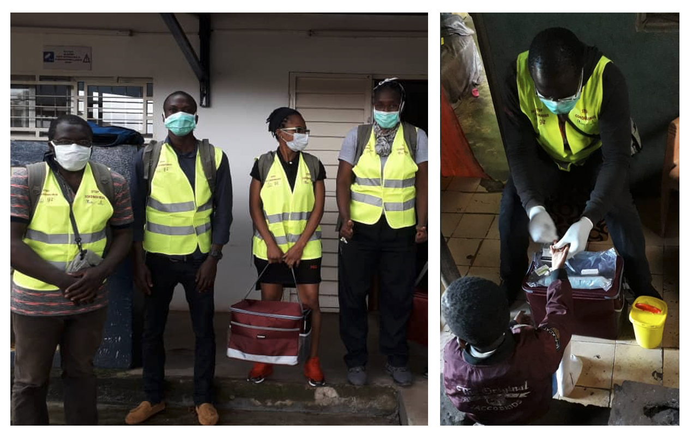

```{r, echo = F, message = F, warning = F}
if(!require("pacman")) install.packages("pacman")
pacman::p_load("here",
                "readr",
                "skimr",
               update=F)

# functions
source(here::here("global/functions/misc_functions.R"))

# default render
registerS3method("reactable_5_rows", "data.frame", reactable_5_rows)
knitr::opts_chunk$set(class.source = "tgc-code-block")

## autograders
suppressMessages(source(here::here("ch02_data_cleaning_pipeline/lessons/ch02_ls01_introduction_autograder.R")))
```

------------------------------------------------------------------------

<!-- # Data cleaning: introduction -->

## Introduction

{width="200"}

Data cleaning is the process of transforming raw, "messy" data into reliable data that can be properly analyzed. This entails identifying **inaccurate**, **incomplete**, or **improbable** data points and resolving data inconsistencies or errors.

Data cleaning tasks can often be tedious and time-consuming. A common joke among data analysts goes "80% of data science is cleaning the data and the remaining 20% is complaining about cleaning the data." But data cleaning is an essential step of the data analysis process. A little bit of cleaning at the start of the data analysis process will go a long way to improving the quality of your analyses and the ease with which these analyses can be done. And a range of packages and functions in R can make simplify the data cleaning process considerably.

In this lesson, we will begin to look at a typical data cleaning pipeline in R. The cleaning steps covered here are unlikely to be exactly what is needed for your own datasets, but they will certainly be a good starting point.

Let's get started!

## Learning objectives

1.  You can list typical operations involved in data cleaning process.
2.  You can diagnose dataset issues that warrant data cleaning through functions like:
    -   `visdat::vis_dat()`

    -   `skimr::skim()`

    -   `inspectdf::inspect_cat()`

    -   `inspectdf::inspect_num()`

    -   `DataExplorer::create_report()`

## Packages

The packages loaded below will be required for this lesson:

```{r}
if(!require("pacman")) install.packages("pacman")
pacman::p_load(visdat, 
               skimr,
               inspectdf, 
               tidyverse)
```

## The Yaounde seroprevalence dataset

{width="504"}

The primary dataset we will be cleaning in this chapter is from a COVID-19 serological survey conducted in Yaounde, Cameroon in late 2020. The study aimed to estimate the proportion of people in Yaounde who had ever been infected with COVID-19. The data was collected on electronic capture devices running the KoboCollect data collection software.

The full dataset can be obtained from [Zenodo](https://zenodo.org/record/5218965), and the paper can be viewed [here](https://www.nature.com/articles/s41467-021-25946-0).

::: side-note
If you have taken some of our introductory analysis courses, you may have encountered the Yaounde COVID-19 dataset in its already-cleaned form. Here, we will be looking at the raw data that was directly exported from the KoboCollect data collection software.
:::

Let's import this dataset and view its `head`.

```{r, message = FALSE}
yaounde <- read_csv(here::here('ch02_data_cleaning_pipeline/data/yaounde_data.csv'))
head(yaounde)
```

The first step of data cleaning will be to explore this dataset in order to identify potential issues that warrant cleaning. This preliminary step is sometimes called "exploratory data analysis" or EDA.

Here, you will look at a few simple EDA commands in R that will help you identify possible data errors and inconsistencies.

## `visdat::vis_dat()`

The `vis_dat()` function from the {visdat} package is a wonderful way to quickly visualize the data types and the missing values in a dataset. Try this now:

```{r dpi = 350}
vis_dat(yaounde)
```

The plot shows a "zoomed out" spreadsheet view of your data frame: each row in the dataframe is represented by a single line on the plot.

From this view you can note some problems:

-   there seems to be a completely empty column in the data (the column `NA` which is fully gray)
-   several variables are very incomplete (such as `sequelae` and `consultation`)
-   the names of some variables are unclear/unclean (`is drug_parac` has a whitespace in its name, `treatment..combinations` has a special character, `..`, etc.)

We will try to remedy some of these issues in the data cleaning process.

@TASK Please add practice question here

## `skimr::skim()`,

Next, the `skim()` function from the {skimr} package provides a console-based overview of the data frame and a summary of every column (by class/type).

Let's see what the function outputs when run on the `yaounde` data frame:

```{r, eval = F, message = F, render = knitr::knit_print}
skimr::skim(yaounde)
```

{width="681"}

{width="681"}

{width="681"}

Amazing! The function provides:

-   An overview of the rows and columns of the dataframe
-   The data type for each variable
-   `n_missing`, the number of missing entries (entries per variable that are `NA`)
-   `complete_rate`, the completeness rate for each variable
-   A set of summary statistics: the mean, standard deviation and quartiles for numerical variables; and the frequency and proportions for categorical variables
-   Spark histograms and line graphs for the numerical variables

And from this output, you can identify some additional issues with your data:

-   you can confirm that the column `NA`, which you saw from the `vis_dat()` output, is indeed completely empty: it has a `complete_rate` of 0
-   distributions are skewed for certain variables (such as `AGE`, `height cm`)
-   etc...

::: practice
1.  Use `skim()` to obtain a detailed overview of the Ugandan typhoid dataset loaded below.

```{r}
uganda_typhoid <- read_csv(here("ch02_data_cleaning_pipeline/data/typhoid_uganda.csv"))
# Write and view your answer:
q1 <- "YOUR ANSWER HERE"
```

```{r, eval = FALSE, include = FALSE}
# Check your answer:
.check_q1()
.hint_q1()
```

2.  Again, use `skim()` to obtain a detailed overview of the Ugandan `typhoid` dataset. However, this time, include only the variables `Age` and `Levelofeducation`.

```{r}
# Write and view your answer:
q2 <- "YOUR ANSWER HERE"
```

```{r,eval = FALSE,echo=FALSE}
# Check your answer:
.check_q2()
.hint_q2()
```
:::

@TASK If possible, include a practice question that asks students

## `inspectdf::inspect_cat()` & `inspectdf::inspect_num()`

While the `skimr::skim()` function gives you variable summaries in the console, you may sometimes want variables summaries in richer graphical form instead. For this, the functions `inspectdf::inspect_cat()` and `inspectdf::inspect_num()` can be used.

If you run `inspect_cat()` on a data object, you get a tabular summary of the categorical variables in the dataset (the important information is hidden in the `levels` column:

```{r}
inspect_cat(yaounde)
```

The magic happens when you run `show_plot()` on the result from `inspect_cat()`:

```{r}
inspect_cat(yaounde) %>% 
  show_plot()
```

Great! You get a nice summary figure showing the distribution of categorical variables! Some variable levels are also nicely labelled (if there is sufficient space to show a label).

From here you can observe some issues with a few categorical variables:

-   For the first variable shown, `AGE.CATEGORY`, one of the age categories is "May-14". This may be an artifact of the famous ["Excel date problem"](https://bit.ly/3uH0aRV).

-   Some variable levels are capitalized, others are in title case. It could be worth standardizing this.

------------------------------------------------------------------------

Similarly, you can obtain a summary plot for the numerical (continuous) variables in the dataset with `inspect_num()`:

```{r}
inspect_num(yaounde) %>% 
  show_plot()
```

From this output, you can notice that some variables which should be factor variables are coded as numeric. E.g. `is_drug_antibio` and `is_drug_antiviral`.

@TASK Please add practice question here

## `DataExplorer::create_report()`

Finally, the `create_report()` function from the {DataExplorer} package creates a full data profile of a provided data frame: an HTML file with basic statistics and distribution visualizations.

Run this function on the `yaounde` data frame and observe its output. Note that it may take a while to run. If it takes too long, you can run it on a dataset sample, rather than the entire dataset.

```{r eval = FALSE}
create_report(yaounde)
```

As you can see, the report is quite extensive. We will not consider all the outputs from this data report (feel free to explore the [package documentation](https://boxuancui.github.io/DataExplorer/index.html) on your own time).\

For now, let's focus on the frequency bar charts that are created for each categorical variable. Part of this is screenshotted below:


From here, one additional problem you can note is that for the `SEX` variable, there are several different spellings of "Male" and "Female". We have "Male", "Female", M", "F" etc. This will have to be remedied during the data cleaning process.

## Wrapping up

By familiarizing ourselves with the data, we have been able to identify some potential problems that may need to be addressed before the data are used in an analysis.

And as you have seen, the actual code needed to do this data exploration is very little; other R developers have done the difficult work for us by building amazing packages to quickly scan datasets and identify issues.

From the next lesson, we will begin to take on these identified issues one by one, starting with the problem of inconsistent, messy variable names.

See you in the next lesson!

## Contributors {.unlisted .unnumbered}

The following team members contributed to this lesson:

`r tgc_contributors_list(ids = c("eem", "lolovanco", "kendavidn"))`

## References {.unlisted .unnumbered}

Some material in this lesson was adapted from the following sources:

-   Batra, Neale, et al. The Epidemiologist R Handbook. 2021.*Cleaning data and core functions*. <https://epirhandbook.com/en/cleaning-data-and-core-functions.html#cleaning-data-and-core-functions>

-   Waring E, Quinn M, McNamara A, Arino de la Rubia E, Zhu H, Ellis S (2022). skimr: Compact and Flexible Summaries of Data. <https://docs.ropensci.org/skimr/> (website), <https://github.com/ropensci/skimr/.>
