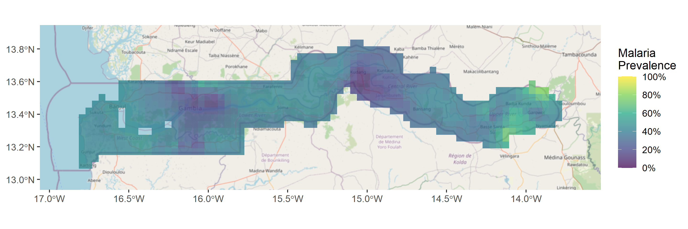
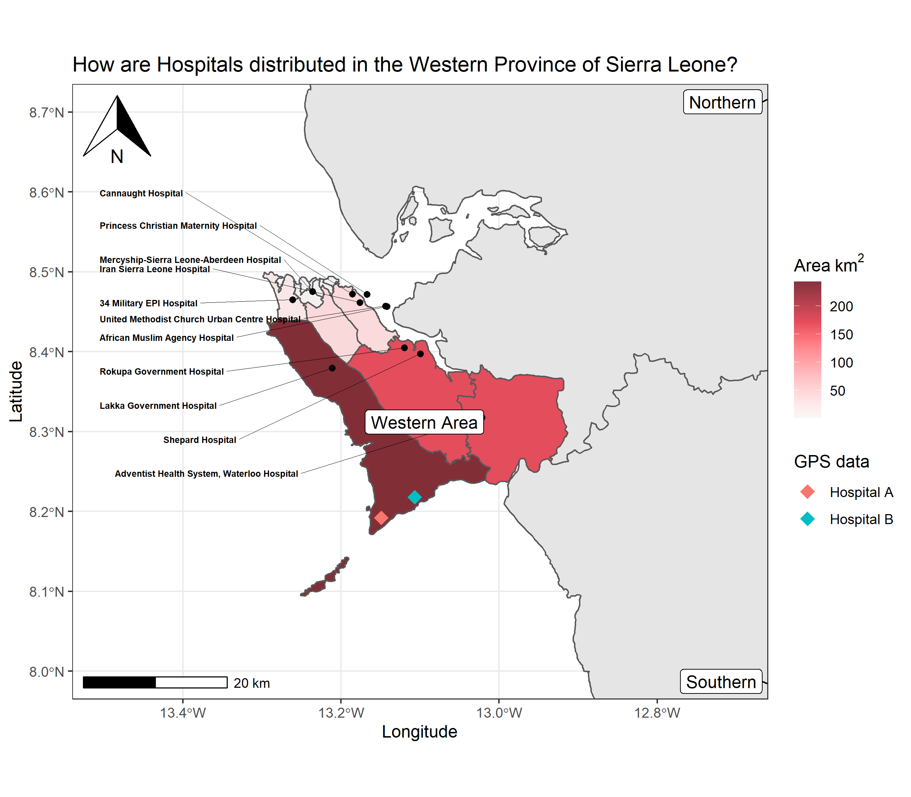

```{r, include = FALSE, warning = FALSE, message = FALSE}
# Load packages 
if(!require(pacman)) install.packages("pacman")
pacman::p_load(tidyverse, knitr, here)

# Source functions 
source(here("global/functions/misc_functions.R"))

# knitr settings
knitr::opts_chunk$set(warning = F, message = F, class.source = "tgc-code-block", error = T)
```

```{r,echo=FALSE}
ggplot2::theme_set(new = theme_bw())
options(scipen=10000)
```

------------------------------------------------------------------------

<!-- # Geospatial analysis: R for GIS -->


## Introduction


• Spatial data provide insights 


• *Spread* of a disease, or


• *Situation* of an outbreak


• **Where** are the current disease hotspots?


• How have the hotspots **changed over time**?


• How is the **access** to health facilities?


• Today, **why to use R** to address these tasks.


## Learning objectives

1.  Define what is a **geospatial analysis**.

2.  Identify the main analytical task that a **GIS software** need to solve.

3.  Identify the **advantages** of R as a GIS software.

## Prerequisites

This lesson requires familiarity with basic R and `{ggplot2}`: if you need to brush up, have a look at our introductory course on R and data visualization.

```{r,eval=TRUE,echo=TRUE,message=FALSE}
if(!require('pacman')) install.packages('pacman')
pacman::p_load_gh("wmgeolab/rgeoboundaries")
pacman::p_load(tidyverse, 
               ggspatial, 
               leaflet, 
               mapview,
               raster,
               spData,
               stars, 
               tmap, 
               here,
               sf)
```


## What is Geospatial analysis?


• Data with *geographic* locations or coordinates


• Related to positions on the Earth's surface.


• Essential to epidemiology.


• Identify **hot-spots** and potential **high-risk areas** for communicable disease spread;


• Map of malaria prevalence predictions in The Gambia (Moraga, 2019)





• Let's see how the code looks like!


```{r,message=FALSE,warning=FALSE}
# 👉 first, get packages:

if(!require('pacman')) install.packages('pacman')
pacman::p_load_gh("wmgeolab/rgeoboundaries")
pacman::p_load(tidyverse, ggspatial, leaflet, 
               raster, stars, here)
```


```{r}
# 👉 second, get data:

# country boundaries
gambia_boundaries <- geoboundaries(country = "Gambia", adm_lvl = 1)
# malaria prevalence
gambia_prevalence <- read_rds(here("ch06_basic_geospatial_viz",
                                   "data", "gambia_prevalence.rds"))
```


```{r}
# 👉 third, plot data:

ggplot() +
  # with a background
  annotation_map_tile(data = gambia_boundaries, zoomin = 0) +
  # plus a prevalence surface
  geom_stars(data = st_as_stars(gambia_prevalence)) +
  # with a color scale
  scale_fill_viridis_c(na.value = "transparent", alpha = 0.75) +
  # and a coordinate system
  coord_sf()
```


• Here, skills for **geospatial visualization**,


• To make *accurate*, *elegant* and *informative* maps.


## R as a GIS


• Geospatial analysis needs a **geographic information system (GIS)**.


• *Manage*, *analyze*, and *visualize* spatial data. 


• Popular platforms, **ArcGIS** and **QGIS**, are *graphic-user-interface (GUI)*.


• So **why use R for geospatial work?** 


• Here five of its merits:


### (1/5) Reproducibility:


• Code is straightforward for anyone to re-run, 


• Easily build on other people's work


• Facilitates collaboration


• Paste this code and reproduce in your computer:


```{r,message=FALSE}
# 👉 packages
if(!require('pacman')) install.packages('pacman')
pacman::p_load(sf, ggplot2)

# 👉 data 
nc <- st_read(system.file("shape/nc.shp", package = "sf"),
              quiet = TRUE)
# 👉 plot
ggplot(data = nc) + 
  geom_sf(aes(fill = SID74)) +
  scale_fill_viridis_c()
```


### (2/5)Reporting:


• `{Rmarkdown}`, `{flexdashboard}` and `{shiny}` to generate reports and *dashboards*.


• *Interactive* maps with `{leaflet}` instead of `{ggplot2}`:


```{r,message=FALSE}
# 👉 packages
if(!require('pacman')) install.packages('pacman')
pacman::p_load(sf, leaflet)

# 👉 data
nc <- st_read(system.file("shape/nc.shp", package = "sf"),
              quiet = TRUE)

# 👉 plot
pal <- colorNumeric("YlOrRd", domain = nc$SID74)
leaflet(nc) %>%
  addTiles() %>%
  addPolygons(color = "white", fillColor = ~ pal(SID74),
              fillOpacity = 1) %>%
  addLegend(pal = pal, values = ~SID74, opacity = 1)
```


### (3/5) Rich ecosystem:


• R with rapidly *growing libraries* 


• highly-active open-source community, 


• ready-to-use packages or tutorials.


• *interactive* map with one line of code!


• `{mapview}` instead of `{leaflet}`:


```{r,message=FALSE}
# 👉 packages
if(!require('pacman')) install.packages('pacman')
pacman::p_load(sf, mapview)

# 👉 data
nc <- st_read(system.file("shape/nc.shp", package = "sf"),
              quiet = TRUE)

# 👉 plot
mapview(nc, zcol = "SID74")
```


### (4/5) Convenience:


• You already know R! 


• Explore new pieces of code.


::: rstudio-cloud


As an example, we will use the `{tmap}` package and make minor modifications to it!


First, run this chunk:

```{r,warning=FALSE,message=FALSE}
# 👉 packages
if(!require('pacman')) install.packages('pacman')
pacman::p_load(tmap, spData)

# 👉 data
load(here("ch06_basic_geospatial_viz/data/nz_elev.rda"))

# 👉 plot
tm_shape(nz_elev)  +
  tm_raster(title = "elev", 
            style = "cont",
            palette = "-RdYlGn") +
  tm_shape(nz) +
  tm_borders(col = "red", 
             lwd = 3) +
  tm_scale_bar(breaks = c(0, 100, 200),
               text.size = 1) +
  tm_compass(position = c("LEFT", "center"),
             type = "rose", 
             size = 2) +
  tm_credits(text = "J. Nowosad, 2019") +
  tm_layout(main.title = "My map",
            bg.color = "lightblue",
            inner.margins = c(0, 0, 0, 0))
```


Now, apply any of the following suggestions to get used to how this package works:

1.  Change the **map title** from "My map" to "New Zealand".
2.  Update the **map credits** with your own name and today's date.
3.  Change the **color palette** to "BuGn".
4.  Try **other palettes** from <http://colorbrewer2.org/>
5.  Put the **north arrow** in the top right corner of the map.
6.  Improve the **legend title** by adding the legend units.
7.  Increase the number of breaks in the **scale bar**.
8.  Change the **borders' color** of the New Zealand's regions to black.
9.  Decrease the line width.
10. Change the **background color** to any color of your choice.
:::


### (5/5) Integrated workflow:


• Combine geospatial visualization and statistical analyses, 


• all within a single script.


• For example, built 3D maps of the Monterey Bay using `{rayshader}`

• Tutorial available: <https://www.tylermw.com/3d-maps-with-rayshader/>


• Bivariate maps of unequal distribution of the income. 


• Tutorial available: <https://timogrossenbacher.ch/2019/04/bivariate-maps-with-ggplot2-and-sf/>


{width="499"}


```{r}

```


## Wrap up


• We learned why to use R as a GIS software,


• take advantage of its coding environment.


• But, which maps are we going to built?


{width="484"}


• How to built -step by step- different types of **Thematic maps** using the `{ggplot2}` package, 


• different data sources and illustrative annotations.


{width="409"}


## Contributors {.unlisted .unnumbered}

The following team members contributed to this lesson:

`r tgc_contributors_list(ids = c("avallecam", "kendavidn"))`

## References {.unlisted .unnumbered}

Some material in this lesson was adapted from the following sources:

-   *Batra, Neale, et al. (2021). The Epidemiologist R Handbook. Chapter 28: GIS Basics*. (2021). Retrieved 01 April 2022, from <https://epirhandbook.com/en/gis-basics.html>

-   *Baumer, Benjamin S., Kaplan, Daniel T., and Horton, Nicholas J. Modern Data Science with R. Chapter 17: Working with geospatial data*. (2021). Retrieved 05 June 2022, from <https://mdsr-book.github.io/mdsr2e/ch-spatial.html>

-   *Lovelace, R., Nowosad, J., & Muenchow, J. Geocomputation with R. Chapter 2: Geographic data in R.* (2019). Retrieved 01 April 2022, from <https://geocompr.robinlovelace.net/spatial-class.html>

-   *Moraga, Paula. Geospatial Health Data: Modeling and Visualization with R-INLA and Shiny. Chapter 12: Building a dashboard to visualize spatial data with flexdashboard*. (2019). Retrieved 13 September 2022, from <https://www.paulamoraga.com/book-geospatial/sec-flexdashboard.html>

-   *Moreno, M., and Bastille, M. Drawing beautiful maps programmatically with R, sf and ggplot2 --- Part 1: Basics.* (2018). Retrieved 13 September 2022, from <https://r-spatial.org/r/2018/10/25/ggplot2-sf.html.>

-   *Nowosad, J. Basics of Spatial Data Analysis Workshop.* (2019). Retrieved 13 September 2022, from <https://github.com/Nowosad/whyr_19w/blob/master/code/spatial_vis.R>

-   *Nowosad, J. The Landscape of Spatial Data Analysis in R.* (2019). Retrieved 13 September 2022, from <https://jakubnowosad.com/whyr_19/#1>

`r tgc_license()`
