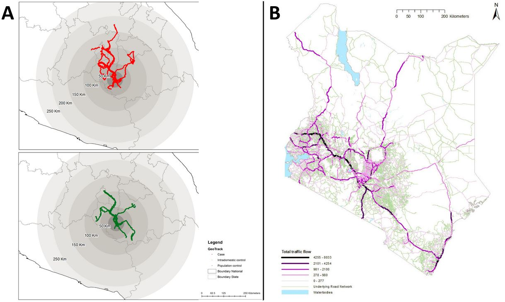

```{r, include = FALSE, warning = FALSE, message = FALSE}
# Load packages 
if(!require(pacman)) install.packages("pacman")
pacman::p_load(tidyverse, knitr, here)

# Source functions 
source(here("global/functions/misc_functions.R"))

# knitr settings
knitr::opts_chunk$set(warning = F, message = F, class.source = "tgc-code-block", error = T)

# Source autograder script quietly 
suppressMessages(source(here::here("ch06_basic_geospatial_viz/lessons/ch06_ls03_physical_features_autograder.R")))
```

```{r,echo=FALSE}
ggplot2::theme_set(new = theme_bw())
options(scipen=10000)
```

------------------------------------------------------------------------

<!-- # Geospatial analysis: density maps -->

## Introduction


• Spatial data may require **geographic context**


• Aids to locate events with *environmental features* like streets.


• Today, we are going to learn:


• How to add **Physical features** to our maps, and


• How to plot them in **multiple layers** to complement Thematic maps!

## Learning objectives

1.  Create **Physical feature maps** to visualize roads or rivers.

2.  Complement **Thematic maps** with Physical features as background.

3.  Relate Physical features with a **Geometry** type.

## Prerequisites

This lesson requires the following packages:

```{r,eval=TRUE,echo=TRUE,message=FALSE}
if(!require('pacman')) install.packages('pacman')
pacman::p_load_gh("afrimapr/afrilearndata")
pacman::p_load(ggspatial,
               ggplot2,
               tibble,
               mdsr,
               terra,
               spData,
               sf)
```

This lesson requires familiarity with `{ggplot2}`: if you need to brush up, have a look at our introductory course on data visualization.

## Physical features


### What are they? {.unnumbered}


• *Physical features* include roads, buildings and rivers.


### How to plot them? {.unnumbered}


• Using `{ggplot2}`, `geom_sf()`, and the `color` argument.


#### With Categorical data {.unlisted .unnumbered}


• Let's map the Road network in South America and `color` them according to their type:


```{r}
south_am_roads <- 
  read_rds(here("ch06_basic_geospatial_viz/data/south_am_roads.rds"))

south_am_roads
```


::: rstudio-cloud
Let's create a map of the Sacramento basin in California US (`sacramento_rivers`), colored by their feature type (`FTYPE`).

```{r,eval=FALSE}
ggplot(data = sacramento_rivers) + 
    geom_sf(aes(_____ = FTYPE), size = 1)
```

Data from here: <https://zenodo.org/record/4985219>
:::


#### With Quantitative data {.unlisted .unnumbered}


• We can use it in Environmental Epidemiology,


• The concentration of chemicals or pollutants in wastewater surveillance.


• In Ecology, richness estimations from rivers.


• Let's map a *classification* of rivers in the Sacramento basin in California US.


```{r}
sacramento_rivers <- 
  read_rds(here("ch06_basic_geospatial_viz/data/sacramento_rivers.rds"))

ggplot(data = sacramento_rivers) + 
  
```


• "Richness" is the estimated number of fish species in each segment of the river.


::: rstudio-cloud
Create a Thematic map of the road network in South America, using the `south_am_roads` dataset, colored by the length in Km (`length_km`) of each road.

```{r,eval=FALSE}
ggplot(data = south_am_roads) + 
    ______(aes(______ = length_km), size = 1)
```
:::


### How to use it? {.unnumbered}


• *Trajectory data* and *Road network data*


• Evaluate the effects of human movement patterns in infectious disease transmission like [Dengue](https://journals.plos.org/plosone/article?id=10.1371/journal.pone.0172313) or [Malaria](https://malariajournal.biomedcentral.com/articles/10.1186/1475-2875-11-205).


{width="540"}


• Both of them are depicted in a map using **Lines**.


::: recap


• Each **Thematic map** has its respective type of *Geometry*.


• There are three main geometry types: *points*, *lines* and *polygons*.


{width="555"}
:::


## Multiple layer maps


• Most maps need additional geographic context.


• Plotting multiple geometries in overlapped layers.


• Complement Thematic maps with *Physical features*.


### How to plot them? {.unnumbered}


• Let's complement:


• a Choropleth map from `africountries` by population (`pop_est`) with


• the African trans-continental highway network lines (`afrihighway`).


```{r,eval=TRUE}
ggplot() +
  geom_sf(data = ,mapping = ) +
  geom_sf(data = )
```


• Here, the physical feature `afrihighway` is **above** all the other layers.


• But it can also be **below**.


• We can complement a Dot map from `africapitals`,


• with the same `afrihighway` layer:


```{r,eval=TRUE}
ggplot() +
  geom_sf(data = ) +
  geom_sf(data = , mapping = aes(size = pop, color = pop))
```


• This is how you plot another map layer on top of another map.


::: recap


• `{ggplot2}` allows to **overlap multiple layers (of maps)**


• To complement Thematic maps.


• For this, You need a **local** specification of data:

``` r
# instead of:
ggplot(data = data_global) +
  geom_sf()

# we use:
ggplot() +
  geom_sf(data = data_local_layer_1) +
  geom_sf(data = data_local_layer_2)
```
:::


• *Order* of layers (below or above) depend on the aim.


::: practice
Create a multiple layer Thematic map with:

-   the `world` dataset (from the `{spData}` package).

-   Then, overlap it with the African trans-continental highway network lines from the `afrihighway` dataset.

Use the `geom_sf()` function for each layer:

```{r,eval = FALSE}
q1 <- 
  ggplot() + 
    ________(data = ________) + 
    ________(data = ________)
q1
```

```{r,include = FALSE}
.check_q1()
.hint_q1()
```
:::


### How to use it? {.unnumbered}


• In scenarios similar to John Snow's *Dot map*


• Locations of deaths of the 1854 London cholera outbreak.


• Complemented with a *physical feature* like the *street roads* of the city:


• In Figure 3B, the *physical feature* is below the Dot map.


• This is why it looks much more readable.


## Wrap up


• How to represent *Physical features* and


• How to use them to *complement* Thematic maps in *multiple layers*.


• However, you may require a *more explicit* background!


• For example, *Basemaps* for Google Maps-like backgrounds.


• See yo in the next lesson!


## Contributors {.unlisted .unnumbered}

The following team members contributed to this lesson:

`r tgc_contributors_list(ids = c("avallecam", "lolovanco", "kendavidn"))`

## References {.unlisted .unnumbered}

Some material in this lesson was adapted from the following sources:

-   *Batra, Neale, et al. (2021). The Epidemiologist R Handbook. Chapter 28: GIS Basics*. (2021). Retrieved 01 April 2022, from <https://epirhandbook.com/en/gis-basics.html>

-   *Lovelace, R., Nowosad, J., & Muenchow, J. Geocomputation with R. Chapter 2: Geographic data in R*. (2019). Retrieved 01 April 2022, from <https://geocompr.robinlovelace.net/spatial-class.html>

-   *Moraga, Paula. Geospatial Health Data: Modeling and Visualization with R-INLA and Shiny. Chapter 2: Spatial data and R packages for mapping*. (2019). Retrieved 01 April 2022, from <https://www.paulamoraga.com/book-geospatial/sec-spatialdataandCRS.html>

-   *Baumer, Benjamin S., Kaplan, Daniel T., and Horton, Nicholas J. Modern Data Science with R. Chapter 17: Working with geospatial data*. (2021). Retrieved 05 June 2022, from <https://mdsr-book.github.io/mdsr2e/ch-spatial.html>

`r tgc_license()`
