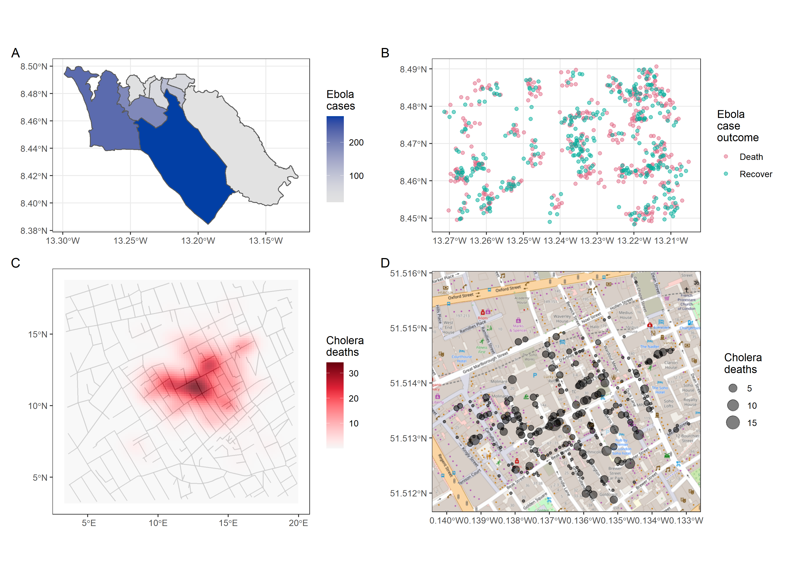
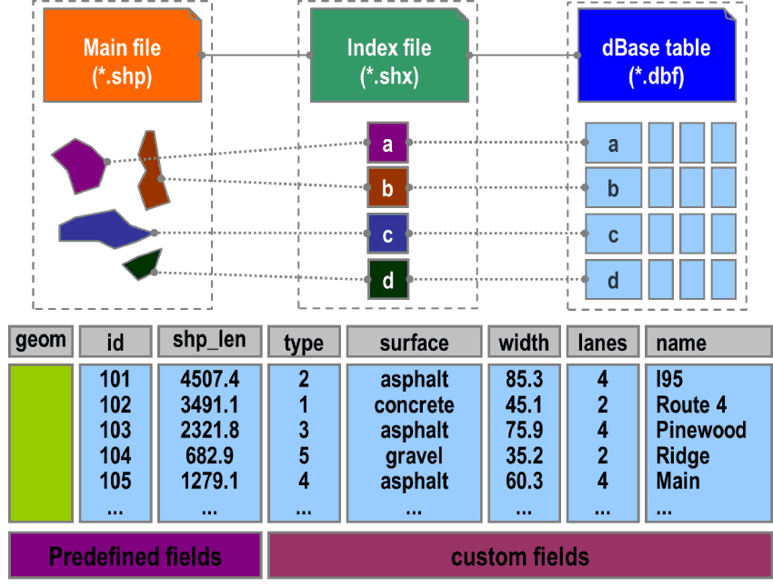

```{r, include = FALSE, warning = FALSE, message = FALSE}
# Load packages 
if(!require(pacman)) install.packages("pacman")
pacman::p_load(tidyverse, knitr, here)

# Source functions 
source(here("global/functions/misc_functions.R"))

# knitr settings
knitr::opts_chunk$set(warning = F, message = F, class.source = "tgc-code-block", error = T)

## autograders
suppressMessages(source(here::here("ch06_basic_geospatial_viz/lessons/ch06_ls05_shapefile_data_autograder.R")))
```

```{r,echo=FALSE}
ggplot2::theme_set(new = theme_bw())
```

------------------------------------------------------------------------

<!-- # Geospatial analysis: Read and Write Shapefiles -->

## Introduction


• We built **Thematic maps** using `{ggplot2}`.





• But, how can we use **external data** from *other* GIS software? 


• What is the *standard file format* to **store** and **share** data?


• Today we are going to read and write **Shapefiles**, and 


• Dive into the components of a **`sf` object**!


## Learning objectives

1.  Read Spatial data from **Shapefiles** using the `read_sf()` function from the `{sf}` package.

2.  Identify the components of **`sf` objects**.

3.  Identify the components of **Shapefiles**.

4.  Write Spatial data in **Shapefiles** using `write_sf()`.

## Prerequisites

This lesson requires the following packages:

```{r,eval=TRUE,echo=TRUE,message=FALSE}
if(!require('pacman')) install.packages('pacman')

pacman::p_load(rnaturalearth,
               ggplot2,
               cholera,
               here,
               sf)

pacman::p_load_gh("afrimapr/afrilearndata",
                  "wmgeolab/rgeoboundaries")
```

## Shapefiles


• The most common data format for *storing* Spatial data.


### How to read Shapefiles? {.unnumbered}


• Using `read_sf()` from `{sf}`.


• From **local files** with a `.shp` extension, 


• To a ready-to-use **`sf` object**.


• Let's read the `sle_adm3.shp` file:


1.  Identify the **file path** up to the `.shp` filename:


``` r
"ch06_basic_geospatial_viz/data/boundaries/sle_adm3.shp"
```


2.  Then, paste that *path* into `read_sf()` within `here()`:


```{r}
shape_file <- ......(here("ch06_basic_geospatial_viz/data/boundaries/sle_adm3.shp"))
```


::: rstudio-cloud
• The output is an `sf` object 

• It can be plotted using `geom_sf()`:

```{r,eval=FALSE}
shape_file %>% class()
```
:::

::: practice
Read the shapefile called `sle_hf.shp` inside the `ch06_basic_geospatial_viz/data/healthsites/` folder. Use the `read_sf()` function:

```{r,eval = FALSE}
q1 <- ________(here("________"))
q1
```

```{r,include=FALSE}
.check_q1()
.hint_q1()
```
:::


• Wait! *Shapefiles* do not come alone! 


• They came with a list of sub-component files. 


• Let's check at the files in the `data/boundaries/` folder:


```{r,eval=TRUE,echo=FALSE}
list.files(path = here("ch06_basic_geospatial_viz/data/boundaries"),
           full.names = FALSE) %>% 
  tibble::enframe(name = NULL)
```


• How are these files *related* with the **`sf` object**?


• Let's now look under the hood to understand `sf` objects better.


## Understanding `sf` objects


• `"sf"` stands for [Simple Features](https://en.wikipedia.org/wiki/Simple_Features), 


• A set of widely-used *standards for storing geospatial information in databases*. 


• Now, what do `sf` objects look like and how do we work with them? 


• We'll look at a slice of the `countries` object:


```{r}
countries <- ne_countries(returnclass = "sf")
```


• `sf` is a special kind of **data frame**


• We can manipulate it with `{tidyverse}` functions like `dplyr::select()`. 


• Let's select three columns:


```{r}
countries %>% 
  select(name,    # country name
         pop_est) # estimated population
```


• What do we see? 


• 5-line **header** and 


• a **data frame**.


### The `sf` header {.unlisted .unnumbered}


• The *header* provides context about the rest of the object.


• Let's go through *the most relevant sections*:


### Features and Fields {.unnumbered}


• Tells you the number of **features** and **fields** in the `sf` object:


    👉Simple feature collection with 177 features and 2 fields👈
    Geometry type: MULTIPOLYGON
    Dimension: XY
    Bounding box: xmin: -180 ymin: -90 xmax: 180 ymax: 83.64513
    Geodetic CRS: +proj=longlat +datum=WGS84


• **Features** are the *row* of the data frame. 


• In our `countries` dataset, each country is a feature.


• **Fields** are the **Attributes** of each Feature. 


• Equivalent to *columns*, not counting the "geometry" column.


{width="624"}


::: practice
The `spData::nz` dataset contains mapping information for the regions of New Zealand. How many features and fields does the dataset have?

```{r eval = FALSE}
# Delete the wrong lines and run the correct line:
q_nz_features_fields <- "A. 16 features and 6 fields"
q_nz_features_fields <- "B. 10 features and 6 fields"
q_nz_features_fields <- "C. 5 features and 4 fields"
```

```{r eval = FALSE, include = FALSE}
# Check your answer:
.check_q_nz_features_fields()
.hint_q_nz_features_fields()
```
:::

### Geometry {.unnumbered}


• Gives you the *type of geometry* in the `sf` object:


    Simple feature collection with 177 features and 2 fields
    👉Geometry type: MULTIPOLYGON👈
    Dimension: XY
    Bounding box: xmin: -180 ymin: -90 xmax: 180 ymax: 83.64513
    Geodetic CRS: +proj=longlat +datum=WGS84


• **Geometry** is a synonym for *"shape"*. 


• Three main geometry types: points, lines and polygons. 


• Each has its respective *"multi"* version: multipoints, multilines and multipolygons.


::: practice
The `ne_download()` function from {rnaturalearth} can be used to obtain a map of major world roads, using the code below:

```{r eval = F, message = F}
roads <- 
  ne_download(scale = 10, 
              category = "physical",
              type = "geographic_lines", 
              returnclass = "sf") 
```

◘ What type of geometry is used to represent the rivers?

```{r eval = FALSE}
# Delete the wrong lines and run the correct line:
q_rivers_geom_type <- "MULTILINESTRING"
q_rivers_geom_type <- "MULTIPOLYGON"
q_rivers_geom_type <- "MULTIPOINT"
```

```{r eval = FALSE, include = FALSE}
# Check your answer:
.check_q_rivers_geom_type()
.hint_q_rivers_geom_type()
```
:::

::: side-note


• Each **individual `sf` object** can only contain *one geometry type*


• All points, all lines or all polygons. 


• You will not find a mixture of geometries in a single sf object.

:::

::: key-point


• **It is related with the `geometry` column of the `sf` dataframe**


• The `geometry` column is the most special property of the `sf` data frame.


• It holds the *core* geospatial data (points, linestrings or polygons).


``` r
👉Geometry type: MULTIPOLYGON👈

First 10 features:
                                  👇👇👇👇👇👇👇👇👇👇👇👇👇👇👇👇
                    name  pop_est                       geometry
0            Afghanistan 28400000 MULTIPOLYGON (((61.21082 35...
1                 Angola 12799293 MULTIPOLYGON (((16.32653 -5...
2                Albania  3639453 MULTIPOLYGON (((20.59025 41...
3   United Arab Emirates  4798491 MULTIPOLYGON (((51.57952 24...
4              Argentina 40913584 MULTIPOLYGON (((-65.5 -55.2...
5                Armenia  2967004 MULTIPOLYGON (((43.58275 41...
6             Antarctica     3802 MULTIPOLYGON (((-59.57209 -...
7 Fr. S. Antarctic Lands      140 MULTIPOLYGON (((68.935 -48....
8              Australia 21262641 MULTIPOLYGON (((145.398 -40...
9                Austria  8210281 MULTIPOLYGON (((16.97967 48...
```


• Some noteworthy points about this column:


• The `geometry` column can't be dropped,


• `geom_sf()` automatically recognizes the geometry column.
:::

### Geodetic CRS {.unnumbered}


• Tells us the Coordinate Reference System (CRS) used.


    Simple feature collection with 177 features and 2 fields
    Geometry type: MULTIPOLYGON
    Dimension: XY
    Bounding box: xmin: -180 ymin: -90 xmax: 180 ymax: 83.64513
    👉Geodetic CRS: +proj=longlat +datum=WGS84👈


• **CRS** relate the spatial elements of the data with the *surface of Earth*.


• CRS are a *key component* of geographic objects. 


• **We will cover them in detail later!**


## Delving into Shapefiles


• They are a *collection* of files,


• At least three files: `.shp`, `.shx`, and `.dbf`.


• Related with components of a **`sf` object**.





• Let's see the component files of a *Shapefile* called `sle_adm3.shp`. 


• All of them are located in **the same** `data/boundaries/` folder:


```{r,eval=TRUE,echo=FALSE}
list.files(path = here("ch06_basic_geospatial_viz/data/boundaries"),
           full.names = FALSE) %>% 
  tibble::enframe(name = NULL)
```


• What is inside each file?


-   **`.shp`**: contains the **Geometry** data,


-   `.dbf`: stores the **Attributes (Fields)** for each shape.


-   `.shx`: is a *positional index* that **links** each Geometry with its Attributes,


-   `.prj`: plain text file describing the **CRS**, including the Map **Projection**,


• These *files* can be compressed into a ZIP folder and shared!


::: watch-out


• *Sub-component files* must be present in one directory (folder) 


• Then, the shapefile is readable.
:::

::: practice
Which of the following options of *component files of Shapefiles*:

a.  `"shp"`
b.  `"shx"`
c.  `"dbf"`

contains the *Geometry* data?

```{r,include=FALSE}
# unlock your answer:
# q4 <- "shp"
# q4 <- "shx"
# q4 <- "dbf"

.check_q4()
.hint_q4()
```

stores the *Attributes* for each shape?

```{r,include=FALSE}
# unlock your answer:
# q5 <- "shp"
# q5 <- "shx"
# q5 <- "dbf"

.check_q5()
.hint_q5()
```
:::

### How to write Shapefiles? {.unnumbered}


• Let's write the `countries` object to an `countries.shp` file:


1.  Define the **file path** up to the `.shp` filename:


``` r
"ch06_basic_geospatial_viz/data/newshapefile/countries.shp"
```


2.  Paste that *path* in `write_sf()` within `here()`:


```{r,warning=FALSE}
countries %>% ......(here("ch06_basic_geospatial_viz/data/newshapefile/countries.shp"))
```


• Now, *all the components* of a **`sf` object** are


• in *four new files* of one **Shapefile**:


```{r,eval=TRUE,echo=FALSE}
list.files(path = here("ch06_basic_geospatial_viz/data/newshapefile"),
           full.names = FALSE) %>% 
  tibble::enframe(name = NULL)
```

```{r include = F}
.score_print()
```

## Wrap up


• We **read** and **write** *Shapefiles* using the *`{sf}`* package, 


• Identified the **components** of an *`sf` object*, and 


• Their relation with the files within a *Shapefile*.


• Now we need to dive into **CRS**'s. 


• Learn how to manage their zoom and transform them!


• Follow along with the lessons to find how to train these skills!


## Contributors {.unlisted .unnumbered}

The following team members contributed to this lesson:

`r tgc_contributors_list(ids = c("avallecam", "lolovanco", "kendavidn"))`

## References {.unlisted .unnumbered}

Some material in this lesson was adapted from the following sources:

-   *Seimon, Dilinie. Administrative Boundaries.* (2021). Retrieved 15 April 2022, from <https://rspatialdata.github.io/admin_boundaries.html>

-   *Varsha Ujjinni Vijay Kumar. Malaria.* (2021). Retrieved 15 April 2022, from <https://rspatialdata.github.io/malaria.html>

-   *Batra, Neale, et al. The Epidemiologist R Handbook. Chapter 28: GIS Basics*. (2021). Retrieved 01 April 2022, from <https://epirhandbook.com/en/gis-basics.html>

-   *Lovelace, R., Nowosad, J., & Muenchow, J. Geocomputation with R. Chapter 2: Geographic data in R*. (2019). Retrieved 01 April 2022, from <https://geocompr.robinlovelace.net/spatial-class.html>

-   *Moraga, Paula. Geospatial Health Data: Modeling and Visualization with R-INLA and Shiny. Chapter 2: Spatial data and R packages for mapping*. (2019). Retrieved 01 April 2022, from <https://www.paulamoraga.com/book-geospatial/sec-spatialdataandCRS.html>

`r tgc_license()`
