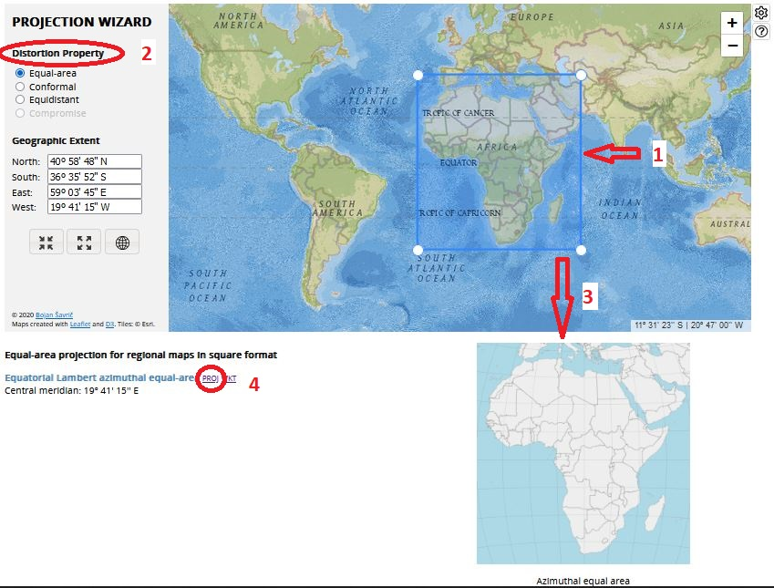

```{r, include = FALSE, warning = FALSE, message = FALSE}
# Load packages 
if(!require(pacman)) install.packages("pacman")
pacman::p_load(tidyverse, knitr, here)

# Source functions 
source(here("global/functions/misc_functions.R"))

# knitr settings
knitr::opts_chunk$set(warning = F, message = F, class.source = "tgc-code-block", error = T)

# Source autograder script quietly 
suppressMessages(source(here::here("ch06_basic_geospatial_viz/lessons/ch06_ls06_crs_autograder.R")))
```

```{r,echo=FALSE}
ggplot2::theme_set(new = theme_bw())
```

<!-- # Geospatial analysis: coordinate reference systems -->

## Introduction

From the previous lesson, we learned that **Spatial data** require a **Coordinate Reference System (CRS)** to relate the spatial elements of the data with the *surface of Earth*. For that reason, Coordinate systems are a *key component* of geographic objects.

 and [EarthLab](https://www.earthdatascience.org/courses/use-data-open-source-python/intro-vector-data-python/spatial-data-vector-shapefiles/geographic-vs-projected-coordinate-reference-systems-python/).](images/crs-coordsys_projections.JPG)

However, Coordinate systems can **distort** the geographical view of the world. Its **misuse** can lead to misconceptions about the relative sizes of countries.

](images/crs-mercator-vs-truesize.gif)

In this lesson we are going to learn how to manage the CRS of maps by **zooming in** to an area of interest, and **change it** depending of our requirements, within a `ggplot` object.

## Learning objectives

1.  Zoom in `ggplot` maps with Coordinate Reference Systems (**CRS**) using the `coord_sf()` function.

2.  Change the **CRS projection** of a `ggplot` map using the `crs` argument of `coord_sf()`.

## Prerequisites

This lesson requires the following packages:

```{r,eval=TRUE,echo=TRUE,message=FALSE}
if(!require('pacman')) install.packages('pacman')

pacman::p_load(malariaAtlas,
               colorspace,
               ggplot2,
               cholera,
               spData,
               dplyr,
               here,
               rio,
               sf)

pacman::p_load_gh("afrimapr/afrilearndata",
                  "wmgeolab/rgeoboundaries")
```

This lesson requires familiarity with `{dplyr}`: if you need to brush up, have a look at our introductory course on data wrangling.

## Data and basic plot

First, let us start with creating a base map of the `world` from the `{spData}` package using `ggplot2`:

```{r world-plot, fig.width = 10, fig.height = 5, out.width = "90%"}
ggplot(data = world) +
    geom_sf()
```

## Manage Coordinate systems with `coord_sf()`

The function `coord_sf()` from the `{ggplot2}` package allows to deal with the **coordinate system**, which includes both the *extent* and *projection* of a map.

### "Zoom in" on maps

The **extent** of the map can also be set in `coord_sf()`, in practice allowing to "zoom" in the area of interest, provided by limits on the x-axis (`xlim`), and on the y-axis (`ylim`).

Here, we zoom in the `world` map to the African continent, which is in an area delimited in **longitude** between 20°W and 55°E, and in **latitude** between 35°S and 40°N. To exactly match the limits provided, we can use the `expand = FALSE` argument.

```{r world-zoom,warning=FALSE,message=FALSE}
ggplot(data = world) +
    geom_sf() +
    coord_sf(xlim = c(-20, 55), ylim = c(-35, 40))
```

::: watch-out
Check which `+` and `-` **signs** are related with the **cardinal direction**:

-   In longitude: West is `-`, East is `+`,
-   In latitude: South is `-`, North is `+`.
:::

::: practice
Zoom in the `africountries` map to Sierra Leona, which is in an area delimited in longitude between 14°W and 10°W, and in latitude between 6°N and 10°N.

```{r,eval = FALSE}
q1 <- 
  ggplot(data = africountries) +
    geom_sf() +
    ________(xlim = c(___, ___), ylim = c(6, 10))
q1
```

```{r,include=FALSE}
.check_q1()
.hint_q1()
```
:::

### Change the Projection of a map

The `world` object have a **CRS projection** called *WGS84* (detailed in the **fifth line** of the **header**)

```{r,eval=FALSE,echo=TRUE}
world
```

    ## Geometry set for 177 features 
    ## Geometry type: MULTIPOLYGON
    ## Dimension:     XY
    ## Bounding box:  xmin: -180 ymin: -89.9 xmax: 180 ymax: 83.64513
    ## Geodetic CRS:  WGS 84
    ## First 5 geometries:

Which corresponds to the **EPSG code 4326**:

```{r}
st_crs(world)$input
```

::: key-point
**Projection** refers to the mathematical equation that was used to *project* the truly *round* earth (3D) onto a *flat* surface (2D).

.](images/crs-map_projections.JPG){width="436"}
:::

::: vocab
-   **EPSG** refers to the *European Petroleum Survey Group (EPSG)*.

-   *EPSG* is a Spatial Reference System Identifier (SRID) with arbitrary **codes** available for concrete **CRS projections**.

-   One of these projections is **WGS84**, which refers to *World Geodetic System 1984*.
:::

Using the `crs` argument of the `coord_sf()` function, it is possible to **override** this setting, and project on the fly to **any projection**.

For example, we can change the current *WGS84* projection to the *ETRS89 Lambert Azimuthal Equal-Area projection* (alias LAEA), which is **EPSG code 3035**:

```{r}
ggplot(data = world) +
    geom_sf() +
    coord_sf(crs = 3035)
```

However, this CRS projection is useful for [European countries](https://epsg.io/3035).

::: practice
Change the CRS projection of the `ggplot` map with the `world` object to the [Pseudo-Mercator](https://epsg.io/3857) coordinate system, which is EPSG code `3857`.

```{r,eval = FALSE}
q2 <- 
  ggplot(data = world) +
    geom_sf() +
    ________(crs = ________)
q2
```

```{r,include=FALSE}
.check_q2()
.hint_q2()
```
:::

#### Choosing a Projection / CRS {.unnumbered}

::: reminder
**Which projection should I use?**

To decide if a projection is right for your data, answer these questions:

-   What is the area of minimal distortion?\
-   What aspect of the data does it preserve?\
:::

::: pro-tip
Take the time to identify a **projection** that is suited for your project. You don't have to stick to the ones that are popular.
:::

Online tools like [Projection Wizard](http://projectionwizard.org/) can also help you **discover** projections that might be a **better fit for your data**.



For instance, to **find** an appropriate projection for the African continent, you can:

1.  Define your *area* of interest,
2.  Select a *distortion* property,
3.  Confirm the map outcome that *fits* your needs,
4.  Copy the text inside the **PROJ** option.

Then, paste that valid **PROJ string** to the `crs` argument:

```{r world-coord}
ggplot(data = world) +
    geom_sf() +
    coord_sf(crs = "+proj=laea +lon_0=19.6875 +lat_0=0 +datum=WGS84 +units=m +no_defs")
```

::: vocab
[PROJ](http://proj4.org/) is an open-source library for storing, representing and transforming CRS information.
:::

::: practice
Change the CRS projection of the `ggplot` map with the `world` object to the [Aitoff](https://proj.org/operations/projections/aitoff.html) coordinate system, using the `+proj=aitoff` PROJ string.

```{r,eval = FALSE}
q3 <- 
  ggplot(data = world) +
    geom_sf() +
    ________(crs = "________")
q3
```

```{r,include=FALSE}
.check_q3()
.hint_q3()
```
:::

#### CRS components {.unnumbered}

A **CRS** has a few key components:

-   *Coordinate System* - There are many many different coordinate systems, so make sure you know which system your coordinates are from. (e.g. longitude/latitude, which is the most common);

-   *Units* - Know what the units are for your coordinate system (e.g. decimal degrees, meters);

-   *Datum* - A particular modeled version of the Earth. These have been revised over the years, so ensure that your map layers are using the same datum. (e.g. WGS84);

-   *Projections* - As defined above, it refers to the mathematical equation that was used to project the truly round earth onto a flat surface.

#### CRS projections {.unnumbered}

The *"orange peel" analogy* is useful to understand **projections**. If you imagine that the earth is an *orange*, how you *peel it* and then *flatten the peel* is similar to how projections get made.

-   A **datum** is the choice of fruit to use. Is the earth an orange, a lemon, a lime, a grapefruit?

.](images/crs-citrus.jpg)

-   A **projection** is how you peel your orange and then flatten the peel.

.](images/crs-orange-peel-earth.jpg){width="420"}

)](https://media.opennews.org/cache/06/37/0637aa2541b31f526ad44f7cb2db7b6c.jpg)

The above image shows maps of the United States in **different projections**. Notice the differences in *shape* associated with each projection. These differences are a direct result of the calculations used to *flatten* the data onto a 2-dimensional map.

::: watch-out
-   Data from the **same location** but saved in **different projections** will not line up in any GIS software.

-   Thus, it's important when working with spatial data to **identify the coordinate reference system** applied to the data **and retain it** throughout data processing and analysis.
:::

```{r include = F}
.score_print()
```

```{r include = F}
pacman::p_unload(raster) # avoid masking select(). Temporary investigation
```

## Wrap up

In this lesson, we have learned how to **manage** a CRS *projection* in `ggplot` maps, how projections are **codified** with *EPSG* codes and *PROJ* strings, and what are the **components** of a CRS.

.](images/crs-datum_projection.png)

So far, all spatial data visualized contain locations measured in **angular units** (longitude/latitude). But, what if data came in a different coordinate system measured in **linear units**? Like the *planar coordinates* of this last summary figure!

In the next lesson, we are going to learn about a Coordinate System *different* to the longitude/latitude system called **UTM**, and how to **transform** spatial objects from UTM to longitude/latitude, and vice versa!

## Contributors {.unlisted .unnumbered}

The following team members contributed to this lesson: `r tgc_contributors_list(ids = c("avallecam", "lolovanco"))`

## References {.unlisted .unnumbered}

Some material in this lesson was adapted from the following sources:

-   *Moreno, M., Basille, M. Drawing beautiful maps programmatically with R, sf and ggplot2 --- Part 1: Basics*. (2018). Retrieved 10 May 2022, from <https://r-spatial.org/r/2018/10/25/ggplot2-sf.html>

-   *Data carpentry. Introduction to Geospatial Concepts: Coordinate Reference Systems*. (2021). Retrieved 15 May 2022, from <https://datacarpentry.org/organization-geospatial/03-crs/index.html>

-   *Moraga, Paula. Geospatial Health Data: Modeling and Visualization with R-INLA and Shiny. Chapter 9: Spatial modeling of geostatistical data. Malaria in The Gambia*. (2019). Retrieved 10 May 2022, from <https://www.paulamoraga.com/book-geospatial/sec-geostatisticaldataexamplespatial.html>

-   *Carrasco-Escobar, G., Barja, A., Quispe, J. [Visualization and Analysis of Spatial Data in Public Health]*. (2021). Retrieved 15 May 2022, from <https://www.reconlearn.org/post/spatial-analysis-1-spanish.html>

`r tgc_license()`
