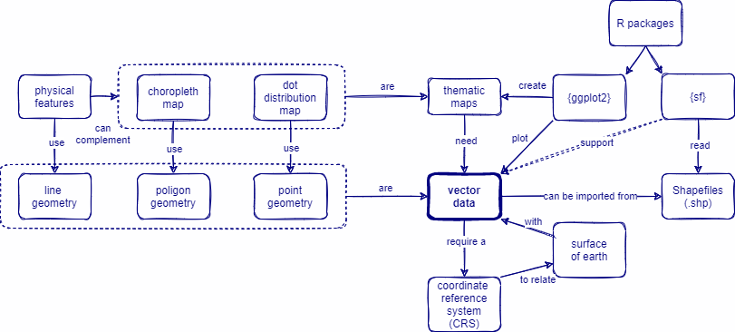

```{r, include = FALSE, warning = FALSE, message = FALSE}
# Load packages 
if(!require(pacman)) install.packages("pacman")
pacman::p_load(tidyverse, knitr, here)

# Source functions 
source(here("global/functions/misc_functions.R"))

# knitr settings
knitr::opts_chunk$set(warning = F, message = F, class.source = "tgc-code-block", error = T)

## autograders
suppressMessages(source(here::here("ch06_basic_geospatial_viz/lessons/ch06_ls08_foreign_objects_autograder.R")))
```

```{r,echo=FALSE}
ggplot2::theme_set(new = theme_bw())
```

------------------------------------------------------------------------

<!-- # Geospatial analysis: read external data -->

## Introduction

Let say that you receive a raw `data.frame` with coordinate points per row, and I want to create a Thematic map with it, how can I make it using `{ggplot2}`? Or that you use a package to get spatial data but in a object class like `SpatVector` or `SpatialPolygonsDataFrame`, how can I use them with `{ggplot2}`?


We need `sf` class objects to create `ggplot` maps! So, today we are going to learn how to **convert foreign** spatial objects to `sf`, either polygon or point data, to keep making `ggplot2` maps!

## Learning objectives

1.  Convert **foreign** objects to **`sf` class** using the `st_as_sf()` function from the `{sf}` package.

2.  Convert foreign **polygon** data in `SpatVector` class to `sf`.

3.  Convert foreign **point** data in `data.frame` class to `sf`.

## Prerequisites

This lesson requires the following packages:

```{r,eval=TRUE,echo=TRUE,message=FALSE}
if(!require('pacman')) install.packages('pacman')

pacman::p_load(malariaAtlas,
               ggplot2,
               cholera,
               geodata,
               dplyr,
               here,
               sf)

pacman::p_load_gh("afrimapr/afrilearndata",
                  "wmgeolab/rgeoboundaries")
```

## Mapping country borders with `{geodata}`

An advantage of the `{geodata}` package is that it downloads country borders data with a *multiple column output*, providing the names of all the levels above the one requested.

For example, here is an example with the first three administrative levels in Bolivia:

```{r,message=FALSE,warning=FALSE}
bolivia_level3 <- gadm(country = "Bolivia", level = 3, path = tempdir())
```

```{r}
bolivia_level3 %>% 
  
  as_tibble() %>% 
  select(starts_with("NAME_")) #👈👈👈👈👈👈👈👈👈👈👈👈👈
```

This is useful for situations where you want to `filter()` only a specific subset of sub-divisions (e.g. level 3) within a region (level 1) or department (level 2).

```{r}
bolivia_level3 %>% 
  
  as_tibble() %>% 
  select(starts_with("NAME_")) %>% 
  
  filter(NAME_1 == "Santa Cruz") #👈👈👈👈👈👈👈👈👈👈👈👈👈👈
```

However, I can not create `ggplot` maps with it because it is a `SpatVector` class object:

``` r
gadm(country = "Bolivia", level = 3, path = tempdir())
```

    👉 class       : SpatVector 👈
       geometry    : polygons 
       dimensions  : 344, 16  (geometries, attributes)
       extent      : -69.64525, -57.45443, -22.90657, -9.670923
       coord. ref. : +proj=longlat +datum=WGS84 +no_defs 

### Convert foreign Polygon geometries to `sf` {.unnumbered}

The best way to solve this issue is to use the `st_as_sf()` function from the `{sf}` package

```{r}
# spatvector
bolivia_level3 %>% class()

# sf
bolivia_level3 %>% st_as_sf() %>% class() #👈👈👈👈👈👈👈👈
```

This solution is useful for object classes like `SpatVector` and `SpatialPolygonsDataFrame`.

::: rstudio-cloud
Convert the country borders of Germany from `SpatVector` to a `sf` class object using the `st_as_sf()` function:

```{r,eval=FALSE,echo=TRUE}
gadm(country = "Germany", level = 2, path = tempdir()) %>% 
  ...........
```
:::

Now with `sf` objects, we can create a ggplot like this:

```{r}
ggplot() +
  geom_sf(data = geoboundaries(country = "Bolivia")) +
  geom_sf(data = bolivia_level3 %>% 
            
            st_as_sf() %>%                 #👈👈👈👈
            
            filter(NAME_1 == "Santa Cruz"),
          mapping = aes(fill = NAME_1))
```

### Vector data {.unnumbered}

::: vocab
**Why is the class object called `SpatVector`?**

-   "SpatVector" stands for *"Spatial Vector"*, and "Vector" stands for **"Vector data"**.

-   **Vector data** is the formal name for the *Geometry types* like Point, Lines, and Polygons.

-   It requires a **Coordinate Reference System (CRS)** to relate the spatial elements of the data with the *surface of Earth*.

-   It is also the **most common format** of Spatial data used in GIS. Which is commonly stored in Shapefiles.
:::

::: watch-out
Do not get confused by the `vector` class object, which is an R class just like `data.frame` and `matrix`.
:::

Above is an example of converting *foreign* **Polygon** data to `sf` class. Now let's see briefly see how to convert *foreign* **Point** data.

## Disease information with `{malariaAtlas}`

The `{malariaAtlas}` package download, visualize and manipulate global malaria data hosted by the [Malaria Atlas Project](https://malariaatlas.org/).

The `malariaAtlas` package enables users to download data like:

-   parasite rate (PR) survey data (*Plasmodium falciparum* and *Plasmodium vivax*)
-   mosquito occurrence data

### Parasite Rate surveys {.unnumbered}

The `getPR()` function downloads all the publicly available PR points for a country (or countries) and returns it as a `data.frame`.

```{r get-pr,message = FALSE,warning=FALSE}
zimbabwe_malaria_pr <- getPR(country = "Zimbabwe", species = "BOTH")
```

::: side-note
The `species` argument is a string specifying the Plasmodium species and can be `Pf` (*Plasmodium falciparum*), `Pv` (*Plasmodium vivax*) or `BOTH`.
:::

The output is a `data.frame` object that contains `longitude` and `latitude` as variables:

```{r}
class(zimbabwe_malaria_pr)
```

```{r}
zimbabwe_malaria_pr %>% 
  as_tibble()
```

::: practice
Download the publicly available Parasite Ratio (PR) points for *Plasmodium falciparum* in `Sierra Leone` using the `{malariaAtlas}` package.

```{r,eval = FALSE}
q3 <- ________(________ = "Sierra Leone",species = "Pf")
q3
```

```{r,include = FALSE}
.check_q3()
.hint_q3()
```
:::

`autoplot()` can be used to quickly and easily visualize the downloaded PR survey points.

```{r viz-PR, eval=FALSE, message=FALSE,warning=FALSE}
autoplot(zimbabwe_malaria_pr)
```

However, if you would like to make a **custom plot** for your particular research needs, with complete control of the *output aesthetics*, you would probably prefer `{ggplot2}` for the work!

### Convert foreign Point geometries to `sf` {.unnumbered}

To convert a `data.frame` to an `sf` object, we can use the `st_as_sf()` from the `{sf}` package.

In case of **Point** patterns data (like for a **Dot map**):

-   the `coords` argument need to specify the names of the variables holding the **Coordinates**, and
-   the `crs` argument specify the **Coordinate Reference System (CRS)** to be assigned (here WGS84, which is the CRS code \#`4326`).

```{r,eval=TRUE,echo=TRUE}
zimbabwe_malaria_pr_sf <- 
  # data frame
  zimbabwe_malaria_pr %>% 
  # convert to sf
  sf::st_as_sf(coords = c("longitude","latitude"),  #👈👈👈👈👈👈
               crs = 4326)
```

Inside the **`coords` argument**,you need to pay attention to two things:

-   You need to use `"quotation_marks"` for each column name,
-   First write the `longitude`, and then the `latitude`.

**Mission accomplished!** This is the output of the conversion:

```{r}
zimbabwe_malaria_pr_sf %>% 
  dplyr::select(site_name,pr)
```

Now we have converted our `data.frame` into an `sf` object and can directly plot this object with `{ggplot2}` code:

```{r,fig.height=3}
ggplot(data = zimbabwe_malaria_pr_sf) +
  geom_sf(aes(size = pr))
```

Or add one previous layer with the administrative boundaries of Zimbabwe:

```{r}
zimbabwe_boundaries_adm1 <- geoboundaries(country = "Zimbabwe",
                                         adm_lvl = 1)
```

In the same ggplot:

```{r,fig.height=3}
ggplot() +
  # boundaries data
  geom_sf(data = zimbabwe_boundaries_adm1,
          fill = "white") +
  # disease data
  geom_sf(data = zimbabwe_malaria_pr_sf,
          aes(size = pr),
          color = "red",
          alpha=0.5)
```

::: watch-out
`sf::st_as_sf()` does not allow missing values in coordinates!

So you can use `{dplyr}` verbs like `filter()` to drop problematic rows from variable `x` using this notation:`filter(!is.na(x))`.
:::

::: practice
With the publicly available Parasite Ratio (PR) points of *Plasmodium falciparum* in Sierra Leone stored in `q3`:

Convert its `data.frame` output to a `sf` object using the `st_as_sf()` function, with the code `4326` to set a `WGS84` CRS. (More on all these codes coming soon, don't be intimidated !)

```{r,eval = FALSE}
q4 <- 
  q3 %>% 
  filter(!is.na(longitude)) %>% 
  sf::________(coords = c("________","________"),
               crs = 4326)
q4
```

```{r, include=FALSE}
.check_q4()
.hint_q4()
```
:::

```{r include = F}
.score_print()
```

```{r include = F}
pacman::p_unload(raster) # avoid masking select(). Temporary investigation
```

## Wrap up

In this lesson, we have learned how to **convert foreign** *Polygon* and *Point* data to a `sf` class object from `SpatVector` and `data.frame` objects, respectively. We also learned about **Vector data** and how **Point data** needs a *Coordinate Reference Systems (CRS)* to obtain an `sf` object.



## Contributors {.unlisted .unnumbered}

The following team members contributed to this lesson:

`r tgc_contributors_list(ids = c("avallecam", "lolovanco"))`

## References {.unlisted .unnumbered}

Some material in this lesson was adapted from the following sources:

-   *Seimon, Dilinie. Administrative Boundaries.* (2021). Retrieved 15 April 2022, from <https://rspatialdata.github.io/admin_boundaries.html>

-   *Varsha Ujjinni Vijay Kumar. Malaria.* (2021). Retrieved 15 April 2022, from <https://rspatialdata.github.io/malaria.html>

-   *Batra, Neale, et al. The Epidemiologist R Handbook. Chapter 28: GIS Basics*. (2021). Retrieved 01 April 2022, from <https://epirhandbook.com/en/gis-basics.html>

-   *Lovelace, R., Nowosad, J., & Muenchow, J. Geocomputation with R. Chapter 2: Geographic data in R*. (2019). Retrieved 01 April 2022, from <https://geocompr.robinlovelace.net/spatial-class.html>

-   *Moraga, Paula. Geospatial Health Data: Modeling and Visualization with R-INLA and Shiny. Chapter 2: Spatial data and R packages for mapping*. (2019). Retrieved 01 April 2022, from <https://www.paulamoraga.com/book-geospatial/sec-spatialdataandCRS.html>

`r tgc_license()`
