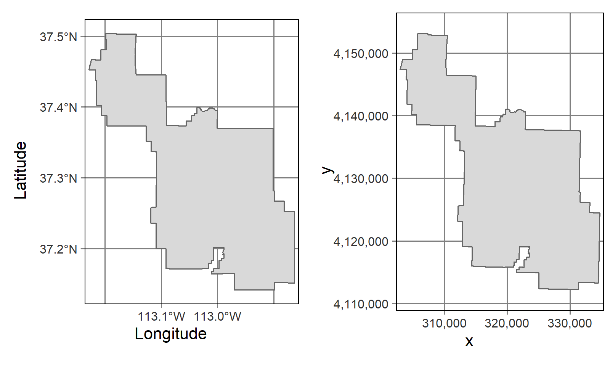

```{r, include = FALSE, warning = FALSE, message = FALSE}
# Load packages 
if(!require(pacman)) install.packages("pacman")
pacman::p_load(tidyverse, knitr, here)

# Source functions 
source(here("global/functions/misc_functions.R"))

# knitr settings
knitr::opts_chunk$set(warning = F, message = F, class.source = "tgc-code-block", error = T)

# Source autograder script quietly 
suppressMessages(source(here::here("ch06_basic_geospatial_viz/lessons/ch06_ls09_utm_autograder.R")))
```

```{r,echo=FALSE}
ggplot2::theme_set(new = theme_bw())
```

<!-- # Geospatial analysis: UTM coordinate system -->

## Introduction

So far, all spatial data visualized contain locations measured in **angular units** (longitude/latitude). But, what if data came in a different coordinate system measured in **linear units**? Like the *planar coordinates* of this summary figure!

.](images/crs-datum_projection-closer.png)

In this lesson we are going to learn how to **set up** our data with a **UTM** Coordinate System, measured in **meters** instead of longitude/latitude, and how to **transform** spatial objects from UTM to longitude/latitude, and vice versa!

## Learning objectives

1.  Configure data with **UTM coordinate system** using the `st_as_sf()` function.

2.  Change the **CRS projection** of a `sf` object using the `st_transform()` function.

## Prerequisites

This lesson requires the following packages:

```{r,eval=TRUE,echo=TRUE,message=FALSE}
if(!require('pacman')) install.packages('pacman')

pacman::p_load(malariaAtlas,
               colorspace,
               ggplot2,
               cholera,
               spData,
               dplyr,
               here,
               rio,
               sf)

pacman::p_load_gh("afrimapr/afrilearndata",
                  "wmgeolab/rgeoboundaries")
```

This lesson requires familiarity with `{dplyr}`: if you need to brush up, have a look at our introductory course on data wrangling.

## Set up a CRS Projection to UTM coordinates


• If you receive a data frame with coordinates, but *without* a CRS projection.


• and you want to make a `ggplot` map with,


• You can use `st_as_sf()` from `{sf}`.


::: recap


• For **point** data we need: coordinates (`"x","y"`) and the CRS (`4326`)


```{r,eval=FALSE}
fatalities %>% 
  
  ggplot() +
  geom_sf(alpha = 0.3)
```
:::


• However, what if you receive coordinates **different to** *longitude* and *latitude*?


• Let's use **malaria prevalence in The Gambia**.


• From children obtained at **65 villages**:


### Malaria prevalence


• First, we read the `gambia_summarized.rds` file with [`{readr}`](https://readr.tidyverse.org/).


```{r,message=FALSE,warning=FALSE}
# "ch06_basic_geospatial_viz/data/gambia_summarized.rds"

gambia_point_summary <- 
  

gambia_point_summary
```


• Data frame with 65 observations and 5 variables:


-   `x`: x coordinate of the village (**UTM**),
-   `y`: y coordinate of the village (**UTM**),
-   `total`: total number of tests performed,
-   `positive`: number of *positive* tests, and
-   `prev`: malaria *prevalence* in each village.


::: vocab
• **UTM** stants for Universal Transverse Mercator, another coordinate system.
:::


#### Set up the CRS projection {.unnumbered}


• To make a map with `ggplot2` and `geom_sf()`,


• We need to transform the `data.frame` to an `sf` object.


• To use `st_as_sf()` from `{sf}`, we need to specify a CRS projection.


• But, **units** of `x` and `y` are **not** *Geographic* coordinates (longitude/latitude).


• Instead, these are **UTM format (Easting/Northing)**, or **Projected** coordinates.


::: vocab


• Two **CRS coordinate systems:**


• **Geographic** - *longitude and latitude* refer a location on the Earth's *3D* ellipsoid surface.


• **Projected** - *easting and northing* Cartesian coordinates refer a location on a *2D* Earth.


.](images/utm-geographic-projected.png)


• In R, it looks like this:


{width="415"}
:::


::: key-point


• All **Projected CRSs** are *based on* a **Geographic CRS**


• Rely on *map projections* to convert the 3D surface of the Earth into Easting and Northing (x and y) values for a 2D surface.


.](images/utm-from_geograph_to_projected-2.png){width="440"}
:::


::: practice
Which of the following options of Coordinate Reference System (CRS) types:

a.  `"geographic_crs"`
b.  `"projected_crs"`

...corresponds to each of these datasets, given the magnitude of the values in their `x` and `y` columns:

the `parana` dataset?

```{r,eval=FALSE}
parana <- import("https://github.com/cran/geoR/raw/master/data/parana.rda")
as_tibble(parana$coords)
```

```{r,include=FALSE}
# unlock your answer:
# q1 <- "geographic_crs"
# q1 <- "projected_crs"

.check_q1()
.hint_q1()
```

the `fatalities` dataset?

```{r,eval=FALSE}
pacman::p_load(cholera)
as_tibble(fatalities)
```

```{r,include=FALSE}
# unlock your answer:
# q2 <- "geographic_crs"
# q2 <- "projected_crs"

.check_q2()
.hint_q2()
```
:::

##### Set UTM Projected coordinates with `st_as_sf()` {.unnumbered}


• Now we can set **UTM coordinates**.


• Specify the projection of The Gambia, **UTM zone 28** (`"+proj=utm +zone=28"`) in `crs` argument.


```{r}
gambia_projected <- gambia_point_summary %>% 
  # first, specify the projection of gambia
  # UTM zone 28
  st_as_sf(     )

gambia_projected
```


• Confirm the presence of the:


• CRS text (`CRS: +proj=utm +zone=28`) inside the **header** of the new `sf` object, and


• the **unit** the `geometry` column in **meters** (`<POINT [m]>`).


::: vocab


• **UTM** system divides Earth


• **60 zones** of *6 degrees of longitude in width*.


• Each zone uses a *transverse Mercator projection*


• It maps a region of large north-south extent.


](images/utm-zones-USA.svg)


• How can I **get** *UTM zones* for a specific part of the world?


• Use [online interactive maps](https://mangomap.com/robertyoung/maps/69585/what-utm-zone-am-i-in-#), or


• Gridded images available in [wikipedia](https://en.wikipedia.org/wiki/Universal_Transverse_Mercator_coordinate_system#Exceptions).
:::


::: key-point


• In the **UTM** system, a **position** on the Earth is given by the:


1.  UTM *zone* number,


2.  *Hemisphere* (north or south), and


3.  Easting and northing *coordinates* in the zone which are measured in **meters**.


• *Eastings* are referenced from *the central meridian* of each zone, and


• *Northings* are referenced from *the equator*.
:::


::: practice
`parana_data` contains the average rainfall over different years for the period May-June (dry-season). It was collected at 143 recording stations throughout *Parana State, Brasil*.

Set `UTM` coordinate system to the `parana_data`. Parana State is located in the UTM zone number `22`.

```{r}
parana_data <- as_tibble(parana$coords) %>% 
  mutate(Rainfall = parana$data)
```

```{r,eval = FALSE}
q3 <- parana_data %>% 
  st_as_sf(coords = c("east", "north"), 
           crs = "+proj=______ +zone=______")
q3
```

```{r,include=FALSE}
.check_q3()
.hint_q3()
```
:::


##### Transform to Geographic coordinates with `st_transform()` {.unnumbered}


• To transform UTM *projected* coordinates to *geographic* coordinates


• e.g., **longitude/latitude** with datum **WGS84**


• Use `st_transform()` where we set a CRS to `"+proj=longlat +datum=WGS84"`:


```{r}
gambia_geographic <- gambia_projected %>% 
  # second, transform 
  # projected coordinates to
  # geographic coordinates
  

gambia_geographic
```


• Confirm the **update** of the:


• CRS text to `CRS: +proj=longlat +datum=WGS84` inside the **header**, and


• The **units** of the `geometry` column to **degrees** (`<POINT [°]>`).


::: vocab


• A **PROJ string** includes the following information:


• `+proj=`: the projection of the data (e.g. `utm`, `longlat`, or `laea`)


• `+zone=`: the zone of the data, specific to the UTM projection (e.g. `28`)


• `+datum=`: the datum use (e.g. `WGS84`)


• `+units=`: the units for the coordinates of the data (e.g. `m`)
:::


::: practice
With the UTM coordinate system data stored in `q3`:

Transform its Projected CRS to a Geographic CRS using the `longitude/latitude` (`longlat`) projection with datum `WGS84`.

```{r,eval = FALSE}
q4 <- q3 %>% 
  st_transform(crs = "+proj=______ +datum=______")
q4
```

```{r,include=FALSE}
.check_q4()
.hint_q4()
```
:::


::: side-note


• To reproduce [John Snow's map](https://cs.calvin.edu/courses/info/601/13geospatial/class/snow.html#4) of previous lessons,


• we needed to *set* and *transform* different CRS in the same coding pipeline:


```{r,eval=FALSE}
mdsr::CholeraDeaths %>%
  # british national grid
  st_set_crs(27700) %>%
  # to wgs84
  st_transform(4326)
```


• **Projected CRS** are a common choice made by a *public mapping agency*.


• With local data sources, to ensure *compatibility*, work with the official CRS provided.
:::


#### Map prevalences {.unnumbered}


• Now with the right CRS projection,


• Let's **overlap** these points with other Spatial data objects:


```{r}
gambia_adm_2 <- geoboundaries(   )
```


```{r,fig.height=2,fig.width=8}
ggplot() +
  geom_sf(data = ) +
  geom_sf(data = gambia_geographic, ) +
  colorspace::
```


::: pro-tip


• **Which CRS to use?**


• "There exist no all-purpose projections, all involve distortion when far from the center of the specified frame" (Bivand, Pebesma, and Gómez-Rubio 2013).


• When **Geographic CRS**, the answer is often **WGS84**.


• Used by default for web mapping, in *GPS* datasets.


• WGS84 is the most common CRS in the world,


• so it is worth knowing its *EPSG code: 4326*.


• Useful to convert unusual CRSs into something that is widely understood.
:::


```{r include = F}
.score_print()
```

```{r include = F}
pacman::p_unload(raster) # avoid masking select(). Temporary investigation
```

## Wrap up


• How to **transform** the CRS of `sf` objects between different *coordinate systems*.


• The characteristics of **Projected** coordinate systems, compared to *Geographic* systems.


.](images/utm-geographic-projected.png)


• Now, we can enrich our Thematic maps


• Let's add **text** and **labels** referring to specific places or regions, and


• Map elements like **scale bars** and a **north arrow**!


## Contributors {.unlisted .unnumbered}

The following team members contributed to this lesson: `r tgc_contributors_list(ids = c("avallecam", "lolovanco"))`

## References {.unlisted .unnumbered}

Some material in this lesson was adapted from the following sources:

-   *Moreno, M., Basille, M. Drawing beautiful maps programmatically with R, sf and ggplot2 --- Part 1: Basics*. (2018). Retrieved 10 May 2022, from <https://r-spatial.org/r/2018/10/25/ggplot2-sf.html>

-   *Data carpentry. Introduction to Geospatial Concepts: Coordinate Reference Systems*. (2021). Retrieved 15 May 2022, from <https://datacarpentry.org/organization-geospatial/03-crs/index.html>

-   *Moraga, Paula. Geospatial Health Data: Modeling and Visualization with R-INLA and Shiny. Chapter 9: Spatial modeling of geostatistical data. Malaria in The Gambia*. (2019). Retrieved 10 May 2022, from <https://www.paulamoraga.com/book-geospatial/sec-geostatisticaldataexamplespatial.html>

-   *Carrasco-Escobar, G., Barja, A., Quispe, J. [Visualization and Analysis of Spatial Data in Public Health]*. (2021). Retrieved 15 May 2022, from <https://www.reconlearn.org/post/spatial-analysis-1-spanish.html>

`r tgc_license()`
