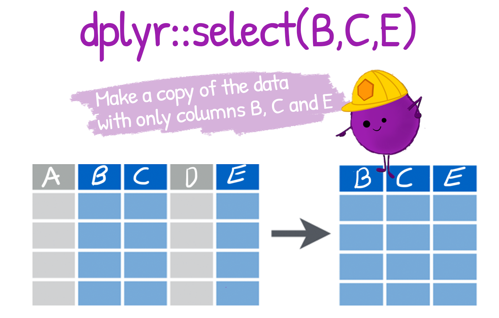

```{r, include = FALSE, warning = FALSE, message = FALSE}
# Load packages 
if(!require(pacman)) install.packages("pacman")
pacman::p_load(tidyverse, knitr, here)

# Source functions 
source(here("global/functions/misc_functions.R"))

# knitr settings
knitr::opts_chunk$set(warning = F, message = F, class.source = "tgc-code-block", error = T)

# Source autograder script quietly 
mute(here("ch99_template/lessons/ch99_ls01_template_autograder.R"))
```

## Learning objectives {.unlisted .unnumbered}

1.  You can keep or drop columns from a data frame using the `select()` function from the {dplyr} package.
2.  You can select a range or combination of columns using operators like the colon (`:`), the exclamation mark (`!`), and the `c()` function.

## Introduction to the dataset

In this lesson, we analyse results from a COVID-19 serological survey conducted in Yaounde, Cameroon in late 2020.

```{r render = reactable_10_rows, message = FALSE}
yaounde <- read_csv(here("ch99_template/data/yaounde_data.csv"))
yaounde  
```

## Introducing `select()`



`dplyr::select()` lets you pick which columns (variables) to keep or drop from a data frame.

You can select a column *by name*:

```{r render = reactable_5_rows}
yaounde %>% select(age) 
```

Or you can select a column *by position*:

```{r render = reactable_5_rows}
yaounde %>% select(6)
```

::: practice
◘ From the `yaounde` data frame, select the `age_category` column.

```{r eval = FALSE}
# Type your answer:
Q_age_category <- yaounde %>% _____________________
```

```{r include = FALSE}
# Check your answer:
.CHECK_Q_age_category()
.HINT_Q_age_category()
```

------------------------------------------------------------------------

◘ From the `yaounde` data frame, select the 14th column.

```{r eval = FALSE}
# Type your answer:
Q_14th_column <- yaounde %>% ____________________
```

```{r include = FALSE}
# Check your answer:
.CHECK_Q_14th_column()
.HINT_Q_14th_column()
```

------------------------------------------------------------------------

◘ What package does the `select()` function come from?

    A. {rmarkdown}

    B. {dplyr}

    C. {ggplot2}

```{r eval = FALSE}
# Delete the incorrect lines and run the correct line
Q_select_package <- "A"
Q_select_package <- "B"
Q_select_package <- "C"
```

```{r include = FALSE}
# Check your answer:
.CHECK_Q_select_package()
.HINT_Q_select_package()
```
:::

## Other divs

::: key-point
An example of a "key point" div.
:::

::: watch-out
An example of a "watch out" div.
:::

::: challenge
An example of a "challenge" div.
:::

::: vocab
An example of a "vocab" div.
:::

::: recap
An example of a "recap" div.
:::

::: rstudio-cloud
An example of an "rstudio-cloud" div. For steps specific to those working on the cloud.
:::

::: error
An example of an "error" div. Anticipate and provide solutions to common errors.
:::

::: reminder
**Remember XYZ syntax**

An example of a "reminder" div with a within-div title.
:::

::: side-note
An example of a "side note" div.

```{r}
"a 'side note' div with a code chunk"
```
:::

::: pro-tip
An example of a "pro tip" div.

```{r eval = F}
"a 'pro tip' div with a non-evaluated code chunk"
```
:::

```{r include = F}
.score_print()
```

## Contributors {.unlisted .unnumbered}

The following team members contributed to this lesson:

```{r echo = F}
# This function uses information stored in global/contributors/contributors.csv
# Only team members who contributed "substantially" to a specific lesson should be listed here
# See https://tinyurl.com/icjme-authorship for notes on "substantial" contribution
tgc_contributors_list(
  ids = c(
    "lolovanco",
    "kendavidn",
    "joy",
    "avallecam",
    "mfr",
    "benguimbis",
    "dcpcamara",
    "ondieki",
    "michals",
    "aowusuda",
    "eduardo",
    "aziza"
  ))
```

## References {.unlisted .unnumbered}

Some material in this lesson was adapted from the following sources:

-   Horst, Allison. "Allisonhorst/Dplyr-Learnr: A Colorful Introduction to Some Common Functions in Dplyr, Part of the Tidyverse." GitHub. Accessed April 6, 2022. <https://github.com/allisonhorst/dplyr-learnr.>

<!-- (Chicago format. You can use https://www.citationmachine.net) -->

`r tgc_license()`
