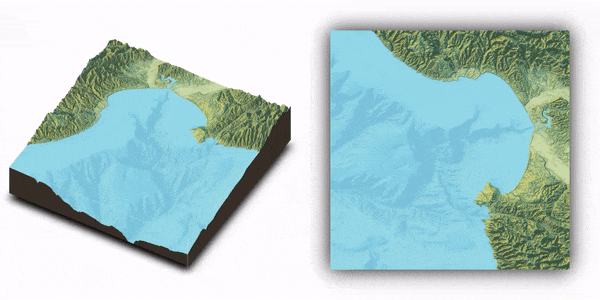

```{r, include = FALSE, warning = FALSE, message = FALSE}
# Load packages 
if(!require(pacman)) install.packages("pacman")
pacman::p_load(tidyverse, knitr, here)

# Source functions 
source(here("global/functions/misc_functions.R"))

# knitr settings
knitr::opts_chunk$set(warning = F, message = F, class.source = "tgc-code-block", error = T)
```

```{r,echo=FALSE}
ggplot2::theme_set(new = theme_bw())
options(scipen=10000)
```

# R for GIS

## Introduction

Spatial aspects of your data can provide a lot of insights into the *spread* of a disease or the *situation* of an outbreak, answering questions such as:

-   **Where** are the current disease hotspots?
-   How have the hotspots **changed over time**?
-   How is the **access** to health facilities? Are any improvements needed?


Here we are going to learn **why to use R** to address all these tasks, according to the needs of applied epidemiologists.

## Learning objectives

1.  Define what is a **geospatial analysis**.

2.  Identify the main analytical task that a **GIS software** need to solve.

3.  Identify the **advantages** of R as a GIS software.

## Prerequisites

This lesson requires familiarity with basic R and `{ggplot2}`: if you need to brush up, have a look at our introductory course on R and data visualization.

## What is Geospatial analysis?

Geospatial analysis is the study of data with *geographic* locations or coordinates--that is, data related to positions on the Earth's surface. This branch of data analysis is essential to epidemiology.

A geospatial analysis can, for example, help us to:

-   Identify **hot-spots** and potential **high-risk areas** for communicable disease spread;
-   Discover environmental **correlates** and potential causes of non-communicable diseases; or
-   Determine the **how accessible** is healthcare for people that need it;

As an example, here is a map of malaria prevalence predictions in The Gambia created with `{ggplot2}`, adapted from Moraga, 2019.


Let's see how the code looks like!

```{r,message=FALSE,warning=FALSE}

# 👉 first, get packages:

if(!require('pacman')) install.packages('pacman')
pacman::p_load_gh("wmgeolab/rgeoboundaries")
pacman::p_load(tidyverse, ggspatial, leaflet, 
               raster, stars, here)

# 👉 second, get data:

# country boundaries
gambia_boundaries <- geoboundaries(country = "Gambia", adm_lvl = 1)
# malaria prevalence
gambia_prevalence <- read_rds(here("data", "gambia_prevalence.rds"))
# 👉 third, plot data:

ggplot() +
  # with a background
  annotation_map_tile(data = gambia_boundaries, zoomin = 0) +
  # plus a prevalence surface
  geom_stars(data = st_as_stars(gambia_prevalence)) +
  # with a color scale
  scale_fill_viridis_c(na.value = "transparent", alpha = 0.75) +
  # and a coordinate system
  coord_sf()
```

In this chapter, you will learn the basic skills required to use R for the **geospatial visualization** of epidemiological data to make *accurate*, *elegant* and *informative* maps.

## R as a GIS

Every geospatial analysis needs a **geographic information system (GIS)**.

A GIS is a software application or platform for *managing*, *analyzing*, and *visualizing* spatial data. The most popular GIS platforms, like **ArcGIS** (paid) and **QGIS** (free), are primarily *graphic-user-interface (GUI)* based---that is, they work with visual point-and-click interfaces, not with code scripts.

So **why use R for geospatial work?** lets look at five of its more relevant merits:

### Reproducibility:

When you do geospatial analysis with code rather than by pointing and clicking, it is straightforward for anyone to re-run, or *reproduce* your analysis steps, by simply re-running your script. Similarly, you can easily build on other people's work by This facilitates easy collaboration with your colleagues (or with your future self)!

Let's take this code as an example. If you paste this code in any R session, you would be able to reproduce in your computer the map that I built:

```{r,message=FALSE}
# 👉 packages
if(!require('pacman')) install.packages('pacman')
pacman::p_load(sf, ggplot2)

# 👉 data 
nc <- st_read(system.file("shape/nc.shp", package = "sf"),
              quiet = TRUE)
# 👉 plot
ggplot(data = nc) + 
  geom_sf(aes(fill = SID74)) +
  scale_fill_viridis_c()
```

### Reporting:

Tools like `{Rmarkdown}`, `{flexdashboard}` and `{shiny}` make it easy to generate elegant reports and *dashboards* for sharing your geospatial work.

For example, we can include our previous map in an *interactive* dashboard using the `{leaflet}` package, instead of `{ggplot2}`:

```{r,message=FALSE}
# 👉 packages
if(!require('pacman')) install.packages('pacman')
pacman::p_load(sf, leaflet)

# 👉 data
nc <- st_read(system.file("shape/nc.shp", package = "sf"),
              quiet = TRUE)

# 👉 plot
pal <- colorNumeric("YlOrRd", domain = nc$SID74)
leaflet(nc) %>%
  addTiles() %>%
  addPolygons(color = "white", fillColor = ~ pal(SID74),
              fillOpacity = 1) %>%
  addLegend(pal = pal, values = ~SID74, opacity = 1)
```

### Rich ecosystem:

R has a rich and rapidly *growing libraries* for working with geospatial data. Because of R's highly-active open-source community, one can usually find ready-to-use packages or tutorials for most tasks with geospatial data.

For example, if we replace the `{leaflet}` package with `{mapview}`, we can make the same previous interactive map with only one line of code!

```{r,message=FALSE}
# 👉 packages
if(!require('pacman')) install.packages('pacman')
pacman::p_load(sf, mapview)

# 👉 data
nc <- st_read(system.file("shape/nc.shp", package = "sf"),
              quiet = TRUE)

# 👉 plot
mapview(nc, zcol = "SID74")
```

### Convenience:

You already know R! This important merit opens the doors to copy, paste and modify any reproducible piece of code that you find.

::: rstudio-cloud
As an example, we will use the `{tmap}` package and make minor modifications to it!

First, run this chunk:

```{r,warning=FALSE,message=FALSE}
# 👉 packages
if(!require('pacman')) install.packages('pacman')
pacman::p_load(tmap, spData)

# 👉 data
load(here("data/nz_elev.rda"))

# 👉 plot
tm_shape(nz_elev)  +
  tm_raster(title = "elev", 
            style = "cont",
            palette = "-RdYlGn") +
  tm_shape(nz) +
  tm_borders(col = "red", 
             lwd = 3) +
  tm_scale_bar(breaks = c(0, 100, 200),
               text.size = 1) +
  tm_compass(position = c("LEFT", "center"),
             type = "rose", 
             size = 2) +
  tm_credits(text = "J. Nowosad, 2019") +
  tm_layout(main.title = "My map",
            bg.color = "lightblue",
            inner.margins = c(0, 0, 0, 0))
```

Now, apply any of the following suggestions to get used to how this package works:

1.  Change the **map title** from "My map" to "New Zealand".
2.  Update the **map credits** with your own name and today's date.
3.  Change the **color palette** to "BuGn".
4.  Try **other palettes** from <http://colorbrewer2.org/>
5.  Put the **north arrow** in the top right corner of the map.
6.  Improve the **legend title** by adding the legend units.
7.  Increase the number of breaks in the **scale bar**.
8.  Change the **borders' color** of the New Zealand's regions to black.
9.  Decrease the line width.
10. Change the **background color** to any color of your choice.
:::

### Integrated workflow:

Finally, with R you can combine geospatial visualization and analyses with other statistical and epidemiological analyses, all within a single script.

For example, you can built a 3D maps of the Monterey Bay using the `{rayshader}` package. To reproduce this you can follow the tutorial available in this link: <https://www.tylermw.com/3d-maps-with-rayshader/>



Also, you can built fancy bivariate maps to highlight the unequal distribution of the income per country. You can follow the whole workflow for this map from this tutorial: <https://timogrossenbacher.ch/2019/04/bivariate-maps-with-ggplot2-and-sf/>

{width="499"}

```{r}

```

## Wrap up

In this first lesson, we learned why to use R as a GIS software and take advantage of its coding environment.

But, which are going to be the first maps that we are going to built in this chapter?

{width="484"}

In the following lessons, we will learn how to built -step by step- different types of **Thematic maps** using the `{ggplot2}` package, with different data sources and illustrative annotations.

{width="409"}

## Contributors {.unlisted .unnumbered}

The following team members contributed to this lesson:

`r tgc_contributors_list(ids = c("avallecam", "kendavidn"))`

## References {.unlisted .unnumbered}

Some material in this lesson was adapted from the following sources:

-   *Batra, Neale, et al. (2021). The Epidemiologist R Handbook. Chapter 28: GIS Basics*. (2021). Retrieved 01 April 2022, from <https://epirhandbook.com/en/gis-basics.html>

-   *Baumer, Benjamin S., Kaplan, Daniel T., and Horton, Nicholas J. Modern Data Science with R. Chapter 17: Working with geospatial data*. (2021). Retrieved 05 June 2022, from <https://mdsr-book.github.io/mdsr2e/ch-spatial.html>

-   *Lovelace, R., Nowosad, J., & Muenchow, J. Geocomputation with R. Chapter 2: Geographic data in R.* (2019). Retrieved 01 April 2022, from <https://geocompr.robinlovelace.net/spatial-class.html>

-   *Moraga, Paula. Geospatial Health Data: Modeling and Visualization with R-INLA and Shiny. Chapter 12: Building a dashboard to visualize spatial data with flexdashboard*. (2019). Retrieved 13 September 2022, from <https://www.paulamoraga.com/book-geospatial/sec-flexdashboard.html>

-   *Moreno, M., and Bastille, M. Drawing beautiful maps programmatically with R, sf and ggplot2 --- Part 1: Basics.* (2018). Retrieved 13 September 2022, from <https://r-spatial.org/r/2018/10/25/ggplot2-sf.html.>

-   *Nowosad, J. Basics of Spatial Data Analysis Workshop.* (2019). Retrieved 13 September 2022, from <https://github.com/Nowosad/whyr_19w/blob/master/code/spatial_vis.R>

-   *Nowosad, J. The Landscape of Spatial Data Analysis in R.* (2019). Retrieved 13 September 2022, from <https://jakubnowosad.com/whyr_19/#1>

`r tgc_license()`
