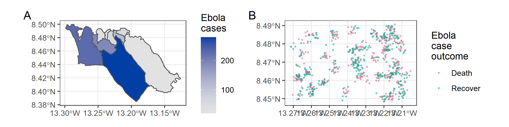
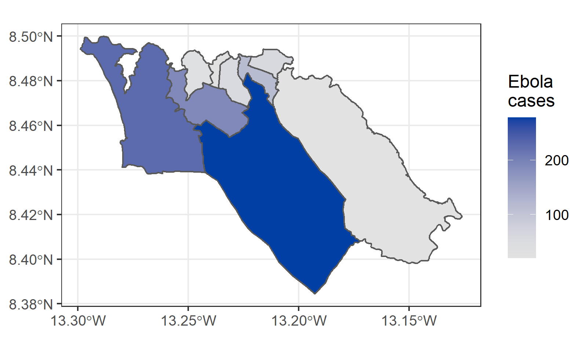
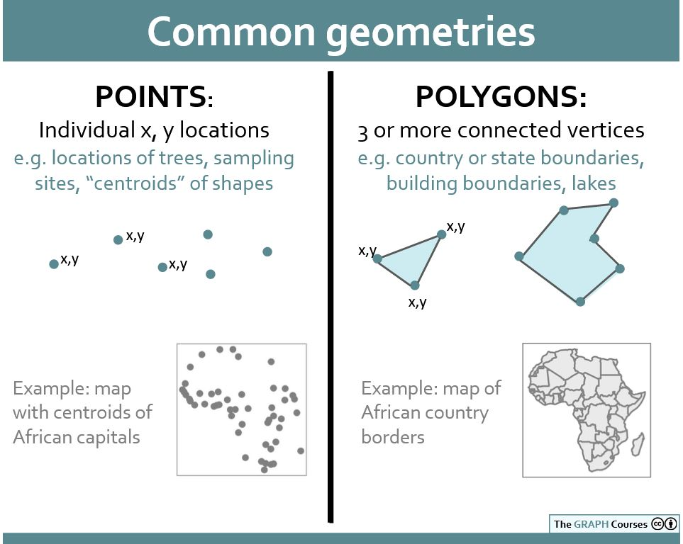
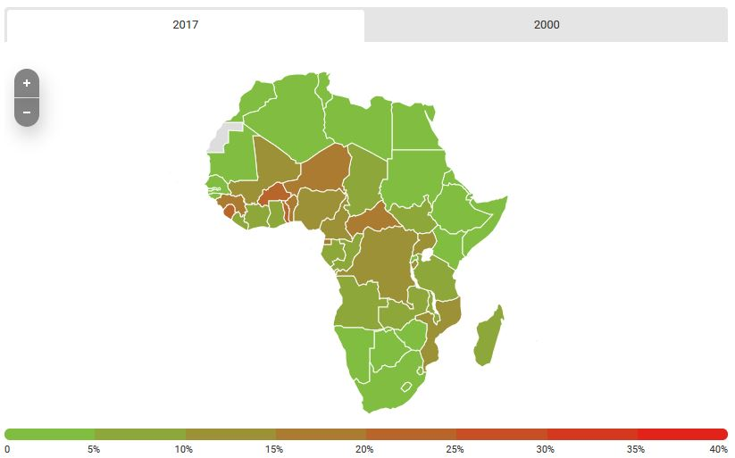

```{r, include = FALSE, warning = FALSE, message = FALSE}
# Load packages 
if(!require(pacman)) install.packages("pacman")
pacman::p_load(tidyverse, knitr, here)

# Source functions 
source(here("global/functions/misc_functions.R"))

# knitr settings
knitr::opts_chunk$set(warning = F, message = F, class.source = "tgc-code-block", error = T)
```

```{r,echo=FALSE}
ggplot2::theme_set(new = theme_bw())
options(scipen=10000)
```

------------------------------------------------------------------------

## Introduction

• In disease outbreaks, **Thematic maps** can be called *Epidemic maps*.

• The two most iconic types of Thematic maps: **Choropleth maps** and **Dot maps**.



------------------------------------------------------------------------

## Learning objectives

1.  Identify two types of **Thematic maps** (choropleth and dot maps) used by epidemiologist to visualize Geospatial data.

2.  Create Thematic maps using `{ggplot2}` and the **`geom_sf()`** function.

3.  Relate each Thematic map with a **Geometry** type.

------------------------------------------------------------------------

## Prerequisites

This lesson requires the following packages:

```{r,eval=TRUE,echo=TRUE,message=FALSE}
if(!require('pacman')) install.packages('pacman')
pacman::p_load_gh("afrimapr/afrilearndata")
pacman::p_load(rnaturalearth,
               ggspatial,
               ggplot2,
               mdsr,
               terra,
               spData)

```

This lesson requires familiarity with `{ggplot2}`: if you need to brush up, have a look at our introductory course on data visualization.

------------------------------------------------------------------------

## Choropleth map

### What is it? {.unnumbered}

• *Colors or shadings* represent **geographic regions** in relation to the value of a variable.

• E.g. *Larger values* could be indicated by a [**darker color**]{.underline}, and *smaller values* by a [**lighter color**]{.underline}.

### How to plot it? {.unnumbered}

• Geospatial data can be plotted using **`ggplot2::geom_sf()`**.

• *Colors* and *shapes* can be depicted with the `aes()` function,

• Using the `fill`, `color` and `size` arguments.

#### With Quantitative data {.unlisted .unnumbered}

• A Quantitative *Choropleth map* requires the `fill` argument.

• Let's create one with the `africountries` dataset from {`afrilearndata}`!

• Administrative boundaries of all the countries in the African continent.

1.  Use `ggplot2::geom_sf()` to plot African countries, only.
2.  `fill` each of them according to their population (`pop_est`):

```{r}
ggplot(______ = africountries) +
  ______(mapping = aes(______ = ______))
```

::: side-note
• `sf` stands for **"simple features"**, an [open standard](http://portal.opengeospatial.org/files/?artifact_id=25355) used to represent a wide range of *geometric shapes*.
:::

::: practice
Create a Choropleth map with the `world` data from the `{spData}` package, using `geom_sf()`, to portrait its countries and `fill` them in relation to its population, available in the `pop` variable.

```{r,eval = FALSE}
# Write and visualize your answer:
q1 <- 
  ggplot(data = world) +
  ________(mapping = aes(fill = pop))
q1
```
:::

#### With Categorical data {.unlisted .unnumbered}

• Let's keep using `fill`.

• Create a map with countries *colored* by their Economical classification (`economy`):

```{r}
countries <- rnaturalearth::ne_countries(returnclass = "sf")

ggplot(data = countries) + 
  ______(mapping = aes(______ = ______))
```

::: watch-out
• Before using `geom_sf()`, verify that your *Spatial data* is an `"sf"` R object:

```{r}
______(africountries)
```

• More about `sf` in the following lessons!
:::

### How to use it? {.unnumbered}

• Visualize how one variable changes across a defined regions.

{width="441"}

• Region of interest (Sierra Leone)

• Partitioned into a finite number of subregions (districts)

• Number of cases aggregated at that level.

::: vocab
• *Choropleth maps* visualize a shape called **Polygons**.

• Collects data from an enclosed region.

• Partitioned into a finite number of *areal units* with defined boundaries.

• E.g., data collected by ZIP code, census tract, or the administrative boundary levels of a country (Figure 2).
:::

------------------------------------------------------------------------

## Dot map

### What is it? {.unnumbered}

• Thematic map type that uses **dots** to represent attribute values.

### How to plot it? {.unnumbered}

• The *Dot map* could use the `size` or `color` argument.

#### With Quantitative data {.unlisted .unnumbered}

• A Quantitative Dot map requires the `size` argument.

• Let's create a Dot map!

• Use the `africapitals` dataset, it contains the location of capital cities in the African continent.

1.  Use `ggplot2::geom_sf()` to plot these locations,
2.  and `size` them according to their number of inhabitants:

```{r,eval=TRUE,echo=TRUE}
ggplot(______ = africapitals +
  ______(mapping = aes(______ = ______))
```

::: rstudio-cloud
We can replicate John Snow's Dot map with the number of deaths per household from the 1854 London cholera outbreak:

```{r,eval=FALSE}
cholera_deaths <- 
  read_rds(here("basic_geospatial_viz/data/cholera_deaths.rds"))

ggplot(data = cholera_deaths) + 
  _____(mapping = aes(_____ = Count), alpha = 0.7)
```
:::

#### With Categorical data {.unlisted .unnumbered}

• Visualize airports *classified* by `type` using the `color` argument:

```{r,results='hide'}
airports <- rnaturalearth::ne_download(scale = 10,
                                       type = "airports", 
                                       returnclass = "sf")

ggplot(data = airports) + 
  ______(aes(______ = ______), alpha = 0.5)
```

::: practice
Create a Thematic map with the `afriairports` object to portrait all its airport locations, using `geom_sf()`, and `color` them in relation to the `type` variable.

```{r,eval = FALSE}
# Write and visualize your answer:
q2 <- 
  ggplot(data = afriairports) +
  ________(mapping = aes(________ = ________))
q2
```
:::

### How to use it? {.unnumbered}

• To visualize the *scatter of your data* and visually *scan for clusters*.

{width="437"}

::: vocab
• *Dot maps* visualize a shape called **Point**.

• Collects data that register the *locations* of random events.

• E.g., geographical coordinates of individuals with a given diagnosis (Figure 3).
:::

::: side-note
• Bothered by having just dots and no geographical context?

• That's good! We will see how to add those using roads and rivers very soon.
:::

::: recap
• Thematic maps visualize specific **Geometry** types:

• Choropleth maps visualize *Polygons*.

• Dot maps visualize *Points*.

{width="445"}
:::

::: practice
Which of the following options of *Thematic map* types:

a.  `"choropleth_map"`
b.  `"dot_distribution_map"`

...corresponds to each of these *Epidemic map* figures?

Your answer should be either "choropleth_map" or "dot_distribution_map".

1.  [Malaria cases in Africa](https://data.unicef.org/topic/child-health/malaria/):

{width="446"}

2.  [COVID-19 cases in the world](https://coronavirus.jhu.edu/map.html):

{width="613"}
:::

```{r include = F}
pacman::p_unload(raster) # avoid masking select(). Temporary investigation
```

------------------------------------------------------------------------

## Wrap up

• We learned about *Thematic maps*,

• How to create them using *ggplot2::geom_sf()*,

• Which type of *Geometry* they visualize.


• But, how can we complement Thematic maps with *geographic context*?

• We are going to learn about how to add *Physical features* to our maps.

------------------------------------------------------------------------

## Contributors {.unlisted .unnumbered}

The following team members contributed to this lesson:

`r tgc_contributors_list(ids = c("avallecam", "lolovanco", "kendavidn"))`

------------------------------------------------------------------------

## References {.unlisted .unnumbered}

Some material in this lesson was adapted from the following sources:

-   *Batra, Neale, et al. (2021). The Epidemiologist R Handbook. Chapter 28: GIS Basics*. (2021). Retrieved 01 April 2022, from <https://epirhandbook.com/en/gis-basics.html>

-   *Lovelace, R., Nowosad, J., & Muenchow, J. Geocomputation with R. Chapter 2: Geographic data in R*. (2019). Retrieved 01 April 2022, from <https://geocompr.robinlovelace.net/spatial-class.html>

-   *Moraga, Paula. Geospatial Health Data: Modeling and Visualization with R-INLA and Shiny. Chapter 2: Spatial data and R packages for mapping*. (2019). Retrieved 01 April 2022, from <https://www.paulamoraga.com/book-geospatial/sec-spatialdataandCRS.html>

-   *Baumer, Benjamin S., Kaplan, Daniel T., and Horton, Nicholas J. Modern Data Science with R. Chapter 17: Working with geospatial data*. (2021). Retrieved 05 June 2022, from <https://mdsr-book.github.io/mdsr2e/ch-spatial.html>

`r tgc_license()`

------------------------------------------------------------------------

## Answer Key {.unnumbered}

### Q1 {.unlisted .unnumbered}

```{r}
q1 <- ggplot(data = world) + 
  geom_sf(aes(fill = pop))
q1
```

### Q2 {.unlisted .unnumbered}

```{r}
q2 <- ggplot(data = afriairports) + 
  geom_sf(aes(fill = type))
q2
```

### Q3 & Q4 {.unlisted .unnumbered}

Which of the following options of *Thematic map* types corresponds to each of these *Epidemic map* figures? Your answer should be either "choropleth_map" or "dot_distribution_map".

1.  [**Malaria cases in Africa]** is a CHROPLETH MAP
2.  **[COVID-19 cases in the world]** is a DOT DISTRIBUTION MAP
