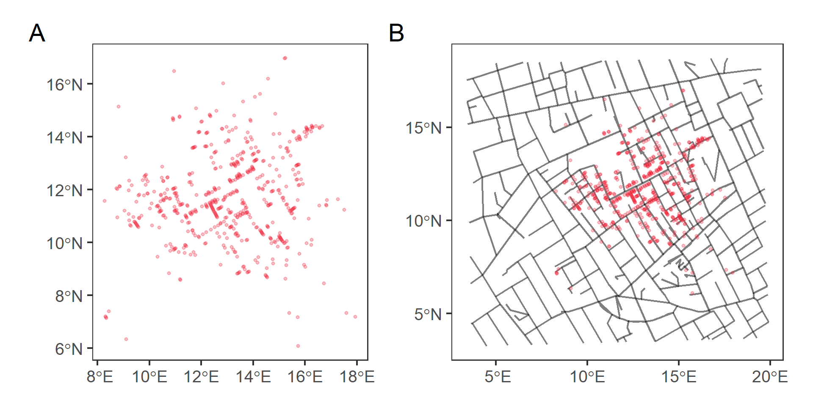
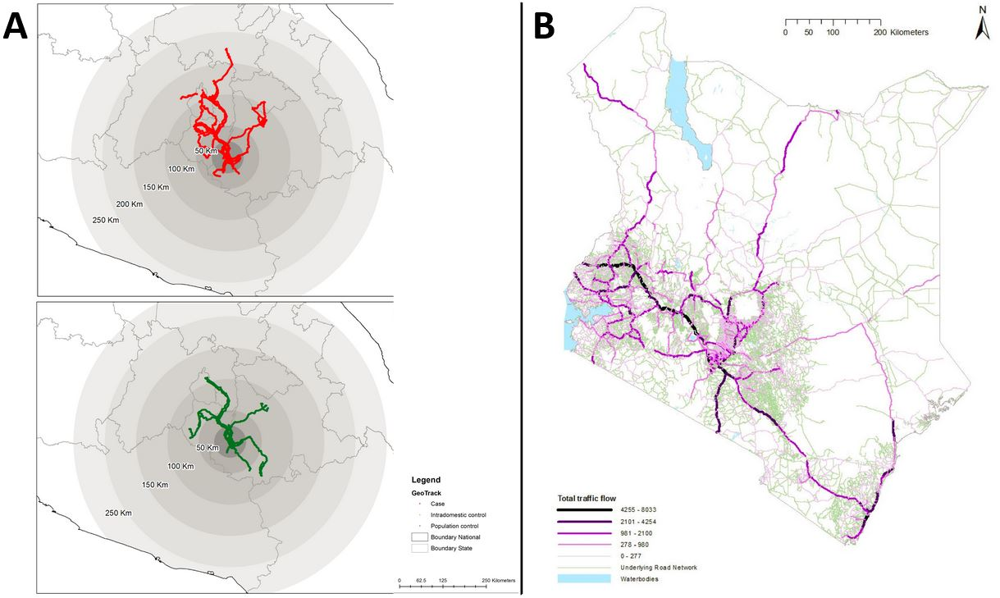
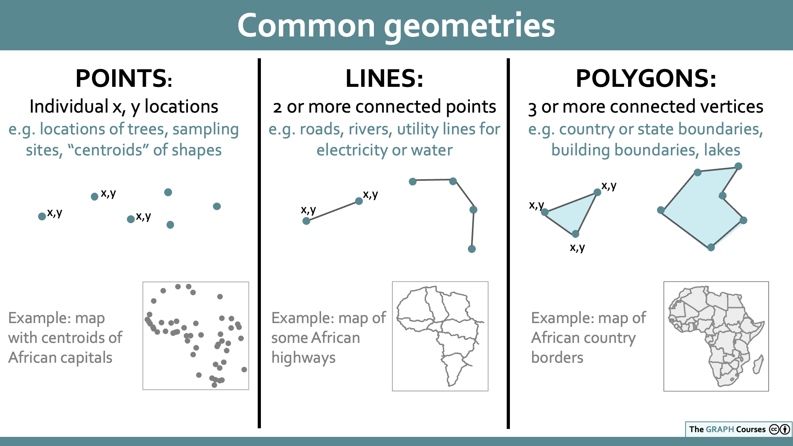
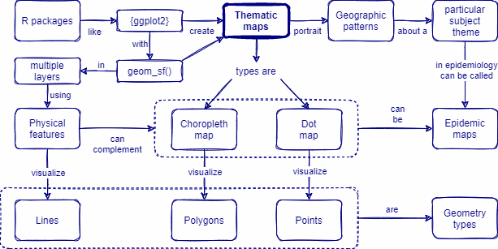

```{r, include = FALSE, warning = FALSE, message = FALSE}
# Load packages 
if(!require(pacman)) install.packages("pacman")
pacman::p_load(tidyverse, knitr, here)

# Source functions 
source(here("global/functions/misc_functions.R"))

# knitr settings
knitr::opts_chunk$set(warning = F, message = F, class.source = "tgc-code-block", error = T)

# Source autograder script quietly 
suppressMessages(source(here::here("lessons/ls03_physical_features_autograder.R")))
```

```{r,echo=FALSE}
ggplot2::theme_set(new = theme_bw())
options(scipen=10000)
```

# Physical features

## Introduction

Most times spatial data requires **geographic context** to locate events with environmental features like rivers or streets.



In this lesson, we are going to learn about how to add **Physical features** to our maps and plot them in *multiple layers* to complement Thematic maps!

## Learning objectives

1.  Create **Physical feature maps** to visualize roads or rivers.

2.  Complement **Thematic maps** with Physical features as background.

3.  Relate Physical features with a **Geometry** type.

## Prerequisites

This lesson requires the following packages:

```{r,eval=TRUE,echo=TRUE,message=FALSE}
if(!require('pacman')) install.packages('pacman')
pacman::p_load_gh("afrimapr/afrilearndata")
pacman::p_load(ggspatial,
               ggplot2,
               tibble,
               mdsr,
               terra,
               spData,
               sf)
```

This lesson requires familiarity with `{ggplot2}`: if you need to brush up, have a look at our introductory course on data visualization.

## Physical features

### What are they? {.unnumbered}

*Physical features* include roads, buildings and rivers.

### How to plot them? {.unnumbered}

A *Physical feature map* mostly use the `color` argument.

#### With Categorical data {.unlisted .unnumbered}

We can create a Physical feature map of the Road network in South America and `color` them according to their type:

```{r}
south_am_roads <- 
  read_rds(here("data/south_am_roads.rds"))

ggplot(data = south_am_roads) + 
  geom_sf(aes(color = type))
```

::: rstudio-cloud
Let's create a map of the Sacramento basin in California US (`sacramento_rivers`), colored by their feature type (`FTYPE`).

```{r,eval=FALSE}
ggplot(data = sacramento_rivers) + 
    geom_sf(aes(_____ = FTYPE), size = 1)
```

Data from here: <https://zenodo.org/record/4985219>
:::

#### With Quantitative data {.unlisted .unnumbered}

In Environmental Epidemiology, we can map numeric variables like the concentration of chemicals or pollutants in wastewater surveillance, or in Ecology, richness estimations from rivers.

Below is an example mapping a *classification* of rivers in the Sacramento basin in California US.

```{r}
sacramento_rivers <- 
  read_rds(here("data/sacramento_rivers.rds"))

ggplot(data = sacramento_rivers) + 
  geom_sf(aes(color = richness), size = 1)
```

"Richness" is the estimated number of fish species in each segment of the river.

::: rstudio-cloud
Create a Thematic map of the road network in South America, using the `south_am_roads` dataset, colored by the length in Km (`length_km`) of each road.

```{r,eval=FALSE}
ggplot(data = south_am_roads) + 
    ______(aes(______ = length_km), size = 1)
```
:::

### How to use it? {.unnumbered}

We can use *Trajectory data* and *Road network data* to evaluate the effects of human movement patterns in infectious disease transmission like [Dengue](https://journals.plos.org/plosone/article?id=10.1371/journal.pone.0172313) or [Malaria](https://malariajournal.biomedcentral.com/articles/10.1186/1475-2875-11-205).



Both of them are depicted in a map using **Lines**.

::: recap
Each **Thematic map** has its respective type of *Geometry*.

-   **"Geometry"** is essentially a synonym for *"Shape"*.
-   There are three main geometry types: *points*, *lines* and *polygons*.


:::

## Multiple layer maps

So far we have been plotting single geometries. But for most maps, you will need to provide additional context. This can be done by plotting multiple geometries.

We can complement Thematic maps with spatial *Physical features* like roads, buildings and rivers.

### How to plot them? {.unnumbered}

As an example, we will complement a Choropleth map with the population of African countries, from the `africountries`, with:

-   the African trans-continental highway network lines, available in the `afrihighway` dataset from the same package.

```{r,eval=TRUE}
ggplot() +
  geom_sf(data = africountries, mapping = aes(fill = pop_est)) +
  geom_sf(data = afrihighway)
```

Here, the physical feature `afrihighway` is **above** all the other layers.

But it can also be **below**. For example, we can complement a Dot map with the population in the capital cities of Africa, from the `africapitals` dataset, with the same layer:

```{r,eval=TRUE}
ggplot() +
  geom_sf(data = afrihighway) +
  geom_sf(data = africapitals, mapping = aes(size = pop, color = pop))
```

This is how you plot another map layer on top of another map.

::: recap
`{ggplot2}` allows to **overlap multiple layers (of maps)** from different data sources to complement Thematic maps.

For this, instead of a *global* specification of data, you need to use a **local** one:

``` r
# instead of:
ggplot(data = data_global) +
  geom_sf()

# we use:
ggplot() +
  geom_sf(data = data_local_layer_1) +
  geom_sf(data = data_local_layer_2)
```
:::

The *order* of the layers (below or above) will depend on the aim of the plot.

::: practice
Create a multiple layer Thematic map with:

-   the `world` dataset (from the `{spData}` package).

-   Then, overlap it with the African trans-continental highway network lines from the `afrihighway` dataset.

Use the `geom_sf()` function for each layer:

```{r,eval = FALSE}
q1 <- 
  ggplot() + 
    ________(data = ________) + 
    ________(data = ________)
q1
```

```{r,include = FALSE}
.check_q1()
.hint_q1()
```
:::

### How to use it? {.unnumbered}

In this example, we replicate John Snow's *Dot map* with the locations of deaths of the 1854 London cholera outbreak. We complemented this map with a *physical feature* like the *street roads* of the city: subfigure B is much more readable than subfigure A right?!


In Figure 3B, the *physical feature* is used as background, below the Dot map. This is why it looks much more readable.

## Wrap up

In this lesson, we have learned about how to represent *Physical features* and how to use them to *complement* Thematic maps in *multiple layers*.



However, most times spatial data requires *more explicit* Google Maps-like **geographic context**! For this you will need to learn how to add *Basemaps* for Google Maps-like backgrounds. Follow along with the lessons to find how to do this!

## Contributors {.unlisted .unnumbered}

The following team members contributed to this lesson:

`r tgc_contributors_list(ids = c("avallecam", "lolovanco", "kendavidn"))`

## References {.unlisted .unnumbered}

Some material in this lesson was adapted from the following sources:

-   *Batra, Neale, et al. (2021). The Epidemiologist R Handbook. Chapter 28: GIS Basics*. (2021). Retrieved 01 April 2022, from <https://epirhandbook.com/en/gis-basics.html>

-   *Lovelace, R., Nowosad, J., & Muenchow, J. Geocomputation with R. Chapter 2: Geographic data in R*. (2019). Retrieved 01 April 2022, from <https://geocompr.robinlovelace.net/spatial-class.html>

-   *Moraga, Paula. Geospatial Health Data: Modeling and Visualization with R-INLA and Shiny. Chapter 2: Spatial data and R packages for mapping*. (2019). Retrieved 01 April 2022, from <https://www.paulamoraga.com/book-geospatial/sec-spatialdataandCRS.html>

-   *Baumer, Benjamin S., Kaplan, Daniel T., and Horton, Nicholas J. Modern Data Science with R. Chapter 17: Working with geospatial data*. (2021). Retrieved 05 June 2022, from <https://mdsr-book.github.io/mdsr2e/ch-spatial.html>

`r tgc_license()`
