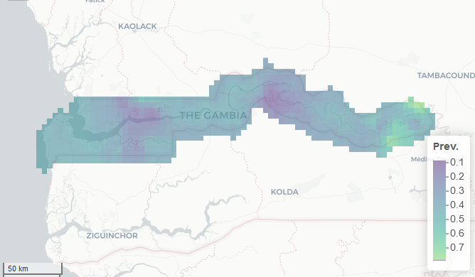
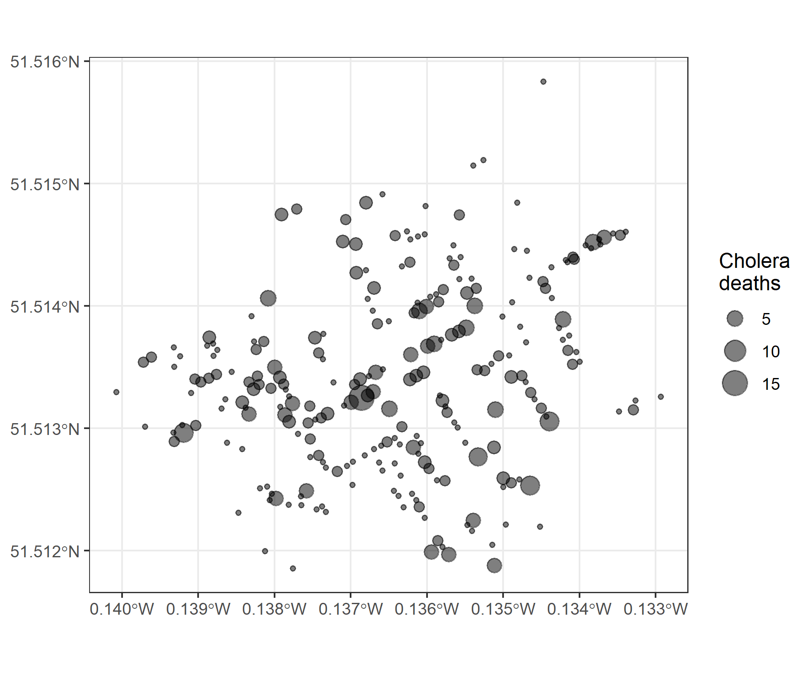

```{r, include = FALSE, warning = FALSE, message = FALSE}
# Load packages 
if(!require(pacman)) install.packages("pacman")
pacman::p_load(tidyverse, knitr, here)

# Source functions 
source(here("global/functions/misc_functions.R"))

# knitr settings
knitr::opts_chunk$set(warning = F, message = F, class.source = "tgc-code-block", error = T)

# Source autograder script quietly 
suppressMessages(source(here::here("lessons/ls04_density_map_autograder.R")))
```

```{r,echo=FALSE}
ggplot2::theme_set(new = theme_bw())
options(scipen=10000)
```

# Density Maps

## Introduction

Sometimes Dot maps can have **overlapped points** that difficult the visualization of more specific patterns. Additionally, most times spatial data requires *more explicit* Google Maps-like **geographic context**.


In this lesson, we are going to learn about how use *Density maps* to avoid overlaps in them, and how to add *Basemaps* for Google Maps-like backgrounds.

## Learning objectives

1.  Identify one more type of Thematic map (**Density maps**) used by epidemiologist to visualize *overlapping* Geospatial data.

2.  Complement *Thematic maps* with **Basemaps** for Google Maps-like backgrounds using the `annotation_map_tile()` function, from the `{ggspatial}` package.

## Prerequisites

This lesson requires the following packages:

```{r,eval=TRUE,echo=TRUE,message=FALSE}
if(!require('pacman')) install.packages('pacman')
pacman::p_load_gh("afrimapr/afrilearndata")
pacman::p_load_gh("avallecam/epihelper")
pacman::p_load(ggspatial,
               ggplot2,
               tibble,
               terra,
               dplyr,
               spData,
               sf)
```

This lesson requires familiarity with `{ggplot2}`: if you need to brush up, have a look at our introductory course on data visualization.

## Density map

### What is it? {.unnumbered}

A *Density map* is a type of Thematic map where colours are used to represent intensity of a value, however, it does not use defined regions or geopolitical boundaries to group data. This type of map is typically used for showing **'hot spots'** or areas with a high density or concentration of points.


### How to plot it? {.unnumbered}

As an example, we are going to use the `afriairports` dataset, from the `{afrilearndata}` package, that contains the locations of African airports.

With a Dot map we get *overlapping points* using the `geom_sf()` function, as in here:

```{r,eval=TRUE,echo=TRUE}
ggplot(data = afriairports) +
  geom_sf()
```

A *Density map* with `{ggplot2}` will require **four main steps**. Let's use the `afriairports` dataset as an example:

1.  First, use `epihelper::st_coordinates_tidy()` to *retrieve* the point coordinates.
2.  Then, use the `ggplot()` function to define the *new* coordinates column names `X` and `Y`,
3.  Use the `geom_bin_2d()` function to depict the *number of airports per area*,
4.  Lastly, use the `coord_sf()` function to *transform* the figure **X** and **Y** axis:
    -   fix their aspect ratio and
    -   add a coordinate reference system format (for instance, from 30°S to 40°N in the **Y** axis).

```{r,eval=TRUE,echo=TRUE}
afriairports %>% 
  
  # 👉 (1) extract coordinates
  st_coordinates_tidy() %>% 
  
  # 👉 (2) define new coordinates with ggplot() 
  ggplot(aes(x = X, y = Y)) +
  
  # 👉 (3) with a new geom function
  geom_bin_2d() +
  
  # 👉 (4) transform axis
  coord_sf()
```

::: rstudio-cloud
Create a Density map with the `pcrime` data read from the `pcrime.rds` local file.

```{r}
pcrime <- read_rds(here("data/pcrime.rds"))
```

```{r,eval=FALSE}
pcrime
```

Use the `geom_bin_2d()`, to portrait the number of crimes per area, faceted by the two types of crime in the column `marks`.

```{r,eval=FALSE}
pcrime %>% 
  st_coordinates_tidy() %>% 
  ggplot(aes(x = X,y = Y)) +
  ........() +
  coord_sf() +
  facet_wrap(~marks)
```
:::

### How to use it? {.unnumbered}

This type of Thematic map is best used with *Environmental data*, such as altitude, air pollution or rainfall data values measured at several monitoring stations.


Density maps are also used to visualize *spatially continuous disease prevalence surfaces*. For example, Moraga et al. (2019) used the prevalence values of malaria in children obtained from surveys conducted at 65 villages in The Gambia to predict the *disease prevalence* at *unobserved locations*, using a geostatistical model.



### What alternative plots do we have? {.unnumbered}

There are two `{ggplot2}` alternatives to plot Density maps:

In one hand, the `geom_density_2d_filled()` function creates a contoured density plot to identify clusters of `"count"` values:

```{r}
afriairports %>% 
  
  # (1) extract coordinates
  st_coordinates_tidy() %>% 
  
  # (2) start ggplot
  ggplot(aes(x = X, y = Y)) +
  
  # 👉 with an alternative geom function 👈
  geom_density_2d_filled(contour_var = "count") +
  
  # (4) transform axis
  coord_sf()
```

In the other hand, the `stat_density_2d()` allows to create a continuous surface of counted values from point data:

```{r}
afriairports %>% 
  
  # (1) extract coordinates
  st_coordinates_tidy() %>% 
  
  # (2) start ggplot
  ggplot(aes(x = X, y = Y)) +
  
  # 👉 with an alternative geom function 👈
  stat_density_2d(
    geom = "raster",
    mapping = aes(fill = after_stat(count)),
    contour = FALSE) + 
  scale_fill_viridis_c() +
  
  # (4) transform axis
  coord_sf()
```

::: rstudio-cloud
Use the `st_coordinates_tidy()` function to extract the X and Y coordinates from the `pcrime` dataset.

This will be useful to built a Density map with `geom_density_2d_filled()` and portrait the number of crimes per area, faceted by the two types of crime in the column `marks`.

```{r,eval=FALSE}
pcrime %>% 
  ........................ %>% 
  ggplot(aes(x = X,y = Y)) +
  geom_density_2d_filled() +
  coord_sf() +
  facet_wrap(~marks)
```
:::

## Basemaps

For all our previous maps, we only have partial context for what we are seeing. For a more integrative view, we may want to overlay our map over *Google Maps-like* physical features. These are called **Basemaps**.

### In a Dot map

For example, for our London cholera outbreak Dot map, we want to overlay it on the London street map---and this is exactly what `{ggspatial}` lets us do.



The `annotation_map_tile()` function adds a layer of **map tiles** pulled from [Open Street Map](https://www.openstreetmap.org/). We can control the `zoom` level. Here, we map the number of deaths at each location to the size of the dot.

```{r, results = "hide", warning = FALSE, message = FALSE}
cholera_deaths <- read_rds(here("data/cholera_deaths.rds"))

ggplot(data = cholera_deaths) + 
  
  # 👉 add a basemap 👈
  annotation_map_tile(zoomin = 0) + 
  
  # continue with ggplot
  geom_sf(mapping = aes(size = Count), alpha = 0.5)
```

::: rstudio-cloud
Add a Basemap to a Dot map using the `africapitals` object and the `annotation_map_tile()` function.

```{r,eval=FALSE,echo=TRUE}
ggplot(data = africapitals) +
  .......() + 
  geom_sf(mapping = aes(size = pop), alpha = 0.5)
```
:::

### In a Density map

Add a Basemap to a Density map using the `pcrime` object and the `annotation_map_tile()` function.

```{r}
pcrime %>% 
  
  # (1) extract coordinates
  st_coordinates_tidy() %>% 
  
  # (2) start ggplot
  ggplot(aes(x = X, y = Y)) +
  
  # 👉 add a basemap 👈
  annotation_map_tile(zoomin = 0) + 
  
  # (3) with a new geom function
  geom_bin_2d() +
  
  # (4) transform axis
  coord_sf() +
  
  # facet
  facet_wrap(~marks)
```

::: watch-out
-   The basemap must be bellow the `geom_*` function!
:::

::: rstudio-cloud
Use two functions, `annotation_map_tile()` and `geom_bin_2d()`, to add a Basemap to a Density map using the `afriairports` object.

```{r,eval=FALSE,echo=TRUE}
afriairports %>% 
  st_coordinates_tidy() %>% 
  ggplot(aes(x = X, y = Y)) +
  ...........() + 
  ...........() +
  coord_sf()
```
:::

## Wrap up

In this lesson, we have learned about one more type of Thematic map called *Density maps* to avoid overlapping spatial points. Also, how to add Google Maps-like backgrounds called *Basemaps*.

But, How can we create more *Thematic maps* from **external** Spatial data created by other GIS software? In the following lessons, we are going to learn how to **read external Spatial data** and *convert foreign* objects to *sf* files! Follow along with the lessons to find how to train these skills!

## Contributors {.unlisted .unnumbered}

The following team members contributed to this lesson:

`r tgc_contributors_list(ids = c("avallecam", "lolovanco"))`

## References {.unlisted .unnumbered}

Some material in this lesson was adapted from the following sources:

-   *Batra, Neale, et al. (2021). The Epidemiologist R Handbook. Chapter 28: GIS Basics*. (2021). Retrieved 01 April 2022, from <https://epirhandbook.com/en/gis-basics.html>

-   *Lovelace, R., Nowosad, J., & Muenchow, J. Geocomputation with R. Chapter 2: Geographic data in R*. (2019). Retrieved 01 April 2022, from <https://geocompr.robinlovelace.net/spatial-class.html>

-   *Moraga, Paula. Geospatial Health Data: Modeling and Visualization with R-INLA and Shiny. Chapter 2: Spatial data and R packages for mapping*. (2019). Retrieved 01 April 2022, from <https://www.paulamoraga.com/book-geospatial/sec-spatialdataandCRS.html>

-   *Baumer, Benjamin S., Kaplan, Daniel T., and Horton, Nicholas J. Modern Data Science with R. Chapter 17: Working with geospatial data*. (2021). Retrieved 05 June 2022, from <https://mdsr-book.github.io/mdsr2e/ch-spatial.html>

`r tgc_license()`
