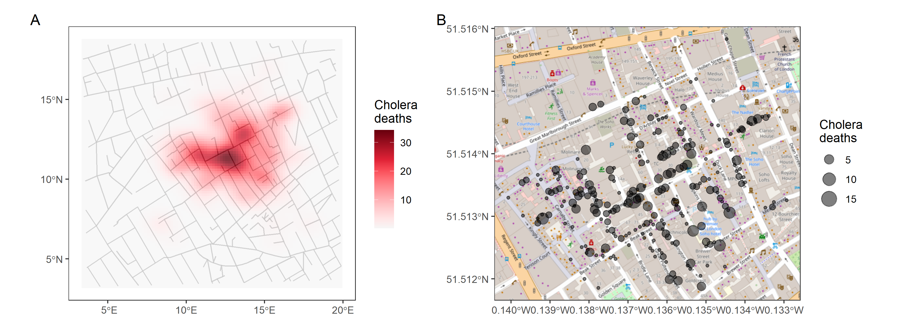
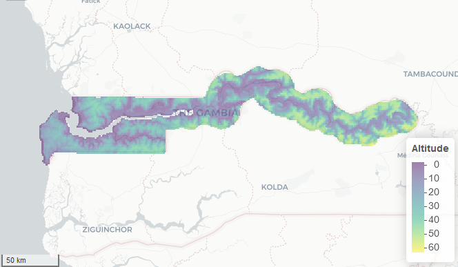

```{r, include = FALSE, warning = FALSE, message = FALSE}
# Load packages 
if(!require(pacman)) install.packages("pacman")
pacman::p_load(tidyverse, knitr, here)

# Source functions 
source(here("global/functions/misc_functions.R"))

# knitr settings
knitr::opts_chunk$set(warning = F, message = F, class.source = "tgc-code-block", error = T)
```

```{r,echo=FALSE}
ggplot2::theme_set(new = theme_bw())
options(scipen=10000)
```

------------------------------------------------------------------------

## Introduction

• Difficulty to visualize patterns.

• Dot maps can have **overlapped points.**

• Lines may not be explicit enough in providing *geographic context*.

{width="676"}

• Today, we are going to learn:

-   How to built *Density maps* to avoid overlaps, and

-   How to add *Basemaps* for Google Maps-like backgrounds.

------------------------------------------------------------------------

## Learning objectives

1.  Identify one more type of Thematic map (**Density maps**) used by epidemiologist to visualize *overlapping* Geospatial data.

2.  Complement *Thematic maps* with **Basemaps** for Google Maps-like backgrounds using the `annotation_map_tile()` function, from the `{ggspatial}` package.

------------------------------------------------------------------------

## Prerequisites

This lesson requires the following packages:

```{r,eval=TRUE,echo=TRUE,message=FALSE}
if(!require('pacman')) install.packages('pacman')
pacman::p_load_gh("afrimapr/afrilearndata")
pacman::p_load_gh("avallecam/epihelper")
pacman::p_load(ggspatial,
               ggplot2,
               tibble,
               terra,
               dplyr,
               spData,
               sf)
```

This lesson requires familiarity with `{ggplot2}`: if you need to brush up, have a look at our introductory course on data visualization.

------------------------------------------------------------------------

## Density map

### What is it? {.unnumbered}

• Thematic map where colours represent the *intensity* of a value,

• It does not use defined regions or geopolitical boundaries to group data.

• It shows **'hot spots'**, or

• Areas with a high *density* or *concentration* of points.


### How to plot it? {.unnumbered}

• Let's use `afriairports`, from `{afrilearndata}`,

• It contains the locations from African airports.

• With `geom_sf()` function we get *overlapping points*:

```{r,eval=TRUE,echo=TRUE}
ggplot(data = afriairports) +
  geom_sf()
```

• A *Density map* require four main steps:

1.  `epihelper::st_coordinates_tidy()` to *retrieve* the point coordinates.

```{=html}
<!-- -->
```
2.  `ggplot()` defining *new* coordinate column names `X` and `Y`,

```{=html}
<!-- -->
```
3.  `geom_bin_2d()` to depict the *number of airports per area*,

```{=html}
<!-- -->
```
4.  `coord_sf()` to *transform* axis aspect ratio and coordinate format.

```{r,eval=TRUE,echo=TRUE}
afriairports %>% 
  
  # 👉 (1) extract coordinates
   %>% 
  
  # 👉 (2) start ggplot
  ggplot() +
  
  # 👉 (3) with a new geom function
   +
  
  # 👉 (4) transform axis
  coord_sf()
```

::: rstudio-cloud
Create a Density map with the `pcrime` data read from the `pcrime.rds` local file.

```{r}
pcrime <- read_rds(here("basic_geospatial_viz/data/pcrime.rds"))
```

```{r,eval=FALSE}
pcrime
```

Use the `geom_bin_2d()`, to portrait the number of crimes per area, faceted by the two types of crime in the column `marks`.

```{r,eval=FALSE}
pcrime %>% 
  st_coordinates_tidy() %>% 
  ggplot(aes(x = X,y = Y)) +
  ........() +
  coord_sf() +
  facet_wrap(~marks)
```
:::

### How to use it? {.unnumbered}

• Used with *Environmental data*,

• Altitude, air pollution or rainfall data.

{width="556"}

• Used for *spatially continuous disease prevalence surfaces*.

• Moraga et al. (2019) for malaria in children at 65 villages in The Gambia

{width="557"}

• They used a geostatistical model to predict the *disease prevalence* at *unobserved locations*.

### What alternative plots do we have? {.unnumbered}

• Two `{ggplot2}` alternatives:

• Use `geom_density_2d_filled()` for a contoured density plot of `"count"` values:

```{r}
afriairports %>% 
  
  # (1) extract coordinates
  st_coordinates_tidy() %>% 
  
  # (2) start ggplot
  ggplot(aes(x = X, y = Y)) +
  
  # 👉 with an alternative geom function 👈
  (contour_var = "") +
  
  # (4) transform axis
  coord_sf()
```

• Use `stat_density_2d()` to create a continuous surface of `count` values:

```{r}
afriairports %>% 
  
  # (1) extract coordinates
  st_coordinates_tidy() %>% 
  
  # (2) start ggplot
  ggplot(aes(x = X, y = Y)) +
  
  # 👉 with an alternative geom function 👈
  stat_density_2d(
    geom = "raster",
    mapping = aes(fill = after_stat(count)),
    contour = FALSE) + 
  scale_fill_viridis_c() +
  
  # (4) transform axis
  coord_sf()
```

::: rstudio-cloud
Use the `st_coordinates_tidy()` function to extract the X and Y coordinates from the `pcrime` dataset.

This will be useful to built a Density map with `geom_density_2d_filled()` and portrait the number of crimes per area, faceted by the two types of crime in the column `marks`.

```{r,eval=FALSE}
pcrime %>% 
  ........................ %>% 
  ggplot(aes(x = X,y = Y)) +
  geom_density_2d_filled() +
  coord_sf() +
  facet_wrap(~marks)
```
:::

------------------------------------------------------------------------

## Basemaps

• With lines for *Physical features* we get partial geographical context.

• We can overlay our map over *Google Maps-like* background.

### In a Dot map

• Let's use the London cholera outbreak Dot map,

{width="416"}

• We can overlay it on the London street map.

• `{ggspatial}` lets us do it.

• Let's use `annotation_map_tile()` to add a layer of **map tiles** from [Open Street Map](https://www.openstreetmap.org/).

```{r, results = "hide", warning = FALSE, message = FALSE}
cholera_deaths <- 
  read_rds(here("basic_geospatial_viz/data/cholera_deaths.rds"))

ggplot(data = cholera_deaths) + 
  
  # 👉 add a basemap 👈
  (zoomin = 0) + 
  
  # continue with ggplot
  geom_sf(mapping = aes(size = Count), alpha = 0.5)
```

• Number of deaths per location using `size`.

::: rstudio-cloud
Add a Basemap to a Dot map using the `africapitals` object and the `annotation_map_tile()` function.

```{r,eval=FALSE,echo=TRUE}
ggplot(data = africapitals) +
  .......() + 
  geom_sf(mapping = aes(size = pop), alpha = 0.5)
```
:::

### In a Density map

• Let's use the `pcrime` object and the `annotation_map_tile()` function.

```{r}
pcrime %>% 
  
  # (1) extract coordinates
  st_coordinates_tidy() %>% 
  
  # (2) start ggplot
  ggplot(aes(x = X, y = Y)) +
  
  # 👉 add a basemap 👈
  (zoomin = 0) + 
  
  # (3) with a new geom function
  geom_bin_2d() +
  
  # (4) transform axis
  coord_sf() +
  
  # facet
  facet_wrap(~marks)
```

::: watch-out
• The basemap must be bellow the `geom_*` function!
:::

::: rstudio-cloud
Use two functions, `annotation_map_tile()` and `geom_bin_2d()`, to add a Basemap to a Density map using the `afriairports` object.

```{r,eval=FALSE,echo=TRUE}
afriairports %>% 
  st_coordinates_tidy() %>% 
  ggplot(aes(x = X, y = Y)) +
  ...........() + 
  ...........() +
  coord_sf()
```
:::

------------------------------------------------------------------------

## Wrap up

• We have learned about *Density maps* to avoid overlapping spatial points.

• How to add *Basemaps* for Google Maps-like backgrounds.


• But, How can we use data from **external** GIS software?

• Follow along with the lessons to find how to train these skills!

------------------------------------------------------------------------

## Contributors {.unlisted .unnumbered}

The following team members contributed to this lesson:

`r tgc_contributors_list(ids = c("avallecam", "lolovanco"))`

------------------------------------------------------------------------

## References {.unlisted .unnumbered}

Some material in this lesson was adapted from the following sources:

-   *Batra, Neale, et al. (2021). The Epidemiologist R Handbook. Chapter 28: GIS Basics*. (2021). Retrieved 01 April 2022, from <https://epirhandbook.com/en/gis-basics.html>

-   *Lovelace, R., Nowosad, J., & Muenchow, J. Geocomputation with R. Chapter 2: Geographic data in R*. (2019). Retrieved 01 April 2022, from <https://geocompr.robinlovelace.net/spatial-class.html>

-   *Moraga, Paula. Geospatial Health Data: Modeling and Visualization with R-INLA and Shiny. Chapter 2: Spatial data and R packages for mapping*. (2019). Retrieved 01 April 2022, from <https://www.paulamoraga.com/book-geospatial/sec-spatialdataandCRS.html>

-   *Baumer, Benjamin S., Kaplan, Daniel T., and Horton, Nicholas J. Modern Data Science with R. Chapter 17: Working with geospatial data*. (2021). Retrieved 05 June 2022, from <https://mdsr-book.github.io/mdsr2e/ch-spatial.html>

`r tgc_license()`
