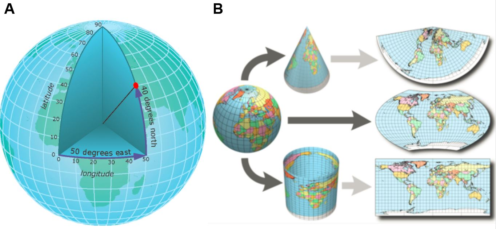

```{r, include = FALSE, warning = FALSE, message = FALSE}
# Load packages 
if(!require(pacman)) install.packages("pacman")
pacman::p_load(tidyverse, knitr, here)

# Source functions 
source(here("global/functions/misc_functions.R"))

# knitr settings
knitr::opts_chunk$set(warning = F, message = F, class.source = "tgc-code-block", error = T)

## autograders
suppressMessages(source(here::here("lessons/ls05_shapefile_data_autograder.R")))
```

```{r,echo=FALSE}
ggplot2::theme_set(new = theme_bw())
```

# Introduction

We can built different types of **Thematic maps** using the `{ggplot2}` package.


But, how can we create *more* Thematic maps from **external Spatial data** generated by *other* GIS software? Is there any *standard file format* to **store** and **share** Spatial data with my peers?


In this lesson we are going learn how to read and write **Shapefiles**, and also dive into the **`sf` objects** components!

# Learning objectives

1.  Read Spatial data from **Shapefiles** using the `read_sf()` function from the `{sf}` package.

2.  Identify the components of **`sf` objects**.

3.  Identify the components of **Shapefiles**.

4.  Write Spatial data in **Shapefiles** using `write_sf()`.

# Prerequisites

This lesson requires the following packages:

```{r,eval=TRUE,echo=TRUE,message=FALSE}
if(!require('pacman')) install.packages('pacman')

pacman::p_load(rnaturalearth,
               ggplot2,
               cholera,
               here,
               sf, 
               rgeoboundaries)

pacman::p_load_gh("afrimapr/afrilearndata")
```

# Shapefiles

**Shapefiles** are the most common data format for *storing* Spatial data.

## How to read Shapefiles?

We can **read** Spatial data from **local files** with a `.shp` extension, as a ready-to-use **`sf` object**.

Let's read the `sle_adm3.shp` file, available inside the `data/boundaries/` folder, in two steps:

1.  Identify the **file path** up to the `.shp` filename, *relative to* the working directory of the R project:

``` r
"data/boundaries/sle_adm3.shp"
```

2.  Then, use `sf::read_sf()` to paste that *path* within `here()` as follows:

```{r}
shape_file <- read_sf(here("data/boundaries/sle_adm3.shp"))
```

::: r-practice
Check that the output is an `sf` object and can be plotted using `geom_sf()`:

```{r,eval=FALSE}
shape_file %>% class()

ggplot(data = shape_file) +
  geom_sf()
```
:::

::: practice
Read the shapefile called `sle_hf.shp` inside the `data/healthsites/` folder. Use the `read_sf()` function:

```{r,eval = FALSE}
q1 <- ________(here("________"))
q1
```

```{r,include=FALSE}
.check_q1()
.hint_q1()
```
:::

Wait! *Shapefiles* have an interesting feature, they do not come alone! They came with a list of sub-component files. Let's check at the files in the `data/boundaries/` folder:

```{r,eval=TRUE,echo=FALSE}
list.files(path = here("data/boundaries"),
           full.names = FALSE) %>% 
  tibble::enframe(name = NULL)
```

How are these files *related* with the **`sf` object**?

So far we've been passing these `sf` objects into `{ggplot2}` without thinking about their underlying structure. Let's now look under the hood to understand `sf` objects better.

## Understanding `sf` objects

First of all, what does the acronym "sf" mean? It stands for [Simple Features](https://en.wikipedia.org/wiki/Simple_Features), which is a set of widely-used *standards for storing geospatial information in databases*. The details of these standards are beyond the scope of this course; just know that the {sf} R package was written to bring spatial data analysis in R closer towards these Simple Features standards.

Now, what do `sf` objects look like and how do we work with them? To answer this, we'll look at a slice of the `countries` object:

```{r}
countries <- ne_countries(returnclass = "sf")
```

Since this `sf` object is a special kind of **data frame**, we can manipulate it with standard functions from the `{tidyverse}` like `dplyr::select()`. So let's select just three columns to make the object easier to observe:

```{r}
countries %>% 
  dplyr::select(name,    # country name
         pop_est) # estimated population
```

What do we see? The object consists of a 5-line **header** and a **data frame**.

## The `sf` header 

The *header* provides some contextualizing information about the rest of the object. You usually don't need to pay too much attention to this header, but we will go through it in some detail.

Let's go line-by-line through *the most relevant sections* of this header to see what these terms mean:

## Features and Fields

The first line of the header tells you the number of **features** and **fields** in the `sf` object:

```         
👉 Simple feature collection with 177 features and 2 fields 👈
   Geometry type: MULTIPOLYGON
   Dimension: XY
   Bounding box: xmin: -180 ymin: -90 xmax: 180 ymax: 83.64513
   Geodetic CRS: +proj=longlat +datum=WGS84
```

**Features** are simply the geographical objects represented by each *row* of the data frame. In our `countries` dataset, each country has its own row; therefore each country is a feature.

And what are **Fields**? These are the **Attributes** that pertain to each feature in the data. In our `countries` dataset, the fields include `"name"`, the name of each country, and `"pop_est"`, its estimated population. *Fields* are essentially equivalent to *columns* in the data frame, although the "geometry" column does not count as a field.

{width="624"}

::: practice
The `spData::nz` dataset contains mapping information for the regions of New Zealand. How many features and fields does the dataset have?

```{r eval = FALSE}
# Delete the wrong lines and run the correct line:
q_nz_features_fields <- "A. 16 features and 6 fields"
q_nz_features_fields <- "B. 10 features and 6 fields"
q_nz_features_fields <- "C. 5 features and 4 fields"
```

```{r eval = FALSE, include = FALSE}
# Check your answer:
.check_q_nz_features_fields()
.hint_q_nz_features_fields()
```
:::

## Geometry 

The second line of the header gives you the type of geometry in the `sf` object:

```         
   Simple feature collection with 177 features and 2 fields
👉 Geometry type: MULTIPOLYGON 👈
   Dimension: XY
   Bounding box: xmin: -180 ymin: -90 xmax: 180 ymax: 83.64513
   Geodetic CRS: +proj=longlat +datum=WGS84
```

**Geometry** is essentially a synonym for *"shape"*. There are three main geometry types: points, lines and polygons. Each of these has its respective "multi" version: multipoints, multilines and multipolygons.

The figure below outlines these main types of geometries.


::: practice
The `ne_download()` function from {rnaturalearth} can be used to obtain a map of major world roads, using the code below:

```{r eval = F, message = F}
roads <- 
  ne_download(scale = 10, 
              category = "physical",
              type = "geographic_lines", 
              returnclass = "sf") 
```

◘ What type of geometry is used to represent the rivers?

```{r eval = FALSE}
# Delete the wrong lines and run the correct line:
q_rivers_geom_type <- "MULTILINESTRING"
q_rivers_geom_type <- "MULTIPOLYGON"
q_rivers_geom_type <- "MULTIPOINT"
```

```{r eval = FALSE, include = FALSE}
# Check your answer:
.check_q_rivers_geom_type()
.hint_q_rivers_geom_type()
```
:::

::: side-note
Each **individual `sf` object** can only contain *one geometry type* (all points, all lines or all polygons). You will not find a mixture of point, line and polygon objects in a single `sf` object.
:::

::: key-point
**It is related with the `geometry` column of the `sf` dataframe**

-   The `geometry` column is the most special property of the `sf` data frame.
-   It holds the *core* geospatial data (points, linestrings or polygons).

``` r
👉 Geometry type: MULTIPOLYGON 👈

   First 10 features:
                                    👇👇👇👇👇👇👇👇👇👇👇👇👇👇👇👇
                       name  pop_est                       geometry
   0            Afghanistan 28400000 MULTIPOLYGON (((61.21082 35...
   1                 Angola 12799293 MULTIPOLYGON (((16.32653 -5...
   2                Albania  3639453 MULTIPOLYGON (((20.59025 41...
   3   United Arab Emirates  4798491 MULTIPOLYGON (((51.57952 24...
   4              Argentina 40913584 MULTIPOLYGON (((-65.5 -55.2...
   5                Armenia  2967004 MULTIPOLYGON (((43.58275 41...
   6             Antarctica     3802 MULTIPOLYGON (((-59.57209 -...
   7 Fr. S. Antarctic Lands      140 MULTIPOLYGON (((68.935 -48....
   8              Australia 21262641 MULTIPOLYGON (((145.398 -40...
   9                Austria  8210281 MULTIPOLYGON (((16.97967 48...
```

Some noteworthy points about this column:

-   The `geometry` column can't be dropped,
-   `geom_sf()` automatically recognizes the geometry column.
:::

## Geodetic CRS 

The final header line tells us what Coordinate Reference System used.

```         
   Simple feature collection with 177 features and 2 fields
   Geometry type: MULTIPOLYGON
   Dimension: XY
   Bounding box: xmin: -180 ymin: -90 xmax: 180 ymax: 83.64513
👉 Geodetic CRS: +proj=longlat +datum=WGS84 👈
```

**Coordinate Reference System (CRS)** relate the spatial elements of the data with the *surface of Earth*.



For now, it is sufficient to know that coordinate systems are a *key component* of geographic objects. **We will cover them in detail later!**

# Delving into Shapefiles

A **single shapefile** is actually a *collection* of at least three files - `.shp`, `.shx`, and `.dbf`.

Each of these files are *related* with elements of the **`sf` header**.


As an example, this is a list with the sub-component files of a *Shapefile* called `sle_adm3.shp`. All of them are located in **the same** `data/boundaries/` folder:

```{r,eval=TRUE,echo=FALSE}
list.files(path = here("data/boundaries"),
           full.names = FALSE) %>% 
  tibble::enframe(name = NULL)
```

What is the content inside each file associated with one shapefile?

-   **`.shp`**: contains the **Geometry** data,
-   `.dbf`: stores the **Attributes (Fields)** for each shape.
-   `.shx`: is a *positional index* that **links** each Geometry with its Attributes,
-   `.prj`: plain text file describing the **CRS**, including the Map **Projection**, <!-- -   `.sbn` and `.sbx`: *spatial index* of the geometry data, --> <!-- -   `.shp.xml`: geospatial *metadata* in XML format. -->

These *associated files* can be compressed into a ZIP folder to be sent via email or download from a website.

::: watch-out
All of these *sub-component files* must be present in a given directory (folder) for the shapefile to be readable.
:::

::: practice
Which of the following options of *component files of Shapefiles*:

a.  `"shp"`
b.  `"shx"`
c.  `"dbf"`

contains the *Geometry* data?

```{r,include=FALSE}
# unlock your answer:
# q4 <- "shp"
# q4 <- "shx"
# q4 <- "dbf"

.check_q4()
.hint_q4()
```

stores the *Attributes* for each shape?

```{r,include=FALSE}
# unlock your answer:
# q5 <- "shp"
# q5 <- "shx"
# q5 <- "dbf"

.check_q5()
.hint_q5()
```
:::

## How to write Shapefiles? 

Let's write the `countries` object to an `countries.shp` file, located inside the `data/newshapefile/` folder, in two steps:

1.  Define the **file path** up to the `.shp` filename, *relative to* the working directory of the R project:

``` r
"data/newshapefile/countries.shp"
```

2.  Then, use `sf::write_sf()` to paste that *path* within `here()` as follows:

```{r,warning=FALSE}
pacman::p_load(sf)
countries %>% write_sf(here("data/newshapefile/countries.shp"))
```

As a result, now we have *all the components* of a **`sf` object** in *four new files* that belong to one **Shapefile**:

```{r,eval=TRUE,echo=FALSE}
list.files(path = here("data/newshapefile"),
           full.names = FALSE) %>% 
  tibble::enframe(name = NULL)
```


# Wrap up

In this lesson, we have learned to **read** and **write** *Shapefiles* using the *`{sf}`* package, identify the **components** of an *`sf` object*, and their relation with the files within a *Shapefile*.

In the next lesson we are going dive into **CRS**'s. We are going to learn how to manage the CRS of maps by **zooming in** to an area of interest, **set them up** to external data with coordinates different to longitude and latitude, and **transform** between different coordinate systems!

## Contributors {.unlisted .unnumbered}

The following team members contributed to this lesson:

`r tgc_contributors_list(ids = c("avallecam", "lolovanco", "kendavidn"))`

## References {.unlisted .unnumbered}

Some material in this lesson was adapted from the following sources:

-   *Seimon, Dilinie. Administrative Boundaries.* (2021). Retrieved 15 April 2022, from <https://rspatialdata.github.io/admin_boundaries.html>

-   *Varsha Ujjinni Vijay Kumar. Malaria.* (2021). Retrieved 15 April 2022, from <https://rspatialdata.github.io/malaria.html>

-   *Batra, Neale, et al. The Epidemiologist R Handbook. Chapter 28: GIS Basics*. (2021). Retrieved 01 April 2022, from <https://epirhandbook.com/en/gis-basics.html>

-   *Lovelace, R., Nowosad, J., & Muenchow, J. Geocomputation with R. Chapter 2: Geographic data in R*. (2019). Retrieved 01 April 2022, from <https://geocompr.robinlovelace.net/spatial-class.html>

-   *Moraga, Paula. Geospatial Health Data: Modeling and Visualization with R-INLA and Shiny. Chapter 2: Spatial data and R packages for mapping*. (2019). Retrieved 01 April 2022, from <https://www.paulamoraga.com/book-geospatial/sec-spatialdataandCRS.html>

`r tgc_license()`
