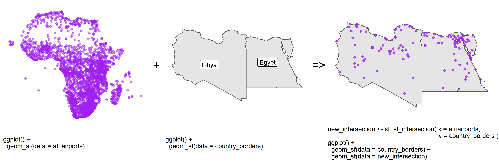
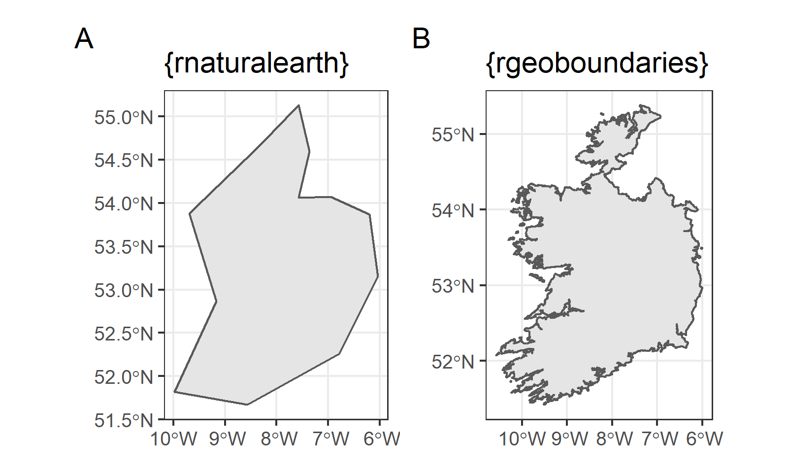

```{r, include = FALSE, warning = FALSE, message = FALSE}
# Load packages 
if(!require(pacman)) install.packages("pacman")
pacman::p_load(tidyverse, knitr, here)

# Source functions 
source(here("global/functions/misc_functions.R"))

# knitr settings
knitr::opts_chunk$set(warning = F, message = F, class.source = "tgc-code-block", error = T)

## autograders
suppressMessages(source(here::here("lessons/ls07_boundary_data_autograder.R")))
```

```{r,echo=FALSE}
ggplot2::theme_set(new = theme_bw())
```

# Introduction

Country **borders** or **boundaries** can have several usages. For example, they can be used as background in Thematic maps or as delimiters of other Spatial data to ease the identification of spread patterns.

An example of the former is shown in Figure 1, where we retrieve the intersection between two spatial objects: points within polygons.



However, the access to this type of data can have **different outputs**, for example, the *low* or *high* resolution of continent and country borders, or the *availability* of certain administrative levels. The choice of these outputs will depend of your needs!

In this lesson we are going to learn how to access continent, country and administrative level borders using `{rnaturalearth}`, `{rgeoboundaries}`, and `{geodata}` packages.

# Learning objectives

1.  Access to *low* resolution continent and country borders with `{rnaturalearth}`

2.  Access to *high* resolution country and administrative level borders with `{rgeoboundaries}`

# Prerequisites

This lesson requires the following packages:

```{r,eval=TRUE,echo=TRUE,message=FALSE}
if(!require('pacman')) install.packages('pacman')

pacman::p_load(rnaturalearth,
               malariaAtlas,
               ggplot2,
               cholera,
               geodata,
               here,
               sf, 
               rgeoboundaries)

pacman::p_load_gh("afrimapr/afrilearndata")
```

# Mapping country borders with `{rnaturalearth}`

As an introduction to plotting boundaries in R, let's look at how to draw a simple world map with country borders. The package `{rnaturalearth}` contains information to map all the countries in the world, among other things.

To obtain this map information, use the `ne_countries()` function, with the argument `returnclass = "sf"`.

```{r}
countries <- ne_countries(returnclass = "sf")
```

The code returns an `sf` object with the shapes for all countries.

Now, the `countries` object can be plotted very easily with the `geom_sf()` function of `{ggplot2}`:

```{r}
ggplot(data = countries) + 
  geom_sf()
```

Wonderful! (Almost too easy!)

## A single continent

To subset to a **specific continent**, use the `continent` argument of `ne_countries()`:

```{r}
# Countries in South America
south_am <- ne_countries(returnclass = "sf", 
                         continent = "south america") # 👈👈👈👈

ggplot(data = south_am) + 
  geom_sf()
```

The `continent` argument can accept a vector with multiple continents:

```{r}
# Countries in north and south america
north_south_am <- 
  ne_countries(returnclass = "sf", 
               continent = c("north america", "south america"))

ggplot(data = north_south_am) +
  geom_sf()
```

::: rstudio-cloud
◘ Use `ne_countries()`, `ggplot()` and `geom_sf()` to plot a single map of all the countries in the Asia and Africa continent

```{r eval = FALSE}
asia_africa <- 
  .........(returnclass = "sf", 
            ......... = c(".........", "........."))

ggplot(data = asia_africa) +
  geom_sf()
```
:::

## Multiple countries 

To subset to a **specific country** or specific countries, use the `country` argument:

```{r}
# Map of Nigeria and Niger
nigeria_niger <- ne_countries(returnclass = "sf", 
                              country = c("nigeria", "niger"))

ggplot(data = nigeria_niger) +
  geom_sf()
```

::: rstudio-cloud
◘ Use `ne_countries()`, `ggplot()` and `geom_sf()` to plot a single map of the national borders of China and Indonesia

```{r eval=FALSE}
china_indonesia <- 
  .........(returnclass = "sf", 
            ......... = c(".........", "........."))

ggplot(data = china_indonesia) +
  geom_sf()
```
:::

# Mapping country borders with `{rgeoboundaries}`

`{rnaturalearth}` is useful for accessing continents and country borders that do not need much boundary resolution. `{rgeoboundaries}` is an alternative package that provides access to high resolution country boundaries.



The [`{rgeoboundaries}`](https://github.com/wmgeolab/rgeoboundaries) package is a client for the [geoBoundaries API](https://www.geoboundaries.org/), providing country political administrative boundaries.

## A single country 

To download boundaries of countries we use the `geoboundaries()` function of `{rgeoboundaries}`. For example, we can download the administrative boundary of Zimbabwe and assign it to a variable called `zimbabwe_boundary` as follows.

```{r,eval=FALSE,echo=TRUE}
zimbabwe_boundary <- geoboundaries(country = "Zimbabwe")
```

::: key-point
-   The `zimbabwe_boundary` is a `"sf"` class object.

```{r,eval=FALSE,echo=FALSE,message=FALSE}
class(zimbabwe_boundary)
```

-   `{ggplot2}` allows us to easily visualise **simple feature** objects using the `geom_sf()` function.

-   It can be used to plot the administrative boundary of Zimbabwe as follows:

```{r, eval=FALSE}
ggplot(data = zimbabwe_boundary) +
  geom_sf()
```
:::

::: practice
Download the boundaries of `Sierra Leone` using the `geoboundaries()` function.

```{r,eval = FALSE}
q1 <- ________(________ = "Sierra Leone")
q1
```

```{r,include = FALSE}
.check_q1()
.hint_q1()
```
:::

## Different administrative levels 

If available, lower levels of administrative boundaries in countries can be downloaded too. We just have to pass the administrative level as an argument in the `geoboundaries()` function.

Administrative **level 1** (`1`) is the highest level, while administrative **level 5** (`5`) is the lowest. This means the country will be further sub-divided into administrative divisions as the Administrative level progresses from 1 to 5.

See how the first and second administrative level boundaries of Zimbabwe are downloaded below.

```{r,fig.height=3}
# downloading administrative level 1 boundaries
zimbabwe_boundaries_adm1 <- geoboundaries(country = "Zimbabwe",
                                         adm_lvl = 1)

ggplot(data = zimbabwe_boundaries_adm1) +
  geom_sf()
```

```{r,fig.height=3}
# downloading administrative level 2 boundaries
zimbabwe_boundaries_adm2 <- geoboundaries(country = "Zimbabwe",
                                         adm_lvl = 2)

ggplot(data = zimbabwe_boundaries_adm2) +
  geom_sf()
```

::: practice
Download the `third` administrative level boundaries of `Sierra Leone`, using the `geoboundaries()` function.

```{r,eval = FALSE}
q2 <- geoboundaries(country = "Sierra Leone", ________ = ________)
q2
```

```{r,include = FALSE}
.check_q2()
.hint_q2()
```
:::

::: pro-tip
We can also download the boundaries of **multiple countries** together by including the names of countries as a `vector` class object like: `c("country_01","country_02")`.

See how the `second` administrative level boundaries of adjacent countries like `Zimbabwe` and `Mozambique` are downloaded and plotted below.

```{r, eval=FALSE}
zimbabwe_mozambique_adm2 <- 
  geoboundaries(country = c("Zimbabwe", "Mozambique"),
                adm_lvl = 2)
```

```{r,eval=FALSE}
ggplot(data = zimbabwe_mozambique_adm2) +
  geom_sf()
```
:::

# Wrap up

In this lesson, we have learned how to **access** *low* and *high* resolution continent, country and multiple administrative level borders using `{rnaturalearth}` and `{rgeoboundaries}`.

# Contributors {.unlisted .unnumbered}

The following team members contributed to this lesson:

`r tgc_contributors_list(ids = c("avallecam", "lolovanco", "kendavidn"))`

# References {.unlisted .unnumbered}

Some material in this lesson was adapted from the following sources:

-   *Seimon, Dilinie. Administrative Boundaries.* (2021). Retrieved 15 April 2022, from <https://rspatialdata.github.io/admin_boundaries.html>

-   *Varsha Ujjinni Vijay Kumar. Malaria.* (2021). Retrieved 15 April 2022, from <https://rspatialdata.github.io/malaria.html>

-   *Batra, Neale, et al. The Epidemiologist R Handbook. Chapter 28: GIS Basics*. (2021). Retrieved 01 April 2022, from <https://epirhandbook.com/en/gis-basics.html>

-   *Lovelace, R., Nowosad, J., & Muenchow, J. Geocomputation with R. Chapter 2: Geographic data in R*. (2019). Retrieved 01 April 2022, from <https://geocompr.robinlovelace.net/spatial-class.html>

-   *Moraga, Paula. Geospatial Health Data: Modeling and Visualization with R-INLA and Shiny. Chapter 2: Spatial data and R packages for mapping*. (2019). Retrieved 01 April 2022, from <https://www.paulamoraga.com/book-geospatial/sec-spatialdataandCRS.html>

`r tgc_license()`
