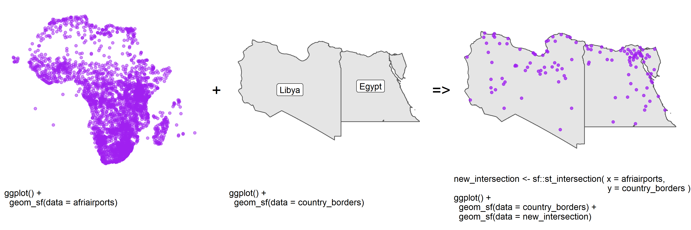
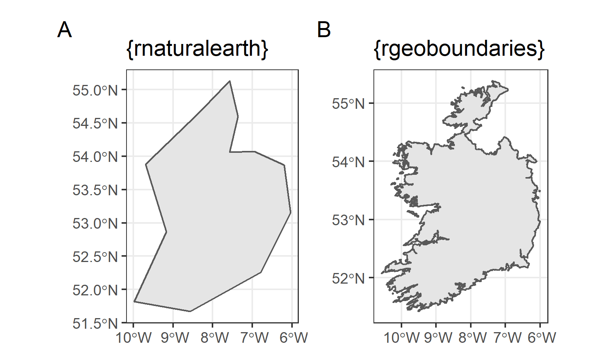
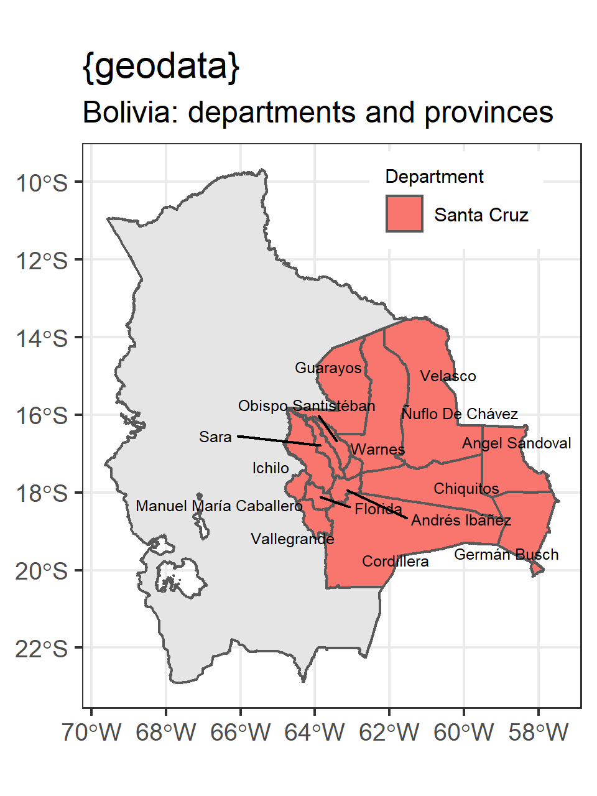

```{r, include = FALSE, warning = FALSE, message = FALSE}
# Load packages 
if(!require(pacman)) install.packages("pacman")
pacman::p_load(tidyverse, knitr, here)

# Source functions 
source(here("global/functions/misc_functions.R"))

# knitr settings
knitr::opts_chunk$set(warning = F, message = F, class.source = "tgc-code-block", error = T)
```

```{r,echo=FALSE}
ggplot2::theme_set(new = theme_bw())
```

------------------------------------------------------------------------

## Introduction

Country **borders** or **boundaries** can have several usages. For example, they can be used as background in Thematic maps or as delimiters of other Spatial data to ease the identification of spread patterns.

An example of the former is shown in Figure 1, where we retrieve the intersection between two spatial objects: points within polygons.



However, the access to this type of data can have **different outputs**, for example, the *low* or *high* resolution of continent and country borders, or the *availability* of certain administrative levels. The choice of these outputs will depend of your needs!

In this lesson we are going to learn how to access continent, country and administrative level borders using `{rnaturalearth}`, `{rgeoboundaries}`, and `{geodata}` packages.

------------------------------------------------------------------------

## Learning objectives

1.  Access to *low* resolution continent and country borders with `{rnaturalearth}`

2.  Access to *high* resolution country and administrative level borders with `{rgeoboundaries}`

3.  Access to *multiple* administrative level borders with `{geodata}`

------------------------------------------------------------------------

## Prerequisites

This lesson requires the following packages:

```{r,eval=TRUE,echo=TRUE,message=FALSE}
if(!require('pacman')) install.packages('pacman')

pacman::p_load(rnaturalearth,
               malariaAtlas,
               ggplot2,
               cholera,
               geodata,
               here,
               sf)

pacman::p_load_gh("afrimapr/afrilearndata",
                  "wmgeolab/rgeoboundaries")
```

------------------------------------------------------------------------

## Mapping country borders with `{rnaturalearth}`

• Let's draw a world map with country borders.

• `{rnaturalearth}` can map all the countries in the world, among others.

• Use `ne_countries()` with the `returnclass = "sf"` argument.

```{r}
countries <- 
```

• It returns an `sf` object!

• So, `countries` can be plotted with `geom_sf()`:

```{r}

```

• Wonderful!

### A single continent {.unnumbered}

• Let's subset the `"south america"` **continent**,

• Use the `continent` argument of `ne_countries()`:

```{r}
# Countries in South America
south_am <- ne_countries(returnclass = "sf") # 👈👈👈👈

ggplot(data = south_am) + 
  geom_sf()
```

• `continent` can accept **multiple** continents

• Let's try `"north america"` and `"south america"`:

```{r}
# Countries in north and south america
north_south_am <- ne_countries(returnclass = "sf") # 👈👈👈👈

ggplot(data = north_south_am) +
  geom_sf()
```

::: rstudio-cloud
◘ Use `ne_countries()`, `ggplot()` and `geom_sf()` to plot a single map of all the countries in the Asia and Africa continent

```{r eval = FALSE}
q_asia_africa <- 
  .........(returnclass = "sf", 
            ......... = c(".........", "........."))

ggplot(data = asia_africa) +
  geom_sf()
```
:::

### Multiple countries {.unnumbered}

• Subset **one** or **multiple** countries,

• e.g. `"nigeria"` and `"niger"`

• Use the `country` argument:

```{r}
# Map of Nigeria and Niger
nigeria_niger <- ne_countries(returnclass = "sf")

ggplot(data = nigeria_niger) +
  geom_sf()
```

::: rstudio-cloud
◘ Use `ne_countries()`, `ggplot()` and `geom_sf()` to plot a single map of the national borders of China and Indonesia

```{r eval=FALSE}
china_indonesia <- 
  .........(returnclass = "sf", 
            ......... = c(".........", "........."))

ggplot(data = china_indonesia) +
  geom_sf()
```
:::

------------------------------------------------------------------------

## Mapping country borders with `{rgeoboundaries}`

• `{rnaturalearth}` access borders that *do not need too much* boundaries resolution.

• `{rgeoboundaries}` access to the *high* resolution country boundaries.

{width="548"}

• [`{rgeoboundaries}`](https://github.com/wmgeolab/rgeoboundaries) is a client for the [geoBoundaries API](https://www.geoboundaries.org/),

• It provides country political administrative boundaries.

### A single country {.unnumbered}

• Use `geoboundaries()` to download the administrative boundary of `"Zimbabwe"`.

```{r,eval=FALSE,echo=TRUE}
zimbabwe_boundary <- 
```

::: key-point
• `zimbabwe_boundary` is a `"sf"` class object.

```{r,eval=FALSE,echo=FALSE,message=FALSE}

```

• So, `zimbabwe_boundary` can be plotted with `geom_sf()`:

```{r, eval=FALSE}
ggplot(data = zimbabwe_boundary) +
  geom_sf()
```
:::

::: practice
Download the boundaries of `Sierra Leone` using the `geoboundaries()` function.

```{r,eval = FALSE}
q1 <- ________(________ = "Sierra Leone")
q1
```

```{r,include = FALSE}
.check_q1()
.hint_q1()
```
:::

### Different administrative levels {.unnumbered}

• If available, we can also download lower levels of administrative boundaries.

• Let's pass the administrative level to `geoboundaries()`.

• Administrative **level 1** (`1`) is the highest level,

• Administrative **level 5** (`5`) is the lowest.

• Let's get the **first** (`1`) administrative level boundaries of `"Zimbabwe"`:

```{r,fig.height=3}
zimbabwe_boundaries_adm1 <- 

ggplot(data = zimbabwe_boundaries_adm1) +
  geom_sf()
```

• Let's get the **second** (`2`) administrative level boundaries of Zimbabwe:

```{r,fig.height=3}
zimbabwe_boundaries_adm2 <- 

ggplot(data = zimbabwe_boundaries_adm2) +
  geom_sf()
```

• Countries could be further sub-divided into administrative divisions from `1` to `5`.

::: practice
Download the `third` administrative level boundaries of `Sierra Leone`, using the `geoboundaries()` function.

```{r,eval = FALSE}
q2 <- geoboundaries(country = "Sierra Leone", ________ = ________)
q2
```

```{r,include = FALSE}
.check_q2()
.hint_q2()
```
:::

::: pro-tip
• Let's download boundaries of **multiple countries** together

• Include their names as a `vector`: `c("country_01","country_02")`.

• `second` administrative level boundaries of adjacent countries: `Zimbabwe` and `Mozambique`

```{r, eval=FALSE}
zimbabwe_mozambique_adm2 <- 
  geoboundaries(country = )
```

```{r,eval=FALSE}
ggplot(data = zimbabwe_mozambique_adm2) +
  geom_sf()
```
:::

------------------------------------------------------------------------

## Mapping country borders with `{geodata}`

• One limitation for `{rgeoboundaries}`

• One column with names of all borders in that level:

```{r}
geoboundaries(country = "Bolivia", adm_lvl = 3) %>% 
  
  as_tibble() %>% 
  select(contains("name"))
```

• `gadm()` from `{geodata}` provides the name of all the levels above the one requested:

```{r,message=FALSE,warning=FALSE}
 %>% 
  
  as_tibble() %>% 
  select(starts_with("NAME_"))
```

::: rstudio-cloud
Use `gadm()` to download the `third` administrative level boundaries of `Sierra Leone`.

```{r,eval = FALSE}
q_geodata <- ________(country = "Sierra Leone", 
                      _______ = ________,
                      path = tempdir())
q_geodata
```
:::

• **Multiple column output**

• Useful to `filter()` sub-divisions (level 3) from a specific region (level 1) of department (level 2).

• Let's filter the *municipalities* (level 3) from the *department* (level 1) called `Santa Cruz`, in Bolivia:

```{r}
gadm(country = "Bolivia", level = 3, path = tempdir()) %>% 
  
  as_tibble() %>% 
  select(starts_with("NAME_")) %>% 
  
   #👈👈👈👈👈👈👈👈👈👈👈👈👈👈
```

• But, how can we make a province map with *this* output?

{width="262"}

• Look at the header of *this* object

• It is of class `SpatVector`:

``` r
gadm(country = "Bolivia", level = 3, path = tempdir())
```

```         
👉 class       : SpatVector 👈
   geometry    : polygons 
   dimensions  : 344, 16  (geometries, attributes)
   extent      : -69.64525, -57.45443, -22.90657, -9.670923
   coord. ref. : +proj=longlat +datum=WGS84 +no_defs 
```

• **It is not an `sf` object!**

------------------------------------------------------------------------

## Wrap up

• How to **access** *low* and *high* resolution continent, country and multiple administrative level borders

• Using `{rnaturalearth}`, `{rgeoboundaries}`, and `{geodata}`.


• Now, let's learn how to **convert** foreign spatial objects to `sf`, to keep making `ggplot2` maps!

------------------------------------------------------------------------

## Contributors {.unlisted .unnumbered}

The following team members contributed to this lesson:

`r tgc_contributors_list(ids = c("avallecam", "lolovanco", "kendavidn"))`

------------------------------------------------------------------------

## References {.unlisted .unnumbered}

Some material in this lesson was adapted from the following sources:

-   *Seimon, Dilinie. Administrative Boundaries.* (2021). Retrieved 15 April 2022, from <https://rspatialdata.github.io/admin_boundaries.html>

-   *Varsha Ujjinni Vijay Kumar. Malaria.* (2021). Retrieved 15 April 2022, from <https://rspatialdata.github.io/malaria.html>

-   *Batra, Neale, et al. The Epidemiologist R Handbook. Chapter 28: GIS Basics*. (2021). Retrieved 01 April 2022, from <https://epirhandbook.com/en/gis-basics.html>

-   *Lovelace, R., Nowosad, J., & Muenchow, J. Geocomputation with R. Chapter 2: Geographic data in R*. (2019). Retrieved 01 April 2022, from <https://geocompr.robinlovelace.net/spatial-class.html>

-   *Moraga, Paula. Geospatial Health Data: Modeling and Visualization with R-INLA and Shiny. Chapter 2: Spatial data and R packages for mapping*. (2019). Retrieved 01 April 2022, from <https://www.paulamoraga.com/book-geospatial/sec-spatialdataandCRS.html>

`r tgc_license()`
