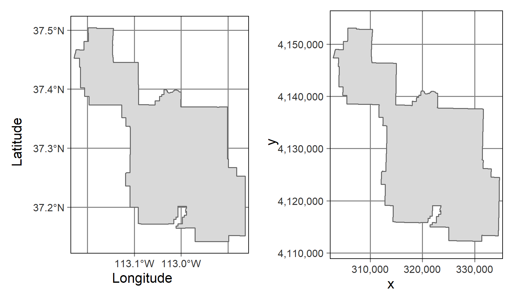

```{r, include = FALSE, warning = FALSE, message = FALSE}
# Load packages 
if(!require(pacman)) install.packages("pacman")
pacman::p_load(tidyverse, knitr, here)

# Source functions 
source(here("global/functions/misc_functions.R"))

# knitr settings
knitr::opts_chunk$set(warning = F, message = F, class.source = "tgc-code-block", error = T)

# Source autograder script quietly 
suppressMessages(source(here::here("lessons/ls09_utm_autograder.R")))
```

```{r,echo=FALSE}
ggplot2::theme_set(new = theme_bw())
```

# UTM coordinate system

## Introduction

So far, all spatial data visualized contain locations measured in **angular units** (longitude/latitude). But, what if data came in a different coordinate system measured in **linear units**? Like the *planar coordinates* of this summary figure!

.](images/crs-datum_projection-closer.png)

In this lesson we are going to learn how to **set up** our data with a **UTM** Coordinate System, measured in **meters** instead of longitude/latitude, and how to **transform** spatial objects from UTM to longitude/latitude, and vice versa!

## Learning objectives

1.  Configure data with **UTM coordinate system** using the `st_as_sf()` function.

2.  Change the **CRS projection** of a `sf` object using the `st_transform()` function.

## Prerequisites

This lesson requires the following packages:

```{r,eval=TRUE,echo=TRUE,message=FALSE}
if(!require('pacman')) install.packages('pacman')

pacman::p_load(malariaAtlas,
               colorspace,
               ggplot2,
               cholera,
               spData,
               dplyr,
               here,
               rio,
               sf)

pacman::p_load_gh("afrimapr/afrilearndata",
                  "wmgeolab/rgeoboundaries")
```

This lesson requires familiarity with `{dplyr}`: if you need to brush up, have a look at our introductory course on data wrangling.

## Set up a CRS Projection to UTM coordinates

Let's say that you receive a data frame with coordinates, but *without* a CRS projection. If you want to make a `ggplot` map with it, you know that you can use `st_as_sf()` from the `{sf}` package.

::: recap
As we learned in a previous lesson, for **point** data we need to specify the coordinates and the CRS:

```{r,eval=FALSE}
fatalities %>% 
  st_as_sf(coords = c("x","y"),
           crs = 4326) %>% 
  ggplot() +
  geom_sf(alpha = 0.3)
```
:::

However, what if you receive coordinates **different to** *longitude* and *latitude*?

To exemplify this scenario, we are going to use **malaria prevalence in The Gambia**. We use data of malaria prevalence in children obtained at **65 villages** in The Gambia.

### Malaria prevalence

First, we read the `gambia_summarized.rds` file using its **file path** with the [`{readr}` package](https://readr.tidyverse.org/).

```{r,message=FALSE,warning=FALSE}
gambia_point_summary <- 
  read_rds(here("data/gambia_summarized.rds"))

gambia_point_summary
```

It is a data frame with 65 observations and 5 variables:

-   `x`: x coordinate of the village (**UTM**),
-   `y`: y coordinate of the village (**UTM**),
-   `total`: total number of tests performed,
-   `positive`: number of *positive* tests, and
-   `prev`: malaria *prevalence* in each village.

::: vocab
**UTM** stants for Universal Transverse Mercator, another coordinate system.
:::

#### Set up the CRS projection {.unnumbered}

Now we can plot the malaria prevalence. However, in order to use `ggplot2` and `geom_sf()`, we need to transform the `data.frame` to an `sf` object.

To use the `st_as_sf()` function from the `{sf}` package, we need to specify a CRS projection. But in this case, the **units** of the `x` and `y` variables are **not** in *Geographic* coordinates (longitude/latitude). Instead, these data coordinates are in **UTM format (Easting/Northing)**, also called **Projected** coordinates.

::: vocab
**CRS coordinate systems:**

-   **Geographic** (or unprojected) reference systems use *longitude and latitude* for referencing a location on the Earth's *three-dimensional* ellipsoid surface.

-   **Projected** coordinate reference systems use *easting and northing* Cartesian coordinates for referencing a location on a *two-dimensional* representation of the Earth.

.](images/utm-geographic-projected.png)

In R, it looks like this:


:::

::: key-point
All **Projected CRSs** are *based on* a **Geographic CRS** and rely on *map projections* to convert the three-dimensional surface of the Earth into Easting and Northing (x and y) values for a two-dimensional Earth representation.

.](images/utm-from_geograph_to_projected-2.png)
:::

::: practice
Which of the following options of Coordinate Reference System (CRS) types:

a.  `"geographic_crs"`
b.  `"projected_crs"`

...corresponds to each of these datasets, given the magnitude of the values in their `x` and `y` columns:

the `parana` dataset?

```{r,eval=FALSE}
parana <- import("https://github.com/cran/geoR/raw/master/data/parana.rda")
as_tibble(parana$coords)
```

```{r,include=FALSE}
# unlock your answer:
# q1 <- "geographic_crs"
# q1 <- "projected_crs"

.check_q1()
.hint_q1()
```

the `fatalities` dataset?

```{r,eval=FALSE}
pacman::p_load(cholera)
as_tibble(fatalities)
```

```{r,include=FALSE}
# unlock your answer:
# q2 <- "geographic_crs"
# q2 <- "projected_crs"

.check_q2()
.hint_q2()
```
:::

##### Set UTM Projected coordinates with `st_as_sf()` {.unnumbered}

First, we need to set **UTM coordinates**. For this, we specify the projection of The Gambia, that is, **UTM zone 28** (`"+proj=utm +zone=28"`) in the `st_as_sf()` function of the `{sf}` package.

```{r}
gambia_projected <- gambia_point_summary %>% 
  # first, specify the projection of gambia
  # UTM zone 28
  st_as_sf(coords = c("x", "y"),
           crs = "+proj=utm +zone=28")

gambia_projected
```

Confirm the presence of the:

-   CRS text (`CRS: +proj=utm +zone=28`) inside the **header** of the new `sf` object, and
-   the **unit** the `geometry` column in **meters** (`<POINT [m]>`).

::: vocab
-   The **UTM** system divides the Earth into **60 zones** of *6 degrees of longitude in width*. Each of the zones uses a transverse Mercator projection that maps a region of large north-south extent.

](images/utm-zones-USA.svg)

-   To **get** the *UTM zones* of various parts of the world, you could use [online interactive maps](https://mangomap.com/robertyoung/maps/69585/what-utm-zone-am-i-in-#), or gridded images available in [wikipedia](https://en.wikipedia.org/wiki/Universal_Transverse_Mercator_coordinate_system#Exceptions).
:::

::: key-point
In the **UTM** system, a **position** on the Earth is given by the:

-   UTM *zone* number,
-   *Hemisphere* (north or south), and
-   Easting and northing *coordinates* in the zone which are measured in **meters**.
    -   *Eastings* are referenced from the central meridian of each zone, and
    -   *northings* are referenced from the equator.
:::

::: practice
`parana_data` contains the average rainfall over different years for the period May-June (dry-season). It was collected at 143 recording stations throughout *Parana State, Brasil*.

Set `UTM` coordinate system to the `parana_data`. Parana State is located in the UTM zone number `22`.

```{r}
parana_data <- as_tibble(parana$coords) %>% 
  mutate(Rainfall = parana$data)
```

```{r,eval = FALSE}
q3 <- parana_data %>% 
  st_as_sf(coords = c("east", "north"), 
           crs = "+proj=______ +zone=______")
q3
```

```{r,include=FALSE}
.check_q3()
.hint_q3()
```
:::

##### Transform to Geographic coordinates with `st_transform()` {.unnumbered}

We can transform the UTM *projected* coordinates to *geographic* coordinates (**longitude/latitude** with datum **WGS84**) using `st_transform()` where we set CRS to `"+proj=longlat +datum=WGS84"`.

```{r}
gambia_geographic <- gambia_projected %>% 
  # second, transform 
  # projected coordinates to
  # geographic coordinates
  st_transform(crs = "+proj=longlat +datum=WGS84")

gambia_geographic
```

Confirm the **update** of the:

-   CRS text to `CRS: +proj=longlat +datum=WGS84` inside the **header**, and
-   the **units** of the `geometry` column to **degrees** (`<POINT [°]>`).

::: vocab
A **PROJ string** includes the following information:

-   `+proj=`: the projection of the data (e.g. `utm`, `longlat`, or `laea`)
-   `+zone=`: the zone of the data, specific to the UTM projection (e.g. `28`)
-   `+datum=`: the datum use (e.g. `WGS84`)
-   `+units=`: the units for the coordinates of the data (e.g. `m`)
:::

::: practice
With the UTM coordinate system data stored in `q3`:

Transform its Projected CRS to a Geographic CRS using the `longitude/latitude` (`longlat`) projection with datum `WGS84`.

```{r,eval = FALSE}
q4 <- q3 %>% 
  st_transform(crs = "+proj=______ +datum=______")
q4
```

```{r,include=FALSE}
.check_q4()
.hint_q4()
```
:::

::: side-note
To reproduce [John Snow's map](https://cs.calvin.edu/courses/info/601/13geospatial/class/snow.html#4) shown in previous lessons, we needed to *set* and *transform* different CRS in the same coding pipeline, using `st_set_crs()` and `st_transform()`.

```{r,eval=FALSE}
mdsr::CholeraDeaths %>%
  # british national grid
  st_set_crs(27700) %>%
  # to wgs84
  st_transform(4326)
```

**Projected CRS** are a choice made by a *public mapping agency*. So, with local data sources, work with the CRS in which the data was provided, to ensure *compatibility*, even if the official CRS is not the most accurate.
:::

#### Map prevalences {.unnumbered}

Now that you have set up the right CRS projection to your data, you can **overlap** these points with other Vector data objects:

```{r}
gambia_adm_2 <- geoboundaries(country = "Gambia", adm_lvl = 2)
```

```{r,fig.height=2,fig.width=8}
ggplot() +
  geom_sf(data = gambia_adm_2) +
  geom_sf(data = gambia_geographic, mapping = aes(color = prev)) +
  colorspace::scale_color_continuous_sequential(palette="Reds 3")
```

::: pro-tip
**Which CRS to use?**

"There exist no all-purpose projections, all involve distortion when far from the center of the specified frame" (Bivand, Pebesma, and Gómez-Rubio 2013).

-   When **Geographic CRS**, the answer is often **WGS84**.
    -   It is used by default for web mapping, in *GPS* datasets, and vector datasets.
    -   WGS84 is the most common CRS in the world, so it is worth knowing its *EPSG code: 4326*.
    -   This 'magic number' can be used to convert objects with unusual projected CRSs into something that is widely understood.
:::

```{r include = F}
.score_print()
```

```{r include = F}
pacman::p_unload(raster) # avoid masking select(). Temporary investigation
```

## Wrap up

In this lesson, we learned how to **transform** the CRS between different *coordinate systems* (projected and geographic).

.](images/utm-geographic-projected.png)

In the next lesson, we are going to use all our previous learning to built one single thematic map by **layers**, and enrich them with **text** and **labels** referring to specific places or regions, and important map elements like **scale bars** and a **north arrow**!

## Contributors {.unlisted .unnumbered}

The following team members contributed to this lesson: `r tgc_contributors_list(ids = c("avallecam", "lolovanco"))`

## References {.unlisted .unnumbered}

Some material in this lesson was adapted from the following sources:

-   *Moreno, M., Basille, M. Drawing beautiful maps programmatically with R, sf and ggplot2 --- Part 1: Basics*. (2018). Retrieved 10 May 2022, from <https://r-spatial.org/r/2018/10/25/ggplot2-sf.html>

-   *Data carpentry. Introduction to Geospatial Concepts: Coordinate Reference Systems*. (2021). Retrieved 15 May 2022, from <https://datacarpentry.org/organization-geospatial/03-crs/index.html>

-   *Moraga, Paula. Geospatial Health Data: Modeling and Visualization with R-INLA and Shiny. Chapter 9: Spatial modeling of geostatistical data. Malaria in The Gambia*. (2019). Retrieved 10 May 2022, from <https://www.paulamoraga.com/book-geospatial/sec-geostatisticaldataexamplespatial.html>

-   *Carrasco-Escobar, G., Barja, A., Quispe, J. [Visualization and Analysis of Spatial Data in Public Health]*. (2021). Retrieved 15 May 2022, from <https://www.reconlearn.org/post/spatial-analysis-1-spanish.html>

`r tgc_license()`
