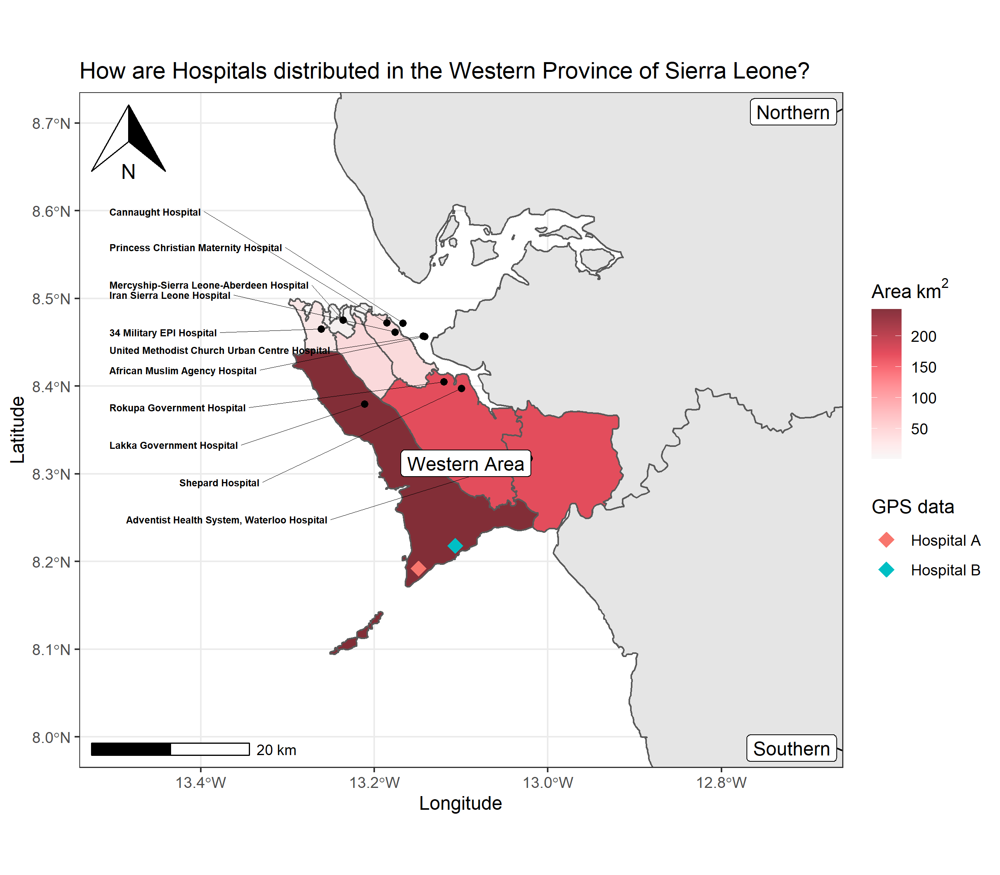

```{r, include = FALSE, warning = FALSE, message = FALSE}
# Load packages 
if(!require(pacman)) install.packages("pacman")
pacman::p_load(tidyverse, knitr, here)

# Source functions 
source(here("global/functions/misc_functions.R"))

# knitr settings
knitr::opts_chunk$set(warning = F, message = F, class.source = "tgc-code-block", error = T)

# Source autograder script quietly 
mute(here("basic_geospatial_viz/lessons/ls10_layers_autograder.R"))
```

```{r,echo=FALSE}
ggplot2::theme_set(new = theme_bw())
```

<!-- # Geospatial analysis: additional layers -->

## Introduction

Until now, we have learnt general concepts about geospatial visualization in independent lessons. The **modular** approach of `{ggplot2}` allows to successively add all of them in different **layers**.

However, these enriched thematic maps also require to contain **text** and **labels** referring to specific places or regions, and important map elements like **scale bars** and a **north arrow**, as will be illustrated in this part.

{width="408"}

In this lesson, we will learn to use functions from the `{ggspatial}` and `{ggsflabel}` packages to add all of these additional elements to our maps!


## Learning objectives

1.  Access **hospital** data coordinates using the `{afrihealthsites}` package.

2.  Add text and **labels** to ggplot maps using the `{ggsflabel}` package.

3.  Add arrow and scale **annotations** in ggplot maps using the `{ggspatial}` package.


## Prerequisites

This lesson requires the following packages:

```{r,eval=TRUE,echo=TRUE,message=FALSE}
if(!require('pacman')) install.packages('pacman')

pacman::p_load(tidyverse,
               colorspace,
               ggspatial,
               janitor,
               ggplot2,
               readxl,
               spData,
               units,
               here,
               sf)

pacman::p_load_gh("yutannihilation/ggsflabel",
                  "afrimapr/afrihealthsites",
                  "afrimapr/afrilearndata",
                  "wmgeolab/rgeoboundaries")
```


## Build an informative map


• How are Tier 3 Hospitals distributed in the Western Province of Sierra Leone?


• Retrieve real Hospital information from a public repository.


### Access hospital sites with `{afrihealthsites}` {.unnumbered}


• `afrihealthsites()` from [`{afrihealthsites}`](https://github.com/afrimapr/afrihealthsites) 


• Coordinates of African health facilities from different sources.


• Health facilities in `Sierra Leone` available in the `who` database:


```{r cities-fl}
sle_healthsites_all <- 
  afrihealthsites(country =        , 
                  datasource =     ,
                  plot = FALSE) %>% 
  janitor::clean_names()

sle_healthsites_all
```


::: rstudio-cloud
Access to all the health facilities of `Zimbabwe` from the `healthsites` data source using the `afrihealthsites()` function.

```{r,eval=FALSE,echo=FALSE}
afrihealthsites(country = "_______", 
                datasource = "_______",
                plot = FALSE) %>% print()
```
:::


::: side-note


• *Three-tier* health delivery classification


• the highest tier (Tier 3) are responsible for most inpatient services as well as teaching and research missions ([Wang, 2021](https://equityhealthj.biomedcentral.com/articles/10.1186/s12939-021-01401-w)).}
:::


• Let's keep Tier 3 health facilities inside the Western province:


```{r}
sle_healthsites_set <- 
  
  sle_healthsites_all %>%
  
  filter(         ) %>% # 👈👈👈👈👈👈👈👈👈👈👈👈👈👈👈
  filter(         )
```


• These sites belong to `Sierra Leone`,


• Let's get their province boundaries with `{rgeoboundaries}`:


```{r}
sierra_leone <- 
```


• Let's map `sierra_leone` and `sle_healthsites_set`:


```{r}
ggplot() +
  
  # country map
  
  
  # hospital points
  
```


• Let's use `coord_sf()` to **zoom in** in area of interest:


```{r}
ggplot() +
  
  # country map
  geom_sf(       ) +
  
  # hospital points
  geom_sf(       ) +
  
  # map extent
         (xlim = c(-13.5,-12.7), ylim = c(8.0,8.7)) # 👈👈👈👈👈👈👈
```


::: recap
`sf` objects can handle on the fly the **coordinate system** (both *projection* and *extent*), which can be very useful if more than one spatial objects are not in the same projection.
:::


### Add a Scale bar and North arrow with `{ggspatial}` {.unnumbered}


• Let's use `{ggspatial}` with a `{ggplot}` map:


• `annotation_north_arrow()` adds a north symbol, and


• `annotation_scale()` a scale bar.


```{r world-scale-north, message = TRUE}
ggplot() +
  
  # country map
  geom_sf(data = sierra_leone) +
  
  # hospital points
  geom_sf(data = sle_healthsites_set) +
  
  # map annotations
         (       ) + # 👈👈👈👈👈👈👈👈👈👈👈👈
         (       ) +
  
  # map extent
  coord_sf(xlim = c(-13.5,-12.7), ylim = c(8.0,8.7))
```


• **location** are by default in the bottom left (`"bl"`)


• `location` uses `"tr"` for top right, `"bl"` for bottom left, etc.


::: practice
To this `ggplot` map with the `zimbabwe_adm1` object:

Add a Scale bar located in the `bottom right` of the map, and a North arrow in the `top left`.

```{r,eval = FALSE}
q4 <- 
  zimbabwe_adm1 %>% 
  ggplot() + 
  geom_sf() +
  _________ +
  _________
q4
```

```{r,include=FALSE}
.check_q4()
.hint_q4()
```
:::


::: side-note


• The [North arrow style](https://paleolimbot.github.io/ggspatial/reference/north_arrow_orienteering.html) can be adjusted with `style`.


• [scale distance](https://paleolimbot.github.io/ggspatial/reference/annotation_scale.html) is set to `"km"` by default, also in "m", "cm", "mi", "ft", or "in".
:::


### Add hospital names with `geom_sf_text_repel()` {.unnumbered}


• `geom_sf_text()` to add hospital locations and names as text:


```{r cities-plot}
sle_healthsites_set %>% 
  ggplot() +
  # geometry
  geom_sf() +
  # label
  geom_sf_text(mapping = aes(label= facility_name)) # 👈👈👈👈👈👈👈
```


• This is not really satisfactory, 


• names overlap on the points, 


• not easy to read on the background. 


• [`{ggsflabel}`](https://yutannihilation.github.io/ggsflabel/index.html) inspired in `{ggrepel}` 


• deal with label placement in `ggplot` maps with `sf` objects 


• including automated movement of labels in case of overlap.


• `geom_sf_text_repel` and `geom_sf_label_repel`


• We "nudge" `facility_name` away, and connect them to the city locations:


```{r cities-plot-nudge}
sle_healthsites_set %>% 
  ggplot() +
  # geometry
  geom_sf() +
  # label
           (         ) # 👈👈👈👈
```


::: practice
`zimbabwe_hospitals` contains all the `hospital` facilities of `Zimbabwe`:

```{r,eval=FALSE}
zimbabwe_hospitals <- 
  afrihealthsites(country = 'Zimbabwe', 
                  datasource='healthsites',
                  plot = FALSE) %>% 
  filter(amenity == 'hospital')

zimbabwe_hospitals
```

Add the name of these facilities as text without overlaps using the `geom_sf_text_repel()` function.

```{r,eval = FALSE}
q5 <- 
  zimbabwe_hospitals %>% 
  ggplot() +
  geom_sf() +
  ____________
q5
```

```{r,include=FALSE}
.check_q5()
.hint_q5()
```
:::


• We can use [`{ggrepel}` arguments](https://ggrepel.slowkow.com/articles/examples.html) to improve its output:


• The size (argument `size`);


• The type of font (`fontface`);


• The force of repulsion between overlapping text labels (`force`);


• The additional padding around the each text label (`box.padding`).


```{r}
sle_healthsites_set %>% 
  ggplot() +
  # geometry
  geom_sf() +
  # label
  geom_sf_text_repel(mapping = aes(label= facility_name),
                     size = 2,         # 👈👈👈👈👈👈👈👈👈👈👈👈👈👈
                     fontface = "bold",
                     force = 40, 
                     box.padding = 0.6)
```


• Adding this layer to the current map, we obtain:


```{r}
ggplot() +
  
  # country map
  geom_sf(data = sierra_leone) +
  
  # hospital points 
  geom_sf(data = sle_healthsites_set) +         
  # hospital names with repelled text 
  geom_sf_text_repel(data = sle_healthsites_set,         # 👈👈👈👈👈
                     mapping = aes(label = facility_name),
                     size         = 2,
                     fontface     = "bold",
                     force        = 0.5,
                     box.padding  = 0.6,
                     nudge_x      = -0.25,
                     direction    = "y",
                     hjust        = 1,
                     segment.size = 0.2) +
  
  # map annotation
  annotation_north_arrow(location="tl") +
  annotation_scale(location="bl") +
  
  # map extent
  coord_sf(xlim = c(-13.5,-12.7), 
           ylim = c(8.0,8.7))
```


### Add province labels with `geom_sf_label_repel()` {.unnumbered}


• Let's add names of administrative borders, available in `shapeName`:


```{r states}
sierra_leone %>% 
  ggplot() +
  
  # country map
  geom_sf() +
  
  # province labels
           (         ) # 👈👈👈👈👈👈👈👈👈👈👈
```


::: practice
The `zimbabwe_adm1` object contains the boundaries of all the provinces in Zimbabwe.

```{r,eval=TRUE,echo=TRUE}
zimbabwe_adm1 <- geoboundaries(country = "Zimbabwe", adm_lvl = 1)
```

Create a `ggplot` map of Zimbabwe with labels for the name of each of its provinces.

```{r,eval = FALSE}
q2 <- 
  zimbabwe_adm1 %>% 
  ggplot() + 
  
  # country map
  geom_sf() + 
  
  # province labels
  geom_sf_....._.....(aes(label = .....))
q2
```

```{r,include=FALSE}
.check_q2()
.hint_q2()
```
:::


• Let's drop Eastern label using `filter()` from `{dplyr}`:


```{r states-nudge}

ggplot() +
  
  # country map
  geom_sf(data = sierra_leone) +
  
  # province labels
         (       ) +         # 👈👈👈👈👈👈
  
  # hospital points 
  geom_sf(data = sle_healthsites_set) +         
  # hospital names with repelled text 
  geom_sf_text_repel(data = sle_healthsites_set,
                     mapping = aes(label = facility_name),
                     size         = 2,
                     fontface     = "bold",
                     force        = 0.5,
                     box.padding  = 0.6,
                     nudge_x      = -0.25,
                     direction    = "y",
                     hjust        = 1,
                     segment.size = 0.2) +
  
  # map annotation
  annotation_north_arrow(location="tl") +
  annotation_scale(location="bl") +
  
  # map extent
  coord_sf(xlim = c(-13.5,-12.7), ylim = c(8.0,8.7))
```


## Final map


• Let's put everything together:


• Adding district boundaries filled by area, and field sited recorded by a GPS device:


```{r, message=FALSE,warning=FALSE}
# districts
sierra_leone_shp <- 
  sf::read_sf(here("basic_geospatial_viz/data/boundaries/sle_adm3.shp")) %>% 
  filter(admin1Name=="Western")

# field site points
sites_sf <- readr::read_csv(
  here("basic_geospatial_viz/data/gps_healthsites.csv")) %>% 
  st_as_sf(coords = c("gps_longitude","gps_latitude"), crs = 4326)
```


```{r,fig.width=8,fig.height=7}
ggplot() +
  
  # country map
  geom_sf(data = sierra_leone) +
  
  # districts filled by area
  geom_sf(data = sierra_leone_shp, # 👈👈👈👈👈👈👈👈👈👈👈👈👈👈👈
          mapping = aes(fill = area_km2)) +
  # color scale for fill
  scale_fill_continuous_sequential(palette="Reds 3", 
                                   alpha = 0.8) +
  # field site points
  geom_sf(data = sites_sf,              # 👈👈👈👈👈👈👈👈👈👈👈👈👈
          mapping = aes(color = gps_name),
          shape = 18, size = 4) +
  
  # province names with repelled labels
  geom_sf_label_repel(data = sierra_leone %>% 
                        filter(shapeName!="Eastern"),
                      mapping = aes(label=shapeName)) +
  
  # hospital points 
  geom_sf(data = sle_healthsites_set) +         
  # hospital names with repelled text 
  geom_sf_text_repel(data = sle_healthsites_set,
                     mapping = aes(label = facility_name),
                     size         = 2,
                     fontface     = "bold",
                     force        = 0.5,
                     box.padding  = 0.6,
                     nudge_x      = -0.25,
                     direction    = "y",
                     hjust        = 1,
                     segment.size = 0.2) +
  
  # map annotation
  annotation_north_arrow(location="tl") +
  annotation_scale(location="bl") +
  
  # map extent
  coord_sf(xlim = c(-13.5,-12.7), 
           ylim = c(8.0,8.7)) +
  
  # ggplot labels
  labs(x = "Longitude",
       y = "Latitude",
       fill = expression(Area~km^2),
       color = "GPS data",
       title = "How are Tier 3 Hospitals distributed in the Western Province of Sierra Leone?")
```


```{r include = F}
.score_print()
```

```{r include = F}
pacman::p_unload(raster) # avoid masking select(). Temporary investigation
```


## Wrap up


• Adding **layers** on `ggplot2` is relatively straightforward, 


• as long as the data is properly stored in an `sf` object. 


• Adding additional layers like point or polygon **labels** and **map annotations** would simply follow the same logic, 


• with additional calls *after* `geom_sf()` and at the *right place* in the `ggplot2` sequence.


## Contributors {.unlisted .unnumbered}

The following team members contributed to this lesson: `r tgc_contributors_list(ids = c("avallecam", "lolovanco"))`

## References {.unlisted .unnumbered}

Some material in this lesson was adapted from the following sources:

-   *Moreno, M., Basille, M. Drawing beautiful maps programmatically with R, sf and ggplot2 --- Part 1: Basics*. (2018). Retrieved 01 June 2022, from <https://r-spatial.org/r/2018/10/25/ggplot2-sf.html>

-   *Moreno, M., Basille, M. Drawing beautiful maps programmatically with R, sf and ggplot2 --- Part 2: Layers*. (2018). Retrieved 01 June 2022, from <https://r-spatial.org/r/2018/10/25/ggplot2-sf-2.html>

-   *Wilke, Claus O. Fundamentals of Data Visualization. Chapter 4: Color scales*. (2020). Retrieved 01 June 2022, from <https://clauswilke.com/dataviz/color-basics.html#color-to-represent-data-values>

`r tgc_license()`
