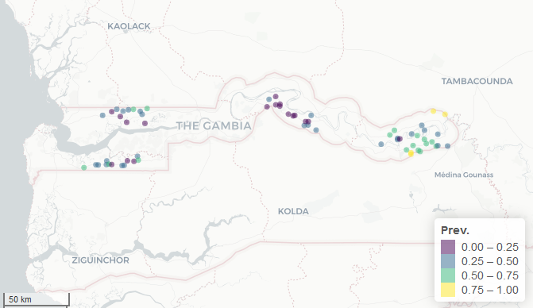
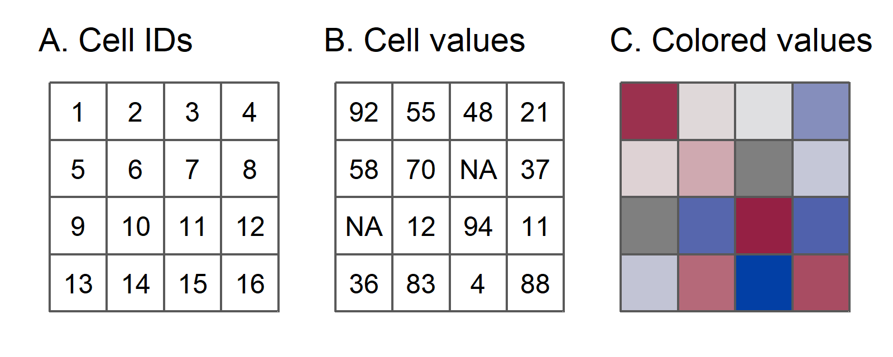
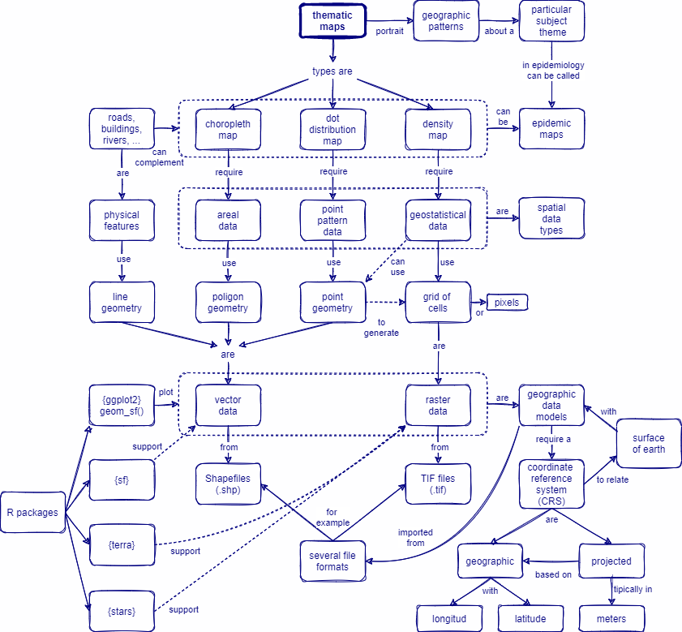

Environmental data is recorded also as a *Grid of cells* and was used as *covariate* for the predictive geostatistical model.


The raw input for Geostatistical data is depicted as *Points geometries*. In this example, the point prevalence of each village.



A Grid of cells (also known as *Pixels*) contains in each cell information such as height, temperature, slope, forest cover, etc. These are often aerial photographs, satellite imagery, etc. These can also be used as *"basemaps"* below Thematic maps.



::: side-note
-   Density maps can depict information using a *Grid of cells* or Pixels.
:::


### Geographic data models: Raster data {.unnumbered}

**Raster Data** is a Grid of cells (e.g. *Pixels*) with each cell containing information such as height, temperature, slope, forest cover, etc. These are often aerial photographs, satellite imagery, etc. Rasters can also be used as *"base maps"* below vector data.


::: side-note
-   Density maps depict information using a *Grid of cells* or Pixels.
:::

*Raster data* will typically be stored in *TIFF files*. Raster data classes are not supported by **sf**. It could be managed by the `{terra}` and `{stars}` packages.

We **read** Raster data using the `rast()` function from the `{terra}` package.

::: practice
Run this code to read Raster data. First, use `{here}` to specify the file path. Then, use `{terra}` to read the `.tif` file inside the `basic_geospatial_viz/data/gis/` folder:

```{r,eval=FALSE,echo=TRUE}
pacman::p_load(terra)
pacman::p_load(here)

raster_path <- 
  here::here("basic_geospatial_viz",
             "data","gis",
             "GMB_altitude.tif")

raster_file <- terra::rast(x = raster_path)

raster_file
```
:::

We **plot** Raster data using the `plot()` function or combining the `{ggplot2}` and `{stars}` packages.

::: practice
Run this code to plot Raster data. Use `{ggplot2}` and `{stars}` to depict the altitude as a grid of cells from The Gambia:

```{r,eval=FALSE,echo=TRUE}
pacman::p_load(ggplot2)
pacman::p_load(stars)

ggplot() +
  geom_stars(data = st_as_stars(raster_file)) +
  coord_sf()
```
:::

## Wrap up

In this lesson, we have learned about *Density maps*, which requires *Geostatistical data*, to represent intensity of a value in a certain area, using a *grid of cells*, and stored as *Raster data*.



## Contributors {.unlisted .unnumbered}

The following team members contributed to this lesson:

`r tgc_contributors_list(ids = c("avallecam", "lolovanco"))`

## References {.unlisted .unnumbered}

Some material in this lesson was adapted from the following sources:

-   *Batra, Neale, et al. (2021). The Epidemiologist R Handbook. Chapter 28: GIS Basics*. (2021). Retrieved 01 April 2022, from <https://epirhandbook.com/en/gis-basics.html>

-   *Lovelace, R., Nowosad, J., & Muenchow, J. Geocomputation with R. Chapter 2: Geographic data in R*. (2019). Retrieved 01 April 2022, from <https://geocompr.robinlovelace.net/spatial-class.html>

-   *Moraga, Paula. Geospatial Health Data: Modeling and Visualization with R-INLA and Shiny. Chapter 2: Spatial data and R packages for mapping*. (2019). Retrieved 01 April 2022, from <https://www.paulamoraga.com/book-geospatial/sec-spatialdataandCRS.html>

-   *Baumer, Benjamin S., Kaplan, Daniel T., and Horton, Nicholas J. Modern Data Science with R. Chapter 17: Working with geospatial data*. (2021). Retrieved 05 June 2022, from <https://mdsr-book.github.io/mdsr2e/ch-spatial.html>

`r tgc_license()`
