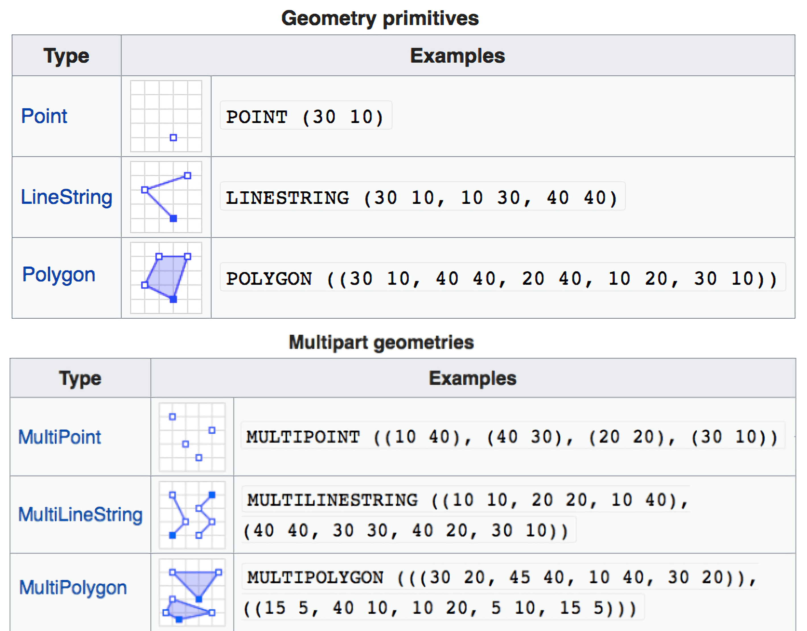

# from layers 

To make a more complete map of the Western province of Sierra Leona, Health facilities (`sf` object: point data) will be added to the map.

## external point data

We start by defining two Hospital sites (point data), according to their longitude and latitude, collected by GPS devices in the field, using the `read_csv()` function from the `{readr}` package:

```{r sites-sites}
sites <- readr::read_csv(here("basic_geospatial_viz/data/gps_healthsites.csv"))

sites
```

::: watch-out
-   The `{readr}` package is better used to read plain text files like *.csv*, *.tsv*, and also *.rds* files.

-   For **more data formats** like *.xlsx* or *.dta* you may prefer to read your data using the `readxl::read_xlsx()` and `haven::read_dta()` packages and functions, respectively.
:::

::: practice
Read the `gps_healthsites.xlsx` file. Use the `read_xlsx()` function from the `{readxl}` package.

```{r,eval = FALSE}
q1 <- "YOUR ANSWER HERE"
q1
```

```{r,include=FALSE}
.check_q1()
.hint_q1()
```
:::

## change point 

As such, we can adjust all characteristics of **points** (e.g. color of the outline and the filling, shape, size, etc.), for each `geom_sf()` layer. In this example, we set the two points as filled diamonds (`shape = 18`) with a bigger size (`size = 2`):

```{r sites-sf-plot}
ggplot() +
  
  # country map
  geom_sf(data = sierra_leone) +
  
  # hospital points
  geom_sf(data = sites_sf, mapping = aes(color = gps_name),
          shape = 18, size = 4) + # 👈👈👈👈👈👈👈👈👈👈👈👈👈👈👈👈
  
  # map extent
  coord_sf(xlim = c(-13.5,-12.7), ylim = c(8.0,8.7))
```

### Fill district data with `{colorspace}` {.unnumbered}

Districts (polygon data) can be retrieved from local **shapefile** data. This time, only districts from Western province are retained:

```{r counties}
sierra_leone_shp <- 
  sf::read_sf(
    here(
      "basic_geospatial_viz/data/boundaries/sle_adm3.shp"
      )) %>% 
  filter(admin1Name=="Western")

ggplot(data = sierra_leone_shp) +
  geom_sf()
```

This time, for all the districts from the province retained, we are going to use the `area_km2` variable:

```{r}
sierra_leone_shp %>% 
  select(area_km2)
```

We can fill in the districts using their **area (in km^2^)** to visually identify the largest counties. For this, we use the [`{colorspace}` package](https://colorspace.r-forge.r-project.org/articles/ggplot2_color_scales.html) with some transparency. In this case, `area_km2` is a *continuous* variable, with a *sequential* scale type:

```{r counties-plot}
sierra_leone_shp %>% 
  ggplot() +
  # district filled by area
  geom_sf(aes(fill = area_km2)) +
  # color scale for fill
  colorspace::scale_fill_continuous_sequential(palette="Reds 3", #👈 
                                               alpha = 0.8)
```

::: vocab
The **scales** are called via the scheme

    scale_<aesthetic>_<datatype>_<colorscale>()

where:

-   `<aesthetic>` is the name of the *aesthetic* (fill, color, colour).
-   `<datatype>` is the type of the *variable* plotted (discrete, continuous, binned).
-   `<colorscale>` sets the type of the color *scale* used (qualitative, sequential, diverging, divergingx).


:::

::: pro-tip
A **Sequential** colors scale indicate:

-   Which values are *larger* or *smaller than* which other ones, and
-   How *distant two specific values are from each other*. This implies that the color scale needs to be perceived to vary uniformly across its entire range.

A **Diverging** color scale allows to:

-   visualize the *deviation of data values* in one of two directions relative to a *neutral midpoint*, usually is represented by a light color,
-   For example, a dataset containing both *positive* and *negative* numbers, and show how far in either direction it *deviates from zero*.


:::

::: practice
This is a ggplot map with the `afriairports` object:

```{r,eval=FALSE}
afriairports %>% 
  ggplot() +
  geom_sf(aes(color = elevation_ft))
```

Paste this code to your answer and:

Update the *color* aesthetic of the *continuous* variable `elevation_ft` of this map to a *diverging* scale, with a midpoint (`mid`) in `5000`.

```{r,eval = FALSE}
q3 <- 
  afriairports %>% 
   ggplot() + 
   geom_sf(aes(color = elevation_ft)) + 
   scale_....._......._.........(mid = ....)
q3
```

```{r,include=FALSE}
.check_q3()
.hint_q3()
```
:::

::: side-note
You can use `{colorspace}` package to:

-   emulate [color vision deficiency](https://colorspace.r-forge.r-project.org/articles/color_vision_deficiency.html) heatmaps with palettes, and
-   access [colorblind-friendly palettes](https://colorspace.r-forge.r-project.org/articles/ggplot2_color_scales.html#available-palettes) like Viridis and others.
:::

So, adding up all the previous layers, he obtain:

```{r}
ggplot() +
  
  # country map
  geom_sf(data = sierra_leone) +
  # province labels
  geom_sf_label_repel(data = sierra_leone %>% 
                        filter(shapeName!="Eastern"),       
                      mapping = aes(label=shapeName)) +
  
  # districts filled by area
  geom_sf(data = sierra_leone_shp,                   # 👈👈👈👈👈👈👈
          mapping = aes(fill = area_km2)) +
  # color scale for fill
  scale_fill_continuous_sequential(palette="Reds 3",
                                   alpha = 0.8) +
  
  # hospital points
  geom_sf(data = sle_healthsites_set) +
  
  # map extent
  coord_sf(xlim = c(-13.5,-12.7), ylim = c(8.0,8.7))
```

Given the overlap of filled districts over province labels, we can rearrange the `ggplot2` layers:

```{r}
ggplot() +
  
  # country map
  geom_sf(data = sierra_leone) +
  
  # districts filled by area
  geom_sf(data = sierra_leone_shp,                   
          mapping = aes(fill = area_km2)) +
  # color scale for fill
  scale_fill_continuous_sequential(palette="Reds 3",
                                   alpha = 0.8) +
  
  # province labels
  geom_sf_label_repel(data = sierra_leone %>% # 👈👈👈👈👈👈👈👈👈👈
                        filter(shapeName!="Eastern"),       
                      mapping = aes(label=shapeName)) +
  
  # hospital points
  geom_sf(data = sites_sf, mapping = aes(color = gps_name),
          shape = 18, size = 2) +
  
  # map extent
  coord_sf(xlim = c(-13.5,-12.7), ylim = c(8.0,8.7))
```

## Final map

For the final map, we put everything together, having a country boundary map based on the Sierra Leona map, with district delineations, province labels, main hospital names and locations, custom GPS collected field sites, as well as a theme adjusted with axis labels, and a north arrow and scale bar:

```{r,fig.width=8,fig.height=7}
ggplot() +
  
  # country map
  geom_sf(data = sierra_leone) +
  
  # districts filled by area
  geom_sf(data = sierra_leone_shp, 
          mapping = aes(fill = area_km2)) +
  # color scale for fill
  scale_fill_continuous_sequential(palette="Reds 3", 
                                   alpha = 0.8) +
  
  # province names with repelled labels
  geom_sf_label_repel(data = sierra_leone %>% 
                        filter(shapeName!="Eastern"),
                      mapping = aes(label=shapeName)) +
  
  # hospital points 
  geom_sf(data = sites_sf, 
          mapping = aes(color = gps_name),
          shape = 18, size = 4) +
  
  # hospital points 
  geom_sf(data = sle_healthsites_set) +         
  # hospital names with repelled text 
  geom_sf_text_repel(data = sle_healthsites_set,         # 👈👈👈👈👈
                     mapping = aes(label = facility_name),
                     size         = 2,
                     fontface     = "bold",
                     force        = 0.5,
                     box.padding  = 0.6,
                     nudge_x      = -0.25,
                     direction    = "y",
                     hjust        = 1,
                     segment.size = 0.2) +
  
  # map annotation
  annotation_north_arrow(location="tl") +
  annotation_scale(location="bl") +
  
  # map extent
  coord_sf(xlim = c(-13.5,-12.7), 
           ylim = c(8.0,8.7)) +
  
  # ggplot labels
  labs(x = "Longitude",
       y = "Latitude",
       fill = expression(Area~km^2),
       color = "GPS data",
       title = "How are Tier 3 Hospitals distributed in the Western Province of Sierra Leone?")
```

# crs


# geometry columns

## can not be dropped

Recall that further above, we ran the following `select()` statement that asked for only two columns, `"name"` and `"pop_est"`:

```{r eval = F}
countries %>% 
  select(name,   # country name
       pop_est)  # estimated population
```

but this command returned **three** columns: `"name"`, `"pop_est"` and `"geometry"`. Why?

Since the `"geometry"` column holds the core geospatial data for an `sf` object, it is always included---it cannot be dropped in the normal ways.

To drop this column, you have to convert the object to a regular data frame with `as.data.frame()` or `as_tibble()` first:

```{r}
countries %>%
  as_tibble() %>% 
  select(name, pop_est) %>% 
  head()
```

(Of course, you usually should not need to drop the geometry column from your `sf` objects.)

## is recognized by geom_sf

So far you have been passing the `sf` object into `geom_sf()` without adding any arguments, for example:

```{r,eval=FALSE}
ggplot(data = countries) + 
  geom_sf()
```

This is because `geom_sf()` automatically recognizes the geometry column and passes it in as an aesthetic. You can make this more explicit, by passing the column manually to the `geometry` argument:

```{r,eval=FALSE}
ggplot(data = countries) + 
  geom_sf(mapping = aes(geometry = geometry))
```

<!-- [source](https://transportgeography.org/contents/methods/network-data-models/esri-shapefile-model/) -->

# sf

::: key-point
The [`{sf}` package]((https://r-spatial.github.io/sf/)) provides a set of tools for working with geospatial **vectors**, i.e., all the **geometry types** used in the vast majority of geographic research, like polygons, points, and lines.
:::


, because it provides an opportunity to learn a few key terms in geospatial analysis

# vector data

## Recap : Thematic maps and Vector data

::: recap
All *Thematic maps* need **Vector data** in a GIS software to be plotted:

-   Choropleth maps use *Polygon* geometry.
-   Dot maps use *Point* geometry.
-   Physical features in a map use *Line* geometry.
:::


# practice questions about geometries

::: practice
Which of the following options of *vector data* types:

a.  `"polygon_geometry"`
b.  `"point_geometry"`
c.  `"line_geometry"`

...corresponds to each of these *thematic map* scenarios?

Please enter the name of the geometry and not the letter associated to it.

Comparison of the number of COVID-19 cases in each province of Angola during the year 2021, filling each of the provinces with a color scale directly proportional to the number of cases.

```{r,include=FALSE}
# unlock your answer:
# q1 <- "polygon_geometry"
# q1 <- "point_geometry"
# q1 <- "line_geometry"

.check_q1()
.hint_q1()
```

Visualization of the distribution of two types of health facilities, hospitals and clinics, in Senegal using geographical coordinates recorded with GPS devices.

```{r,include=FALSE}
# unlock your answer:
# q2 <- "polygon_geometry"
# q2 <- "point_geometry"
# q2 <- "line_geometry"

.check_q2()
.hint_q2()
```

Visualization of the urban water supply networks in the city of Cape Town, South Africa.

```{r,include=FALSE}
# unlock your answer:
# q3 <- "polygon_geometry"
# q3 <- "point_geometry"
# q3 <- "line_geometry"

.check_q3()
.hint_q3()
```
:::

# _ autograders

```{r}
##~~~~~~~~~~~~~~~~~~~~~~~~~~~~~~~~~~~~~~~~~~~~~~~~~~~~~~~~~~~~~~~~~~~~~~~~~~~~~~
## q1 ----
##~~~~~~~~~~~~~~~~~~~~~~~~~~~~~~~~~~~~~~~~~~~~~~~~~~~~~~~~~~~~~~~~~~~~~~~~~~~~~~

# [backend]
.check_q1 <-
  function() {
    .problem_number <<- 1
    
    .q1_correct <- "polygon_geometry" # write correct answer
    .q1_mistake1 <- "point_geometry" # optional: highlight common mistake
    
    .autograder <<-
      function(){
        if (!is.character(q1) || grepl(pattern = " ",x = q1)) 
          return(c(value = -1, message = "! You should paste the whole text of only one of the options."))
        if (isTRUE(all.equal(q1, .q1_mistake1))) return(c(value = 0, message = "! Data was aggregated for a complete province, not for its capital city."))
        if (isTRUE(all.equal(q1, .q1_correct))) return(c(value = 1, message = paste("Correct!", praise::praise()) ))
        # wrong
        return(c(value = 0, message = "Wrong. Please try again."))
      }
    .apply_autograder()
  }

# [backend]
# create one hint per question
.hint_q1 <- function(){
  'The keyword is to identify the administrative level ("province"), and associate it with a geometrical shape.' -> out
  cat(out)
}
# solution of question
.solution_q1 <- function(){
  'polygon_geometry' -> out
  cat(out)
}

# # [frontend]
# # to paste in lesson
# q1 <- "YOUR ANSWER HERE"
# 
# .check_q1()
# .hint_q1()
# 
# # # [backend]
# # # test the check function
# q1 <- "line_geometry"
# .check_q1()
# q1 <- "point_geometry"
# .check_q1()
# q1 <- "polygon_geometry"
# .check_q1()

##~~~~~~~~~~~~~~~~~~~~~~~~~~~~~~~~~~~~~~~~~~~~~~~~~~~~~~~~~~~~~~~~~~~~~~~~~~~~~~
## q2 ----
##~~~~~~~~~~~~~~~~~~~~~~~~~~~~~~~~~~~~~~~~~~~~~~~~~~~~~~~~~~~~~~~~~~~~~~~~~~~~~~

# [backend]
.check_q2 <-
  function() {
    .problem_number <<- 2
    
    .q2_correct <- "point_geometry" # write correct answer
    .q2_mistake1 <- "polygon_geometry" # optional: highlight common mistake
    
    .autograder <<-
      function(){
        if (!is.character(q2) || grepl(pattern = " ",x = q2)) 
          return(c(value = -1, message = "! You should paste the whole text of only one of the options."))
        if (isTRUE(all.equal(q2, .q2_mistake1))) return(c(value = 0, message = "! Data was collected in specific locations."))
        if (isTRUE(all.equal(q2, .q2_correct))) return(c(value = 1, message = paste("Correct!", praise::praise()) ))
        # wrong
        return(c(value = 0, message = "Wrong. Please try again."))
      }
    .apply_autograder()
  }

# [backend]
# create one hint per question
.hint_q2 <- function(){
  'The keyword is "geographical coordinates", and associate it with a geometrical shape.' -> out
  cat(out)
}
# solution of question
.solution_q2 <- function(){
  'point_geometry' -> out
  cat(out)
}

# # [frontend]
# # to paste in lesson
# q2 <- "YOUR ANSWER HERE"
# 
# .check_q2()
# .hint_q2()
# 
# # # [backend]
# # # test the check function
# q2 <- "line_geometry"
# .check_q2()
# q2 <- "polygon_geometry"
# .check_q2()
# q2 <- "point_geometry"
# .check_q2()

##~~~~~~~~~~~~~~~~~~~~~~~~~~~~~~~~~~~~~~~~~~~~~~~~~~~~~~~~~~~~~~~~~~~~~~~~~~~~~~
## q3 ----
##~~~~~~~~~~~~~~~~~~~~~~~~~~~~~~~~~~~~~~~~~~~~~~~~~~~~~~~~~~~~~~~~~~~~~~~~~~~~~~

# [backend]
.check_q3 <-
  function() {
    .problem_number <<- 3
    
    .q3_correct <- "line_geometry" # write correct answer
    .q3_mistake1 <- "point_geometry" # optional: highlight common mistake
    
    .autograder <<-
      function(){
        if (!is.character(q3) || grepl(pattern = " ",x = q3)) 
          return(c(value = -1, message = "! You should paste the whole text of only one of the options."))
        if (isTRUE(all.equal(q3, .q3_mistake1))) return(c(value = 0, message = "! Data represents a physical feature of a trajectory rather than a specific location."))
        if (isTRUE(all.equal(q3, .q3_correct))) return(c(value = 1, message = paste("Correct!", praise::praise()) ))
        # wrong
        return(c(value = 0, message = "Wrong. Please try again."))
      }
    .apply_autograder()
  }

# [backend]
# create one hint per question
.hint_q3 <- function(){
  'The keyword is "network", and associate it with a geometrical shape.' -> out
  cat(out)
}
# solution of question
.solution_q3 <- function(){
  'line_geometry' -> out
  cat(out)
}

# # [frontend]
# # to paste in lesson
# q3 <- "YOUR ANSWER HERE"
# 
# .check_q3()
# .hint_q3()
# 
# # # [backend]
# # # test the check function
# q3 <- "polygon_geometry"
# .check_q3()
# q3 <- "point_geometry"
# .check_q3()
# q3 <- "line_geometry"
# .check_q3()

```


# choropleth

Also, with the same data source, we can visualize the population distribution around the world:

```{r}
ggplot(data = countries) + 
  geom_sf(aes(fill = pop_est))
```

# dot map

**With Quantitative data**

We can replicate John Snow’s Dot map with the number of deaths per household of the 1854 London cholera outbreak:

```{r}
cholera_deaths <- read_rds(here("basic_geospatial_viz/data/cholera_deaths.rds"))

ggplot(data = cholera_deaths) + 
  geom_sf(mapping = aes(size = Count), alpha = 0.7)
```


# sf

{sf} largely replaces an older R package for geospatial analysis {sp}, although you may still need to use {sp} once in a while.

-   The number of *features* are the number of rows in the **data frame**.
-   The number of *fields* are equal to the number of columns in the **data frame** minus one. It **excludes** the *last one* called **geometry**.

### Geometries {.unnumbered}

If we explore the **data frame** associated with the Spatial data objects, we identify that all of them have a **geometry** column at the end:

                geometry
       POINT (7.17 9.18)
       POINT (-0.2 5.56)
      POINT (38.74 9.03)
      POINT (3.04 36.77)
    POINT (47.51 -18.89)
     POINT (38.94 15.33)
     POINT (-7.99 12.65)
      POINT (18.56 4.36)
     POINT (-16.6 13.46)
     POINT (-15.6 11.87)

The text that appears below the **geometry** column its also detailed in the second line of the **header** of the output:

    Geometry type: POINT

::: rstudio-cloud
Now, run these code chunks and identify which *Geometry* is detailed in their headers. These are Spatial data objects used until now for:

1.  *Choropleth maps*, and

```{r,eval=FALSE}
africountries
```

2.  *Physical features*

```{r,eval=FALSE}
afrihighway
```

These **Geometries** (Point, Polygon and Lines) are types of **Vector data**.
:::

::: pro-tip
It is possible (though rarely necessary) to extract and print to console the entire list of coordinates for a linestring or polygon:

```{r}
## Print the linestring for the first row in `world_rivers`
world_rivers[["geometry"]][[1]] 
```

> MULTILINESTRING ((22.75649 -20.47161, 22.79458 -20.43499, 22.80981 -20.42571, 22.85693 -20.40462, 22.91909 -20.38948, 22.93091 -20.38372, 22.98672 -20.34564, 23.01089 -20.33577, 23.10303 -20.31097, 23.11929 -20.30423, 23.27441 -20.15775, 23.32788 -20.1242))

In this linestring, the first point has a coordinates 22.75649 and -20.47161, the second point has coordinates 22.79458 -20.43499, and so on.

The tables below shows the "raw" coordinate representations for other geometries:

{width="561"}
:::

## Visualizing `sf` objects with `mapview::mapview()`

@INCOMPLETE

A nice way to get a quick overview of all the fields and features in a map object is with mapview::mapview()

```{r}

```

When you click on any feature, you see a list of fields (attributes):

[SCREENSHOT]
